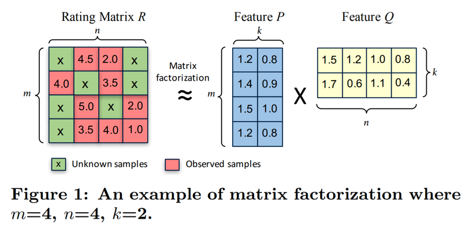
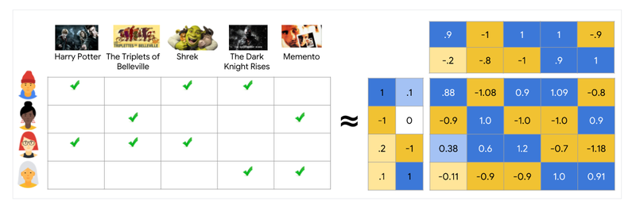

# 8. 아이유팬이 좋아할 만한 다른 아티스트 찾기

## 학습목표

- 추천시스템의 개념과 목적을 이해한다.
- Implicit 라이브러리를 활용하여 Matrix Factorization(이하 MF) 기반의 추천 모델을 만들어 본다.
- 음악 감상 기록을 활용하여 비슷한 아티스트를 찾고 아티스트를 추천해 본다.
- 추천 시스템에서 자주 사용되는 데이터 구조인 CSR Matrix을 익힌다
- 유저의 행위 데이터 중 Explicit data와 Implicit data의 차이점을 익힌다.
- 새로운 데이터셋으로 직접 추천 모델을 만들어 본다.

## 추천시스템이란?

추천시스템이란, 데이터를 바탕으로 유저가 좋아할 만한 콘텐츠를 찾아서 자동으로 보여주거나 추천해주는 기능이다. 추천시스템의 원리는 간단하게 설명하면 나와 비슷한 다른 사용자들이 좋아하는 것과 비슷한 것을 내게 추천해준다는 것이다. 이러한 추천시스템은 크게 두 가지로 나뉜다.

[http://www.kocca.kr/insight/vol05/vol05_04.pdf](http://www.kocca.kr/insight/vol05/vol05_04.pdf)

### (1) 협업 필터링

---

협업 필터링이란 대규모의 기존 사용자 행동 정보를 분석하여 해당 사용자와 비슷한 성향의 사용자들이 기존에 좋아했던 항목을 추천하는 기술이다. 

- 장점
    - 결과가 직관적이며 항목의 구체적인 내용을 분석할 필요가 없다.
- 단점
    - 콜드 스타트(Cold Start)문제가 있다.
    - 계산량이 비교적 많은 알고리즘이므로 사용자 수가 많은 경우 효율적으로 추천할 수 없다.
    - 시스템 항목이 많다 하더라도 사용자들은 소수의 인기있는 항목에만 관심을 보이는 롱테일(Long tail)문제가 있다.
- 행렬분해(Matrix Factorization), k-최근접 이웃 알고리즘 (k-Nearest Neighbor algorithm;
kNN) 등의 방법이 많이 사용된다.

### (2) 콘텐츠 기반 필터링

---

콘텐츠 기반 필터링은 항목 자체를 분석하여 추천을 구현한다. 예를 들어 음악을 추천하기 위해 음악 자체를 분석하여 유사한 음악을 추천하는 방식이다.

콘텐츠 기반 필터링을 위해서는 항목을 분석한 프로파일(item profile)과 사용자의 선호도를
추출한 프로파일(user profile)을 추출하여 이의 유사성을 계산한다. 유명한 음악 사이트인 판도
라(Pandora)의 경우, 신곡이 출시되면 음악을 분석하여 장르, 비트, 음색 등 약 400여 항목의 특
성을 추출한다. 그리고 사용자로부터는 ‘like’를 받은 음악의 특색을 바탕으로 해당 사용자의 프로
파일을 준비한다. 이러한 음악의 특성과 사용자 프로파일을 비교함으로써 사용자가 선호할 만한
음악을 제공하게 된다.

- 군집분석(Clustering analysis), 인공신경망(Artificial neural network), tf-idf(term frequencyinverse document frequency) 등의 기술이 사용된다.

---

추천시스템은 **아이템은 매우 많고**, **유저의 취향은 다양할 때** 유저가 소비할 만한 아이템을 예측하는 모델이다.

- 유튜브 : 동영상이 매일 엄청나게 많이 올라오고 유저의 취향(게임 선호, 뷰티 선호, 지식 선호, 뉴스 선호)이 다양
- 페이스북 : 포스팅되는 글이 엄청 많고 유저가 관심 있는 페이지, 친구, 그룹은 전부 다름
- 아마존 : 카테고리를 한정해도 판매 품목이 엄청 많고 좋아하는 브랜드, 구매 기준이 다양

## 데이터 탐색과 전처리

### (1) 데이터 준비

---

[http://ocelma.net/MusicRecommendationDataset/lastfm-360K.html](http://ocelma.net/MusicRecommendationDataset/lastfm-360K.html) 데이터셋 홈페이지

```python
# 파일 불러오기
import pandas as pd
import os

fname = os.getenv('HOME') + '/aiffel/recommendata_iu/data/lastfm-dataset-360K/usersha1-artmbid-artname-plays.tsv'
col_names = ['user_id', 'artist_MBID', 'artist', 'play']   # 임의로 지정한 컬럼명
data = pd.read_csv(fname, sep='\t', names= col_names)      # sep='\t'
data.head(10)

# 사용하는 컬럼 재정의
using_cols = ['user_id', 'artist', 'play']
data = data[using_cols]
data.head(10)

data['artist'] = data['artist'].str.lower() # 검색을 쉽게하기 위해 아티스트 문자열을 소문자로 변경
data.head(10)

# 첫 번째 유저 데이터 확인
condition = (data['user_id']== data.loc[0, 'user_id'])
data.loc[condition]
```

### (2) 데이터 탐색

---

확인이 필요한 정보

- 유저수, 아티스트수, 인기 많은 아티스트
- 유저들이 몇 명의 아티스트를 듣고 있는지에 대한 통계
- 유저 play 횟수 중앙값에 대한 통계

```python
# 유저 수
data['user_id'].nunique()

# 아티스트 수
data['artist'].nunique()

# 인기 많은 아티스트
artist_count = data.groupby('artist')['user_id'].count()
artist_count.sort_values(ascending=False).head(30)

# 유저별 몇 명의 아티스트를 듣고 있는지에 대한 통계
user_count = data.groupby('user_id')['artist'].count()
user_count.describe()

# 유저별 play횟수 중앙값에 대한 통계
user_median = data.groupby('user_id')['play'].median()
user_median.describe()

# 이름은 꼭 데이터셋에 있는 것으로
my_favorite = ['black eyed peas' , 'maroon5' ,'jason mraz' ,'coldplay' ,'beyoncé']

# 'zimin'이라는 user_id가 위 아티스트의 노래를 30회씩 들었다고 가정
my_playlist = pd.DataFrame({'user_id': ['zimin']*5, 'artist': my_favorite, 'play':[30]*5})

if not data.isin({'user_id':['zimin']})['user_id'].any(): # user_id에 'zimin'이라는 데이터가 없다면
    data = data.append(my_playlist) # 위에 임의로 만든 my_favorite 데이터를 추가

data.tail(10) # 잘 추가되었는지 확인
```

### (3) 모델에 활용하기 위한 전처리

---

데이터의 관리를 쉽게 하기 위해 indexing 작업을 해준다.

```python
# 고유한 유저, 아티스트를 찾아내는 코드
user_unique = data['user_id'].unique()
artist_unique = data['artist'].unique()

# 유저, 아티스트 indexing 하는 코드 idx는 index의 약자
user_to_idx = {v:k for k,v in enumerate(user_unique)}
artist_to_idx = {v:k for k,v in enumerate(artist_unique)}

# 인덱싱이 잘 되었는지 확인해 봅니다. 
print(user_to_idx['zimin'])    # 358869명의 유저 중 마지막으로 추가된 유저이니 358868이 나와야 합니다. 
print(artist_to_idx['black eyed peas'])

# indexing을 통해 데이터 컬럼 내 값을 바꾸는 코드
# dictionary 자료형의 get 함수는 https://wikidocs.net/16 을 참고하세요.

# user_to_idx.get을 통해 user_id 컬럼의 모든 값을 인덱싱한 Series를 구해 봅시다. 
# 혹시 정상적으로 인덱싱되지 않은 row가 있다면 인덱스가 NaN이 될 테니 dropna()로 제거합니다. 
temp_user_data = data['user_id'].map(user_to_idx.get).dropna()
if len(temp_user_data) == len(data):   # 모든 row가 정상적으로 인덱싱되었다면
    print('user_id column indexing OK!!')
    data['user_id'] = temp_user_data   # data['user_id']을 인덱싱된 Series로 교체해 줍니다. 
else:
    print('user_id column indexing Fail!!')

# artist_to_idx을 통해 artist 컬럼도 동일한 방식으로 인덱싱해 줍니다. 
temp_artist_data = data['artist'].map(artist_to_idx.get).dropna()
if len(temp_artist_data) == len(data):
    print('artist column indexing OK!!')
    data['artist'] = temp_artist_data
else:
    print('artist column indexing Fail!!')

data
```

## 사용자의 명시적/암묵적 평가

- 명시적 데이터(Explicit Data) : 좋아요, 평점과 같이 유저가 자신의 선호도를 직접(Explicit)표현한 데이터
- 암묵적 데이터(Implicit Data) : 유저가 간접적(Implicit)으로 선호, 취향을 나타내는 데이터. 검색기록, 방문페이지, 구매내역, 마우스 움직임 기록 등이 있다.

```python
# 1회만 play한 데이터의 비율을 보는 코드
only_one = data[data['play']<2]
one, all_data = len(only_one), len(data)
print(f'{one},{all_data}')
print(f'Ratio of only_one over all data is {one/all_data:.2%}')
```

이번에 만들 모델에서는 암묵적 데이터의 해석을 위해 다음과 같은 규칙을 적용한다.

- 한 번이라도 들었으면 선호한다고 판단한다.
- 많이 재생한 아티스트에 대해 가중치를 주어서 더 확실히 좋아한다고 판단한다.

## Matrix Factorization(MF)

추천시스템의 다양한 모델 중 Matrix Factorization(MF, 행렬분해) 모델을 사용할 것이다.



MF는 평가행렬 R을 P와 Q 두 개의 Feature Matrix로 분해하는 것이다. 아래 그림에서는 P가 사용자의 특성(Feature) 벡터고, Q는 영화의 특성 벡터가 된다. 두 벡터를 내적해서 얻어지는 값이 영화 선호도로 간주하는 것이다.



벡터를 잘 만드는 기준은 유저i의 벡터와 아이템j의 벡터를 내적했을 때 유저i가 아이템j에 대해 평가한 수치와 비슷한지 확인하는 것이다.


이번에 사용할 모델은 [Collaborative Filtering for Implicit Feedback Datasets](http://yifanhu.net/PUB/cf.pdf) 논문에서 제한한 모델을 사용한다.

## CSR(Compressed Sparse Row) Matrix

---

유저 X 아이템 평가행렬을 행렬로 표현한다고 하면 36만 * 29만 * 1byte = 약 97GB가 필요하다. 이렇게 큰 용량을 메모리에 올려놓고 작업을 한다는 것은 거의 불가능 하기 때문에 CSR을 사용한다.

CSR은 Sparse한 matrix에서 0이 아닌 유효한 데이터로 채워지는 데이터의 값과 좌표 정보만으로 구성하여 메모리 사용량을 최소화 하면서도 Sparse한 matrix와 동일한 행렬을 표현할 수 있는 데이터 구조이다.

```python
# 실습 위에 설명보고 이해해서 만들어보기
from scipy.sparse import csr_matrix

num_user = data['user_id'].nunique()
num_artist = data['artist'].nunique()

csr_data = csr_matrix((data.play, (data.user_id, data.artist)), shape= (num_user, num_artist))
csr_data
```

## MF 모델 학습하기

---

Matrix Factorization 모델을 implicit 패키지를 사용하여 학습해보자.

- implicit 패키지는 이전 스텝에서 설명한 암묵적(implicit) dataset을 사용하는 다양한 모델을 굉장히 빠르게 학습할 수 있는 패키지이다.
- 이 패키지에 구현된 als(AlternatingLeastSquares) 모델을 사용한다. Matrix Factorization에서 쪼개진 두 Feature Matrix를 한꺼번에 훈련하는 것은 잘 수렴하지 않기 때문에, 한쪽을 고정시키고 다른 쪽을 학습하는 방식을 번갈아 수행하는 AlternatingLeastSquares 방식이 효과적인 것으로 알려져 있다.

```python
from implicit.als import AlternatingLeastSquares
import os
import numpy as np

# implicit 라이브러리에서 권장하고 있는 부분
os.environ['OPENBLAS_NUM_THREADS']='1'
os.environ['KMP_DUPLICATE_LIB_OK']='True'
os.environ['MKL_NUM_THREADS']='1'

# Implicit AlternatingLeastSquares 모델의 선언
als_model = AlternatingLeastSquares(factors=100, regularization=0.01, use_gpu=False, iterations=15, dtype=np.float32)

# als 모델은 input으로 (item X user 꼴의 matrix를 받기 때문에 Transpose해줍니다.)
csr_data_transpose = csr_data.T
csr_data_transpose

# 모델 훈련
als_model.fit(csr_data_transpose)

# 벡터값 확인
zimin, black_eyed_peas = user_to_idx['zimin'], artist_to_idx['black eyed peas']
zimin_vector, black_eyed_peas_vector = als_model.user_factors[zimin], als_model.item_factors[black_eyed_peas]

zimin_vector
black_eyed_peas_vector

# zimin과 black_eyed_peas를 내적하는 코드
np.dot(zimin_vector, black_eyed_peas_vector) # 0.5098079

# 다른 아티스트에 대한 선호도
queen = artist_to_idx['queen']
queen_vector = als_model.item_factors[queen]
np.dot(zimin_vector, queen_vector) # 0.3044492
```

## 비슷한 아티스트 찾기 + 유저에게 추천하기

### (1) 비슷한 아티스트 찾기

---

`AlternatingLeastSquares` 클래스에 구현되어 있는 `similar_items` 메서드를 통하여 비슷한 아티스트를 찾는다.

```python
# 비슷한 아티스트 찾기
favorite_artist = 'coldplay'
artist_id = artist_to_idx[favorite_artist]
similar_artist = als_model.similar_items(artist_id, N=15)
similar_artist

# #artist_to_idx 를 뒤집어, index로부터 artist 이름을 얻는 dict를 생성합니다. 
idx_to_artist = {v:k for k,v in artist_to_idx.items()}
[idx_to_artist[i[0]] for i in similar_artist]

# 비슷한 아티스트를 찾아주는 함수
def get_similar_artist(artist_name: str):
    artist_id = artist_to_idx[artist_name]
    similar_artist = als_model.similar_items(artist_id)
    similar_artist = [idx_to_artist[i[0]] for i in similar_artist]
    return similar_artist

# 다른 아티스트 확인
get_similar_artist('2pac')
get_similar_artist('lady gaga')
```

특정 장르를 선호하는 사람들은 선호도가 집중되기 때문에 장르별 특성이 두드러진다.

### (2) 유저에게 아티스트 추천하기

---

`AlternatingLeastSquares` 클래스에 구현되어 있는 recommend 메서드를 통하여 좋아할 만한 아티스트를 추천받는다. `filter_already_liked_items` 는 유저가 이미 평가한 아이템은 제외하는 Argument이다.

```python
user = user_to_idx['zimin']
# recommend에서는 user*item CSR Matrix를 받습니다.
artist_recommended = als_model.recommend(user, csr_data, N=20, filter_already_liked_items=True)
artist_recommended

# index to artist
[idx_to_artist[i[0]] for i in artist_recommended]

# 추천 기여도 확인
rihanna = artist_to_idx['rihanna']
explain = als_model.explain(user, csr_data, itemid=rihanna)

[(idx_to_artist[i[0]], i[1]) for i in explain[1]]
```

### (3) 마무리

---

추천시스템에서 Baseline으로 많이 사용되는 MF를 통해 아티스트를 추천하는 모델을 만들어보았다. 그러나 이 모델은 몇 가지 아쉬운 점이 있다.

1. 유저, 아티스트에 대한 Meta정보를 반영하기 쉽지 않다. 예를 들어 연령대별로 음악 취향이 다를 수 있는데 이러한 부분을 반영하기 어렵다.
2. 유저가 언제  play했는지 반영하기 어렵다. 10년 전에 재생된 노래랑 지금 재생되는 노래랑 비교해보자.

## 회고록

- csr_data를 만드는데 왜인지 모르겠지만 unique로 뽑은 값을 shape에다 넣어줬더니 row index가 넘었다고 에러가 떴다. 그래서 shape를 넣지 않고 그냥 돌렸더니 생성이 되었고, 만들어진 csr_data의 shape를 확인해보니 unique값과 달랐다. 왜 그런지는 잘 모르겠다... NaN값이 있나..?
- 오늘 한 과제가 지금까지 한 과제 중에서 가장 어려웠던 것 같다. 아직 데이터 전처리에 익숙하지 않아서 그럴 수도 있지만 데이터 전처리가 거의 전부인 것 같다.
- 데이터 전처리만 잘 해도 반은 성공한다는 느낌이다. 애초에 데이터가 없으면 시작조차 할 수 없으니 데이터 전처리하는 방법과 pandas, numpy등 사용 방법에 대해 잘 익혀둬야 겠다.
- 모델을 훈련하여 실제로 추천받은 목록을 보니 토이스토리를 골랐을 때 토이스토리2, 벅스라이프, 알라딘 등을 추천해주는 걸 보면 만화애니메이션 장르쪽을 추천해주고 있다. 따라서 훈련이 잘 이루어졌다고 평가할 수 있을 것 같다.
- csr_data를 만들 때 shape 에서 Error가 발생하는 이유를 알아냈다. 그 원인은 csr_data의 (row_ind, col_ind) parameter가 max(row_ind), max(col_ind)로 작동하여 row_ind와 col_ind의 index의 최댓값을 사용하기 때문이다. 물론 row와 col이 index 순으로 잘 정렬되어 있다면 이렇게 해도 문제가 없지만, 실제로는 movie_id의 중간에 빠진 index들이 있기 때문에 movie_id의 총 갯수인 3628개 보다 큰 max(row_ind)의 3953개가 parameter로 사용되는 것이다. user_id도 마찬가지로 unique한 값은 6040개지만, index가 1부터 시작하여 끝값은 6041이므로 총 6042개를 col_ind로 사용하게 된다. 이 부분은 수정해보려고 했으나, movie_id마다 이미 할당된 title이 있기 때문에 ratings DataFrame에 다시 movie_id에 맞는 title column을 더해주고 movie_id순으로 중복을 제거하고 sort하여 title에 다시 movie_id를 할당해 주는 작업이 너무 번거로워서 그만뒀다.

### 유용한 링크

[https://orill.tistory.com/entry/Explicit-vs-Implicit-Feedback-Datasets?category=1066301](https://orill.tistory.com/entry/Explicit-vs-Implicit-Feedback-Datasets?category=1066301) 명시적/암묵적 평가

[https://lovit.github.io/nlp/machine learning/2018/04/09/sparse_mtarix_handling/#csr-matrix](https://lovit.github.io/nlp/machine%20learning/2018/04/09/sparse_mtarix_handling/#csr-matrix) CSR

[https://docs.scipy.org/doc/scipy/reference/generated/scipy.sparse.csr_matrix.html](https://docs.scipy.org/doc/scipy/reference/generated/scipy.sparse.csr_matrix.html) CSR을 만드는 방법

[https://danthetech.netlify.app/DataScience/evaluation-metrics-for-recommendation-system](https://danthetech.netlify.app/DataScience/evaluation-metrics-for-recommendation-system) 추천시스템 평가 방법
