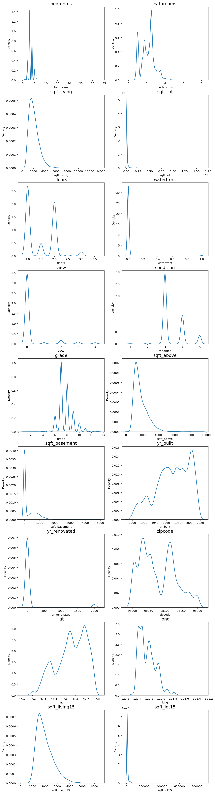
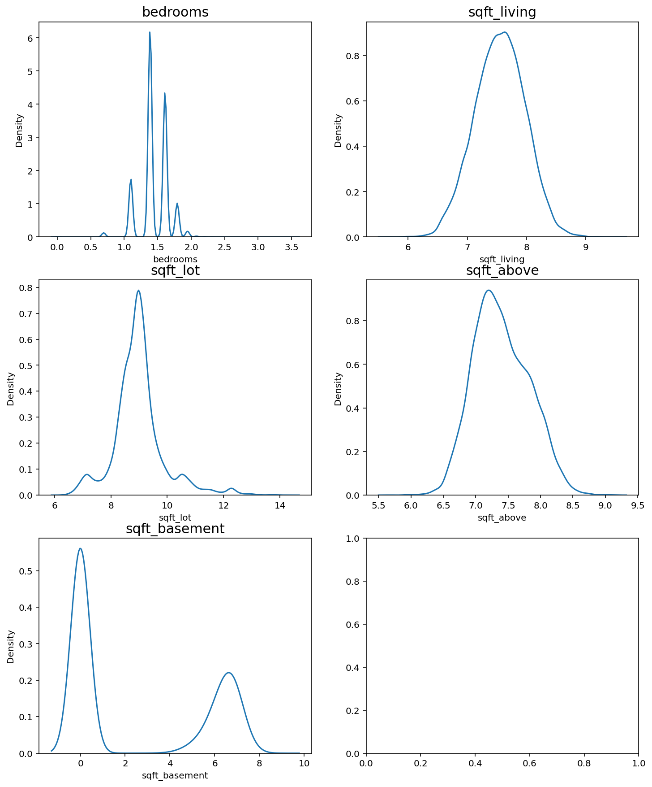
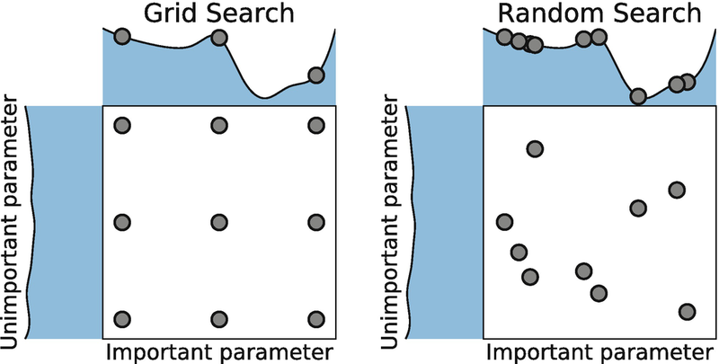

# 9. 캐글 경진대회 따라해보기

## 학습목표

---

- 데이터 사이언스 관련 최대 커뮤니티인 캐글의 경진대회에 직접 참여해서 문제를 해결해본다.
- 캐글에서 데이터를 내려받는 것으로부터 시작해서, 로컬 서버에서 자유롭게 다루어보며 문제 해결을 위한 고민을 해본다.
- 앙상블 기법의 개념과 강점을 이해하고, 여러 모델의 예측 결과를 Averaging 한 최종 결과로 캐글에 제출해본다.
- 하이퍼 파라미터 튜닝의 필요성과 의미를 이해하고, Grid Search, Random Search 등의 기법을 알아본다.
- Grid Search 기법을 활용해서 직접 하이퍼 파라미터 튜닝 실험을 해보고, 모델의 성능을 최대한 끌어올려본다.

```python
# 준비물
$ conda install -c conda-forge xgboost
$ conda install -c conda-forge lightgbm
$ conda install -c conda-forge missingno

$ pip install scikit-learn==0.23.0
```

## 참가 규칙, 평가 기준 살펴보기

오늘 진행할 대회는 [https://www.kaggle.com/c/2019-2nd-ml-month-with-kakr](https://www.kaggle.com/c/2019-2nd-ml-month-with-kakr) 이다.

링크를 보면 대회 소개, 점수 평가 기준, 상품, 대회 일정, 대회 규칙 등이 명시되어 있다.

Data 항목에는 데이터에 대한 설명들이 있다. train.csv 데이터를 활용해서 데이터를 뜯어보고 모델에 학습시킨 후, test.csv 파일의 데이터에 대해 price를 예측해서 sample_submission.csv 형식으로 제출하면 된다.

## Baseline 셋팅하기

---

이번 대회에서는 주최자 차원에서 Baseline이 제공되었다. Baseline은 기본적으로 문제 해결을 시작할 때 쉽게 사용해볼 수 있는 샘플을 이야기한다.

```python
# 시각화를 위한 코드
import matplotlib.pyplot as plt
%matplotlib inline
%config InlineBackend.figure_format = 'retina'
```

## 라이브러리, 데이터 가져오기

---

```python
import warnings
warnings.filterwarnings("ignore")

import os
from os.path import join

import pandas as pd
import numpy as np

import missingno as msno

from sklearn.ensemble import GradientBoostingRegressor
from sklearn.model_selection import KFold, cross_val_score
import xgboost as xgb
import lightgbm as lgb

import matplotlib.pyplot as plt
import seaborn as sns

train_data_path = join('./data', 'train.csv')
sub_data_path = join('./data', 'test.csv')
```

## 데이터 이해하기

---

```python
1. ID : 집을 구분하는 번호
2. date : 집을 구매한 날짜
3. price : 타겟 변수인 집의 가격
4. bedrooms : 침실의 수
5. bathrooms : 침실당 화장실 개수
6. sqft_living : 주거 공간의 평방 피트
7. sqft_lot : 부지의 평방 피트
8. floors : 집의 층수
9. waterfront : 집의 전방에 강이 흐르는지 유무 (a.k.a. 리버뷰)
10. view : 집이 얼마나 좋아 보이는지의 정도
11. condition : 집의 전반적인 상태
12. grade : King County grading 시스템 기준으로 매긴 집의 등급
13. sqft_above : 지하실을 제외한 평방 피트
14. sqft_basement : 지하실의 평방 피트
15. yr_built : 집을 지은 년도
16. yr_renovated : 집을 재건축한 년도
17. zipcode : 우편번호
18. lat : 위도
19. long : 경도
20. sqft_living15 : 이웃하는 15개 집의 거실의 평방 피트
21. sqft_lot15 : 아웃하는 15개 집의 부지의 평방 피트
```

```python
# 데이터 불러오기
data = pd.read_csv(train_data_path)
sub = pd.read_csv(sub_data_path)
print('train data dim : {}'.format(data.shape))
print('sub data dim : {}'.format(sub.shape))

# 학습 데이터에서 라벨 제거하기
y = data['price']
del data['price']

print(data.columns)

# 학습 데이터와 테스트 데이터 합치기
train_len = len(data)
data = pd.concat((data, sub), axis=0)

print(len(data))
data.head()

# missingno 라이브러리 이용하여 결측치 확인
msno.matrix(data)

# 수치로 확인
for c in data.columns:
    print('{} : {}'.format(c, len(data.loc[pd.isnull(data[c]), c].values)))

# 필요없는 데이터 정리
sub_id = data['id'][train_len:]
del data['id']

print(data.columns)
```

전체 데이터들의 분포를 확인하여 모델이 결과를 예측하는데 도움이 될 수 있도록 다듬는 작업을 진행한다. 시각화를 위해 seaborn의 kdeplot 그래프를 사용하였다. kdeplot 그래프는 이산데이터의 경우에도 부드러운 곡선으로 전체 준포를 확인할 수 있도록 시각화 하는 함수이다.

```python
fig, ax = plt.subplots(9, 2, figsize=(12, 50))   # 가로스크롤 때문에 그래프 확인이 불편하다면 figsize의 x값을 조절해 보세요. 

# id 변수(count==0인 경우)는 제외하고 분포를 확인합니다.
count = 1
columns = data.columns
for row in range(9):
    for col in range(2):
        sns.kdeplot(data[columns[count]], ax=ax[row][col])
        ax[row][col].set_title(columns[count], fontsize=15)
        count += 1
        if count == 19 :
            break
```



위 그래프 중에서는 bedrooms, sqft_living, sqft_lot, sqft_above, sqft_basement 변수가 한쪽으로 치우친 경향을 보이므로 로그 변환을 통해 정규분포에 가깝게 만들 수 있다.

```python
skew_columns = ['bedrooms', 'sqft_living', 'sqft_lot', 'sqft_above', 'sqft_basement']

for c in skew_columns:
    data[c] = np.log1p(data[c].values) # 각 요소에 대해 자연로그 log(1 + x)를 반환

# 변환 후 분포 확인
fig, ax = plt.subplots(3, 2, figsize=(12, 15))

count = 0
for row in range(3):
    for col in range(2):
        if count == 5:
            break
        sns.kdeplot(data[skew_columns[count]], ax=ax[row][col])
        ax[row][col].set_title(skew_columns[count], fontsize=15)
        count += 1
```



```python
# train, test data 분리
sub = data.iloc[train_len:, :]
x = data.iloc[:train_len, :]

print(x.shape)
print(sub.shape)
```

## 모델 설계

---

```python
# Average Blending
gboost = GradientBoostingRegressor(random_state=2019)
xgboost = xgb.XGBRegressor(random_state=2019)
lightgbm = lgb.LGBMRegressor(random_state=2019)

models = [{'model':gboost, 'name':'GradientBoosting'}, {'model':xgboost, 'name':'XGBoost'},
          {'model':lightgbm, 'name':'LightGBM'}]

# Cross Validation
def get_cv_score(models):
    kfold = KFold(n_splits=5, random_state=2019).get_n_splits(x.values)
    for m in models:
        print("Model {} CV score : {:.4f}".format(m['name'], np.mean(cross_val_score(m['model'], x.values, y)), 
                                                  kf=kfold))

# R Square 점수 반환
get_cv_score(models)
```

Baseline 모델에서는 여러 모델을 입력하면 각 모델에 대한 예측 결과를 평균내 내어주는 AverageingBlending 함수를 만들어 사용한다.

```python
# AvergagingBlending 함수 선언
def AveragingBlending(models, x, y, sub_x):
    for m in models : 
        m['model'].fit(x.values, y)
    
    predictions = np.column_stack([
        m['model'].predict(sub_x.values) for m in models
    ])
    return np.mean(predictions, axis=1)

# 예측값
y_pred = AveragingBlending(models, x, y, sub)
print(len(y_pred))
y_pred
```

캐글에 결과를 제출하기 위해서는 정해진 양식에 따라 제출해야 한다.

```python
# 제출 양식 확인
data_dir = os.getenv('HOME')+'/aiffel/kaggle_kakr_housing/data'

submission_path = join(data_dir, 'sample_submission.csv')
submission = pd.read_csv(submission_path)
submission.head() # id 와 price로 구성됨

# 제출 양식에 맞게 DataFrame 작성
result = pd.DataFrame({
    'id' : sub_id, 
    'price' : y_pred
})

result.head()

# 파일 저장
my_submission_path = join(data_dir, 'submission.csv')
result.to_csv(my_submission_path, index=False)

print(my_submission_path)
```

## 결과 제출

---

Submission 버튼을 눌러서 제출 후 내 스코어를 확인할 수 있다.

## 랭킹을 올리기 위하여

### (1) 하이퍼 파라미터 튜닝

---

```python
# 파일 불러오기
data_dir = os.getenv('HOME')+'/aiffel/kaggle_kakr_housing/data'

train_data_path = join(data_dir, 'train.csv')
test_data_path = join(data_dir, 'test.csv') 

train = pd.read_csv(train_data_path)
test = pd.read_csv(test_data_path)

train.head()

# data 전처리
train['date'] = train['date'].apply(lambda i: i[:6]).astype(int)
train.head()

# target 분리
y = train['price']
del train['price']

print(train.columns)

# id 컬럼 삭제
del train['id']

print(train.columns)

# test 데이터 처리
test['date'] = test['date'].apply(lambda i: i[:6]).astype(int)

del test['id']

print(test.columns)

# y분포 확인
sns.kdeplot(y)
plt.show()

# 로그변환
y = np.log1p(y)

sns.kdeplot(y)
plt.show()

# train 전체 자료형 확인
train.info()
```

### (2) 함수로 만들어 쓰기

---

```python
# 모듈 import
from sklearn.model_selection import train_test_split
from sklearn.metrics import mean_squared_error

# rmse 함수
def rmse(y_test, y_pred):
    return np.sqrt(mean_squared_error(np.expm1(y_test), np.expm1(y_pred)))

# 모델 import
from xgboost import XGBRegressor
from lightgbm import LGBMRegressor
from sklearn.ensemble import GradientBoostingRegressor, RandomForestRegressor

# random_state는 모델초기화나 데이터셋 구성에 사용되는 랜덤 시드값입니다. 
#random_state=None    # 이게 초기값입니다. 아무것도 지정하지 않고 None을 넘겨주면 모델 내부에서 임의로 선택합니다.  
random_state=2020        # 하지만 우리는 이렇게 고정값을 세팅해 두겠습니다. 

gboost = GradientBoostingRegressor(random_state=random_state)
xgboost = XGBRegressor(random_state=random_state)
lightgbm = LGBMRegressor(random_state=random_state)
rdforest = RandomForestRegressor(random_state=random_state)

models = [gboost, xgboost, lightgbm, rdforest]

# 각 모델의 이름
gboost.__class__.__name__

# 모델 별 학습 및 예측
df = {}

for model in models:
    # 모델 이름 획득
    model_name = model.__class__.__name__

    # train, test 데이터셋 분리 - 여기에도 random_state를 고정합니다. 
    X_train, X_test, y_train, y_test = train_test_split(train, y, random_state=random_state, test_size=0.2)

    # 모델 학습
    model.fit(X_train, y_train)
    
    # 예측
    y_pred = model.predict(X_test)

    # 예측 결과의 rmse값 저장
    df[model_name] = rmse(y_test, y_pred)
    
    # data frame에 저장
    score_df = pd.DataFrame(df, index=['RMSE']).T.sort_values('RMSE', ascending=False)
    
df

# get_score 함수
def get_scores(models, train, y):
        df = {}

        for model in models:
            model_name = model.__class__.__name__
            X_train, X_test, y_train, y_test = train_test_split(train, y, random_state=random_state, test_size=0.2)
            model.fit(X_train, y_train)
            y_pred = model.predict(X_test)
            df[model_name] = rmse(y_test, y_pred)
            score_df = pd.DataFrame(df, index=['RMSE']).T.sort_values('RMSE', ascending=False)
            
						return (score_df)
          
get_scores(models, train, y)
```

### (3) 그리드 탐색

---

RMSE 결괏값을 나타내주는 함수가 준비되었으니 다양한 하이퍼 파라미터로 실험해보자.

```python
from sklearn.model_selection import GridSearchCV
```



GridSearchCV에 입력되는 parameter들은 다음과 같다.

- param_grid : 탐색할 파라미터의 종류 (딕셔너리로 입력)
- scoring : 모델의 성능을 평가할 지표
- cv : cross validation을 수행하기 위해 train 데이터셋을 나누는 조각의 개수
- verbose : 그리드 탐색을 진행하면서 진행 과정을 출력해서 보여줄 메세지의 양 (숫자가 클수록 더 많은 메세지를 출력합니다.)
- n_jobs : 그리드 탐색을 진행하면서 사용할 CPU의 개수

```python
# 탐색할 parameter 준비
param_grid = {
    'n_estimators': [50, 100],
    'max_depth': [1, 10],
}

# 모델 준비
model = LGBMRegressor(random_state=random_state)

# 모델 탐색
grid_model = GridSearchCV(model, param_grid=param_grid, \
                        scoring='neg_mean_squared_error', \
                        cv=5, verbose=1, n_jobs=5)

grid_model.fit(train, y) # totalling 20 fits -> parameter 갯수 * CV(Cross-val)

# 결과 확인
grid_model.cv_results_

# 계산에 사용된 parameter
params = grid_model.cv_results_['params']
params

# score 확인
score = grid_model.cv_results_['mean_test_score']
score

# DataFrame 으로 변환
results = pd.DataFrame(params)
results['score'] = score

results

# score는 neg_mean_square_error를 사용했기 때문에 MSE의 음수값이다.
# 따라서 RMSE를 구하기 위해서는 약간의 변형이 필요하다.
results['RMSE'] = np.sqrt(-1 * results['score'])
results # 계산된 값은 Loss 값

# 계산된 값은 실제로는 Root Mean Squared Log Error
results = results.rename(columns={'RMSE': 'RMSLE'})
results

# 내림차순으로 정렬
results.sort_values(['RMSLE'])
results
```

```python
# GridSearch 함수 선언
def my_GridSearch(model, train, y, param_grid, verbose=2, n_jobs=5):
    grid_model = GridSearchCV(model, param_grid=param_grid,
                            scoring='neg_mean_squared_error',
                            cv=5, verbose=verbose, n_jobs=n_jobs)
    grid_model.fit(train, y)
    grid_model.cv_results_

    params = grid_model.cv_results_['params']
    score = grid_model.cv_results_['mean_test_score']

    results = pd.DataFrame(params)
    results['score'] = score

    results['RMSLE'] = np.sqrt(-1 * results['score'])
    results = results.sort_values(['RMSLE'])

    return results
```

### (4) 제출하는 것도 빠르고 깔끔하게

---

제출 과정 또한 하나의 함수로 깔끔하게 진행해보자.

```python
# GridSearch
param_grid = {
    'n_estimators': [50, 100],
    'max_depth': [1, 10],
}

model = LGBMRegressor(random_state=random_state)
my_GridSearch(model, train, y, param_grid, verbose=2, n_jobs=5)

# 찾은 조합으로 model train
model = LGBMRegressor(max_depth=10, n_estimators=100, random_state=random_state)
model.fit(train, y)
prediction = model.predict(test)
prediction

# 원래 scale로 변환
prediction = np.expm1(prediction)
prediction

# sample_submission 불러오기
submission_path = join(data_dir, 'sample_submission.csv')
submission = pd.read_csv(submission_path)
submission.head()

submission['price'] = prediction
submission.head()

# 결과 저장
submission_csv_path = '{}/submission_{}_RMSLE_{}.csv'.format(data_dir, 'lgbm', '0.164399')
submission.to_csv(submission_csv_path, index=False)
print(submission_csv_path)
```

```python
# save_submission 함수 선언
def save_submission(model, train, y, test, model_name, rmsle=None):
    model.fit(train, y)
    
    prediction = model.predict(test)
    prediction = np.expm1(prediction)
    
    data_dir = os.getenv('HOME')+'/aiffel/kaggle_kakr_housing/data'
    submission_path = join(data_dir, 'sample_submission.csv')
    submission = pd.read_csv(submission_path)
    
    submission['price'] = prediction
    
    submission_csv_path = '{}/submission_{}_RMSLE_{}.csv'.format(data_dir, model_name, rmsle)
    submission.to_csv(submission_csv_path, index=False)
    print('{} saved!'.format(submission_csv_path))
```

## 회고록

- 인공지능 공부를 시작하고 목표로 삼았던 캐글 컴패티션에서 메달따기의 첫걸음으로 이미 지난 컴패티션에 도전해보았다.
- 지금까지 노드를 진행했던 걸 생각하면 캐글에서 좋은 성능을 내는 것도 크게 어렵지 않을 것이라고 생각했는데 오산이었다... 내가 지금까지 배운 것은 빙산의 일각이었을 뿐이다.
- 역시 대회에서는 최대한 여러가지 경우의 수를 최대한 많이 시도해보는 것이 유리하다고 생각하기 때문에 데이터 처리부터 훈련에 따른 결과까지 한 번에 볼 수 있도록 하는 함수를 많이 사용하는 것 같다.
- 인공지능을 공부하기 전에도 하이퍼 파라미터도 자동으로 찾을 수 있을 것이라 생각했는데 역시나 있었다. 그러나 생각보다 단순하고 무식한 방법이었다. 그냥 다 돌려보기...
- xgboost의 parameter를 찾기 위해 GridSearch를 하였으나 파라미터 갯수가 많아서 그런지 1시간이 넘어도 결과가 나오질 않아서 결국 취소하였다. xgboost의 Hyperparameter를 최적화 할 때 GridSearch를 사용하면 오래 걸린다고는 했지만 이정도일 줄은 몰랐다.
- 그냥 xgboost의 속도가 느렸던 것이었다. lightgbm은 xgboost보다 빠른 속도로 Hyperparameter를 튜닝해볼 수 있었다.
- 추후 해커톤을 진행하면서 optuna라는 RandomSearch 라이브러리 사용법을 배워서 여기서도 한번 적용해봤는데 GridSearch를 워낙 많이 해서 그런지 크게 다른 결과를 얻지는 못하였다.
- 처음엔 baseline에서 hyperparameter만 조절하여 rubric을 만족시키려고 했었는데 현재 가진 feature로는 불가능한 것 같아서 결국엔 다른 사람들의 Notebook을 참고하여 feature를 추가하였다.
- feature를 추가하고 나니 너무나도 쉽게 rubric 조건을 만족할 수 있었다... hyperparameter 최적화보다 feature engineering이 더 중요한 것 같다.
- 내가 직접 스코어를 향상시킬 수 있는 방법을 찾고 따라해보니 확실히 이전보다는 머신러닝에 대한 이해가 높아진 것 같다.
- FE를 잘 하려면 pandas를 자유자재로 쓸 줄 알아야 할 것 같다. 내가 원하는 feature를 만들고 싶어도 만드는 방법을 모르면 아무 소용없기 때문이다.
- 사이킷런에 있는 회귀 앙상블 모델은 거의 다 써본 것 같은데 xgb와 lgb가 월등하게 성능이 좋아서 이 두 모델을 섞은 Voting 모델을 사용하여 최종 제출하였다. RMSE는 xgb가 더 좋았지만 Private Score는 Voting 모델쪽이 더 좋은 것으로 나왔다. 아무래도 xgb는 test set에 과적합 된 것 같다.

유용한 링크

[https://datascienceschool.net/01 python/04.03 데이터프레임 고급 인덱싱.html?highlight=데이터프레임 고급 인덱싱](https://datascienceschool.net/01%20python/04.03%20%EB%8D%B0%EC%9D%B4%ED%84%B0%ED%94%84%EB%A0%88%EC%9E%84%20%EA%B3%A0%EA%B8%89%20%EC%9D%B8%EB%8D%B1%EC%8B%B1.html?highlight=%EB%8D%B0%EC%9D%B4%ED%84%B0%ED%94%84%EB%A0%88%EC%9E%84%20%EA%B3%A0%EA%B8%89%20%EC%9D%B8%EB%8D%B1%EC%8B%B1)

[https://data-newbie.tistory.com/207](https://data-newbie.tistory.com/207) pandas lambda 활용하기

[https://subinium.github.io/introduction-to-ensemble-1/#:~:text=앙상블(Ensemble) 학습은 여러,를 가지고 이해하면 좋습니다](https://subinium.github.io/introduction-to-ensemble-1/#:~:text=%EC%95%99%EC%83%81%EB%B8%94(Ensemble)%20%ED%95%99%EC%8A%B5%EC%9D%80%20%EC%97%AC%EB%9F%AC,%EB%A5%BC%20%EA%B0%80%EC%A7%80%EA%B3%A0%20%EC%9D%B4%ED%95%B4%ED%95%98%EB%A9%B4%20%EC%A2%8B%EC%8A%B5%EB%8B%88%EB%8B%A4).

[https://gentlej90.tistory.com/73](https://gentlej90.tistory.com/73) kaggle 앙상블 가이드

[https://newsight.tistory.com/259](https://newsight.tistory.com/259) 결정계수 R Square

[https://shwksl101.github.io/ml/dl/2019/01/30/Hyper_parameter_optimization.html](https://shwksl101.github.io/ml/dl/2019/01/30/Hyper_parameter_optimization.html) 그리드 탐색

[https://scikit-learn.org/stable/modules/model_evaluation.html#scoring-parameter](https://scikit-learn.org/stable/modules/model_evaluation.html#scoring-parameter) 사이킷런 스코어링 체계

[http://machinelearningkorea.com/2019/09/29/lightgbm-파라미터/](http://machinelearningkorea.com/2019/09/29/lightgbm-%ED%8C%8C%EB%9D%BC%EB%AF%B8%ED%84%B0/) 파라미터 설명
