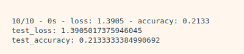

# 인공지능과 가위바위보 하기

# How to make?


일반적으로 딥러닝 기술은 **"데이터 준비 → 딥러닝 네트워크 설계 → 학습 → 테스트(평가)"** 순으로 이루어진다.

## 1. 데이터 준비

### MINIST 숫자 손글씨 Dataset 불러들이기

---

```python
import tensorflow as tf
from tensorflow import keras

import numpy as np
import matplotlib.pyplot as plt

print(tf.__version__) # Tensorflow의 버전 출력

mnist = keras.datasets.mnist

(x_train, y_train), (x_test, y_test) = mnist.load_data()

print(len(x_train)) # x_train 배열의 크기를 출력

plt.imshow(x_train[1], cmap=plt.cm.binary)
plt.show() # x_train의 1번째 이미지를 출력

print(y_train[1]) # x_train[1]에 대응하는 실제 숫자값

index = 10000
plt.imshow(x_train[index], cmap=plt.cm.binary)
plt.show()
print(f'{index} 번째 이미지의 숫자는 바로 {y_train[index]} 입니다.')

print(x_train.shape) # x_train 이미지의 (count, x, y)
print(x_test.shape)
```

### Data 전처리 하기

---

인공지능 모델을 훈련시킬 때, 값이 너무 커지거나 하는 것을 방지하기 위해 정수 연산보다는 0~1 사이의 값으로 정규화 시켜주는 것이 좋다.

정규화는 모든 값을 최댓값으로 나누어주면 된다.

```python
print(f'최소값: {np.min(x_train)} 최대값: {np.max(x_train)}')

x_train_norm, x_test_norm = x_train / 255.0, x_test / 255.0
print(f'최소값: {np.min(x_train_norm)} 최대값: {np.max(x_train_norm)}')
```

## 2. 딥러닝 네트워크 설계하기

### Sequential Model 사용해보기

---

```python
model = keras.models.Sequential()
model.add(keras.layers.Conv2D(16, (3,3), activation='relu', input_shape=(28,28,1)))
model.add(keras.layers.MaxPool2D(2,2))
model.add(keras.layers.Conv2D(32, (3,3), activation='relu'))
model.add(keras.layers.MaxPooling2D((2,2)))
model.add(keras.layers.Flatten())
model.add(keras.layers.Dense(32, activation='relu'))
model.add(keras.layers.Dense(10, activation='softmax'))

print(f'Model에 추가된 Layer 개수: {len(model.layers)}')

model.summary()
```


## 3. 딥러닝 네트워크 학습시키기

우리가 만든 네트워크의 입력은 (data_size, x_size, y_size, channel) 과 같은 형태를 가진다. 그러나 `x_train.shape` 에는 채널수에 대한 정보가 없기 때문에 만들어주어야 한다.

```python
print("Before Reshape - x_train_norm shape: {}".format(x_train_norm.shape))
print("Before Reshape - x_test_norm shape: {}".format(x_test_norm.shape))

x_train_reshaped=x_train_norm.reshape( -1, 28, 28, 1)  # 데이터갯수에 -1을 쓰면 reshape시 자동계산됩니다.
x_test_reshaped=x_test_norm.reshape( -1, 28, 28, 1)

print("After Reshape - x_train_reshaped shape: {}".format(x_train_reshaped.shape))
print("After Reshape - x_test_reshaped shape: {}".format(x_test_reshaped.shape))

model.compile(optimizer='adam',
             loss='sparse_categorical_crossentropy',
             metrics=['accuracy'])

model.fit(x_train_reshaped, y_train, epochs=10)
```

10epochs 정도 돌려본 결과 99.8% 에 가까운 정확도를 나타내는 것을 확인하였다.

## 4.  모델 평가하기

### 테스트 데이터로 성능을 확인해보기

---

```python
test_loss, test_accuracy = model.evaluate(x_test_reshaped,y_test, verbose=2)
print("test_loss: {} ".format(test_loss))
print("test_accuracy: {}".format(test_accuracy))
```

실제 테스트 데이터를 이용하여 테스트를 진행해본 결과, 99.1% 로 소폭 하락하였다. MNIST 데이터셋 참고문헌을 보면 학습용 데이터와 시험용 데이터의 손글씨 주인이 다른 것을 알 수 있다.

### 어떤 데이터를 잘못 추론했는지 확인해보기

---

`model.evalutate()` 대신 `model.predict()`를 사용하면 model이 입력값을 보고 실제로 추론한 확률분포를 출력할 수 있다.

```python
predicted_result = model.predict(x_test_reshaped)  # model이 추론한 확률값. 
predicted_labels = np.argmax(predicted_result, axis=1)

idx = 0  # 1번째 x_test를 살펴보자. 
print('model.predict() 결과 : ', predicted_result[idx])
print('model이 추론한 가장 가능성이 높은 결과 : ', predicted_labels[idx])
print('실제 데이터의 라벨 : ', y_test[idx])

# 실제 데이터 확인
plt.imshow(x_test[idx],cmap=plt.cm.binary)
plt.show()
```

추론 결과는 벡터 형태로, 추론 결과가 각각 0, 1, 2, ..., 7, 8, 9 일 확률을 의미한다.

아래 코드는 추론해낸 숫자와 실제 값이 다른 경우를 확인해보는 코드이다.

```python
import random
wrong_predict_list=[]
for i, _ in enumerate(predicted_labels):
    # i번째 test_labels과 y_test이 다른 경우만 모아 봅시다. 
    if predicted_labels[i] != y_test[i]:
        wrong_predict_list.append(i)

# wrong_predict_list 에서 랜덤하게 5개만 뽑아봅시다.
samples = random.choices(population=wrong_predict_list, k=5)

for n in samples:
    print("예측확률분포: " + str(predicted_result[n]))
    print("라벨: " + str(y_test[n]) + ", 예측결과: " + str(predicted_labels[n]))
    plt.imshow(x_test[n], cmap=plt.cm.binary)
    plt.show()
```

## 5. 더 좋은 네트워크 만들어 보기

딥러닝 네트워크 구조 자체는 바꾸지 않으면서도 인식률을 올릴 수 있는 방법은 Hyperparameter 들을 바꿔보는 것이다. Conv2D 레이어에서 입력 이미지의 특징 수를 증감시켜보거나, Dense 레이어에서 뉴런 수를 바꾸어보거나, epoch 값을 변경볼 수 있다.

```python
#바꿔 볼 수 있는 하이퍼파라미터들
n_channel_1=16
n_channel_2=32
n_dense=32
n_train_epoch=10

model=keras.models.Sequential()
model.add(keras.layers.Conv2D(n_channel_1, (3,3), activation='relu', input_shape=(28,28,1)))
model.add(keras.layers.MaxPool2D(2,2))
model.add(keras.layers.Conv2D(n_channel_2, (3,3), activation='relu'))
model.add(keras.layers.MaxPooling2D((2,2)))
model.add(keras.layers.Flatten())
model.add(keras.layers.Dense(n_dense, activation='relu'))
model.add(keras.layers.Dense(10, activation='softmax'))

model.summary()
model.compile(optimizer='adam',
             loss='sparse_categorical_crossentropy',
             metrics=['accuracy'])

# 모델 훈련
model.fit(x_train_reshaped, y_train, epochs=n_train_epoch)

# 모델 시험
test_loss, test_accuracy = model.evaluate(x_test_reshaped, y_test, verbose=2)
print("test_loss: {} ".format(test_loss))
print("test_accuracy: {}".format(test_accuracy))

```

| Title | n\_channel\_1 | n\_channel\_2 | n\_dense | n\_train\_epoch | loss | accuracy |
| --- | --- | --- | --- | --- | --- | --- |
| 1 | 16 | 32 | 32 | 10 | 0.0417 | 0.9889 |
| 2 | 1 | 32 | 32 | 10 | 0.0636 | 0.9793 |
| 3 | 2 | 32 | 32 | 10 | 0.0420 | 0.9865 |
| 4 | 4 | 32 | 32 | 10 | 0.0405 | 0.9886 |
| 5 | 8 | 32 | 32 | 10 | 0.0360 | 0.9885 |
| 6 | 32 | 32 | 32 | 10 | 0.0322 | 0.9903 |
| 7 | 64 | 32 | 32 | 10 | 0.0325 | 0.9914 |
| 8 | 128 | 32 | 32 | 10 | 0.0320 | 0.9912 |
| 9 | 16 | 1 | 32 | 10 | 0.1800 | 0.9437 |
| 10 | 16 | 64 | 32 | 10 | 0.0322 | 0.9912 |
| 11 | 16 | 128 | 32 | 10 | 0.0348 | 0.9917 |
| 12 | 16 | 32 | 64 | 10 | 0.0430 | 0.9888 |
| 13 | 16 | 32 | 128 | 10 | 0.0327 | 0.9916 |
| 14 | 16 | 32 | 32 | 15 | 0.0427 | 0.9900 |
| 15 | 16 | 32 | 32 | 20 | 0.0523 | 0.9884 |
| 16 | 64 | 128 | 128 | 15 | 0.0503 | 0.9901 |

각각의 Hyperparameter 별로 최적의 값을 찾아서 해당 값들만으로 테스트해보면 가장 좋은 결과가 나올 것 이라고 예상했는데 현실은 아니었다. 이래서 딥러닝이 어려운 것 같다.

## 6. 프로젝트: 가위바위보 분류기 만들기

오늘 배운 내용을 바탕으로 가위바위보 분류기를 만들어보자.

### 데이터 준비

---

### 1. 데이터 만들기

데이터는 구글의 teachable machine 사이트를 이용하면 쉽게 만들어볼 수 있다.

- 여러 각도에서
- 여러 크기로
- 다른 사람과 함께
- 만들면 더 좋은 데이터를 얻을 수 있다.

다운받은 이미지의 크기는 224x224 이다.

### 2. 데이터 불러오기 + Resize 하기

MNIST 데이터셋의 경우 이미지 크기가 28x28이었기 때문에 우리의 이미지도 28x28 로 만들어야 한다. 이미지를 Resize 하기 위해 PIL 라이브러리를 사용한다.

```python
# PIL 라이브러리가 설치되어 있지 않다면 설치
!pip install pillow   

from PIL import Image
import os, glob

print("PIL 라이브러리 import 완료!")

# 이미지 Resize 하기
# 가위 이미지가 저장된 디렉토리 아래의 모든 jpg 파일을 읽어들여서
image_dir_path = os.getenv("HOME") + "/aiffel/rock_scissor_paper/train/scissor"
print("이미지 디렉토리 경로: ", image_dir_path)

images=glob.glob(image_dir_path + "/*.jpg")  

# 파일마다 모두 28x28 사이즈로 바꾸어 저장합니다.
target_size=(28,28)
for img in images:
    old_img=Image.open(img)
    new_img=old_img.resize(target_size,Image.ANTIALIAS)
    new_img.save(img,"JPEG")

print("가위 이미지 resize 완료!")
```

```python
# load_data 함수

def load_data(img_path, number):
    # 가위 : 0, 바위 : 1, 보 : 2
    number_of_data=number   # 가위바위보 이미지 개수 총합에 주의하세요.
    img_size=28
    color=3
    #이미지 데이터와 라벨(가위 : 0, 바위 : 1, 보 : 2) 데이터를 담을 행렬(matrix) 영역을 생성합니다.
    imgs=np.zeros(number_of_data*img_size*img_size*color,dtype=np.int32).reshape(number_of_data,img_size,img_size,color)
    labels=np.zeros(number_of_data,dtype=np.int32)

    idx=0
    for file in glob.iglob(img_path+'/scissor/*.jpg'):
        img = np.array(Image.open(file),dtype=np.int32)
        imgs[idx,:,:,:]=img    # 데이터 영역에 이미지 행렬을 복사
        labels[idx]=0   # 가위 : 0
        idx=idx+1

    for file in glob.iglob(img_path+'/rock/*.jpg'):
        img = np.array(Image.open(file),dtype=np.int32)
        imgs[idx,:,:,:]=img    # 데이터 영역에 이미지 행렬을 복사
        labels[idx]=1   # 바위 : 1
        idx=idx+1       
    
    for file in glob.iglob(img_path+'/paper/*.jpg'):
        img = np.array(Image.open(file),dtype=np.int32)
        imgs[idx,:,:,:]=img    # 데이터 영역에 이미지 행렬을 복사
        labels[idx]=2   # 보 : 2
        idx=idx+1
        
    print("학습데이터(x_train)의 이미지 개수는",idx,"입니다.")
    return imgs, labels

image_dir_path = os.getenv("HOME") + "/aiffel/rock_scissor_paper"
(x_train, y_train)=load_data(image_dir_path, 2100)
x_train_norm = x_train/255.0   # 입력은 0~1 사이의 값으로 정규화

print("x_train shape: {}".format(x_train.shape))
print("y_train shape: {}".format(y_train.shape))

# 불러온 이미지 확인
import matplotlib.pyplot as plt
plt.imshow(x_train[0])
print('라벨: ', y_train[0])
```

### 3. 딥러닝 네트워크 설계하기

```python
# 딥러닝 네트워크 설계
import tensorflow as tf
from tensorflow import keras
import numpy as np

n_channel_1=16
n_channel_2=32
n_dense=64
n_train_epoch=15

model=keras.models.Sequential()
model.add(keras.layers.Conv2D(n_channel_1, (3,3), activation='relu', input_shape=(28,28,3)))
model.add(keras.layers.MaxPool2D(2,2))
model.add(keras.layers.Conv2D(n_channel_2, (3,3), activation='relu'))
model.add(keras.layers.MaxPooling2D((2,2)))
model.add(keras.layers.Flatten())
model.add(keras.layers.Dense(n_dense, activation='relu'))
model.add(keras.layers.Dense(3, activation='softmax'))

model.summary()
```

### 4. 모델 학습하기

```python
# 모델 학습
model.compile(optimizer='adam',
             loss='sparse_categorical_crossentropy',
             metrics=['accuracy'])

model.fit(x_train_reshaped, y_train, epochs=n_train_epoch)
```

### 5. 모델 평가하기

```python
# 테스트 이미지
image_dir_path = os.getenv("HOME") + "/aiffel/rock_scissor_paper/test/testset1"
(x_test, y_test)=load_data(image_dir_path, 300)
x_test_norm = x_test/255.0   # 입력은 0~1 사이의 값으로 정규화

print("x_train shape: {}".format(x_test.shape))
print("y_train shape: {}".format(y_test.shape))

# 불러온 이미지 확인
import matplotlib.pyplot as plt
plt.imshow(x_test[0])
print('라벨: ', y_test[0])

# 모델 테스트
test_loss, test_accuracy = model.evaluate(x_test_reshaped, y_test, verbose=2)
print("test_loss: {} ".format(test_loss))
print("test_accuracy: {}".format(test_accuracy))
```

처음 100개의 데이터 가지고 실행했을 때 결과는 처참했다... 



총 10명 분량을 train set으로 사용하고 test를 돌렸을 때 가장 잘 나온 결과!


오늘은 Layer를 추가하지 않고 단순히 Hyperparameter만 조정하여 인식률을 높이는 것을 목표로 했다. 우선 데이터가 부족한 것 같아서 10명 보다 더 많은 데이터를 추가해보면 좋을 것 같다. 아직 첫 모델이라 많이 부족했지만, 그래도 뭔가 목표가 있고 무엇을 해야 하는지 알게 되면 딥러닝이 조금 더 재밌어질 것 같다.
