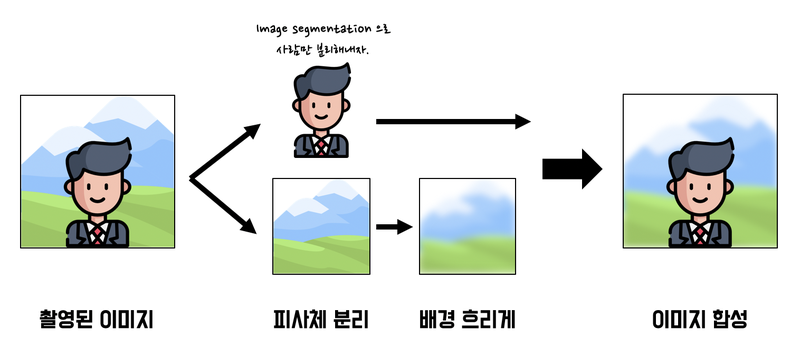
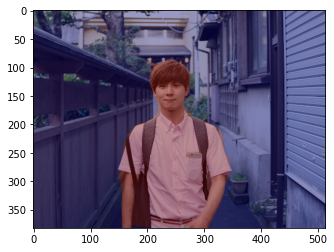
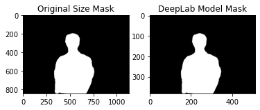
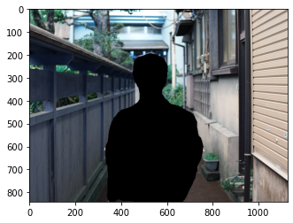
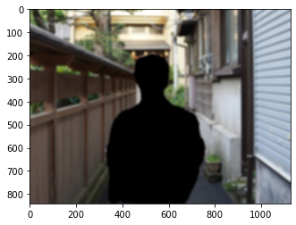
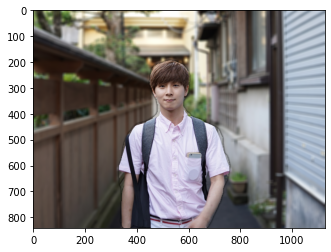

# 10. 인물사진 모드로 사진찍기

인물사진 모드란, 피사체를 촬영할 때 배경이 흐려지는 효과를 넣어주는 것을 이야기 한다. 물론 DSLR의 아웃포커스 효과와는 다른 방식으로 구현한다.

핸드폰 카메라의 인물사진 모드는 듀얼 카메라를 이용해 아웃포커싱 기능을 흉내낸다.

- DSLR에서는 사진을 촬영할 때 피사계 심도(depth of field, DOF)를 얕게 하여 초점이 맞은 피사체를 제외한 배경을 흐리게 만든다.
- 핸드폰 인물사진 모드는 화각이 다른 두 렌즈를 사용한다. 일반(광각) 렌즈에서는 배경을 촬영하고 망원 렌즈에서는 인물을 촬영한 뒤 배경을 흐리게 처리한 후 망원 렌즈의 인물과 적절하게 합성한다.

### 인물사진 모드에서 사용되는 용어

한국에서는 배경을 흐리게 하는 기술을 주로 '아웃포커싱'이라고 표현한다. 하지만 아웃포커싱은 한국에서만 사용하는 용어이고 정확한 영어 표현은 얕은 피사계 심도(shallow depth of field) 또는 셸로우 포커스(shallow focus) 라고 한다.

## 학습 목표

---

- 딥러닝을 이용하여 핸드폰 인물 사진 모드를 모방해본다.

## 셸로우 포커스 만들기

### (1) 사진준비

---

하나의 카메라로 셸로우 포커스(shallow focus)를 만드는 방법은 다음과 같다.



이미지 세그멘테이션(Image segmentation) 기술을 이용하면 하나의 이미지에서 배경과 사람을 분리할 수 있다. 분리된 배경을 블러(blur)처리 후 사람 이미지와 다시 합하면 아웃포커싱 효과를 적용한 인물사진을 얻을 수 있다.

```python
# 필요 모듈 import
import cv2
import numpy as np
import os
from glob import glob
from os.path import join
import tarfile
import urllib

from matplotlib import pyplot as plt
import tensorflow as tf

# 이미지 불러오기
import os
img_path = os.getenv('HOME')+'/aiffel/human_segmentation/images/2017.jpg'  # 본인이 선택한 이미지의 경로에 맞게 바꿔 주세요. 
img_orig = cv2.imread(img_path) 
print (img_orig.shape)
```

### (2) 세그멘테이션으로 사람 분리하기

---

배경에만 렌즈흐림 효과를 주기 위해서는 이미지에서 사람과 배경을 분리해야 한다. 흔히 포토샵으로 '누끼 따기'와 같은 작업을 이야기한다.

**세그멘테이션(Segmentation)이란?**

이미지에서 픽셀 단위로 관심 객체를 추출하는 방법을 이미지 세그멘테이션(image segmentation) 이라고 한다. 이미지 세그멘테이션은 모든 픽셀에 라벨(label)을 할당하고 같은 라벨은 "공통적인 특징"을 가진다고 가정한다. 이 때 공통 특징은 물리적 의미가 없을 수도 있다. 픽셀이 비슷하게 생겼다는 사실은 인식하지만, 우리가 아는 것처럼 실제 물체 단위로 인식하지 않을 수 있다. 물론 세그멘테이션에는 여러 가지 세부 태스크가 있으며, 태스크에 따라 다양한 기준으로 객체를 추출한다.

**시멘틱 세그멘테이션(Semantic segmentation)이란?**

세그멘테이션 중에서도 특히 우리가 인식하는 세계처럼 물리적 의미 단위로 인식하는 세그멘테이션을 시맨틱 세그멘테이션 이라고 한다. 쉽게 설명하면 이미지에서 픽셀을 사람, 자동차, 비행기 등의 물리적 단위로 분류(classification)하는 방법이라고 할 수 있다.

**인스턴스 세그멘테이션(Instance segmentation)이란?**

시맨틱 세그멘테이션은 '사람'이라는 추상적인 정보를 이미지에서 추출해내는 방법이다. 그래서 사람이 누구인지 관계없이 같은 라벨로 표현이 된다. 더 나아가서 인스턴스 세그멘테이션은 사람 개개인 별로 다른 라벨을 가지게 한다. 여러 사람이 한 이미지에 등장할 때 각 객체를 분할해서 인식하자는 것이 목표이다.

**이미지 세그멘테이션의 간단한 알고리즘 : 워터쉐드 세그멘테이션(watershed segmentation)**

이미지에서 영역을 분할하는 가장 간단한 방법은 물체의 '경계'를 나누는 것이다. 이미지는 그레이스케일(grayscale)로 변환하면 0~255의 값을 가지기 때문에 픽셀 값을 이용해서 각 위치의 높고 낮음을 구분할 수 있다. 따라서 낮은 부분부터 서서히 '물'을 채워 나간다고 생각할 때 각 영역에서 점점 물이 차오르다가 넘치는 시점을 경계선으로 만들면 물체를 서로 구분할 수 있게 된다.

### (3) 시멘틱 세그멘테이션 다뤄보기

---

세그멘테이션 문제에는 FCN, SegNet, U-Net 등 많은 모델이 사용된다. 오늘은 그 중에서 DeepLab이라는 세그멘테이션 모델을 만들고 모델에 이미지를 입력할 것이다. DeepLab 알고리즘(DeepLab v3+)은 세그멘테이션 모델 중에서도 성능이 매우 좋아 최근까지도 많이 사용되고 있다.

DeepLabDemo : [https://github.com/tensorflow/models/blob/master/research/deeplab/deeplab_demo.ipynb](https://github.com/tensorflow/models/blob/master/research/deeplab/deeplab_demo.ipynb)

```python
# DeepLabModel Class 정의
class DeepLabModel(object):
    INPUT_TENSOR_NAME = 'ImageTensor:0'
    OUTPUT_TENSOR_NAME = 'SemanticPredictions:0'
    INPUT_SIZE = 513
    FROZEN_GRAPH_NAME = 'frozen_inference_graph'

    # __init__()에서 모델 구조를 직접 구현하는 대신, tar file에서 읽어들인 그래프구조 graph_def를 
    # tf.compat.v1.import_graph_def를 통해 불러들여 활용하게 됩니다. 
    def __init__(self, tarball_path):
        self.graph = tf.Graph()
        graph_def = None
        tar_file = tarfile.open(tarball_path)
        for tar_info in tar_file.getmembers():
            if self.FROZEN_GRAPH_NAME in os.path.basename(tar_info.name):
                file_handle = tar_file.extractfile(tar_info)
                graph_def = tf.compat.v1.GraphDef.FromString(file_handle.read())
                break
        tar_file.close()

        with self.graph.as_default():
    	    tf.compat.v1.import_graph_def(graph_def, name='')

        self.sess = tf.compat.v1.Session(graph=self.graph)

    # 이미지를 전처리하여 Tensorflow 입력으로 사용 가능한 shape의 Numpy Array로 변환합니다.
    def preprocess(self, img_orig):
        height, width = img_orig.shape[:2]
        resize_ratio = 1.0 * self.INPUT_SIZE / max(width, height)
        target_size = (int(resize_ratio * width), int(resize_ratio * height))
        resized_image = cv2.resize(img_orig, target_size)
        resized_rgb = cv2.cvtColor(resized_image, cv2.COLOR_BGR2RGB)
        img_input = resized_rgb
        return img_input
        
    def run(self, image):
        img_input = self.preprocess(image)

        # Tensorflow V1에서는 model(input) 방식이 아니라 sess.run(feed_dict={input...}) 방식을 활용합니다.
        batch_seg_map = self.sess.run(
            self.OUTPUT_TENSOR_NAME,
            feed_dict={self.INPUT_TENSOR_NAME: [img_input]})

        seg_map = batch_seg_map[0]
        return cv2.cvtColor(img_input, cv2.COLOR_RGB2BGR), seg_map
```

`preprocess()`는 전처리, `run()`은 실제로 세그멘테이셔는 하는 함수이다. input tensor를 만들기 위해 전처리를 하고, 적절한 크기로 resize하여 OpenCV의 BGR 채널은 RGB로 수정 후 `run()`함수의 input parameter로 사용된다.

```python
# Model 다운로드
# define model and download & load pretrained weight
_DOWNLOAD_URL_PREFIX = 'http://download.tensorflow.org/models/'

model_dir = os.getenv('HOME')+'/aiffel/human_segmentation/models'
tf.io.gfile.makedirs(model_dir)

print ('temp directory:', model_dir)

download_path = os.path.join(model_dir, 'deeplab_model.tar.gz')
if not os.path.exists(download_path):
    urllib.request.urlretrieve(_DOWNLOAD_URL_PREFIX + 'deeplabv3_mnv2_pascal_train_aug_2018_01_29.tar.gz',
                   download_path)

MODEL = DeepLabModel(download_path)
print('model loaded successfully!')
```

위 코드는 구글이 제공하는 pretrained weight이다. 이 모델은 PASCAL VOC 2012라는 대형 데이터셋으로 학습된 v3 버전이다.

```python
# 이미지 resize
img_resized, seg_map = MODEL.run(img_orig)
print (img_orig.shape, img_resized.shape, seg_map.max()) # cv2는 채널을 HWC 순서로 표시

# seg_map.max() 의 의미는 물체로 인식된 라벨 중 가장 큰 값을 뜻하며, label의 수와 일치

# PASCAL VOC로 학습된 label
LABEL_NAMES = [
    'background', 'aeroplane', 'bicycle', 'bird', 'boat', 'bottle', 'bus',
    'car', 'cat', 'chair', 'cow', 'diningtable', 'dog', 'horse', 'motorbike',
    'person', 'pottedplant', 'sheep', 'sofa', 'train', 'tv'
]
len(LABEL_NAMES)

# 사람을 찾아 시각화
img_show = img_resized.copy()
seg_map = np.where(seg_map == 15, 15, 0) # 예측 중 사람만 추출 person의 label은 15
img_mask = seg_map * (255/seg_map.max()) # 255 normalization
img_mask = img_mask.astype(np.uint8)
color_mask = cv2.applyColorMap(img_mask, cv2.COLORMAP_JET)
img_show = cv2.addWeighted(img_show, 0.6, color_mask, 0.35, 0.0)

plt.imshow(cv2.cvtColor(img_show, cv2.COLOR_BGR2RGB))
plt.show()
```



### (4) 세그멘테이션 결과를 원래 크기로 복원하기

---

DeepLab 모델을 사용하기 위해 이미지 크기를 작게 resize했기 때문에 원래 크기로 복원해야 한다.

```python
# 이미지 사이즈 비교
img_mask_up = cv2.resize(img_mask, img_orig.shape[:2][::-1], interpolation=cv2.INTER_LINEAR)
_, img_mask_up = cv2.threshold(img_mask_up, 128, 255, cv2.THRESH_BINARY)

ax = plt.subplot(1,2,1)
plt.imshow(img_mask_up, cmap=plt.cm.binary_r)
ax.set_title('Original Size Mask')

ax = plt.subplot(1,2,2)
plt.imshow(img_mask, cmap=plt.cm.binary_r)
ax.set_title('DeepLab Model Mask')

plt.show()
```



`cv2.resize()` 함수를 이용하여 원래 크기로 복원하였다. 크기를 키울 때 보간(interpolation)을 고려해야 하는데, `cv2.INTER_NEAREST`를 이용하면 깔끔하게 처리할 수 있지만 더 정확하게 확대하기 위해 `cv2.INTER_LINEAR`를 사용하였다.

결과적으로 `img_mask_up` 은 경계가 블러된 픽셀값 0~255의 이미지를 얻는다. 확실한 경계를 다시 정하기 위해 중간값인 128을 기준으로 임계값(threshold)을 설정하여 128 이하의 값은 0으로 128 이상의 값은 255로 만들었다.

### (5) 배경 흐리게 하기

---

```python
# 배경 이미지 얻기
img_mask_color = cv2.cvtColor(img_mask_up, cv2.COLOR_GRAY2BGR)
img_bg_mask = cv2.bitwise_not(img_mask_color)
img_bg = cv2.bitwise_and(img_orig, img_bg_mask)
plt.imshow(img_bg)
plt.show()
```



`bitwise_not` : not 연산하여 이미지 반전

`bitwise_and` : 배경과 and 연산하여 배경만 있는 이미지를 얻을 수 있다.

```python
# 이미지 블러처리
img_bg_blur = cv2.blur(img_bg, (13,13))
plt.imshow(cv2.cvtColor(img_bg_blur, cv2.COLOR_BGR2RGB))
plt.show()
```



### (6) 흐린 배경과 원본 영상 합성

---

```python
# 255인 부분만 원본을 가져온 후 나머지는 blur 이미지
img_concat = np.where(img_mask_color==255, img_orig, img_bg_blur)
plt.imshow(cv2.cvtColor(img_concat, cv2.COLOR_BGR2RGB))
plt.show()
```


## 회고록

- 평소에 사진을 취미로 하고 있어서 이번 과제를 이해하는 것이 어렵지 않았다.
- 이미지 세그멘테이션에 대해 단어만 알고 정확히 어떤 역할을 하는 기술인지 잘 몰랐는데 이번 학습을 통해 확실하게 알 수 있었다.
- 이미지를 블러처리 하는 과정에서 인물과 배경의 경계 부분도 같이 블러처리 되어버리기 때문에 나중에 이미지를 병합하는 과정에서 배경에 있는 인물 영역이 실제 사진의 인물 영역보다 넓어져 병합 후의 이미지에서 경계 주위로 그림자(?)가 지는 것 같은 현상을 볼 수 있었다.
- 앞으로 자율주행이나 인공지능을 이용해서 자동화 할 수 있는 부분에는 어디든 사용될 수 있을 법한 그런 기술인 것 같다.
- 이 기술을 이용해서 병, 캔, 플라스틱 과 같은 재활용 쓰레기를 구분할 수 있다고 하면, 환경 분야에서도 쓸 수 있지 않을까...? 그 정도로 구분하는 것은 어려울 것 같긴 하다.
- jupyter notebook에서 생성된 이미지를 깔끔하게 보이도록 정리하려고 html을 이용하여 사진을 정렬했었는데 github에선 html style이 무시된다는 것을 알게되어 3시간 정도를 이미지 정렬하는 데 썼다... 결국 안 된다는 것을 깨닫고 pyplot을 이용해서 비교하였다.

### 유용한 링크

[https://blog.lunit.io/2018/07/02/deeplab-v3-encoder-decoder-with-atrous-separable-convolution-for-semantic-image-segmentation/](https://blog.lunit.io/2018/07/02/deeplab-v3-encoder-decoder-with-atrous-separable-convolution-for-semantic-image-segmentation/) DeepLab V3+

[https://arxiv.org/abs/1610.02357](https://arxiv.org/abs/1610.02357) Xception: Deep Learning with Depthwise Separable Convolutions

[https://github.com/tensorflow/models/blob/master/research/deeplab/g3doc/model_zoo.md](https://github.com/tensorflow/models/blob/master/research/deeplab/g3doc/model_zoo.md) pretrained weight

[https://opencv-python.readthedocs.io/en/latest/doc/10.imageTransformation/imageTransformation.html](https://opencv-python.readthedocs.io/en/latest/doc/10.imageTransformation/imageTransformation.html) opencv image transformation

[https://stackoverflow.com/questions/32774956/explain-arguments-meaning-in-res-cv2-bitwise-andimg-img-mask-mask](https://stackoverflow.com/questions/32774956/explain-arguments-meaning-in-res-cv2-bitwise-andimg-img-mask-mask) bitwise 사용하여 이미지 바꾸기

[https://numpy.org/doc/stable/reference/generated/numpy.where.html](https://numpy.org/doc/stable/reference/generated/numpy.where.html)
