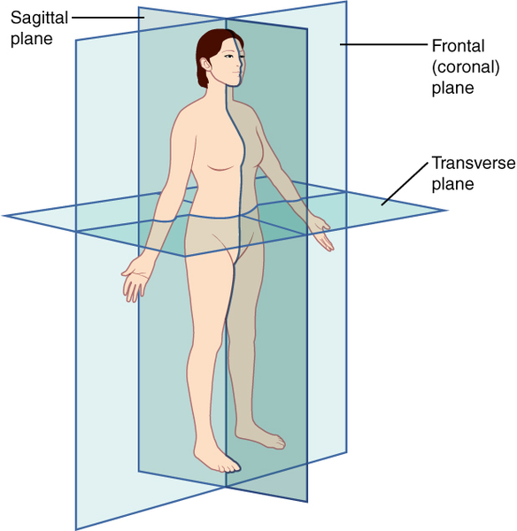
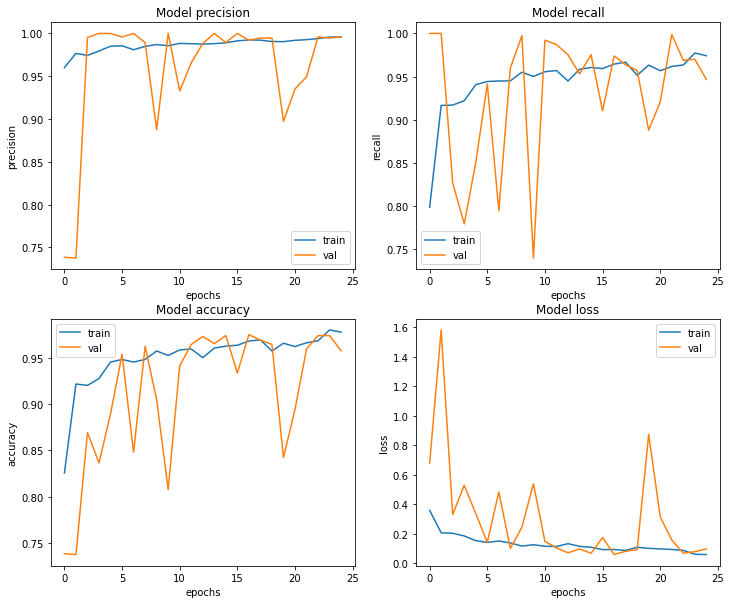

# 14. 폐렴아 기다려라!

딥러닝 기술이 산업적으로 명확한 용도를 입증한 도메인 중 하나로 의료 분야를 들 수 있다. 의료영상을 분석하는 일은 전문적인 훈련을 받은 숙련된 의료인력만 가능한 일이지만, 최근의 발달된 딥러닝 기술은 숙련자 수준 이상의 정확도를 바탕으로 영상분석 인력의 개인적 편차 ,주관적 판단, 피로에 의한 오진 등의 부정확성을 극복할 수 있는 좋은 대안으로 인정받고 있다.

하지만, 의료영상을 분석하는 것은 일반적인 이미지 처리와는 다소 다른 독특한 특징이 있다.

- 의료영상 이미지는 개인정보 보호 등의 이슈로 인해 데이터를 구하는 것이 쉽지 않다.
- 라벨링 작업 자체가 전문적 지식을 요하므로 데이터셋 구축 비용이 비싸다.
- 희귀질병을 다루는 경우 데이터를 입수하는 것 자체가 드문 일이다.
- 음성/양성 데이터간 imbalance가 심하기 때문에 학습에 주의가 필요하다.
- 이미지만으로 진단이 쉽지 않아 다른 데이터와 결합해서 해석해야 할수도 있다.

## 의료 영상에 대해

### (1) 사람 속을 보는 방법

---

만약에 폐의 문제를 진단하려면 어떻게 해야 할까? 기술이 발달하기 전에는 칼로 흉부를 갈라 확인하는 방법밖엔 없었겠지만 오늘날에는 X-RAY나 CT영상 등 다양한 기술이 존재한다.


위의 사진과 같이 피부에 칼을 대지 않아도 X-RAY나 CT 영상으로 폐의 정상 여부 혹은 모양을 볼 수 있게 되었다. 이런 기술은 우리의 평균수명을 향상시키는데 크게 이바지하고 있다.

### (2) 의료 영상 종류

---

**X-RAY**

- RAY는 전자를 물체에 충돌시킬 때 발생하는 투과력이 강한 복사선(전자기파)을 말합니다. X-RAY는 방사선의 일종으로 지방, 근육, 천, 종이 같이 밀도가 낮은 것은 수월하게 통과하지만, 밀도가 높은 뼈, 금속 같은 물질은 잘 통과하지 못한다.


**CT**

- CT는 Computed Tomography의 줄임말로, 환자를 중심으로 X-RAY를 빠르게 회전하여 3D 이미지를 만들어내는 영상이다. 환자의 3차원 이미지를 형성하여 기본 구조는 물론 가능한 종양 또는 이상을 쉽게 식별하고 위치를 파악할 수 있다.
- 신체의 단면 이미지를 "Slice" 또는 단층 촬영 이미지라고 하며, 기존의 X-RAY보다 더 자세한 정보를 포함한다.


**MRI**

MRI는 Magnetic Resonance Imaging(자기 공명 영상)의 줄임말로 신체의 해부학적 과정과 생리적 과정을 보기 위해 사용하는 의료 영상 기술 이다. MRI 스캐너는 강한 자기장를 사용하여 신체 기관의 이미지를 생성한다. MRI는 CT, X-RAY와 다르게 방사선을 사용하지 않아서 방사선의 위험성에서는 보다 안전하다.

## X-RAY 이미지

X-RAY 이미지를 이해하려면, X-RAY 영상을 촬영하기 위해 사용되는 자세 분류 체계를 이해하는 것이 중요하다.

### (1) 의료영상 자세 분류

---



위의 이미지에 따르면 의료 영상 촬영은 인체를 세 방향의 단면으로 나누어 진행된다.

- Sagittal plane : 시상면. 사람을 왼쪽과 오른쪽을 나누는 면
- Coronal plane : 관상면. 인체를 앞 뒤로 나누는 면
- Transverse plane : 횡단면(수평면). 인체를 상하로 나누는 면


### (2) X-RAY 특성

---

X-RAY는 전자기파가 몸을 통과한 결과를 이미지화 시킨 것이다. 즉, 통과하고 남은 전자기파의 결과이기 때문에 색상이 아니라 흑백 명암으로 나오게 되며, 부위에 따라서 명암이 다르게 나온다.


- 뼈 : 하얀색
- 근육 및 지방 : 연한 회색
- 공기 : 검은색


- 갈비뼈 : 하얀색
- 폐 : 검은색
- 어깨 쪽의 지방 및 근육 : 연한 회색

## 폐렴을 진단해보자

폐렴은 폐에 염증이 생긴 상태로 중증의 호흡기 감염병이다.

### (1) Data 준비

---

**데이터셋**

이번 노드에서 사용할 데이터는 캐글의 Chest X-Ray Images 이다. 

[Chest X-Ray Images (Pneumonia)](https://www.kaggle.com/paultimothymooney/chest-xray-pneumonia)

**폐렴구별법**


폐렴의 구별법은 언뜻 예상 외로 간단하다. X-RAY 사진상, 다양한 양상의 음영(폐 부위에 희미한 그림자) 증가가 관찰괸다. 구별 방법은 간단하지만 실제로 영상을 보면 희미한 경우가 많이 있어 저게 실제로 폐렴으로 인한 것인지 아니면 다른 이유 때문인지 파악하기 어렵다.


정상적인 흉부 X-RAY(왼쪽)는 이미지에서 비정상적인 음영 영역이 없는 깨끗한 폐를 보여준다. 세균성 폐렴 (가운데)은 일반적으로 오른쪽 상부 엽 (흰색 화살표)에 있는 나타내는 반면, 바이러스성 폐렴 (오른쪽)은 양쪽 폐에서보다 확산 된 "interstitial(조직 사이에 있는)" 패턴으로 나타난다.

위와 같이 폐렴에 걸린 사진들은 특징이 패턴을 이루고 있는 것을 볼 수 있다. 따라서 이런 패턴을 잘 읽어내는 딥러닝 알고리즘을 학습시켜보자.

```python
import re    # 정규표현식 관련된 작업에 필요한 패키지
import os    # I/O 관련된 작업에 필요한 패키지 
import pandas as pd     # 데이터 전처리 관련된 작업에 필요한 패키지
import numpy as np      # 데이터 array 작업에 필요한 패키지
import tensorflow as tf  # 딥러닝 관련된 작업에 필요한 패키지
import matplotlib.pyplot as plt    # 데이터 시각화에 관련된 작업에 필요한 패키지
from sklearn.model_selection import train_test_split  # 데이터 전처리에 필요한 패키지

# 데이터 로드할 때 빠르게 로드할 수 있도록하는 설정 변수
AUTOTUNE = tf.data.experimental.AUTOTUNE

# 데이터 ROOT 경로 변수
ROOT_PATH = os.path.join(os.getenv('HOME'), 'aiffel')

# BATCH_SIZE 변수
BATCH_SIZE = 16

# X-RAY 이미지 사이즈 변수
IMAGE_SIZE = [180, 180]

# EPOCH 크기 변수
EPOCHS = 25

print(ROOT_PATH)

# data load
train_filenames = tf.io.gfile.glob(str(ROOT_PATH + '/chest_xray/train/*/*'))
test_filenames = tf.io.gfile.glob(str(ROOT_PATH + '/chest_xray/test/*/*'))
val_filenames = tf.io.gfile.glob(str(ROOT_PATH + '/chest_xray/val/*/*'))

print(len(train_filenames)) # 5216
print(len(test_filenames))  # 624
print(len(val_filenames))   # 16
```

train 안에는 5216개, test 안에는 624개, val 안에는 16개가 있다. 갯수 비는 89%, 10.7%, 0.3% 으로, val 갯수가 너무 없기 때문에 train에서 val에 쓰일 데이터를 더 가져와보자. train과 val에 있는 데이터를 모은 다음에 train : val를 80:20으로 분할한다.

```python
filenames = tf.io.gfile.glob(str(ROOT_PATH + '/chest_xray/train/*/*'))
filenames.extend(tf.io.gfile.glob(str(ROOT_PATH + '/chest_xray/val/*/*')))

# train, test(val) dataset으로 분할. test_size에 0.2는 20%롤 의미함.
train_filenames, val_filenames = train_test_split(filenames, test_size=0.2)

print(len(train_filenames)) # 4185
print(len(val_filenames))   # 1047

# 정상/폐렴 이미지 수 확인
COUNT_NORMAL = len([filename for filename in train_filenames if "NORMAL" in filename])
print("Normal images count in training set: " + str(COUNT_NORMAL)) # 1076

COUNT_PNEUMONIA = len([filename for filename in train_filenames if "PNEUMONIA" in filename])
print("Pneumonia images count in training set: " + str(COUNT_PNEUMONIA)) # 3109
```

결과를 보면 정상보다 폐렴 이미지 수가 3배 더 많이 있다. 우리가 사용할 CNN 모델의 경우 데이터가 클래스별 balance가 좋을 수록 training을 잘 한다. 데이터가 클래스 불균형(imbalance)한 것은 차후에 조정한다. test와 val 데이터셋은 평가하기 위해서 사용되기 때문에 학습과 관련이 없으므로 imbalance한 데이터 셋이어도 문제가 없다.

tf.data는 tensorflow에서 학습시킬 때, 배치처리 작업을 보다 효율적으로 할 수 있도록 해준다.

```python
# tf.data 인스턴스 생성
train_list_ds = tf.data.Dataset.from_tensor_slices(train_filenames)
val_list_ds = tf.data.Dataset.from_tensor_slices(val_filenames)

# train, val dataset 갯수 확인
TRAIN_IMG_COUNT = tf.data.experimental.cardinality(train_list_ds).numpy()
print("Training images count: " + str(TRAIN_IMG_COUNT)) # 4185

VAL_IMG_COUNT = tf.data.experimental.cardinality(val_list_ds).numpy()
print("Validating images count: " + str(VAL_IMG_COUNT)) # 1047

# label 이름 확인
CLASS_NAMES = np.array([str(tf.strings.split(item, os.path.sep)[-1].numpy())[2:-1]
                        for item in tf.io.gfile.glob(str(ROOT_PATH + "/chest_xray/train/*"))])
print(CLASS_NAMES) # ['PNEUMONIA' 'NORMAL']

# label data 생성
def get_label(file_path):
    parts = tf.strings.split(file_path, os.path.sep)
    return parts[-2] == "PNEUMONIA"   # 폐렴이면 양성(True), 노말이면 음성(False)를 리턴하게 합니다.
```

이미지 데이터는 사이즈가 제각각일 가능성이 높으므로 이미지의 사이즈를 통일시키고 GPU 메모리를 효율적으로 사용하기 위해 이미지 사이즈를 줄여보자.

```python
# 이미지 데이터 타입 float로 변경 후 resize
def decode_img(img):
  # 이미지를 uint8 tensor로 바꾼다.
  img = tf.image.decode_jpeg(img, channels=3)
  # img를 범위 [0,1]의 float32 데이터 타입으로 바꾼다.
  img = tf.image.convert_image_dtype(img, tf.float32)
  # img의 이미지 사이즈를 IMAGE_SIZE에서 지정한 사이즈로 수정한다.
  return tf.image.resize(img, IMAGE_SIZE)

def process_path(file_path):
    label = get_label(file_path)
    img = tf.io.read_file(file_path)
    img = decode_img(img)
    return img, label

# train, val dataset 생성
train_ds = train_list_ds.map(process_path, num_parallel_calls=AUTOTUNE)
val_ds = val_list_ds.map(process_path, num_parallel_calls=AUTOTUNE)

# 이미지 확인
for image, label in train_ds.take(1): # take(1) 하나의 데이터만 가져오기
    print("Image shape: ", image.numpy().shape) # (180, 180, 3)
    print("Label: ", label.numpy()) # True

# testset 생성
test_list_ds = tf.data.Dataset.list_files(str(ROOT_PATH + '/chest_xray/test/*/*'))
TEST_IMAGE_COUNT = tf.data.experimental.cardinality(test_list_ds).numpy()
test_ds = test_list_ds.map(process_path, num_parallel_calls=AUTOTUNE)
test_ds = test_ds.batch(BATCH_SIZE)

print(TEST_IMAGE_COUNT) # 624
```

 prepare_for_training() 함수는 학습 데이터를 효율적으로 할 수 있도록 데이터를 변환 시켜준다.

shuffle()을 사용하며 고정 크기 버퍼를 유지하고 해당 버퍼에서 무작위로 균일하게 다음 요소를 선택한다.

repeat()를 사용하면 epoch를 진행하면서 여러번 데이터셋을 불러오게 되는데, 이때 repeat()를 사용한 데이터셋의 경우 여러번 데이터셋을 사용할 수 있게 해준다. 예를 들어, 100개의 데이터를 10번 반복하면 1000개의 데이터가 필요하게 되는데, repeat()를 사용하면 자동으로 데이터를 맞춰준다.

batch()를 사용하면 BATCH_SIZE에서 정한 만큼의 배치로 주어진다. 예를 들어, 100개의 데이터를 10개의 배치로 나누게 되면 각 배치에는 10개의 데이터로 나뉘게 된다.

prefetch()를 사용하면 학습데이터를 나눠서 읽어오기 때문에, 첫 번째 데이터를 GPU에서 학습하는 동안 두 번째 데이터를 CPU에서 준비할 수 있어 리소스의 유휴 상태를 줄일 수 있다.

```python
# tf.data 파이프라인 사용
def prepare_for_training(ds, shuffle_buffer_size=1000):

    ds = ds.shuffle(buffer_size=shuffle_buffer_size)

    ds = ds.repeat()

    ds = ds.batch(BATCH_SIZE)

    ds = ds.prefetch(buffer_size=AUTOTUNE)

    return ds

train_ds = prepare_for_training(train_ds)
val_ds = prepare_for_training(val_ds)
```

데이터를 보기 위해 먼저, train에 있는 batch 중 첫 번째 배치를 추출한 후, 추출된 배치를 image와 label 데이터 셋으로 나눈다. show_batch()함수를 이용해서 결과 사진을 확인해보자.

```python
image_batch, label_batch = next(iter(train_ds))

def show_batch(image_batch, label_batch):
    plt.figure(figsize=(10,10))
    for n in range(16):
        ax = plt.subplot(5,5,n+1)
        plt.imshow(image_batch[n])
        if label_batch[n]:
            plt.title("PNEUMONIA")
        else:
            plt.title("NORMAL")
        plt.axis("off")

show_batch(image_batch.numpy(), label_batch.numpy())
```

### (2) CNN 모델링

---

```python
# Conv Layer
def conv_block(filters):
    block = tf.keras.Sequential([
        tf.keras.layers.SeparableConv2D(filters, 3, activation='relu', padding='same'),
        tf.keras.layers.SeparableConv2D(filters, 3, activation='relu', padding='same'),
        tf.keras.layers.BatchNormalization(),
        tf.keras.layers.MaxPool2D()
    ]
    )
    
    return block

# Dense Layer
def dense_block(units, dropout_rate):
    block = tf.keras.Sequential([
        tf.keras.layers.Dense(units, activation='relu'),
        tf.keras.layers.BatchNormalization(),
        tf.keras.layers.Dropout(dropout_rate)
    ])
    
    return block
```

위 모델에서는 조금 특이하게 Batch Normalization과 Dropout이라는 두가지 regularization 기법이 동시에 사용되고 있다. 일반적으로 이런 방법은 잘 사용되지 않거나, 금기시되기도 한다. 대표적으로 아래와 같은 논문의 사례를 들 수 있다.

- [Understanding the Disharmony between Dropout and Batch Normalization by Variance Shift](https://openaccess.thecvf.com/content_CVPR_2019/papers/Li_Understanding_the_Disharmony_Between_Dropout_and_Batch_Normalization_by_Variance_CVPR_2019_paper.pdf)

위 논문에서는 variance shift를 억제하는 Batch Normalization과 이를 유발시키는 Dropout을 동시에 사용하는 것이 어울리지 않는다고 밝히고 있다.

그러나, 실용적으로는 두 방법을 같이 쓰는 것이 낫다고 보는 견해도 없는 것은 아니다. 예외적으로 동시에 사용하는 것이 성능향상에 도움을 주는 경우가 실제로 있다. 아래 논문과 같이 두 방법을 같이 쓰는 것을 옹호하는 경우도 있다.

- [Rethinking the Usage of Batch Normalization and Dropout in the Training of Deep Neural Networks](https://arxiv.org/pdf/1905.05928.pdf)

```python
def build_model():
    model = tf.keras.Sequential([
        tf.keras.Input(shape=(IMAGE_SIZE[0], IMAGE_SIZE[1], 3)),
        
        tf.keras.layers.Conv2D(16, 3, activation='relu', padding='same'),
        tf.keras.layers.Conv2D(16, 3, activation='relu', padding='same'),
        tf.keras.layers.MaxPool2D(),
        
        conv_block(32),
        conv_block(64),
        
        conv_block(128),
        tf.keras.layers.Dropout(0.2),
        
        conv_block(256),
        tf.keras.layers.Dropout(0.2),
        
        tf.keras.layers.Flatten(),
        dense_block(512, 0.7),
        dense_block(128, 0.5),
        dense_block(64, 0.3),
        
        tf.keras.layers.Dense(1, activation='sigmoid')
    ])
    
    return model
```

**데이터 imbalance 처리**

'Normal'과 'Pneumonia' 중에 'Pneumonia' 데이터가 많이 있었다. 한 라벨이 너무 많은 경우를 imbalance 하다고 하는데, 데이터를 학습 할 때 imbalance한 데이터의 경우 학습 효과가 좋지 않을 수 있다.

이런 문제들을 해결하는 방법으로 **Weight balancing**이라는 테크닉이 사용된다. Weight balancing 은 training set 의 각 데이터에서 loss 를 계산할 때 특정 클래스의 데이터에 더 큰 loss 값을 갖도록 가중치를 부여하는 방법이다. Keras는 `model.fit()`을 호출할 때 파라미터로 넘기는 `class_weight` 에 이러한 클래스별 가중치를 세팅할 수 있도록 지원하고 있다. 상세한 내용은 아래 링크를 참고하자.

- [딥러닝에서 클래스 불균형을 다루는 방법](https://3months.tistory.com/414)

아래 코드에서 `weight_for_0`은 'Normal' 이미지에 사용할 weight를, `weight_for_1`은 'Pneumonia' 이미지에 사용할 weight를 세팅한다. 이 weight들은 'Normal'과 'Pneumonia' 전체 데이터 건수에 반비례하도록 설정된다.

```python
weight_for_0 = (1 / COUNT_NORMAL)*(TRAIN_IMG_COUNT)/2.0 
weight_for_1 = (1 / COUNT_PNEUMONIA)*(TRAIN_IMG_COUNT)/2.0

class_weight = {0: weight_for_0, 1: weight_for_1}

print('Weight for class 0: {:.2f}'.format(weight_for_0)) # 1.94
print('Weight for class 1: {:.2f}'.format(weight_for_1)) # 0.67
```

**모델 훈련**

이미지의 라벨이 두 개밖에 없기 때문에 "binary_cross entropy" loss를 사용하고, optimizer는 'adam'을 사용한다. 성과에 대해서 측정하기 위한 metrics으로 'accuracy', 'precision', 'recall'을 사용한다.

```python
with tf.device('/GPU:0'):
    model = build_model()

    METRICS = [
        'accuracy',
        tf.keras.metrics.Precision(name='precision'),
        tf.keras.metrics.Recall(name='recall')
    ]
    
    model.compile(
        optimizer='adam',
        loss='binary_crossentropy',
        metrics=METRICS
    )

with tf.device('/GPU:0'):
    history = model.fit(
        train_ds,
        steps_per_epoch=TRAIN_IMG_COUNT // BATCH_SIZE,
        epochs=EPOCHS,
        validation_data=val_ds,
        validation_steps=VAL_IMG_COUNT // BATCH_SIZE,
        class_weight=class_weight,
    )
```

**결과 확인**

```python
fig, ax = plt.subplots(2, 2, figsize=(20, 12))
ax = ax.ravel()

for i, met in enumerate(['precision', 'recall', 'accuracy', 'loss']):
    ax[i].plot(history.history[met])
    ax[i].plot(history.history['val_' + met])
    ax[i].set_title('Model {}'.format(met))
    ax[i].set_xlabel('epochs')
    ax[i].set_ylabel(met)
    ax[i].legend(['train', 'val'])
```



**모델 평가**

```python
loss, acc, prec, rec = model.evaluate(test_ds)
```

## 폐렴 진단기 성능개선

```python
# data augmentation
def augment(image,label):
    image = tf.image.random_flip_left_right(image)  # 랜덤하게 좌우를 반전합니다.
    return image,label

def prepare_for_training(ds, shuffle_buffer_size=1000):
    # augment 적용 부분이 배치처리 함수에 추가되었습니다.
    ds = ds.map(
            augment,       # augment 함수 적용
            num_parallel_calls=2
        )

    ds = ds.shuffle(buffer_size=shuffle_buffer_size)

    ds = ds.repeat()

    ds = ds.batch(BATCH_SIZE)

    ds = ds.prefetch(buffer_size=AUTOTUNE)

    return ds

train_ds = prepare_for_training(train_ds)
val_ds = prepare_for_training(val_ds)
```

## 회고록

- 의료분야는 인공지능을 활용해보고 싶은 분야중 하나였기 때문에 오늘 의료데이터를 이용한 실습을 하게되어 좋은 경험이었다.
- 노드에서 학습한 내용만으로도 이미 충분히 높은 정확도를 보여주었기 때문에 별 다른 Tuning을 하지 않아도 Lubric을 만족하였다. 그러나 정확도를 더 높여보고자 여러가지 방법을 시도해보았다.
- 이미지의 해상도가 높아지면 정확도가 올라갈 것이라고 예상하여 360x360, 480x480으로 시도해보았으나 오히려 정확도가 더 낮게 나왔다. Convolution Layer의 filter의 크기가 적절하지 않았을 가능성도 있어서 filter 크기를 변경하여 다시 시도해봐야겠다.
- Dropout을 감소시켰더니 오히려 정확도가 감소하였다. train set에 Overfitting 된 것 같다.
- 이미지의 해상도를 높였을 때 filter 갯수를 늘려서 parameter를 거의 2배 이상 늘렸음에도 불구하고 정확도는 크게 차이가 없었다. parameter를 더 늘려봐야 하는 걸까...

### 유용한 링크

[http://taewan.kim/post/cnn/](http://taewan.kim/post/cnn/)
