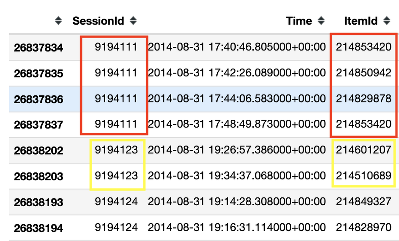
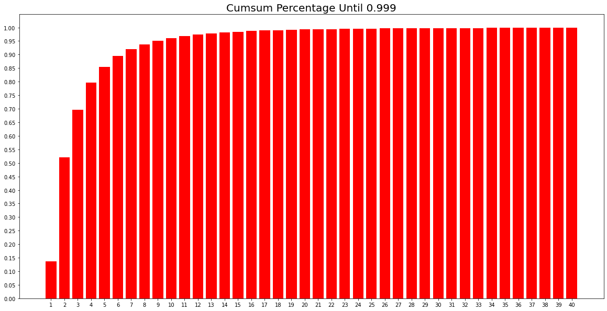
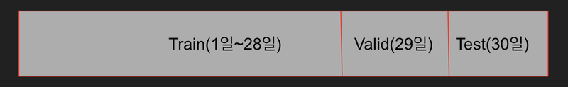
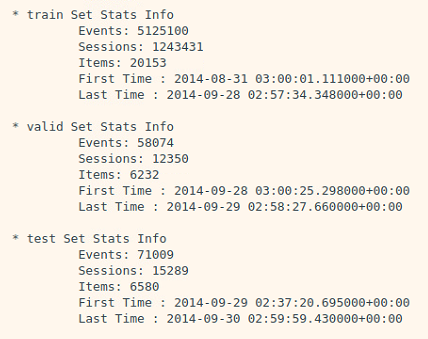
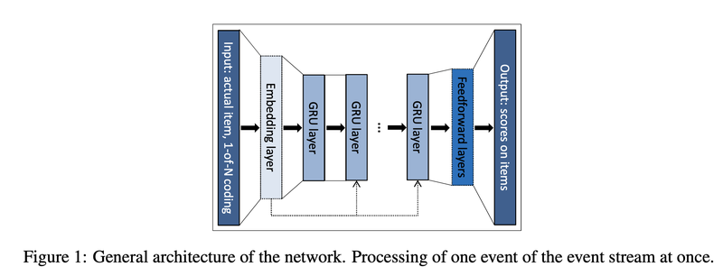
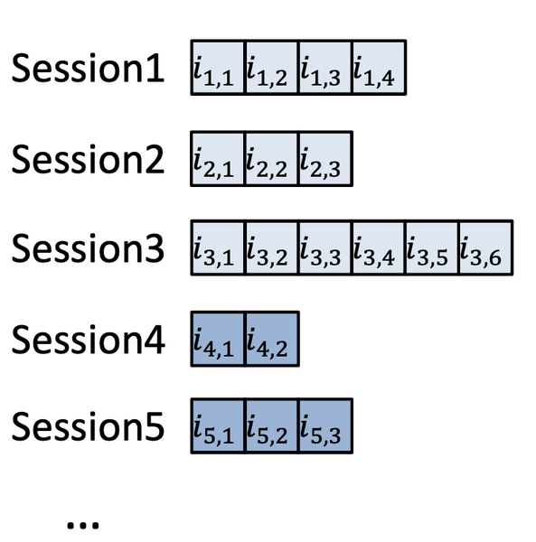
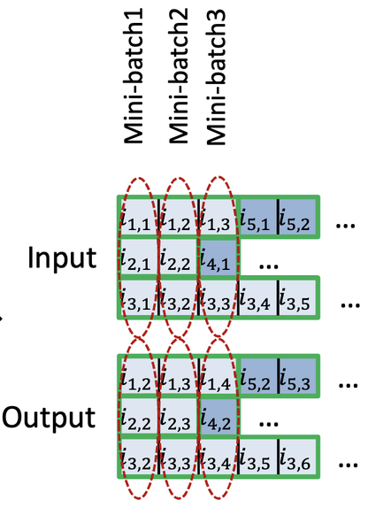

# 17. 다음에 볼 영화 예측하기

## Session-Based Recommendation

---

전자상거래 플랫폼에서는 '바로 지금 시점에 이 고객이 좋아할 만한 상품'을 추천해 주고 싶어한다. **Session-Based Recommendation**은 말 그대로 세션 데이터를 기반으로 유저가 다음에 클릭 또는 구매할 아이템을 예측하는 추천을 말한다. Session이란 유저가 서비스를 이용하면서 발생하는 중요한 정보를 담은 데이터를 말하며, 서버 쪽에 저장된다. 유저의 행동 데이터들은 유저측 브라우저를 통해 쿠키의 형태로 저장되는데 쿠키는 세션과 상호작용하면서 정보를 주고 받는다. 이번 자료에서는 세션을 브라우저가 종료되기 전까지 유저의 행동을 담은 시퀀스 데이터와 같은 의미로 사용한다.

- [쿠키, 세션이란?](https://chrisjune-13837.medium.com/web-%EC%BF%A0%ED%82%A4-%EC%84%B8%EC%85%98%EC%9D%B4%EB%9E%80-aa6bcb327582)

다음과 같은 예시가 있다.

- 9194111 Session의 유저가 8분여에 걸쳐 4개의 아이템(214853420 214850942 214829878 214853420)을 본 상황
- 유저가 214853420 아이템을 보았을 때 214850942 을 추천하고 이어서 214850942를 보았을 때 214829878을 추천하고 싶음



추천 시스템을 주로 다루는 학회 RecSys에서는 매년 추천을 주제로 대회를 개최한다. 2015년도에는 [YOOCHOOSE](https://www.yoochoose.com/)라는 추천 엔진 솔루션 회사에서 [E-Commerce 데이터](https://2015.recsyschallenge.com/challenge.html)를 공개했습니다.

```python
# 7z 압축 해제
$ sudo apt install p7zip-full
$ 7z x yoochoose-data.7z -oyoochoose-data
```

```python
# 데이터 설명(README)를 읽어 봅니다. 
import os
f = open(os.getenv('HOME')+'/aiffel/yoochoose-data/dataset-README.txt', 'r')
while True:
    line = f.readline()
    if not line: break
    print(line)
f.close()
```

데이터 설명을 읽어보면 몇 가지 주목할만한 점이 있다.

1. 유저에 대한 정보를 전혀 알 수 없다. (성별, 나이, 장소, 마지막 접속 날짜, 이전 구매 내역 등등 )
2. 아이템에 대한 정보도 전혀 알 수 없다. (실제로 어떤 물건인지, 사진이나 설명, 가격)

이와 달리 유저에 대한 정보를 알 수 있는 경우는 보통 Sequential Recommendation 이라고 구별해서 부르기도 한다. 유저와 아이템의 추가 정보를 Sequential Recommendation 모델에 적용하는 분야는 Context-Aware 라는 키워드로 활발히 연구되고 있다. 또한 E-Commerce 데이터의 경우 다음과 같은 특징을 갖는다고 한다.

1. 비로그인 상태로 탐색하는 유저가 많다.
2. 로그인 상태로 탐색한다고 할지라도 접속할 때 마다 탐색하는 의도가 뚜렷하게 다르다.

즉, 마우스를 사야겠다고 마음먹고 탐색한 이력이 칫솔을 사야겠다 생각하고 탐색하는 경우에 도움이 되지 않는다.

## Data Preprocessing

### (1) Data Load

---

데이터를 불러와 살펴보고 주요 통계치들을 살펴보자. 이번 자료에서는 Click 데이터에 있는 Session Id, TimeStamp, ItemId 칼럼만 사용한다.

```python
# pathlib 설치
pip install pathlib
```

```python
import datetime as dt
from pathlib import Path
import os

import numpy as np
import pandas as pd
import warnings
warnings.filterwarnings('ignore')

data_path = Path(os.getenv('HOME')+'/aiffel/yoochoose-data') 
train_path = data_path / 'yoochoose-clicks.dat'
train_path

def load_data(data_path: Path, nrows=None):
    data = pd.read_csv(data_path, sep=',', header=None, usecols=[0, 1, 2],
                       parse_dates=[1], dtype={0: np.int32, 2: np.int32}, nrows=nrows)
    data.columns = ['SessionId', 'Time', 'ItemId']
    return data

# 시간이 좀 걸릴 수 있습니다. 메모리도 10GB 가까이 소요될 수 있으니 메모리 상태에 주의

data = load_data(train_path, None)
data.sort_values(['SessionId', 'Time'], inplace=True)  # data를 id와 시간 순서로 정렬해줍니다.
data

# 유저 수(세션 수)와 아이템 수 확인
data['SessionId'].nunique(), data['ItemId'].nunique() # (9249729, 52739)
```

### (2) Session Length

---

```python
# 각 세션이 몇 개의 클릭 데이터를 갖는지 확인
session_length = data.groupby('SessionId').size()
session_length

session_length.median(), session_length.mean()
session_length.min(), session_length.max()
session_length.quantile(0.999)
```

각 세선의 길이는 보통 2~3정도이고, 99.9% 는 세선의 길이가 41이 이하이다. 길이가 200인 세션은 확인해보자.

```python
long_session = session_length[session_length==200].index[0]
data[data['SessionId'] == long_session]
```

매우 짧은 간격으로 지속적으로 클릭을 1시간 30분 가량 지속하고 있다. 유저들의 서비스 이용행태는 다양하기 때문에 데이터 전처리를 어떻게 할지는 모델을 만드는 사람이 판단해야 한다.

- 음악 데이터의 경우 어떤 사람은 하루종일 랜덤재생을 할 수도 있다. 이 유저의 데이터를 그대로 사용하는 게 좋을까?
- 어떤 상품의 경우 1분 내에 20명이 10점을 주고 나갈 수도 있다. 이 상품을 팔기 위해 조작하고 있는 건 아닐까?

너무 긴 세션을 제거할 수도 있고 포함시킬 수도 있다. 어떻게 하면 좋을지는 개인의 판단이다.

세션길이 기준 하위 99.9% 까지의 분포 누적합을 시각화해보자.

```python
length_count = session_length.groupby(session_length).size()
length_percent_cumsum = length_count.cumsum() / length_count.sum() # 누적합
length_percent_cumsum_999 = length_percent_cumsum[length_percent_cumsum < 0.999]

length_percent_cumsum_999

import matplotlib.pyplot as plt

plt.figure(figsize=(20, 10))
plt.bar(x=length_percent_cumsum_999.index, height=length_percent_cumsum_999, color='red')
plt.xticks(length_percent_cumsum_999.index)
plt.yticks(np.arange(0, 1.01, 0.05))
plt.title('Cumsum Percentage Until 0.999', size=20)
plt.show()
```



추천시스템은 유저-상품 관계 매트릭스를 유저 행렬과 상품 행렬의 곱으로 표현하는 Matrix Factorization 모델을 널리 사용한다. 그러나 위의 데이터는 행렬을 곱헀을 때 빈칸이 너무 많아서(Data Sparsity) 모델이 제대로 학습되지 않을 가능성이 있다.

### (3) Session Time

---

- 어떤 유저가 아이폰을 구매하려고 한다. 2020년 5월에는 아이폰SE2를 구매하려는 사람이 많을 것이다.
- 그러나 그로부터 몇달 후면 아이폰 12의 구매량이 엄청나게 증가하게 될 것이다.
- 영화나 드라마 역시 마찬가지로 유저들의 소비 패턴을 금방금방 변한다.
- 이런 이유 때문에 추천시스템을 구축할 때에는 최근 소비 트렌드를 학습하는 것이 중요하다.

추천 시스템에서 다루는 시간 관련 데이터는 다양한 측면이 있다. 데이터 생성 날짜 이외에도 접속하는 시간대, 접속해 있는 시간, 접속하는 요일, 계절, 마지막 접속 시간, 장바구니에 넣고 지난 시간 등이 있다.

```python
oldest, latest = data['Time'].min(), data['Time'].max()
print(oldest) 
print(latest)
```

데이터 설명대로 6개월치 데이터가 있다. 6개월치 데이터를 사용하면 성능이 더 좋아질까? 우선 1달치 데이터만 사용해보자

```python
type(latest) # pandas._libs.tslibs.timestamps.Timestamp
```

latest는 Timestamp 객체이기 때문에 int 객체와의 사칙연산을 지원하지 않는다. 날짜끼리의 차이를 구하고 싶을 때는 datetime 라이브러리의 timedelta 객체를 사용한다.

```python
month_ago = latest - dt.timedelta(30) # 최종 날짜로부터 30일 이전 날짜
data = data[data['Time'] > month_ago] # 최종 날짜로부터 30일 까지의 데이터
data
```

### (4) Data Cleansing

---

위에서 살펴봤을 때, 길이가 1인 세션이 많았다. 우리의 목적은 유저가 최소 1개 이상 클릭했을 때 다음 클릭을 예측하는 것이므로 길이가 1인 세션은 제거해준다. 너무 적게 클릭된 아이템도 이상한 아이템일 가능성이 있으므로 제거해준다.

```python
# short_session을 제거한 다음 unpopular item을 제거하면 다시 길이가 1인 session이 생길 수 있습니다.
# 이를 위해 반복문을 통해 지속적으로 제거 합니다.
def cleanse_recursive(data: pd.DataFrame, shortest, least_click) -> pd.DataFrame:
    while True:
        before_len = len(data)
        data = cleanse_short_session(data, shortest)
        data = cleanse_unpopular_item(data, least_click)
        after_len = len(data)
        if before_len == after_len:
            break
    return data

def cleanse_short_session(data: pd.DataFrame, shortest):
    session_len = data.groupby('SessionId').size()
    session_use = session_len[session_len >= shortest].index
    data = data[data['SessionId'].isin(session_use)]
    return data

def cleanse_unpopular_item(data: pd.DataFrame, least_click):
    item_popular = data.groupby('ItemId').size()
    item_use = item_popular[item_popular >= least_click].index
    data = data[data['ItemId'].isin(item_use)]
    return data

data = cleanse_recursive(data, shortest=2, least_click=5)
data
```

### (5) Train/Valid/Test Split

---

모델 평가를 위해 Vaild Set과 Test Set을 만들어야 한다. 대회에서 Test Set을 제공해주고 있다.

```python
test_path = data_path / 'yoochoose-test.dat'
tes t= load_data(test_path)
test['Time'].min(), test['Time'].max()
```

Test Set을 살펴보니 Train Set과 기간이 겹친다. 그러나 추천시스템은 지금을 잘 예측하는게 중요하다. 사용자의 소비 패턴이 달라지기 때문에 1달 전에 성능이 좋은 모델을 지금 쓰면 맞지 않을 수가 있다. 이러한 이유로 Session-Based Recommendation에서는 기간에 따라 Train, Valid, Test Set을 나누기도 한다. 이번 자료에서는 가장 마지막 1일 기간 동안을 Test, 2일 전부터 1일전 까지를 valid set으로 나눈다.



```python
def split_by_date(data: pd.DataFrame, n_days: int):
    final_time = data['Time'].max()
    session_last_time = data.groupby('SessionId')['Time'].max()
    session_in_train = session_last_time[session_last_time < final_time - dt.timedelta(n_days)].index
    session_in_test = session_last_time[session_last_time >= final_time - dt.timedelta(n_days)].index

    before_date = data[data['SessionId'].isin(session_in_train)]
    after_date = data[data['SessionId'].isin(session_in_test)]
    after_date = after_date[after_date['ItemId'].isin(before_date['ItemId'])]
    return before_date, after_date

tr, test = split_by_date(data, n_days=1)
tr, val = split_by_date(tr, n_days=1)

# data에 대한 정보를 살펴봅니다.
def stats_info(data: pd.DataFrame, status: str):
    print(f'* {status} Set Stats Info\n'
          f'\t Events: {len(data)}\n'
          f'\t Sessions: {data["SessionId"].nunique()}\n'
          f'\t Items: {data["ItemId"].nunique()}\n'
          f'\t First Time : {data["Time"].min()}\n'
          f'\t Last Time : {data["Time"].max()}\n')

stats_info(tr, 'train')
stats_info(val, 'valid')
stats_info(test, 'test')
```



```python
# train set에 없는 아이템이 val, test기간에 생길 수 있으므로 train data를 기준으로 인덱싱합니다.
id2idx = {item_id : index for index, item_id in enumerate(tr['ItemId'].unique())}

def indexing(df, id2idx):
    df['item_idx'] = df['ItemId'].map(lambda x: id2idx.get(x, -1))  # id2idx에 없는 아이템은 모르는 값(-1) 처리 해줍니다.
    return df

tr = indexing(tr, id2idx)
val = indexing(val, id2idx)
test = indexing(test, id2idx)
```

데이터 준비를 마쳤다. 데이터를 저장한 다음 data pipeline을 구축해보자.

```python
save_path = data_path / 'processed'
save_path.mkdir(parents=True, exist_ok=True)

tr.to_pickle(save_path / 'train.pkl')
val.to_pickle(save_path / 'valid.pkl')
test.to_pickle(save_path / 'test.pkl')
```

## 논문소개 (GRU4REC)

---

이번 자료에서 사용할 모델은 2016년 ICLR에 공개된 SESSION-BASED RECOMMENDATIONS WITH RECURRENT NEURAL NETWORKS 이다. Session Data에서는 처음으로 RNN 계열 모델을 적용하여 발표했다. 모델 구조는 아래 그림처럼 간단하다.



여러 RNN 계열의 모델(e.g. LSTM)이 있겠지만 저자가 실험해본 결과 GRU의 성능이 제일 좋았다고 한다. 또한 Embedding Layer를 사용하지 않았을 때가 사용했을 때보다 성능이 좋았다고 한다. 따라서 이번 자료에서도 Embedding Layer를 사용하지 않고 One-hot Encoding만 사용해본다.

**Session-Parallel Mini-Batches**

위에서 보았듯이 Session의 길이는 매우 짧은 것들이 대부분이나, 매우 긴 것들도 있다. 이 세션들을 데이터 샘플 하나로 보고 mini-batch를 구성하여 input으로 넣는다면 길이가 제일 긴 세션의 연산이 끝날 때까지 짧은 세션들이 기다려야 한다.



위 그림에서 Session 1, 2, 3을 하나의 mini-batch로 만든다면, 이 미니배치의 연산은 Session 3의 연산이 끝나야 끝나는 식이다. 논문의 저자는 대신 Session-Parallel Mini-Batches를 제안했다. 이름처럼 Session이 끝날 때까지 기다리지 않고 병렬적으로 계산하자는 뜻이다. 아래 그림에서 session2가 끝나면 session4가 시작하는 방식이다.



이렇게 구성했을 때 Mini-Batch의 shape은 (3, 1, 1)이 되고 RNN cell의 state가 1개로만 이루어진다. 또한 Tensorflow 기준으로 RNN을 만들 때 stateful=True 옵션을 사용하고 2처럼 세션이 끝나면 state를 0으로 만들어 준다

- [RNN API 보기](https://www.tensorflow.org/api_docs/python/tf/keras/layers/RNN)

**SAMPLING ON THE OUTPUT** : Negative Sampling와 같은 개념이다. Item의 수가 많기 때문에 Loss를 계산할 때 모든 아이템을 비교하지 않고 인기도를 고려하여 Sampling한다. 이번 자료에서는 구현하지 않았다.

**Ranking Loss :** Session-Based Recommendation Task를 여러 아이템 중 다음 아이템이 무엇인지 Classification하는 Task로 생각할 수도 있다. 그러나 여러 아이템을 관련도 순으로 랭킹을 매겨서 높은 랭킹의 아이템을 추천하는 Task로도 생각할 수 있다. 추천 시스템 연구 분야에서는 이렇게 Ranking을 맞추는 objective function에 대한 연구가 있었고 논문의 저자 역시 이런 Loss를 사용했다.
그러나 이번 자료에서는 Classification Task로 보고 Cross-Entropy Loss를 사용한다.

## Data Pipeline

이전 스텝에서 개념을 정리해 본 Session-Parallel Mini-Batch 를 구현해보자.

### (1) SessionDataset

---

데이터가 주어지면 세션이 시작되는 인덱스를 담는 값과 세션을 새로 인덱싱한 값을 갖는 클래스를 만든다.

```python
class SessionDataset:
    """Credit to yhs-968/pyGRU4REC."""

    def __init__(self, data):
        self.df = data
        self.click_offsets = self.get_click_offsets()
        self.session_idx = np.arange(self.df['SessionId'].nunique())  # indexing to SessionId

    def get_click_offsets(self):
        """
        Return the indexes of the first click of each session IDs,
        """
        offsets = np.zeros(self.df['SessionId'].nunique() + 1, dtype=np.int32)
        offsets[1:] = self.df.groupby('SessionId').size().cumsum()
        return offsets
```

train데이터로 `SessionDataset` 객체를 만들고 인스턴스 변수들을 살펴보자. `click_offsets` 변수는 각 세션이 시작된 인덱스를 담고 있다. `session_idx` 변수는 각 세션을 인덱싱한 `np.array` 이다.

```python
tr_dataset = SessionDataset(tr)
tr_dataset.df.head(10)

tr_dataset.click_offsets

tr_dataset.session_idx
```

### (2) SessionDataLoader

---

`SessionDataset` 객체를 받아서 Session-Parallel mini-batch를 만드는 클래스를 만든다. `__iter__` 메소드는 모델 인풋, 라벨, 세션이 끝나는 곳의 위치를 `yield`한다. mask는 후에 RNN Cell State를 초기화 하는데 사용할 것이다.

```python
class SessionDataLoader:
    """Credit to yhs-968/pyGRU4REC."""

    def __init__(self, dataset: SessionDataset, batch_size=50):
        self.dataset = dataset
        self.batch_size = batch_size

    def __iter__(self):
        """ Returns the iterator for producing session-parallel training mini-batches.
        Yields:
            input (B,):  Item indices that will be encoded as one-hot vectors later.
            target (B,): a Variable that stores the target item indices
            masks: Numpy array indicating the positions of the sessions to be terminated
        """

        start, end, mask, last_session, finished = self.initialize()  # initialize 메소드에서 확인해주세요.
        """
        start : Index Where Session Start
        end : Index Where Session End
        mask : indicator for the sessions to be terminated
        """

        while not finished:
            min_len = (end - start).min() - 1  # Shortest Length Among Sessions
            for i in range(min_len):
                # Build inputs & targets
                inp = self.dataset.df['item_idx'].values[start + i]
                target = self.dataset.df['item_idx'].values[start + i + 1]
                yield inp, target, mask

            start, end, mask, last_session, finished = self.update_status(start, end, min_len, last_session, finished)

    def initialize(self):
        first_iters = np.arange(self.batch_size)    # 첫 배치에 사용할 세션 Index를 가져옵니다.
        last_session = self.batch_size - 1    # 마지막으로 다루고 있는 세션 Index를 저장해둡니다.
        start = self.dataset.click_offsets[self.dataset.session_idx[first_iters]]       # data 상에서 session이 시작된 위치를 가져옵니다.
        end = self.dataset.click_offsets[self.dataset.session_idx[first_iters] + 1]  # session이 끝난 위치 바로 다음 위치를 가져옵니다.
        mask = np.array([])   # session의 모든 아이템을 다 돌은 경우 mask에 추가해줄 것입니다.
        finished = False         # data를 전부 돌았는지 기록하기 위한 변수입니다.
        return start, end, mask, last_session, finished

    def update_status(self, start: np.ndarray, end: np.ndarray, min_len: int, last_session: int, finished: bool):  
        # 다음 배치 데이터를 생성하기 위해 상태를 update합니다.
        
        start += min_len   # __iter__에서 min_len 만큼 for문을 돌았으므로 start를 min_len 만큼 더해줍니다.
        mask = np.arange(self.batch_size)[(end - start) == 1]  
        # end는 다음 세션이 시작되는 위치인데 start와 한 칸 차이난다는 것은 session이 끝났다는 뜻입니다. mask에 기록해줍니다.

        for i, idx in enumerate(mask, start=1):  # mask에 추가된 세션 개수만큼 새로운 세션을 돌것입니다.
            new_session = last_session + i  
            if new_session > self.dataset.session_idx[-1]:  # 만약 새로운 세션이 마지막 세션 index보다 크다면 모든 학습데이터를 돈 것입니다.
                finished = True
                break
            # update the next starting/ending point
            start[idx] = self.dataset.click_offsets[self.dataset.session_idx[new_session]]     # 종료된 세션 대신 새로운 세션의 시작점을 기록합니다.
            end[idx] = self.dataset.click_offsets[self.dataset.session_idx[new_session] + 1]

        last_session += len(mask)  # 마지막 세션의 위치를 기록해둡니다.
        return start, end, mask, last_session, finished

tr_data_loader = SessionDataLoader(tr_dataset, batch_size=4)
tr_dataset.df.head(15)

iter_ex = iter(tr_data_loader)

inputs, labels, mask =  next(iter_ex)
print(f'Model Input Item Idx are : {inputs}')
print(f'Label Item Idx are : {"":5} {labels}')
print(f'Previous Masked Input Idx are {mask}')
```

## Modeling

### (1) Evaluation Metric

---

모델 성능에 대한 지표로 precision이나 recall이 있다. Session-Based Recommendation Task에서는 모델이 k개의 아이템을 제시했을 때, 유저가 클릭/구매한 n개의 아이템이 많아야 좋다. 이 때문에 recall의 개념을 확장한 `recall@k` 지표, precision의 개념을 확장한 `Mean Average Precision@k` 지표 등을 사용한다. 추천에서는 몇 번째로 맞추느냐도 중요하다. 구글에서 검색했을 때 1페이지에 원하는 결과가 나오지 않고 2페이지에 나온다면 유저 반응이 크게 떨어질 것이다. 따라서 순서에 민감한 지표인 `MRR`, `NDCG` 같은 지표도 사용한다.

이번 자료에서는 `MRR`과 `Recall@k`를 사용한다. `MRR`은 정답 아이템이 나온 순번의 역수 값이다.
따라서 정답 아이템이 추천 결과 앞쪽 순번에 나온다면 지표가 높아질 것이고 뒤쪽에 나오거나 안나온다면 지표가 낮아질 것이다.

- [NDCG, MRR, MAP](https://medium.com/swlh/rank-aware-recsys-evaluation-metrics-5191bba16832)

```python
def mrr_k(pred, truth: int, k: int):
    indexing = np.where(pred[:k] == truth)[0]
    if len(indexing) > 0:
        return 1 / (indexing[0] + 1)
    else:
        return 0

def recall_k(pred, truth: int, k: int) -> int:
    answer = truth in pred[:k]
    return int(answer)
```

### (2) Model Architecture

---

```python
import numpy as np
import tensorflow as tf
from tensorflow.keras.layers import Input, Dense, Dropout, GRU
from tensorflow.keras.losses import categorical_crossentropy
from tensorflow.keras.models import Model
from tensorflow.keras.optimizers import Adam
from tensorflow.keras.utils import to_categorical
from tqdm import tqdm

def create_model(args):
    inputs = Input(batch_shape=(args.batch_size, 1, args.num_items))
    gru, _ = GRU(args.hsz, stateful=True, return_state=True, name='GRU')(inputs)
    dropout = Dropout(args.drop_rate)(gru)
    predictions = Dense(args.num_items, activation='softmax')(dropout)
    model = Model(inputs=inputs, outputs=[predictions])
    model.compile(loss=categorical_crossentropy, optimizer=Adam(args.lr), metrics=['accuracy'])
    model.summary()
    return model
```

모델에 사용할 Hyperparameter를 class 형식으로 관리한다.

```python
class Args:
    def __init__(self, tr, val, test, batch_size, hsz, drop_rate, lr, epochs, k):
        self.tr = tr
        self.val = val
        self.test = test
        self.num_items = tr['ItemId'].nunique()
        self.num_sessions = tr['SessionId'].nunique()
        self.batch_size = batch_size
        self.hsz = hsz
        self.drop_rate = drop_rate
        self.lr = lr
        self.epochs = epochs
        self.k = k

args = Args(tr, val, test, batch_size=2048, hsz=50, drop_rate=0.1, lr=0.001, epochs=3, k=20)

model = create_model(args)
```

### (3) Model Training

---

학습은 총 3epoch 진행되며, 대략 1시간 가량 소요된다. 3epoch면 모델이 충분히 수렴하여 성능이 확인될 만큼은 아니나, 모델 학습이 정상적으로 진행되고 있음을 확인할 수 있는 수준은 될 것이다.

```python
# train 셋으로 학습하면서 valid 셋으로 검증합니다.
def train_model(model, args):
    train_dataset = SessionDataset(args.tr)
    train_loader = SessionDataLoader(train_dataset, batch_size=args.batch_size)

    for epoch in range(1, args.epochs + 1):
        total_step = len(args.tr) - args.tr['SessionId'].nunique()
        tr_loader = tqdm(train_loader, total=total_step // args.batch_size, desc='Train', mininterval=1)
        for feat, target, mask in tr_loader:
            reset_hidden_states(model, mask)  # 종료된 session은 hidden_state를 초기화합니다. 아래 메서드에서 확인해주세요.

            input_ohe = to_categorical(feat, num_classes=args.num_items)
            input_ohe = np.expand_dims(input_ohe, axis=1)
            target_ohe = to_categorical(target, num_classes=args.num_items)

            result = model.train_on_batch(input_ohe, target_ohe)
            tr_loader.set_postfix(train_loss=result[0], accuracy = result[1])

        val_recall, val_mrr = get_metrics(args.val, model, args, args.k)  # valid set에 대해 검증합니다.

        print(f"\t - Recall@{args.k} epoch {epoch}: {val_recall:3f}")
        print(f"\t - MRR@{args.k}    epoch {epoch}: {val_mrr:3f}\n")

def reset_hidden_states(model, mask):
    gru_layer = model.get_layer(name='GRU')  # model에서 gru layer를 가져옵니다.
    hidden_states = gru_layer.states[0].numpy()  # gru_layer의 parameter를 가져옵니다.
    for elt in mask:  # mask된 인덱스 즉, 종료된 세션의 인덱스를 돌면서
        hidden_states[elt, :] = 0  # parameter를 초기화 합니다.
    gru_layer.reset_states(states=hidden_states)

def get_metrics(data, model, args, k: int):  # valid셋과 test셋을 평가하는 코드입니다. 
                                             # train과 거의 같지만 mrr, recall을 구하는 라인이 있습니다.
    dataset = SessionDataset(data)
    loader = SessionDataLoader(dataset, batch_size=args.batch_size)
    recall_list, mrr_list = [], []

    total_step = len(data) - data['SessionId'].nunique()
    for inputs, label, mask in tqdm(loader, total=total_step // args.batch_size, desc='Evaluation', mininterval=1):
        reset_hidden_states(model, mask)
        input_ohe = to_categorical(inputs, num_classes=args.num_items)
        input_ohe = np.expand_dims(input_ohe, axis=1)

        pred = model.predict(input_ohe, batch_size=args.batch_size)
        pred_arg = tf.argsort(pred, direction='DESCENDING')  # softmax 값이 큰 순서대로 sorting 합니다.

        length = len(inputs)
        recall_list.extend([recall_k(pred_arg[i], label[i], k) for i in range(length)])
        mrr_list.extend([mrr_k(pred_arg[i], label[i], k) for i in range(length)])

    recall, mrr = np.mean(recall_list), np.mean(mrr_list)
    return recall, mrr

train_model(model, args)
```

### (4) Inference

---

```python
def test_model(model, args, test):
    test_recall, test_mrr = get_metrics(test, model, args, 20)
    print(f"\t - Recall@{args.k}: {test_recall:3f}")
    print(f"\t - MRR@{args.k}: {test_mrr:3f}\n")

test_model(model, args, test)
```

## 프로젝트 : Movielens 영화 SBR

---

Movielens 1M Dataset을 기반으로, Session based Recommendation 시스템을 제작해 보자.

```python
$ wget http://files.grouplens.org/datasets/movielens/ml-1m.zip
```

```python
data_path = Path(os.getenv('HOME')+'/aiffel/yoochoose-data/ml-1m') 
train_path = data_path / 'ratings.dat'

def load_data(data_path: Path, nrows=None):
    data = pd.read_csv(data_path, sep='::', header=None, usecols=[0, 1, 2, 3], dtype={0: np.int32, 1: np.int32, 2: np.int32}, nrows=nrows)
    data.columns = ['UserId', 'ItemId', 'Rating', 'Time']
    return data

data = load_data(train_path, None)
data.sort_values(['UserId', 'Time'], inplace=True)  # data를 id와 시간 순서로 정렬해줍니다.
data
```

- 여기서 이전 실습내역과 가장 크게 다른 부분은 바로 SessionID 대신 UserID 항목이 들어갔다는 점이다. 이 데이터셋은 명확한 1회 세션의 SessionID를 포함하지 않는다. 그래서 이번에는 UserID가 SessionID 역할을 해야 한다.
- Rating 정보가 포함되어 있다. 이전 실습내역에서는 이런 항목이 포함되어 있지 않았으므로, 무시하고 제외할 수 있다. 하지만, 직전에 봤던 영화가 맘에 들었는지 여부가 비슷한 영화를 더 고르게 하는 것과 상관이 있을 수도 있다. 아울러, Rating이 낮은 데이터를 어떻게 처리할지도 고민해야 한다.
- Time 항목에는 UTC time 가 포함되어, 1970년 1월 1일부터 경과된 초단위 시간이 기재되어 있다.

### (1) 데이터의 전처리

---

위와 같이 간단히 구성해 본 데이터셋을 꼼꼼이 살펴보면서 항목별 기본분석, session length, session time, cleaning 등의 작업을 진행한다. 특히, 이 데이터셋에서는 Session이 아닌 UserID 단위로 데이터가 생성되어 있으므로, 이를 Session 단위로 어떻게 해석할지에 주의한다.

### (2) 미니 배치의 구성

---

실습코드 내역을 참고하여 데이터셋과 미니 배치를 구성해 보자. Session-Parallel Mini-Batch의 개념에 따라, 학습 속도의 저하가 최소화될 수 있도록 구성한다. 단, 위에서 Session 단위를 어떻게 정의했느냐에 따라서 Session-Parallel Mini-Batch이 굳이 필요하지 않을 수도 있다.

### (3) 모델 구성

---

이 부분도 실습코드 내역을 참고하여 다양하게 모델 구조를 시도해볼 수 있다.

### (4) 모델 학습

---

다양한 하이퍼파라미터를 변경해 보며 검증해 보도록 합니다. 실습코드에 언급되었던 Recall, MRR 등의 개념들도 함께 관리될 수 있도록 한다.

### (5) 모델 테스트

---

미리 구성한 테스트셋을 바탕으로 Recall, MRR 을 확인해 본다.

## 회고록

- 데이터 형식이 달라 전처리 하다가 포기했다. 최초로 진행을 포기한 노드가 될 것 같다.
- 하루 종일 데이터 전처리만 하다가 모델을 돌려봤지만 문제가 생긴다. 원인은 모르겠다.
- 배치사이즈를 2048에서 256으로 바꾸었더니 돌아간다... 배치사이즈가 문제였었나보다.
- 다행히 프로젝트를 포기하지 않고 제출할 수 있게 되었다. 역시 여러 방법을 시도하다보면 언젠간 답을 찾을 수 있게 되는 것 같다.
- 이번 노드가 데이터 전처리 때문에 유독 어려웠다고 느꼈다. 특히 pandas를 좀 더 자유자재로 사용할 수 있도록 연습해야 겠다는 생각이 들었다.

### 유용한 링크

[https://chrisjune-13837.medium.com/web-쿠키-세션이란-aa6bcb327582](https://chrisjune-13837.medium.com/web-%EC%BF%A0%ED%82%A4-%EC%84%B8%EC%85%98%EC%9D%B4%EB%9E%80-aa6bcb327582)

[https://brownbears.tistory.com/415](https://brownbears.tistory.com/415) pathlib

[https://arxiv.org/pdf/1511.06939v4.pdf](https://arxiv.org/pdf/1511.06939v4.pdf) Session-Based Recommendation with RNN

[https://dojang.io/mod/page/view.php?id=2405](https://dojang.io/mod/page/view.php?id=2405) 이터레이터 사용하기
