# 18. 문자를 읽을 수 있는 딥러닝

문자를 읽는 기술인 OCR(Optical Character Recognition, 광학 문자 인식)은 산업적으로 매우 유용한 기술이다. 딥러닝이 도입된 이후 OCR 기술이 획기적으로 개선되어 많은 산업 도메인에 유용하게 사용될 수 있는 가능성이 열리고 있다.

## 학습 목표

---

- OCR의 과정을 이해한다.
- 문자인식 결과의 표현방식을 이해한다.
- 파이썬을 통해 OCR을 사용할 수 있다.

## 기계가 읽을 수 있을까?

---

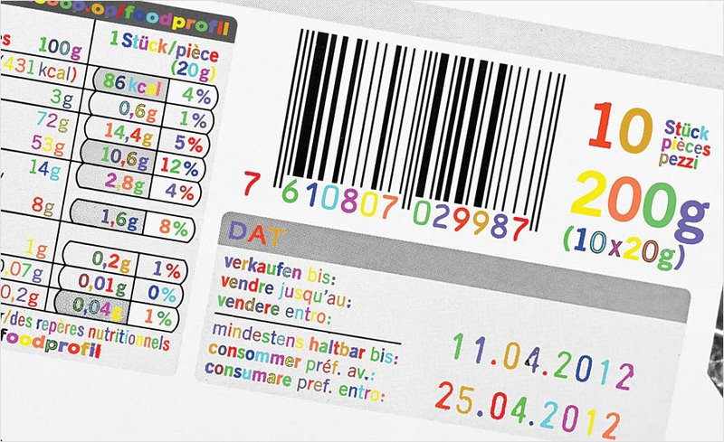

사람이 문자를 읽는 과정은 문자가 있다는 것을 **1)인식**하고, 인식한 문자를 **2)해독**하는 과정을 거치는 것이 일반적이다. 기계가 문자를 읽는 과정도 이와 비슷하다. 컴퓨터 비전에서 사용하는 용어로 위의 두 단계를 번역하자면 문자의 존재를 **1)Detection**하고, 어떤 문자인지 판독하는 **2)Recognition**으로 나눌 수 있다.

- [구글 OCR API](https://cloud.google.com/vision/?utm_source=google&utm_medium=cpc&utm_campaign=japac-KR-all-en-dr-bkws-all-all-trial-e-dr-1008074&utm_content=text-ad-none-none-DEV_c-CRE_252596144846-ADGP_Hybrid%20%7C%20AW%20SEM%20%7C%20BKWS%20~%20T1%20%7C%20EXA%20%7C%20ML%20%7C%20M%3A1%20%7C%20KR%20%7C%20en%20%7C%20Vision%20%7C%20API-KWID_43700029837773855-kwd-316837066534&userloc_1009877&utm_term=KW_google%20vision%20api%20ocr&gclid=Cj0KCQiAyp7yBRCwARIsABfQsnRMFOzgV84oX2MTWrPMvaE_JgjgTshUaLE6LYrsk8lM23-43gBfCkMaAnGaEALw_wcB)

우리가 사용한것은 구글 OCR API이다. 이 API를 이용하여 어플리케이션을 만들 수 있다. 파이썬 코드로 호출해서 다시한번 테스트해보자.

**STEP 1) 구글의 파이썬 API 인터페이서 모듈 설치**

```python
$ pip install --upgrade google-api-python-client
$ pip install google-cloud-vision
```

**STEP 2) Google Cloud Vision API 사용**

아래 링크의 설명을 참고하여 서비스 계정 및 인증키를 생성한다. 브라우저에서 다운로드한 인증키는 다음 경로에 `my_google_api_key.json`이라는 파일명으로 저장한다. (파일은 처음에 sheet-contents-로 시작되는 이름으로 자동 저장됩니다.)

- [Google Cloud Vision API 사용하기](http://egloos.zum.com/mcchae/v/11342622)

**STEP 3) 인증키 경로 등록 후 커널 재기동**

```python
$ export GOOGLE_APPLICATION_CREDENTIALS=$HOME/aiffel/ocr_python/my_google_api_key.json
```

**STEP 4) API 사용 테스트**

```python
# 텍스트 탐지 함수
def detect_text(path):
    """Detects text in the file."""
    from google.cloud import vision
    import io
    client = vision.ImageAnnotatorClient()

    with io.open(path, 'rb') as image_file:
        content = image_file.read()
        
    image = vision.Image(content=content)

    response = client.text_detection(image=image)
    texts = response.text_annotations
    print('Texts:')

    for text in texts:
       print('\n"{}"'.format(text.description))

    vertices = (['({},{})'.format(vertex.x, vertex.y)
                 for vertex in text.bounding_poly.vertices])

    print('bounds: {}'.format(','.join(vertices)))

    if response.error.message:
        raise Exception(
            '{}\nFor more info on error messages, check: '
            'https://cloud.google.com/apis/design/errors'.format(
                response.error.message))
```

```python
# 다운받은 인증키 경로가 정확하게 지정되어 있어야 합니다. 
!ls -l $GOOGLE_APPLICATION_CREDENTIALS

import os
os.environ["GOOGLE_APPLICATION_CREDENTIALS"] =  os.getenv('HOME')+'/aiffel/ocr_python/my_google_api_key.json'

# 입력 이미지 경로를 지정해 주세요.
path = os.getenv('HOME')+'/aiffel/ocr_python/test_image.jpg'

# 위에서 정의한 OCR API 이용 함수를 호출해 봅시다.
detect_text(path)
```

## 문자를 읽는 과정

---

구글 API에서는 문자의 영역을 사각형으로 표현하고 우측에 `Block`과 `Paragraph`로 구분해서 인식결과를 나타내고 있다. 구글 API가 이미지에 박스를 친 다음 박스별 텍스트의 내용을 알려준 것처럼, 문자 모델은 보통 두 단계로 이뤄진다.

먼저 입력받은 사진 속에서 문자의 위치를 찾아낸다. 이 과정을 `Text Detection(문자검출)` 이라고 한다. 찾은 문자 영역으로부터 문자를 읽어내는 것은 `Text Recognition(문자인식)` 이다. 예를 들어 아래 카카오의 OCR 모델은 먼저 문자가 있는 영역의 정보 (coord, Text Recognition)를 찾아내고, 각 영역에서 문자를 인식하고 있다. 이렇게 문자 인식 모델은 Text Detection과 Recognition 두 과정을 통해서 사진 속의 문자를 읽을 수 있게 된다. 

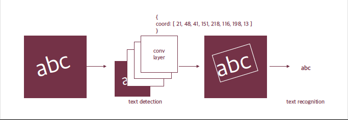

위 그림에서는 문자의 영역을 표현하는 방법으로 사각형의 네 꼭지점 좌표를 알려 주는 방법을 제시하고 있다. 하지만 다른 도형이나 표현 방법을 사용할 수도 있을 것이다. 이런 방법을 연구한 많은 논문들이 있다.

- Scene Text Detection with Polygon Offsetting and Border Augmentation

## 딥러닝 문자인식의 시작

---

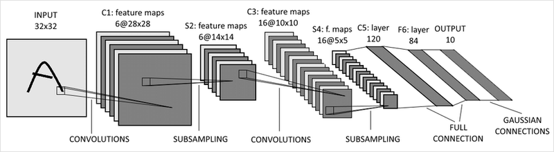

MNIST가 딥러닝 데이터셋의 "hello, world!"라면, LeNet은 CNN의 "hello, world!"라 할 수 있다. 1998년에 발표된 LeNet은 우편번호나 손글씨를 읽기 위해서 만들어졌다. 앞서 학습한 MNIST로 LeNet을 훈련시킨다면 우편번호를 읽을 수 있는 것이다. 위 그림은 LeNet-5의 구조로, 요즘 나온 모델들을 생각한다면 구조가 상당히 간단하다. Convolution 레이어와 최종 출력 레이어로 이뤄져 있다.

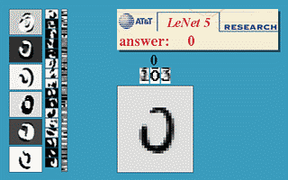

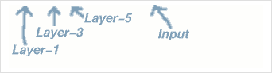

아래 데모사이트에서 이렇게 간단한 구조로도 어려운 글자를 읽을 수 있는 딥러닝 분류 모델, LeNet을 확인해 보자.

- [Yann LeCun's Demo](http://yann.lecun.com/exdb/lenet/index.html)
- [L12/1 LeNet from Berkely](https://www.youtube.com/watch?v=m3BrTjo2zUA)

하지만 이렇게 단순한 분류 모델만으로는 우리가 위에서 구글 API로 테스트해 보았던 복잡한 결과를 얻을 수 없다. 넓고 복잡한 이미지에서 글자 영역을 찾을 수 없을 뿐더러 글자를 영역별로 잘라서 넣더라도 우리가 인식하기를 원하는 사진은 여러 글자가 모여있기 때문에 단순한 분류 문제로 표현이 불가능하다.

LeNet 데모페이지에서 Noise Resistance의 예시를 보면 문자가 노이즈, 즉 잡음에 가려져도 문자를 잘 읽는다. 이런 강건(robust)한 모델은 가려진 케이스에 대한 데이터를 확보하거나, Augmentation을 통해 해당 케이스에 대한 강건성을 확보한다.

## 사진 속 문자 찾아내기 - Detection

---


사진 속 문자를 찾아내는 최근의 딥러닝 모델은 일반적인 Object Detection(객체 인식) 방법으로 접근한다. 이미지 속에서 물체를 찾아내는 딥러닝 모델에게 문자를 찾도록 학습시킨 것이다. 문자의 특성에 따라 모델을 변경하기도 한다.

딥러닝 기반 객체 검출 방법에는 **Regression(회귀)** 방식이나 **Segmentation(세그멘테이션)** 방식이 있다. **Regression**은 기준으로 하는 박스 대비 문자의 박스가 얼마나 차이가 나는지를 학습한다. **Segmentation**은 픽셀단위로 해당 픽셀이 문자를 표현하는지를 분류하는 문제(pixel-wise classification)라고 볼 수 있다. 여기서는 문자를 찾아내는 딥러닝 모델이 우리가 흔히 들어본 Object Detection과 큰 차이가 없다는 정도로 이해하고 넘어가자.

- 참고: [딥러닝을 활용한 객체 탐지 알고리즘 이해하기](https://blogs.sas.com/content/saskorea/2018/12/21/%EB%94%A5%EB%9F%AC%EB%8B%9D%EC%9D%84-%ED%99%9C%EC%9A%A9%ED%95%9C-%EA%B0%9D%EC%B2%B4-%ED%83%90%EC%A7%80-%EC%95%8C%EA%B3%A0%EB%A6%AC%EC%A6%98-%EC%9D%B4%ED%95%B4%ED%95%98%EA%B8%B0/)

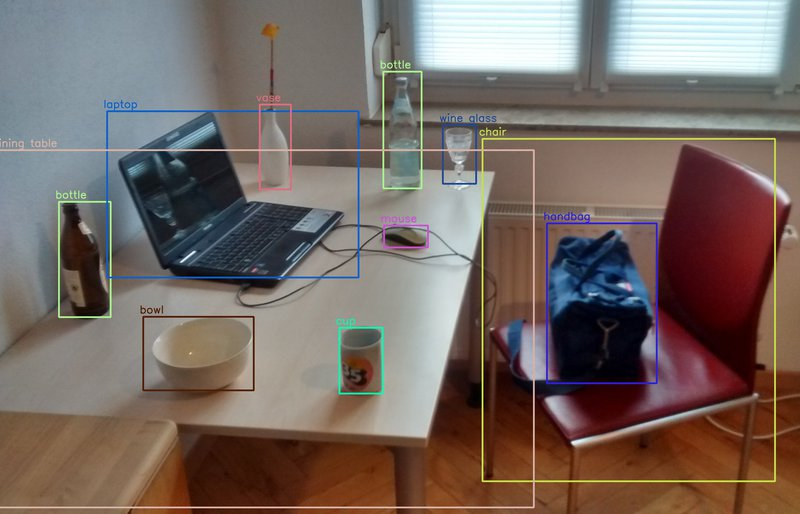

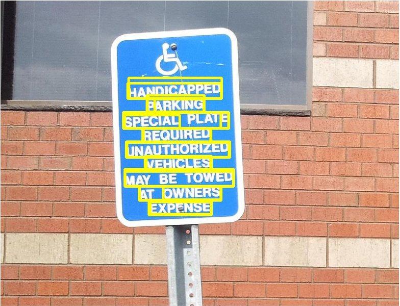

문자는 일반적인 객체와는 조금 다른 특성을 가지고 있다. 일반적인 객체는 물체에 따라서 크기가 일정한 특징을 가지지만, 문자는 영역과 배치가 자유로워 문자를 검출하기 위한 설정이 필요하다. 또한 객체는 물체간 거리가 충분히 확보되는데에 반해 글자는 매우 촘촘하게 배치되어 있다.

## 사진 속 문자 읽어내기 - Recognition

---

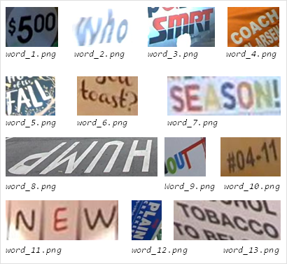

문자 인식은 사진 속에서 문자를 검출해내는 검출 모델이 영역을 잘라서 주면 그 영역에 어떤 글자가 포함되어 있는지 읽어내는 과정이다. 위는 ICDAR15라는 OCR 데이터셋에서 단어 단위로 잘린 이미지이다. 문자 인식 모델은 이렇게 작게 잘린 이미지가 들어오면 이미지 속에 어떤 단어가 포함됐는지 찾아낸다.

이 과정은 이미지 문제보다는 자연어처리에서 많은 영감을 받았다. 자연어 처리를 한다면 RNN이 떠오를텐데, 이미지 내의 문자 인식 모델의 기본적인 방법 중 하나가 바로 CNN과 RNN을 결합한 CRNN 모델이다. 이미지 내의 텍스트와 연관된 특징을 CNN을 통해 추출한 후에 스텝 단위 문자 정보를 RNN으로 인식하는 것이다.

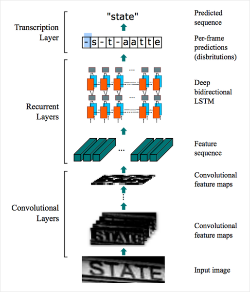

이렇게 검출 결과로부터 인식 모델을 통해 문자를 인식하고 나면 구글 API의 결과처럼 사진 속 영역에 표시를 하고 그 영역에 어떤 문자가 적혀있는지 알 수 있는 OCR 시스템이 된다.

- [네이버 데뷰 2018, 이활석님의 CRAFT 모델소개와 연구 경험](https://tv.naver.com/v/4578167)
- [Terry TaeWoong Um님의 사진 속 글자 읽기, OCR (Optical character recognition)](https://www.youtube.com/watch?v=ckRFBl_XWFg)

## keras-OCR 써보기

---

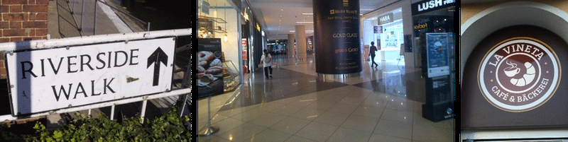

`keras-ocr`은 텐서플로우의 케라스 API를 기반으로 이미지 속 문자를 읽는 End-to-End OCR을 할 수 있게 해준다. 공식 문서에도 나와 있듯, 검출 모델로는 네이버 데뷰 2018 영상에서 소개한 CRAFT(Character Region Awareness for Text Detection)를 사용하고, 인식 모델로는 앞에서 설명한 CRNN을 사용한다. (keras-ocr은 tensorflow 2.2.0 버전에서만 구동 가능함에 주의)

```python
# keras-ocr 설치
$ pip install keras-ocr
```

필요한 라이브러리인 `keras_ocr` 과 인식결과의 시각화를 위한 `matplotlib.pyplot` 를 불러온다. `keras_ocr.pipeline.Pipeline()` 는 인식을 위한 파이프라인을 생성하는데 이때 초기화 과정에서 미리 학습된 모델의 가중치(weight)를 불러오게 된다. 검출기와 인식기를 위한 가중치 하나씩을 불러오는 것이다.

- [keras-ocr 공식 문서](https://keras-ocr.readthedocs.io/en/latest/index.html)

```python
import matplotlib.pyplot as plt
import keres_ocr

# keras-ocr이 detector과 recognizer를 위한 모델을 자동으로 다운로드
pipeline = keras_ocr.pipeline.Pipeline()
```

만들어둔 파이프라인의 recognize() 에 이미지를 몇 개 넣어준다. 이미지소스의 url을 사용할건데요. 이미지는 [https://unsplash.com/s/photos/text](https://unsplash.com/s/photos/text) 에서 가져왔다.

```python
# 테스트에 사용할 이미지 url을 모아 봅니다. 추가로 더 모아볼 수도 있습니다. 
image_urls = [
  'https://source.unsplash.com/M7mu6jXlcns/640x460',
  'https://source.unsplash.com/6jsp4iHc8hI/640x460',
  'https://source.unsplash.com/98uYQ-KupiE',
  'https://source.unsplash.com/j9JoYpaJH3A',
  'https://source.unsplash.com/eBkEJ9cH5b4'
]

images = [ keras_ocr.tools.read(url) for url in image_urls]
prediction_groups = [pipeline.recognize([url]) for url in image_urls]
```

이제 인식된 결과를 pyplot으로 시각화를 해보면 다음과 같다. 내부적으로 recognize() 는 검출기와 인식기를 두고, 검출기로 바운딩 박스(bounding box, 문자가 있는 영역을 표시한 정보)를 검출한 뒤, 인식기가 각 박스로부터 문자를 인식하는 과정을 거치도록 한다.

- 참고 : [keras-ocr 파이프라인](https://github.com/faustomorales/keras-ocr/blob/master/keras_ocr/pipeline.py)

```python
# Plot the predictions
fig, axs = plt.subplots(nrows=len(images), figsize=(20, 20))
for idx, ax in enumerate(axs):
    keras_ocr.tools.drawAnnotations(image=images[idx], 
                                    predictions=prediction_groups[idx][0], ax=ax)
```

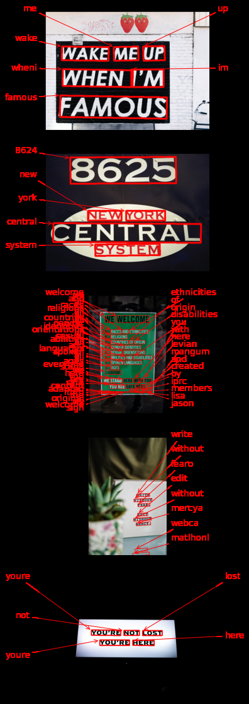

keras-ocr은 한글 데이터셋으로 훈련이 되어있지 않은 모델이다. 한글 텍스트의 detection은 정상적으로 진행되더라도 recognition 결과가 엉뚱하게 나올 수 있음에 주의하자.

[https://github.com/faustomorales/keras-ocr/issues/101](https://github.com/faustomorales/keras-ocr/issues/101)

## 테서랙트 써보기


이번에는 테서랙트(Tesseract) 라이브러리로 이미지에서 문자를 인식해 보자. 테서랙트는 구글에서 후원하는 OCR 오픈소스 라이브러리로 현재는 버전 4와 Tessearct.js등으로 확장되는 등 많은 곳에서 사용되고 있다. 버전 4에서는 LSTM이 엔진에 추가되었고 현재 한국어를 포함한 116 개 국어를 지원하고 있다. 오픈소스라는 점은 개인이 원하는 프로젝트에 활용하기 쉽다는 것을 뜻하니, 직접 해 보면서 익혀두면 나중에 간단한 OCR 모델이 필요할 때 빠르게 활용할 수 있을 것이다.

### (1) 테서랙트 설치하기

---

우선 우분투에서 실행할 경우 터미널에서 아래 코드를 사용해 테서랙트 관련 패키지들을 설치해주어야 한다. 다른 운영체제를 사용할 경우에는 아래 Tesseract Install Guide를 참고

- [Tesseract Install Guide](https://github.com/tesseract-ocr/tessdoc)

```python
sudo apt install tesseract-ocr
sudo apt install libtesseract-dev
```

### (2) 테서랙트 파이썬 warpper 설치

---

Pytesseract는 OS에 설치된 테서랙트를 파이썬에서 쉽게 사용할 수있도록 해주는 래퍼 라이브러리(wrapper library)로, 파이썬 내에서 컴퓨터에 설치된 테서랙트 엔진의 기능을 바로 쓸 수 있도록 해준다.

- 참고: [pytesseract](https://pypi.org/project/pytesseract/)
- 참고: [위키백과: 래퍼 라이브러리](https://ko.wikipedia.org/wiki/%EB%9E%98%ED%8D%BC_%EB%9D%BC%EC%9D%B4%EB%B8%8C%EB%9F%AC%EB%A6%AC)

```python
pip install pytesseract
```

### (3) 테서랙트로 문자 검출하고 이미지 자르기 (Detection)

---

테서랙트를 사용하면 한 번에 이미지 내의 문자 검출과 인식을 할 수 있다. 그러나 OCR이 이뤄지는 전체과정을 직접 거쳐보기 위해 검출을 먼저 해보자.

```python
import os
import pytesseract
from PIL import Image
from pytesseract import Output
import matplotlib.pyplot as plt

# OCR Engine modes(–oem):
# 0 - Legacy engine only.
# 1 - Neural nets LSTM engine only.
# 2 - Legacy + LSTM engines.
# 3 - Default, based on what is available.

# Page segmentation modes(–psm):
# 0 - Orientation and script detection (OSD) only.
# 1 - Automatic page segmentation with OSD.
# 2 - Automatic page segmentation, but no OSD, or OCR.
# 3 - Fully automatic page segmentation, but no OSD. (Default)
# 4 - Assume a single column of text of variable sizes.
# 5 - Assume a single uniform block of vertically aligned text.
# 6 - Assume a single uniform block of text.
# 7 - Treat the image as a single text line.
# 8 - Treat the image as a single word.
# 9 - Treat the image as a single word in a circle.
# 10 - Treat the image as a single character.
# 11 - Sparse text. Find as much text as possible in no particular order.
# 12 - Sparse text with OSD.
# 13 - Raw line. Treat the image as a single text line, bypassing hacks that are Tesseract-specific.

def crop_word_regions(image_path='./images/sample.png', output_path='./output'):
    if not os.path.exists(output_path):
        os.mkdir(output_path)
    custom_oem_psm_config = r'--oem 3 --psm 3'
    image = Image.open(image_path)

    recognized_data = pytesseract.image_to_data(
        image, lang='eng',    # 한국어라면 lang='kor'
        config=custom_oem_psm_config,
        output_type=Output.DICT
    )
    
    top_level = max(recognized_data['level'])
    index = 0
    cropped_image_path_list = []
    for i in range(len(recognized_data['level'])):
        level = recognized_data['level'][i]
    
        if level == top_level:
            left = recognized_data['left'][i]
            top = recognized_data['top'][i]
            width = recognized_data['width'][i]
            height = recognized_data['height'][i]
            
            output_img_path = os.path.join(output_path, f"{str(index).zfill(4)}.png")
            print(output_img_path)
            cropped_image = image.crop((
                left,
                top,
                left+width,
                top+height
            ))
            cropped_image.save(output_img_path)
            cropped_image_path_list.append(output_img_path)
            index += 1
    return cropped_image_path_list

work_dir = os.getenv('HOME')+'/aiffel/ocr_python'
img_file_path = work_dir + '/test_image.png'   #테스트용 이미지 경로입니다. 본인이 선택한 파일명으로 바꿔주세요. 

cropped_image_path_list = crop_word_regions(img_file_path, work_dir)
```

위에서 구현한 `crop_word_regions()` 함수는 선택된 테스트 이미지를 받아서, 문자 검출을 진행한 후, 검출된 문자 영역을 crop한 이미지로 만들어 그 파일들의 list를 리턴하는 함수이다.

이미지를 데이터로 변환할 때에는 기본적으로 `pytesseract.image_to_data()` 를 사용한다. 파이썬에서 편하게 사용하기 위해서 `pytesseract` 의 `Output` 을 사용해서 결과값의 형식을 딕셔너리(`DICT`) 형식으로 설정해주게 된다. 이렇게 인식된 결과는 바운딩 박스의 left, top, width, height 정보를 가지며, 바운딩 박스를 사용해 이미지의 문자 영역들을 파이썬 PIL(pillow) 또는 OpenCV 라이브러리를 사용해 잘라(crop)서 `cropped_image_path_list`에 담아 리턴한다.

(주의) 위 코드에서 lang='kor' 로 바꾸면 에러가 발생한다. 테서랙트의 언어팩을 설치해야 정상동작한다.

```python
sudo apt install tesseract-ocr-kor
```

- [언어팩 설치에 대해서](https://blog.daum.net/rayolla/1141)

### (4) 테서랙트로 잘린 이미지에서 단어 인식하기

---

검출된 바운딩 박스 별로 잘린 이미지를 넣어주면 영역별 텍스트가 결과값으로 나오는 `image_to_string()`를 사용하여 문자 인식을 해보자.

```python
def recognize_images(cropped_image_path_list):
    custom_oem_psm_config = r'--oem 3 --psm 7'
    
    for image_path in cropped_image_path_list:
        image = Image.open(image_path)
        recognized_data = pytesseract.image_to_string(
            image, lang='eng',    # 한국어라면 lang='kor'
            config=custom_oem_psm_config,
            output_type=Output.DICT
        )
        print(recognized_data['text'])
    print("Done")

# 위에서 준비한 문자 영역 파일들을 인식하여 얻어진 텍스트를 출력
recognize_images(cropped_image_path_list)
```

## 프로젝트 : 다양한 OCR모델 비교하기

OCR 기능을 활용한 서비스를 빠르게 개발해야 하는 임무를 맡은 엔지니어라고 가정하고 어떤 모듈을 도입하면 좋을지 검토해보자.

### (1) 검증용 데이터셋 준비

---

```python
# 모듈 import
import os
import tensorflow as tf
import numpy as np
import matplotlib.pyplot as plt
import cv2

# 이미지 불러오기
test_filenames = tf.io.gfile.glob(str('./images/whiskey/*.jpg'))
test_filenames

image_titles = []
images = []
for filename in test_filenames:
    image = cv2.imread(filename)
    images.append(cv2.cvtColor(image, cv2.COLOR_BGR2RGB))
    image_titles.append(os.path.splitext(os.path.basename(filename))[0])
image_titles

# 테스트 이미지 시각화
plt.figure(figsize=(16, 12))
for i, (image, title) in enumerate(zip(images, image_titles)):
    plt.subplot(3, 4, i+1)
    plt.imshow(image)
    plt.title(title, fontsize=20)
```

### (2)-1 Google OCR API

---

```python
# 텍스트 탐지 함수
def detect_text(path):
    """Detects text in the file."""
    from google.cloud import vision
    import io
    client = vision.ImageAnnotatorClient()

    with io.open(path, 'rb') as image_file:
        content = image_file.read()
        
    image = vision.Image(content=content)

    response = client.text_detection(image=image)
    texts = response.text_annotations
    print('Texts:')

    for text in texts:
        print('\n"{}"'.format(text.description))

    vertices = (['({},{})'.format(vertex.x, vertex.y)
                 for vertex in text.bounding_poly.vertices])

    print('bounds: {}'.format(','.join(vertices)))

    if response.error.message:
        raise Exception(
            '{}\nFor more info on error messages, check: '
            'https://cloud.google.com/apis/design/errors'.format(
                response.error.message))

# 다운받은 인증키 경로가 정확하게 지정되어 있어야 합니다. 
!ls -l $GOOGLE_APPLICATION_CREDENTIALS

import os
os.environ["GOOGLE_APPLICATION_CREDENTIALS"] =  os.getenv('HOME')+'/aiffel/ocr_python/my_google_api_key.json'

google_ocr = []

# 위에서 정의한 OCR API 이용 함수를 호출해 봅시다.
for filenames in test_filenames:
    google_ocr.append(detect_text(filenames))
```

### (2)-2 keras-ocr

---

```python
import keras_ocr

pipeline = keras_ocr.pipeline.Pipeline()

prediction_groups = [pipeline.recognize([filename]) for filename in test_filenames]

# Plot the predictions
fig, axs = plt.subplots(nrows=len(images), figsize=(16, 80))
for idx, ax in enumerate(axs):
    keras_ocr.tools.drawAnnotations(image=images[idx], 
                                    predictions=prediction_groups[idx][0], ax=ax)
```

### (2)-3 Tesseract OCR

---

```python
import pytesseract
from PIL import Image
from pytesseract import Output

# OCR Engine modes(–oem):
# 0 - Legacy engine only.
# 1 - Neural nets LSTM engine only.
# 2 - Legacy + LSTM engines.
# 3 - Default, based on what is available.

# Page segmentation modes(–psm):
# 0 - Orientation and script detection (OSD) only.
# 1 - Automatic page segmentation with OSD.
# 2 - Automatic page segmentation, but no OSD, or OCR.
# 3 - Fully automatic page segmentation, but no OSD. (Default)
# 4 - Assume a single column of text of variable sizes.
# 5 - Assume a single uniform block of vertically aligned text.
# 6 - Assume a single uniform block of text.
# 7 - Treat the image as a single text line.
# 8 - Treat the image as a single word.
# 9 - Treat the image as a single word in a circle.
# 10 - Treat the image as a single character.
# 11 - Sparse text. Find as much text as possible in no particular order.
# 12 - Sparse text with OSD.
# 13 - Raw line. Treat the image as a single text line, bypassing hacks that are Tesseract-specific.

# 이미지 영역 찾는 함수
def crop_word_regions(image_path='./images/sample.png', output_path='./output'):
    if not os.path.exists(output_path):
        os.mkdir(output_path)
    custom_oem_psm_config = r'--oem 3 --psm 3'
    image = Image.open(image_path)

    recognized_data = pytesseract.image_to_data(
        image, lang='eng',    # 한국어라면 lang='kor'
        config=custom_oem_psm_config,
        output_type=Output.DICT
    )
    
    top_level = max(recognized_data['level'])
    index = 0
    cropped_image_path_list = []
    for i in range(len(recognized_data['level'])):
        level = recognized_data['level'][i]
    
        if level == top_level:
            left = recognized_data['left'][i]
            top = recognized_data['top'][i]
            width = recognized_data['width'][i]
            height = recognized_data['height'][i]
            
            output_img_path = os.path.join(output_path, f"{str(index).zfill(4)}.png")
            print(output_img_path)
            cropped_image = image.crop((
                left,
                top,
                left+width,
                top+height
            ))
            cropped_image.save(output_img_path)
            cropped_image_path_list.append(output_img_path)
            index += 1
    return cropped_image_path_list

# 이미지에서 문자 인식하는 함수
def recognize_images(cropped_image_path_list):
    custom_oem_psm_config = r'--oem 3 --psm 7'
    
    for image_path in cropped_image_path_list:
        image = Image.open(image_path)
        recognized_data = pytesseract.image_to_string(
            image, lang='eng',    # 한국어라면 lang='kor'
            config=custom_oem_psm_config,
            output_type=Output.DICT
        )
        print(recognized_data['text'])
    print("Done")

# 각 이미지 별 폴더 생성하여 croped 이미지 얻기
for filename, title in zip(test_filenames, image_titles):
    work_dir = (os.path.join('./tesseract', title))
    os.makedirs(work_dir, exist_ok=True)
    cropped_image_path_list = crop_word_regions(filename, work_dir)
    recognize_images(cropped_image_path_list)
```

### (3) 테스트 결과 정리

---

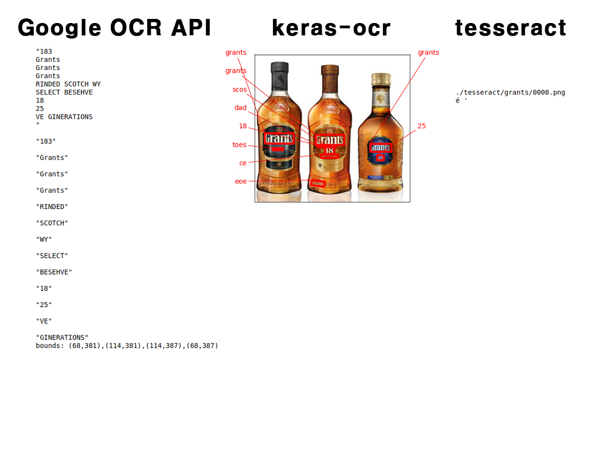

## 회고록

- OCR이 우리 주변에서 많이 사용되는 기술인 건 알고 있었지만 그 기술의 기반이 딥러닝이었다는 사실이 놀라웠다.
- Google OCR API가 가장 성능이 좋을 것이라고 예상했었는데, 역시나였다. 아무래도 유료로 제공되는 API이기 때문에 무료보다 성능이 낮을 수는 없을 것이다.
- OCR의 한 가지 어려움이라고 한다면 문자를 인식하는 위치가 사진의 각도나 위치에 따라 달라지기 때문에 일정한 서식을 가진 글자라고 해도 필요한 요소만 추출하긴 어려울 것 같다. 그래서 자동차 번호판을 인식하거나, 신용카드, 명함 등을 스캔할 때 특정 위치를 기준으로 할 수 밖에 없는 것이 아닌가 생각한다.
