# 19. 인간보다 퀴즈를 잘 푸는 인공지능

2018년 10월, SQuAD(Stanford Question Answering Dataset) 리더보드에 Human performance를 능가하는 점수로 1위 자리를 갱신한 모델이 나타나 엄청난 주목을 끌었다. 이른바, [사람보다 퀴즈를 잘 푸는 인공지능]이 나타났다는 소식은 딥러닝 자연어처리 분야에 충격적인 뉴스가 아닐 수 없었다. 다음 달에 뉴욕 타임즈에는 다음과 같은 제목의 기사가 실렸다.

> **Finally, a Machine That Can Finish Your Sentence**
Completing someone else’s thought is not an easy trick for A.I. But new systems are starting to crack the code of natural language.

구글에서 발표한 논문에 소개된 이 모델의 이름은 바로 BERT(Bidirectional Encoder Representations from Transformers)였다. 이 모델은 340MB나 되는 엄청난 사이즈의 파라미터를 가진 모델을 수십 GB나 되는 코퍼스를 학습 시켜 만든 pretrained model로서, 비단 SQuAD뿐 아니라 당시 거의 모든 자연어처리 태스크의 SOTA(State-of-the-art)를 갱신하는 기염을 토했다. 단순히 성능이 개선되어서만이 아니라, BERT는 엄청난 규모의 언어 모델(Language Model)을 pretrain하고 이를 어떤 태스크에든 약간의 fine-tuning만을 통해 손쉽게 적용하여 해결하는 제너럴한 방식이 가능함을 입증하여, 자연어처리 패러다임의 근본적인 변화를 불러왔다. 이후 수많은 후속 모델들이 BERT의 아이디어를 더욱 발전, 확장시켜 나가면서, 이전에는 기대할 수 없었던 자연어처리 기술 발달을 가속화해 가고 있다.

오늘은 BERT 모델 구조를 살펴보고, Pretrained Model을 활용하여 한국형 SQuAD인 KorQuAD 태스크를 수행하는 모델을 학습해 본다. 이 과정을 통해 Contextual Word Embedding의 개념과 자연어처리 분야의 최근 트렌드인 전이학습(Transfer Learning) 활용 방법까지 함께 숙지하도록 하자.

### 전제조건

---

- Keras를 활용한 모델 구성 및 학습 진행 방법을 숙지하고 있다.
- LSTM의 개념을 이해하고 모델 구성에 활용할 수 있다.
- Transformer 모델 구조와 Attention의 개념에 대해 이해하고 있다.

### 학습 목표

---

- Transformer Encoder로 이루어진 BERT의 모델구조를 이해한다.
- Pretrained embedding 접근 방식에 대해 이해한다.
- Pretrained BERT를 활용할 수 있다.

### 준비물

---

```python
# 한국어 시각화를 위한 패키지
$ sudo apt update -qq
$ sudo apt install fonts-nanum* -qq

# 필요한 모듈
$ pip install tensorflow_addons==0.11.2
$ pip install sentencepiece
$ pip install wordcloud
$ pip install ipywidgets --user
$ pip install tqdm
$ pip install pydot
$ pip install pydotplus
$ pip install graphviz
```

- [tensorflow와 tensorflow_addons 버전 호환성에 유의](https://github.com/tensorflow/addons#python-op-compatibility-matrix)

```python
# 한국어 폰트 설치를 확인
import matplotlib as mpl
import matplotlib.pyplot as plt
import matplotlib.font_manager as fm

fontpath = '/usr/share/fonts/truetype/nanum/NanumBarunGothic.ttf'
font = fm.FontProperties(fname=fontpath, size=9)
plt.rc('font', family='NanumBarunGothic') 
mpl.font_manager._rebuild()
```

## KorQuAD Task

### (1) KorQuAD 데이터셋 소개

---

오늘 우리는 KorQuAD(The Korean Question Answering Dataset, 한국어 질의응답 데이터셋)을 통해 자연어처리 분야의 기계독해(Machine Reading Comprehension, MRC) 태스크를 다루어 볼 것이다. 이 데이터셋은 미국 스탠퍼드 대학에서 구축한 대용량 데이터셋인 SQuAD를 벤치마킹한 것이다. 자연어처리에 입문하게 되면 흔히는 감성분석 등의 Text Classification, 또는 Encoder-Decoder 구조의 모델을 통한 번역 태스크를 많이 다루게 될 것이다. 그러나 자연어처리 분야에서 기계독해 태스크는 머신이 자연어의 의미를 정확하게 이해하고 사람의 질문에 정확하게 답변할 수 있는지를 측정하는 아주 중요한 분야다. 그래서 SQuAD 데이터셋은 언어 모델의 성능을 측정하는 가장 표준적인 벤치마크로 인정받고 있다. 세계 유수 연구소와 대학에서 SQuAD 데이터셋의 리더보드에 이름을 올리기 위해 지금도 열심히 연구중이다.

- [SQuAD 공식 홈페이지](https://rajpurkar.github.io/SQuAD-explorer/)
- [KorQuAD 공식 홈페이지](https://korquad.github.io/)

두 데이터셋 모두 현재는 2.0으로 버전이 올라가 있다. 1.0과 2.0 모두 EM(Exact Match: 모델이 정답을 정확히 맞춘 비율), F1 score(모델이 낸 답안과 정답이 음절 단위로 겹치는 부분을 고려한 부분점수), 1-example-latency(질문당 응답속도) 이상 3가지 척도로 모델을 평가한다.

- [참고 : MRC 모델, 어떻게 개발하고 평가하나요?](https://blog.naver.com/skelterlabs/222025030327)

```python
# KorQuAD 데이터 다운로드
$ wget https://korquad.github.io/dataset/KorQuAD_v1.0_train.json
$ wget https://korquad.github.io/dataset/KorQuAD_v1.0_dev.json
```

```python
# imports
from __future__ import absolute_import, division, print_function, unicode_literals

import tensorflow as tf
import tensorflow.keras.backend as K
import tensorflow_addons as tfa

import os
import re
import numpy as np
import pandas as pd
import pickle
import random
import collections
import json
from datetime import datetime

import sentencepiece as spm
from tqdm.notebook import tqdm
import matplotlib.pyplot as plt
import seaborn as sns
from wordcloud import WordCloud

random_seed = 1234
random.seed(random_seed)
np.random.seed(random_seed)
tf.random.set_seed(random_seed)
```

다운로드받은 KorQuAD 데이터를 확인해 보자. 아래 `print_json_tree()` 메소드는 KorQuAD 데이터처럼 json 포맷으로 이루어진 데이터에서 리스트의 첫번째 아이템의 실제 내용을 간단히 확인하는데 유용하다.

```python
def print_json_tree(data, indent=""):
    for key, value in data.items():
        if type(value) == list:     # list 형태의 item은 첫번째 item만 출력
            print(f'{indent}- {key}: [{len(value)}]')
            print_json_tree(value[0], indent + "  ")
        else:
            print(f'{indent}- {key}: {value}')

data_dir = os.getenv('HOME')+'/aiffel/bert_qna/data'
model_dir = os.getenv('HOME')+'/aiffel/bert_qna/models'

# 훈련데이터 확인
train_json_path = data_dir + '/KorQuAD_v1.0_train.json'
with open(train_json_path) as f:
    train_json = json.load(f)
    print_json_tree(train_json)

# 검증데이터 확인
dev_json_path = data_dir + '/KorQuAD_v1.0_dev.json'
with open(dev_json_path) as f:
    dev_json = json.load(f)
    print_json_tree(dev_json)
```

json 데이터의 실제 형태는 아래와 같이 `json.dumps()`를 이용해 확인해볼 수 있다.

```python
print(json.dumps(train_json["data"][0], indent=2, ensure_ascii=False))
```

## KorQuAD 데이터셋 전처리

### (1) 띄어쓰기 단위 정보관리

---

SQuAD, KorQuAD 데이터셋으로 모델을 구성하기 위한 전처리 과정은 다른 자연어처리 태스크와 다소 다른 접근법이 있다.

```python
def _is_whitespace(c):
    if c == " " or c == "\t" or c == "\r" or c == "\n" or ord(c) == 0x202F:
        return True
    return False

# whitespace가 2개인 경우를 처리해야 함

string1 = '1839년 파우스트을 읽었다.'
string2 = '1839년  파우스트을 읽었다.'
string1[6:10], string2[7:11]
```

위 두 문장에 대해 글자별로 띄어쓰기 영역 정보를 관리해 주려면 다음과같이 약간 다르게 처리될 것이다.

```python
word_tokens = []
char_to_word = []
prev_is_whitespace = True

# 첫번째 문장(string1)에 대해 띄어쓰기 영역 정보를 표시
for c in string1:
    if _is_whitespace(c):
        prev_is_whitespace = True
    else:
        if prev_is_whitespace:
            word_tokens.append(c)
        else:
            word_tokens[-1] += c
        prev_is_whitespace = False    
    char_to_word.append(len(word_tokens) - 1)
    print(f'\'{c}\' : {word_tokens} : {char_to_word}')

word_tokens = []
char_to_word = []
prev_is_whitespace = True

# 두번째 문장(string2)에 대해 띄어쓰기 영역 정보를 표시
for c in string2:
    if _is_whitespace(c):
        prev_is_whitespace = True
    else:
        if prev_is_whitespace:
            word_tokens.append(c)
        else:
            word_tokens[-1] += c
        prev_is_whitespace = False    
    char_to_word.append(len(word_tokens) - 1)
    print(f'\'{c}\' : {word_tokens} : {char_to_word}')
```

같은 코드이지만 '1839년' 다음의 공백 길이에 따라 두 문장의 영역표시 결과가 조금 달라지는 것을 확인할 수 있다. 이 기능을 함수로 만들면 다음과 같다.

```python
def _tokenize_whitespace(string):
    word_tokens = []
    char_to_word = []
    prev_is_whitespace = True

    for c in string:
        if _is_whitespace(c):
            prev_is_whitespace = True
        else:
            if prev_is_whitespace:
                word_tokens.append(c)
            else:
                word_tokens[-1] += c
            prev_is_whitespace = False    
        char_to_word.append(len(word_tokens) - 1)
    
    return word_tokens, char_to_word
```

위와 같은 방법으로 띄어쓰기 단위로 token을 정리한 후, word token 영역별로 유니크한 숫자(어절 번호)를 부여한다. SQuAD 유형의 문제를 풀 때 글자 혹은 subword 단위로 token이 분리되는 것에 대비해서 원래 데이터가 띄어쓰기 단위로 어떠했었는지 word token 영역별로 추가 정보를 관리하면 도움이 된다. 아래와 같이 글자별로 word_token 영역을 표시해 주는 `char_to_word` list를 관리해 둔다. 이 값은 현재 글자가 몇 번째 어절에 포함된 것이었는지를 말해 준다.

```python
# 첫번째 문장(string1)에 대해 띄어쓰기 영역 정보를 표시
word_tokens, char_to_word = _tokenize_whitespace(string1)
for c, i in zip(list(string1), char_to_word):
    print(f'\'{c}\' : {i}')

word_tokens, char_to_word
# (['1839년', '파우스트을', '읽었다.'], [0, 0, 0, 0, 0, 0, 1, 1, 1, 1, 1, 1, 2, 2, 2, 2])

# 두번째 문장(string2)에 대해 띄어쓰기 영역 정보를 표시
word_tokens, char_to_word = _tokenize_whitespace(string2)
for c, i in zip(list(string2), char_to_word):
    print(f'\'{c}\' : {i}')

word_tokens, char_to_word
# (['1839년', '파우스트을', '읽었다.'], [0, 0, 0, 0, 0, 0, 0, 1, 1, 1, 1, 1, 1, 2, 2, 2, 2])
```

### (2) Tokenize by Vocab

---

> 읽다, 읽었다, 읽어라, 읽고, 읽으려면, 읽다가…

이 모든 단어를 전부 단어사전에 추가하려면 너무 많은 단어가 필요할 것이다. Word 기반의 단어사전 구축이 가지는 문제점으로, 특히 한국어의 경우에 이런 문제점이 심하다. 이런 문제를 해결하기 위하여 '읽었다'를 '읽'+'었다'로 나누어서 처리하는 **Subword Segmentation** 방법이 있다.

BERT에는 [WordPiece](https://arxiv.org/pdf/1609.08144.pdf) 모델 사용이 일반적이지만, 오늘은 [SentencePiece](https://github.com/google/sentencepiece) 모델을 이용해서 Subword 기반의 텍스트 전처리를 진행할 것이다. 구글에서 오픈소스로 제공하는 SentencePiece 모델은 파이썬에서 손쉽게 사용가능하며, WordPiece 등 다른 모델들을 통합하여 제공하므로 최근 널리 사용되고 있다.

다만, 한국어의 경우에는 `koNLPy`를 통해 사용할 수 있는 형태소분석기가 이런 역할을 한다. 하지만 SentencePiece 같은 모델들은 언어마다 다른 문법규칙을 활용하지 않고, 적절한 Subword 분절 규칙을 학습하거나, 혹은 자주 사용되는 구문을 하나의 단어로 묶어내는 등 통계적인 방법을 사용한다. 그래서 어떤 언어에든 보편적으로 적용 가능하다는 장점이 있다.

```python
# vocab loading
vocab = spm.SentencePieceProcessor()
vocab.load(f"{model_dir}/ko_32000.model")

# word를 subword로 변경하면서 index 저장
word_to_token = []
context_tokens = []
for (i, word) in enumerate(word_tokens):
    word_to_token.append(len(context_tokens))
    tokens = vocab.encode_as_pieces(word)  # SentencePiece를 사용해 Subword로 쪼갭니다.
    for token in tokens:
        context_tokens.append(token)

context_tokens, word_to_token # (['▁1839', '년', '▁', '파우스트', '을', '▁읽', '었다', '.'], [0, 2, 5])
```

'_' 표시는 앞부분이 공백이라는 것을 의미한다. 여기서 `word_to_token`의 [0, 2, 5]란 `context_tokens`에 쪼개져 담긴 0번, 2번, 5번 토큰인 '▁1839', '▁', '▁읽' 이 어절단위의 첫번째 토큰이 된다는 정보를 담아둔 것이다. 위 코드도 함수로 만들면 다음과 같다.

```python
def _tokenize_vocab(vocab, context_words):
    word_to_token = []
    context_tokens = []
    for (i, word) in enumerate(context_words):
        word_to_token.append(len(context_tokens))
        tokens = vocab.encode_as_pieces(word)
        for token in tokens:
            context_tokens.append(token)
    return context_tokens, word_to_token
```

### (3) Improve Span

---

KorQuAD 데이터셋은 `질문(question)`과 `지문(context)`을 주고, `지문` 영역에서 `정답(answer)`을 찾도록 구성되어 있다. 그러므로 정답에 해당하는 지문 영역을 정확히 찾아내는 것이 전처리의 핵심적인 작업이 된다.

```python
context = train_json['data'][0]['paragraphs'][0]['context']
question = train_json['data'][0]['paragraphs'][0]['qas'][0]['question']
answer_text = train_json['data'][0]['paragraphs'][0]['qas'][0]['answers'][0]['text']
answer_start = train_json['data'][0]['paragraphs'][0]['qas'][0]['answers'][0]['answer_start']
answer_end = answer_start + len(answer_text) - 1

print('[context] ', context)
print('[question] ', question)
print('[answer] ', answer_text)
print('[answer_start] index: ', answer_start, 'character: ', context[answer_start])
print('[answer_end]index: ', answer_end, 'character: ', context[answer_end])

# answer_text에 해당하는 context 영역을 정확히 찾아내야 합니다. 
assert context[answer_start:answer_end + 1] == answer_text

# context를 띄어쓰기(word) 단위로 토큰화한 결과를 살펴봅니다. 
word_tokens, char_to_word = _tokenize_whitespace(context)

print( word_tokens[:20])

char_to_word[:20], context[:20]

# 띄어쓰기(word) 단위로 쪼개진 context(word_tokens)를 Subword로 토큰화한 결과를 살펴봅니다. 
context_tokens, word_to_token = _tokenize_vocab(vocab, word_tokens)
for i in range(min(20, len(word_to_token) - 1)):
    print(word_to_token[i], context_tokens[word_to_token[i]:word_to_token[i + 1]])
```

정답을 찾는 방법은 context에 포함된 answer의 글자단위 시작 인덱스 `answer_start`와 종료 인덱스 `answer_end`를 구했다. 이 위치를 어절(word) 단위로 변환하면 다음과 같다.

```python
# answer_start와 answer_end로부터 word_start와 word_end를 구합니다. 
word_start = char_to_word[answer_start]
word_end = char_to_word[answer_end]
word_start, word_end, answer_text, word_tokens[word_start:word_end + 1] # (14, 14, '교향곡', ['교향곡을'])
```

찾아야 하는 정답은 15번째 어절(index=14)에 있다. 그러나 우리가 원하는 답은 '교향곡을'이 아닌 '교향곡'이다. 따라서 `word_start`로부터 `word_end`까지의 context를 Subword 단위로 토큰화한 결과를 이용한다.

```python
token_start = word_to_token[word_start]
if word_end < len(word_to_token) - 1:
    token_end = word_to_token[word_end + 1] - 1
else:
    token_end = len(context_tokens) - 1
token_start, token_end, context_tokens[token_start:token_end + 1] # (19, 20, ['▁교향곡', '을'])

# 실제 정답인 answer_text도 Subword 기준으로 토큰화해 둡니다. 
token_answer = " ".join(vocab.encode_as_pieces(answer_text))
token_answer # '▁교향곡'
```

KorQuAD 문제의 정답은 단답형만 있는 것이 아니므로, 좀더 일반적인 방법으로 정답 토큰 범위를 찾는 코드를 작성해보자.

```python
# 정답이 될수 있는 new_start와 new_end의 경우를 순회탐색합니다. 
for new_start in range(token_start, token_end + 1):
    for new_end in range(token_end, new_start - 1, -1):
        text_span = " ".join(context_tokens[new_start : (new_end + 1)])
        if text_span == token_answer:   # 정답과 일치하는 경우
            print("O >>", (new_start, new_end), text_span)
        else:
            print("X >>", (new_start, new_end), text_span)
"""
X >> (19, 20) ▁교향곡 을
O >> (19, 19) ▁교향곡
X >> (20, 20) 을
"""
```

함수로 정리하면 다음과 같다.

```python
# context_tokens에서 char_answer의 위치를 찾아 리턴하는 함수
def _improve_span(vocab, context_tokens, token_start, token_end, char_answer):
    token_answer = " ".join(vocab.encode_as_pieces(char_answer))
    for new_start in range(token_start, token_end + 1):
        for new_end in range(token_end, new_start - 1, -1):
            text_span = " ".join(context_tokens[new_start : (new_end + 1)])
            if text_span == token_answer:
                return (new_start, new_end)
    return (token_start, token_end)

token_start, token_end = _improve_span(vocab, context_tokens, token_start, token_end, answer_text)
print('token_start:', token_start, ' token_end:', token_end)
context_tokens[token_start:token_end + 1] # token_start: 19  token_end: 19 ['▁교향곡']
```

### (4) 데이터셋 분리

---

train 데이터셋, dev 데이터셋을 분리하여, 위에서 작성한 `_improve_span()` 함수를 이용해 전처리 후 파일로 저장한다.

```python
def dump_korquad(vocab, json_data, out_file):
    with open(out_file, "w") as f:
        for data in tqdm(json_data["data"]):
            title = data["title"]
            for paragraph in data["paragraphs"]:
                context = paragraph["context"]
                context_words, char_to_word = _tokenize_whitespace(context)

                for qa in paragraph["qas"]:
                    assert len(qa["answers"]) == 1
                    qa_id = qa["id"]
                    question = qa["question"]
                    answer_text = qa["answers"][0]["text"]
                    answer_start = qa["answers"][0]["answer_start"]
                    answer_end = answer_start + len(answer_text) - 1

                    assert answer_text == context[answer_start:answer_end + 1]

                    word_start = char_to_word[answer_start]
                    word_end = char_to_word[answer_end]

                    word_answer = " ".join(context_words[word_start:word_end + 1])
                    char_answer = " ".join(answer_text.strip().split())
                    assert char_answer in word_answer

                    context_tokens, word_to_token = _tokenize_vocab(vocab, context_words)

                    token_start = word_to_token[word_start]
                    if word_end < len(word_to_token) - 1:
                        token_end = word_to_token[word_end + 1] - 1
                    else:
                        token_end = len(context_tokens) - 1

                    token_start, token_end = _improve_span(vocab, context_tokens, token_start, token_end, char_answer)

                    data = {"qa_id": qa_id, "title": title, "question": vocab.encode_as_pieces(question), "context": context_tokens, "answer": char_answer, "token_start": token_start, "token_end":token_end}
                    f.write(json.dumps(data, ensure_ascii=False))
                    f.write("\n")
```

```python
# 전처리를 수행하여 파일로 생성합니다. 
dump_korquad(vocab, train_json, f"{data_dir}/korquad_train.json")
dump_korquad(vocab, dev_json, f"{data_dir}/korquad_dev.json")
```

```python
# 실제 파일 내용 확인
def print_file(filename, count=10):
    """
    파일 내용 출력
    :param filename: 파일 이름
    :param count: 출력 라인 수
    """
    with open(filename) as f:
        for i, line in enumerate(f):
            if count <= i:
                break
            print(line.strip())

print_file(f"{data_dir}/korquad_train.json")
```

### (5) 데이터 분석 : Question

---

원본 데이터셋을 전처리하여 모델이 다루게 될 데이터셋으로 가공하는 과정을 진행했다. 그러나 이 데이터셋을 기대로 사용할 수 있을지, 혹은 이상(abnormal) 데이터가 존재하지는 않는지 분석하는 과정이 필요하다. 우선 전체 데이터에서 question 항목의 길이 분포를 조사해보자.

```python
questions = []
contexts = []
token_starts = []
with open(f"{data_dir}/korquad_train.json") as f:
    for i, line in enumerate(f):
        data = json.loads(line)
        questions.append(data["question"])
        contexts.append(data["context"])
        token_starts.append(data["token_start"])
        if i < 10:
            print(data["token_start"], data["question"])

# token count
train_question_counts = [len(question) for question in questions]
train_question_counts[:10]

# 그래프에 대한 이미지 사이즈 선언
# figsize: (가로, 세로) 형태의 튜플로 입력
plt.figure(figsize=(8, 4))
# histogram 선언
# bins: 히스토그램 값들에 대한 버켓 범위, 
# range: x축 값의 범위
# facecolor: 그래프 색상
# label: 그래프에 대한 라벨
plt.hist(train_question_counts, bins=100, range=[0, 100], facecolor='b', label='train')
# 그래프 제목
plt.title('Count of question')
# 그래프 x 축 라벨
plt.xlabel('Number of question')
# 그래프 y 축 라벨
plt.ylabel('Count of question')
plt.show()
```

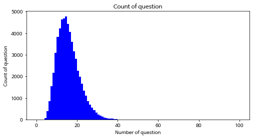

```python
# 데이터 길이
print(f"question 길이 최대:    {np.max(train_question_counts):4d}")
print(f"question 길이 최소:    {np.min(train_question_counts):4d}")
print(f"question 길이 평균:    {np.mean(train_question_counts):7.2f}")
print(f"question 길이 표준편차: {np.std(train_question_counts):7.2f}")
# https://ko.wikipedia.org/wiki/%EB%B0%B1%EB%B6%84%EC%9C%84%EC%88%98
# 백분위수(Percentile)는 크기가 있는 값들로 이뤄진 자료를 순서대로 나열했을 때 백분율로 나타낸 특정 위치의 값을 이르는 용어이다.
# 일반적으로 크기가 작은 것부터 나열하여 가장 작은 것을 0, 가장 큰 것을 100으로 한다.
# 100개의 값을 가진 어떤 자료의 20 백분위수는 그 자료의 값들 중 20번째로 작은 값을 뜻한다. 50 백분위수는 중앙값과 같다.
percentile25 = np.percentile(train_question_counts, 25)
percentile50 = np.percentile(train_question_counts, 50)
percentile75 = np.percentile(train_question_counts, 75)
percentileIQR = percentile75 - percentile25
percentileMAX = percentile75 + percentileIQR * 1.5
print(f"question 25/100분위:  {percentile25:7.2f}")
print(f"question 50/100분위:  {percentile50:7.2f}")
print(f"question 75/100분위:  {percentile75:7.2f}")
print(f"question IQR:        {percentileIQR:7.2f}")
print(f"question MAX/100분위: {percentileMAX:7.2f}")

# boxplot 생성
plt.figure(figsize=(4, 6))
# 첫번째 파라메터: 여러 분포에 대한 데이터 리스트를
# labels: 입력한 데이터에 대한 라벨
# showmeans: 평균값을 표현
# 참고: https://leebaro.tistory.com/entry/%EB%B0%95%EC%8A%A4-%ED%94%8C%EB%A1%AFbox-plot-%EC%84%A4%EB%AA%85
plt.boxplot(train_question_counts, labels=['token counts'], showmeans=True)
plt.show()
```

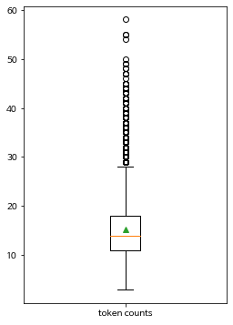

### (6) 데이터 분석 : Context

---

위와 동일한 방법으로 Context에 대해서도 분석해보자.

```python
# token count
train_context_counts = [len(context) for context in contexts]
train_context_counts[:10]

# 그래프에 대한 이미지 사이즈 선언
# figsize: (가로, 세로) 형태의 튜플로 입력
plt.figure(figsize=(8, 4))
# histogram 선언
# bins: 히스토그램 값들에 대한 버켓 범위, 
# range: x축 값의 범위
# facecolor: 그래프 색상
# label: 그래프에 대한 라벨
plt.hist(train_context_counts, bins=900, range=[100, 1000], facecolor='r', label='train')
# 그래프 제목
plt.title('Count of context')
# 그래프 x 축 라벨
plt.xlabel('Number of context')
# 그래프 y 축 라벨
plt.ylabel('Count of context')
plt.show()
```

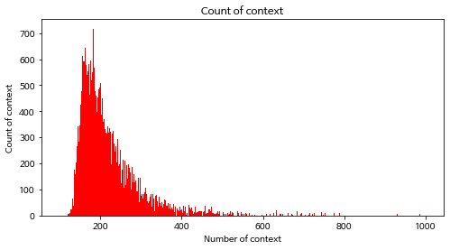

```python
# 데이터 길이
print(f"context 길이 최대:    {np.max(train_context_counts):4d}")
print(f"context 길이 최소:    {np.min(train_context_counts):4d}")
print(f"context 길이 평균:    {np.mean(train_context_counts):7.2f}")
print(f"context 길이 표준편차: {np.std(train_context_counts):7.2f}")
# https://ko.wikipedia.org/wiki/%EB%B0%B1%EB%B6%84%EC%9C%84%EC%88%98
# 백분위수(Percentile)는 크기가 있는 값들로 이뤄진 자료를 순서대로 나열했을 때 백분율로 나타낸 특정 위치의 값을 이르는 용어이다.
# 일반적으로 크기가 작은 것부터 나열하여 가장 작은 것을 0, 가장 큰 것을 100으로 한다.
# 100개의 값을 가진 어떤 자료의 20 백분위수는 그 자료의 값들 중 20번째로 작은 값을 뜻한다. 50 백분위수는 중앙값과 같다.
percentile25 = np.percentile(train_context_counts, 25)
percentile50 = np.percentile(train_context_counts, 50)
percentile75 = np.percentile(train_context_counts, 75)
percentileIQR = percentile75 - percentile25
percentileMAX = percentile75 + percentileIQR * 1.5
print(f"context 25/100분위:  {percentile25:7.2f}")
print(f"context 50/100분위:  {percentile50:7.2f}")
print(f"context 75/100분위:  {percentile75:7.2f}")
print(f"context IQR:        {percentileIQR:7.2f}")
print(f"context MAX/100분위: {percentileMAX:7.2f}")

plt.figure(figsize=(4, 6))
# 박스플롯 생성
# 첫번째 파라메터: 여러 분포에 대한 데이터 리스트를
# labels: 입력한 데이터에 대한 라벨
# showmeans: 평균값을 표현
# 참고: https://leebaro.tistory.com/entry/%EB%B0%95%EC%8A%A4-%ED%94%8C%EB%A1%AFbox-plot-%EC%84%A4%EB%AA%85
plt.boxplot(train_context_counts, labels=['token counts'], showmeans=True)
plt.show()
```

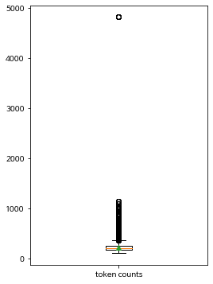

### (7) 데이터 분석 : Answer

---

위와 동일한 방법으로 answer 항목에 대해서도 분석해보자.

```python
# token count
train_answer_starts = token_starts
train_answer_starts[:10]

# 그래프에 대한 이미지 사이즈 선언
# figsize: (가로, 세로) 형태의 튜플로 입력
plt.figure(figsize=(8, 4))
# histogram 선언
# bins: 히스토그램 값들에 대한 버켓 범위, 
# range: x축 값의 범위
# facecolor: 그래프 색상
# label: 그래프에 대한 라벨
plt.hist(train_answer_starts, bins=500, range=[0, 500], facecolor='g', label='train')
# 그래프 제목
plt.title('Count of answer')
# 그래프 x 축 라벨
plt.xlabel('Number of answer')
# 그래프 y 축 라벨
plt.ylabel('Count of answer')
plt.show()
```

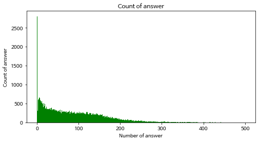

```python
# 데이터 길이
print(f"answer 위치 최대:    {np.max(train_answer_starts):4d}")
print(f"answer 위치 최소:    {np.min(train_answer_starts):4d}")
print(f"answer 위치 평균:    {np.mean(train_answer_starts):7.2f}")
print(f"answer 위치 표준편차: {np.std(train_answer_starts):7.2f}")
# https://ko.wikipedia.org/wiki/%EB%B0%B1%EB%B6%84%EC%9C%84%EC%88%98
# 백분위수(Percentile)는 크기가 있는 값들로 이뤄진 자료를 순서대로 나열했을 때 백분율로 나타낸 특정 위치의 값을 이르는 용어이다.
# 일반적으로 크기가 작은 것부터 나열하여 가장 작은 것을 0, 가장 큰 것을 100으로 한다.
# 100개의 값을 가진 어떤 자료의 20 백분위수는 그 자료의 값들 중 20번째로 작은 값을 뜻한다. 50 백분위수는 중앙값과 같다.
percentile25 = np.percentile(train_answer_starts, 25)
percentile50 = np.percentile(train_answer_starts, 50)
percentile75 = np.percentile(train_answer_starts, 75)
percentileIQR = percentile75 - percentile25
percentileMAX = percentile75 + percentileIQR * 1.5
print(f"answer 25/100분위:  {percentile25:7.2f}")
print(f"answer 50/100분위:  {percentile50:7.2f}")
print(f"answer 75/100분위:  {percentile75:7.2f}")
print(f"answer IQR:        {percentileIQR:7.2f}")
print(f"answer MAX/100분위: {percentileMAX:7.2f}")

plt.figure(figsize=(4, 6))
# 박스플롯 생성
# 첫번째 파라메터: 여러 분포에 대한 데이터 리스트를
# labels: 입력한 데이터에 대한 라벨
# showmeans: 평균값을 표현
# 참고: https://leebaro.tistory.com/entry/%EB%B0%95%EC%8A%A4-%ED%94%8C%EB%A1%AFbox-plot-%EC%84%A4%EB%AA%85
plt.boxplot(train_answer_starts, labels=['token counts'], showmeans=True)
plt.show()
```

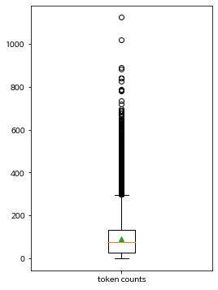

### (8) 데이터 분석 : Word Cloud

---

워드 클라우드(Word Cloud)란 자료의 빈도수를 시각화해서 나타내는 방법이다. 문서의 핵심 단어를 한눈에 파악할 수 있고, 빅데이터를 분석할 때 데이터의 특징을 도출하기 위해서 활용된다. 빈도수가 높은 단어일수록 글씨 크기가 큰 특징이 있다.

```python
# train documents
documents = []

# 전체 데이터에서 title, context, question 문장을 모두 추출합니다. 
for data in tqdm(train_json["data"]):
    title = data["title"]
    documents.append(title)
    for paragraph in data["paragraphs"]:
        context = paragraph["context"]
        documents.append(context)

        for qa in paragraph["qas"]:
            assert len(qa["answers"]) == 1
            question = qa["question"]
            documents.append(question)

documents[:10]   # 그중 맨 앞 10개만 확인해 봅니다.

# documents를 전부 이어 하나의 문장으로 만들면 이렇게 보입니다. 
" ".join(documents[:10])
```

```python
# WordCloud로 " ".join(documents)를 처리해 봅니다. 
wordcloud = WordCloud(width=800, height=800, font_path='/usr/share/fonts/truetype/nanum/NanumBarunGothic.ttf').generate(" ".join(documents))
plt.figure(figsize=(10, 10))
# https://datascienceschool.net/view-notebook/6e71dbff254542d9b0a054a7c98b34ec/
# image 출력, interpolation 이미지 시각화 옵션
plt.imshow(wordcloud, interpolation='bilinear')
plt.axis('off')
plt.show()
```

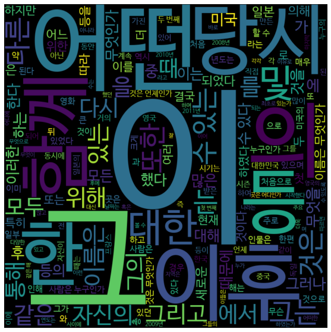

### (9) 데이터 로드

---

지금까지 만든 데이터셋을 메모리에 로드한다.

```python
train_json = os.path.join(data_dir, "korquad_train.json")
dev_json = os.path.join(data_dir, "korquad_dev.json")

class Config(dict):
    """
    json을 config 형태로 사용하기 위한 Class
    :param dict: config dictionary
    """
    __getattr__ = dict.__getitem__
    __setattr__ = dict.__setitem__

args = Config({
    'max_seq_length': 384,
    'max_query_length': 64,
})
args

# 생성한 데이터셋 파일을 메모리에 로딩하는 함수
def load_data(args, filename):
    inputs, segments, labels_start, labels_end = [], [], [], []

    n_discard = 0
    with open(filename, "r") as f:
        for i, line in enumerate(tqdm(f, desc=f"Loading ...")):
            data = json.loads(line)
            token_start = data.get("token_start")
            token_end = data.get("token_end")
            question = data["question"][:args.max_query_length]
            context = data["context"]
            answer_tokens = " ".join(context[token_start:token_end + 1])
            context_len = args.max_seq_length - len(question) - 3

            if token_end >= context_len:
                # 최대 길이내에 token이 들어가지 않은 경우 처리하지 않음
                n_discard += 1
                continue
            context = context[:context_len]
            assert len(question) + len(context) <= args.max_seq_length - 3

            tokens = ['[CLS]'] + question + ['[SEP]'] + context + ['[SEP]']
            ids = [vocab.piece_to_id(token) for token in tokens]
            ids += [0] * (args.max_seq_length - len(ids))
            inputs.append(ids)
            segs = [0] * (len(question) + 2) + [1] * (len(context) + 1)
            segs += [0] * (args.max_seq_length - len(segs))
            segments.append(segs)
            token_start += (len(question) + 2)
            labels_start.append(token_start)
            token_end += (len(question) + 2)
            labels_end.append(token_end)
    print(f'n_discard: {n_discard}')

    return (np.array(inputs), np.array(segments)), (np.array(labels_start), np.array(labels_end))
```

```python
# train data load
train_inputs, train_labels = load_data(args, train_json)
print(f"train_inputs: {train_inputs[0].shape}")
print(f"train_inputs: {train_inputs[1].shape}")
print(f"train_labels: {train_labels[0].shape}")
print(f"train_labels: {train_labels[1].shape}")

# dev data load
dev_inputs, dev_labels = load_data(args, dev_json)
print(f"dev_inputs: {dev_inputs[0].shape}")
print(f"dev_inputs: {dev_inputs[1].shape}")
print(f"dev_labels: {dev_labels[0].shape}")
print(f"dev_labels: {dev_labels[1].shape}")

train_inputs[:10], train_labels[:10]
```

최종 데이터셋은 다음과 같다.

```python
# Question과 Context가 포함된 입력데이터 1번째
train_inputs[0][0]

"""
array([    5, 15798,    10, 28935,     9,    11, 29566,    20, 14604,
       20424,  3904,    70,    11,  4648,    10,    19,  1910,     4,
       22070,    15, 15798,    10, 28935,     9,    11, 29566,    16,
         626, 14604,    38, 14028, 11773, 13829,   384,  8376,  3021,
        1239,  6874,    16,  1687,  5958,  2694,  5061,     7,    30,
        1613, 15798,    10, 28065,    75,  4415,  1816,  4978,    27,
         347,   145,   107,  2703,   263,    11,     1,    18,  5853,
          99,  9677,    24, 11969,    13,  7595,   437,  1019,  5907,
         257,  3794,  1972,    20, 11278,    11, 29566,     9,   612,
       12631, 13214,  1732,    76,     7,   110,  8802, 17581,   354,
        9648,  2060,    21,  1682, 22110, 18164,    17, 21076, 14980,
           9,  6874,    81, 11325,  4239,  3597,  1010,  1035, 17670,
           8,  2447,  1306,    35,   443,    11, 29566,     9,   315,
       12729, 14457,    30,  7938,  3742, 10766,   634,  9971, 17590,
       19424,    10,   285,  4080,    61, 17573,   483,     7,  7588,
           9,   473,   338,   147,  1924,     9, 11016,   136,  1034,
          13, 11672,    40,  3436,  5217,  7898, 11684,    57,   830,
           9,    19,  3319,    86,   220,   464, 14980,     9, 20515,
         412,   991,   684,  1924,     9,   634,   920,   144,   430,
          34,    25,     7,  4210,  6874,  2150,    16, 22070,   298,
        1159,    75,  1098,  8802,  7490,   805,    35, 18678,    16,
        1657,  1970,  2272,    53,     7,   110,  6559,  2178,    24,
         756,    82,    30,   315,   684,  3772, 18678,    12,    16,
        1682, 22110,     9, 22469,    22,  1757,    61,  8817,   194,
         164,  1693,   749,     8,  6739, 12202,    10,   494,     7,
         502, 12181,    18,    46,    15,   374,    17,  1680,   708,
       26344,    22,  1757,   432,   465,   351,    32, 18563,   710,
           8,  2585,  1384, 16071,   265,  3360,     7,    38,   747,
          82,   383,   678,   200,    26,   590,  1281,    41,  1172,
          31,    16,  2178,    43,  3044,   156,    17,   647,   468,
        7490,    41,    84,   758,    92,    33,  3401,   369, 18319,
           8,  2582, 29798,  1102,    17,    30,  4573, 11170,   139,
          58,   220,   773,    19,   211, 23824,    25,     7,     4,
           0,     0,     0,     0,     0,     0,     0,     0,     0,
           0,     0,     0,     0,     0,     0,     0,     0,     0,
           0,     0,     0,     0,     0,     0,     0,     0,     0,
           0,     0,     0,     0,     0,     0,     0,     0,     0,
           0,     0,     0,     0,     0,     0,     0,     0,     0,
           0,     0,     0,     0,     0,     0,     0,     0,     0,
           0,     0,     0,     0,     0,     0,     0,     0,     0,
           0,     0,     0,     0,     0,     0,     0,     0,     0,
           0,     0,     0,     0,     0,     0,     0,     0,     0,
           0,     0,     0,     0,     0,     0])
"""
```

```python
# Question을 0으로, Context를 1로 구분해 준 Segment 데이터 1번째
train_inputs[1][0]

"""
array([0, 0, 0, 0, 0, 0, 0, 0, 0, 0, 0, 0, 0, 0, 0, 0, 0, 0, 1, 1, 1, 1,
       1, 1, 1, 1, 1, 1, 1, 1, 1, 1, 1, 1, 1, 1, 1, 1, 1, 1, 1, 1, 1, 1,
       1, 1, 1, 1, 1, 1, 1, 1, 1, 1, 1, 1, 1, 1, 1, 1, 1, 1, 1, 1, 1, 1,
       1, 1, 1, 1, 1, 1, 1, 1, 1, 1, 1, 1, 1, 1, 1, 1, 1, 1, 1, 1, 1, 1,
       1, 1, 1, 1, 1, 1, 1, 1, 1, 1, 1, 1, 1, 1, 1, 1, 1, 1, 1, 1, 1, 1,
       1, 1, 1, 1, 1, 1, 1, 1, 1, 1, 1, 1, 1, 1, 1, 1, 1, 1, 1, 1, 1, 1,
       1, 1, 1, 1, 1, 1, 1, 1, 1, 1, 1, 1, 1, 1, 1, 1, 1, 1, 1, 1, 1, 1,
       1, 1, 1, 1, 1, 1, 1, 1, 1, 1, 1, 1, 1, 1, 1, 1, 1, 1, 1, 1, 1, 1,
       1, 1, 1, 1, 1, 1, 1, 1, 1, 1, 1, 1, 1, 1, 1, 1, 1, 1, 1, 1, 1, 1,
       1, 1, 1, 1, 1, 1, 1, 1, 1, 1, 1, 1, 1, 1, 1, 1, 1, 1, 1, 1, 1, 1,
       1, 1, 1, 1, 1, 1, 1, 1, 1, 1, 1, 1, 1, 1, 1, 1, 1, 1, 1, 1, 1, 1,
       1, 1, 1, 1, 1, 1, 1, 1, 1, 1, 1, 1, 1, 1, 1, 1, 1, 1, 1, 1, 1, 1,
       1, 1, 1, 1, 1, 1, 1, 1, 1, 1, 1, 1, 1, 1, 1, 1, 1, 1, 1, 1, 1, 1,
       1, 1, 1, 1, 1, 1, 1, 1, 1, 1, 1, 0, 0, 0, 0, 0, 0, 0, 0, 0, 0, 0,
       0, 0, 0, 0, 0, 0, 0, 0, 0, 0, 0, 0, 0, 0, 0, 0, 0, 0, 0, 0, 0, 0,
       0, 0, 0, 0, 0, 0, 0, 0, 0, 0, 0, 0, 0, 0, 0, 0, 0, 0, 0, 0, 0, 0,
       0, 0, 0, 0, 0, 0, 0, 0, 0, 0, 0, 0, 0, 0, 0, 0, 0, 0, 0, 0, 0, 0,
       0, 0, 0, 0, 0, 0, 0, 0, 0, 0])
"""
```

```python
# Answer위치의 시작점과 끝점 라벨 1번째
train_labels[0][0], train_labels[1][0] # (37, 37)
```

## LSTM을 이용한 도전

KorQuAD 태스크를 LSTM 모델을 활용하여 학습해보자. 다소 복잡해 보이겠지만 Input이 2개, Output이 2개인 모델이라는 점에 주목하자. 2개의 Input은 이전 스텝에서 보았던 train_inputs[0], train_inputs[1]이 들어간다. 이들은 각각 Question+Context의 데이터와 Segment이다. 그리고 Output은 Answer의 시작점과 끝점의 위치다.

```python
def build_model_lstm(n_vocab, n_seq, d_model):
    tokens = tf.keras.layers.Input((None,), name='tokens')
    segments = tf.keras.layers.Input((None,), name='segments')

    hidden = tf.keras.layers.Embedding(n_vocab, d_model)(tokens) + tf.keras.layers.Embedding(2, d_model)(segments) # (bs, n_seq, d_model)

    hidden = tf.keras.layers.LSTM(d_model, return_sequences=True)(hidden)  # (bs, n_seq, d_model)
    hidden = tf.keras.layers.LSTM(d_model, return_sequences=True)(hidden)  # (bs, n_seq, d_model)
    hidden = tf.keras.layers.Dense(2)(hidden) # (bs, n_seq, 2)
    start_logits, end_logits = tf.split(hidden, 2, axis=-1)  # (bs, n_seq, 1), (bs, n_seq, 1)
    start_logits = tf.squeeze(start_logits, axis=-1)  # (bs, n_seq)
    start_outputs = tf.keras.layers.Softmax(name="start")(start_logits)
    end_logits = tf.squeeze(end_logits, axis=-1)  # (bs, n_seq)
    end_outputs = tf.keras.layers.Softmax(name="end")(end_logits)

    model = tf.keras.Model(inputs=(tokens, segments), outputs=(start_outputs, end_outputs))
    return model

model = build_model_lstm(n_vocab=len(vocab), n_seq=512, d_model=512)
tf.keras.utils.plot_model(model, 'model.png', show_shapes=True)
```

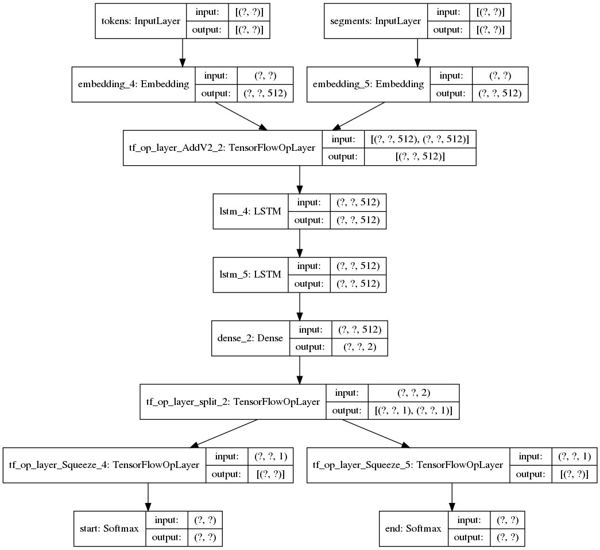

```python
model.compile(loss=tf.keras.losses.sparse_categorical_crossentropy, 
              optimizer=tf.keras.optimizers.Adam(learning_rate=5e-4), 
              metrics=["accuracy"])
```

훈련을 진행해보자. 1Epoch에 2~3분 정도 소요되며, 5Epoch 이상 `val_start_accuracy`가 좋아지지 않으면 훈련을 종료한다.

```python
# early stopping
early_stopping = tf.keras.callbacks.EarlyStopping(monitor='val_start_accuracy', patience=5)
# save weights
save_weights = tf.keras.callbacks.ModelCheckpoint(os.path.join(data_dir, "korquad_lstm.hdf5"), monitor='val_start_accuracy', verbose=1, save_best_only=True, mode='max', save_freq='epoch', save_weights_only=True)

history = model.fit(train_inputs, train_labels, epochs=20, batch_size=128, validation_data=(dev_inputs, dev_labels), callbacks=[early_stopping, save_weights])
```

```python
# training result
plt.figure(figsize=(16, 4))

plt.subplot(1, 3, 1)
plt.plot(history.history['loss'], 'b-', label='loss')
plt.plot(history.history['val_loss'], 'r--', label='val_loss')
plt.xlabel('Epoch')
plt.legend()

plt.subplot(1, 3, 2)
plt.plot(history.history['start_accuracy'], 'g-', label='start_accuracy')
plt.plot(history.history['val_start_accuracy'], 'k--', label='val_start_accuracy')
plt.xlabel('Epoch')
plt.legend()

plt.subplot(1, 3, 3)
plt.plot(history.history['end_accuracy'], 'b-', label='end_accuracy')
plt.plot(history.history['val_end_accuracy'], 'g--', label='val_end_accuracy')
plt.xlabel('Epoch')
plt.legend()

plt.show()
```

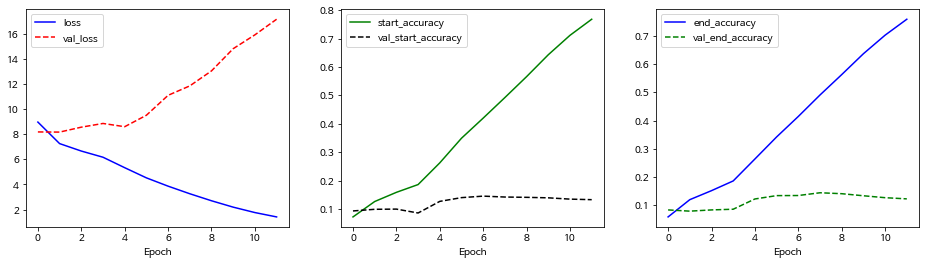

LSTM을 통해 진행했던 결과는 val_loss가 낮아지지 않고, val_accuracy들도 크게 좋아지지 않는 것을 확인할 수 있다. KorQuAD 태스크는 데이터셋만 가지고 사전 준비 없이 학습했을 때 일정 이상 좋아지지 않는다는 것을 알 수 있다. 모델을 다양하게 바꾸어 보아도 결과는 비슷할 것이다. 그렇다면 어떻게 해야 이 태스크를 학습할 수 있을까?

## BERT의 모델 구조

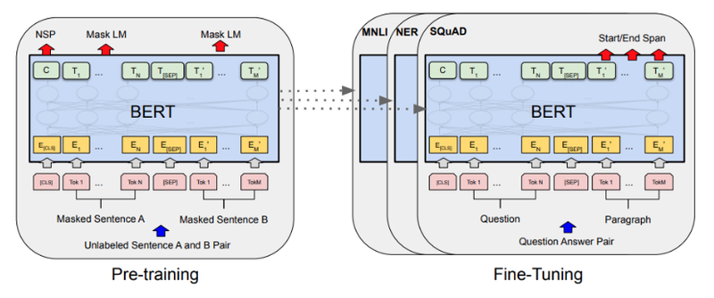

Transformer 모델은 Self-Attention 으로 이루어진 Encoder-Decoder 구조를 가지고 있어서 번역기 모델 형태를 구현하는데 적당했다. BERT는 여기서 Transformer Encoder 구조만을 활용한다. Layer 개수는 12개 이상으로 늘리고, 전체적으로 파라미터 크기가 훨씬 커지긴 했지만 기본적인 구조는 동일하다. BERT 에서는 Decoder가 없는 대신에 Transformer Encoder에 넣었을 때, 출력 모델이 `Mask LM`, `NSP` 라는 2가지 문제를 해결하도록 되어있다.

**Mask LM**

입력 데이터가 `나는 <mask> 먹었다` 일 때 BERT 모델이 `<mask>`가 `밥을` 임을 맞출 수 있도록 하는 언어 모델이다. 이전의 Next Token Prediction Language Model과 대비 시켜 이른바 다음 빈칸에 알맞은 말은 문제를 엄청나게 풀어보는 언어 모델을 구현한 것이다.

**Next Sentence Prediction**

이 경우는 입력데이터가 `나는 밥을 먹었다. <SEP> 그래서 지금 배가 부르다.`가 주어졌을 때 `<SEP>`를 경계로 좌우 두 문장이 순서대로 이어지는 문장이 맞는지를 맞추는 문제이다. BERT 모델은 이 두 문장을 입력으로 받았을 때 첫 번째 바이트에 NSP 결과값을 리턴하게 된다.

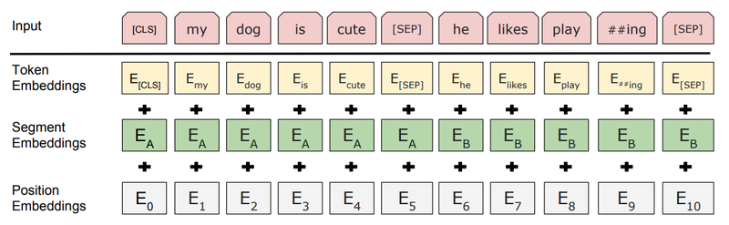

여기서 주목할 것은 바로 위 그림에 나타나는 BERT 모델의 입력 부분이다. 텍스트 입력이 위 그림의 [Input]처럼 주어졌을 때, 실제로 모델에 입력되는 것은 Token, Segment, Position Embedding의 3가지가 더해진 형태이다. 실제로는 그 이후 layer normalization과 dropout이 추가로 적용된다. 각각의 역할은 다음과 같다.

**Token Embedding**

BERT는 텍스트의 tokenizer로 Word Piece model이라는 subword tokenizer를 사용한다. 문자(char) 단위로 임베딩하는 것이 기본이지만, 자주 등장하는 긴 길이의 subword도 하나의 단위로 만들어 준다. 자주 등장하지 않는 단어는 다시 subword 단위로 쪼개진다. 이것은 자주 등장하지 않는 단어가 OOV(Out-of-vocabulary) 처리되는 것을 방지해 주는 장점도 있다. 그래서 최종적으로 Word Piece모델의 각 임베딩이 입력된다.

**Segment Embedding**

기존 Transformer에 없던 독특한 임베딩이다. 이것은 각 단어가 어느 문장에 포함되는지 그 역할을 규정하는 것이다. 이전 스텝에서 KorQuAD 데이터셋을 분석하면서 살펴보았지만, 특히 QA 문제처럼 이 단어가 Question 문장에 속하는지, Context 문장에 속하는지 구분이 필요한 경우에 이 임베딩은 매우 유용하게 사용된다.

**Position Embedding**

이 임베딩은 기존의 Transformer에서 사용되던 position embedding과 동일하다.

```python
# 유틸리티 함수들

def get_pad_mask(tokens, i_pad=0):
    """
    pad mask 계산하는 함수
    :param tokens: tokens (bs, n_seq)
    :param i_pad: id of pad
    :return mask: pad mask (pad: 1, other: 0)
    """
    mask = tf.cast(tf.math.equal(tokens, i_pad), tf.float32)
    mask = tf.expand_dims(mask, axis=1)
    return mask

def get_ahead_mask(tokens, i_pad=0):
    """
    ahead mask 계산하는 함수
    :param tokens: tokens (bs, n_seq)
    :param i_pad: id of pad
    :return mask: ahead and pad mask (ahead or pad: 1, other: 0)
    """
    n_seq = tf.shape(tokens)[1]
    ahead_mask = 1 - tf.linalg.band_part(tf.ones((n_seq, n_seq)), -1, 0)
    ahead_mask = tf.expand_dims(ahead_mask, axis=0)
    pad_mask = get_pad_mask(tokens, i_pad)
    mask = tf.maximum(ahead_mask, pad_mask)
    return mask

@tf.function(experimental_relax_shapes=True)
def gelu(x):
    """
    gelu activation 함수
    :param x: 입력 값
    :return: gelu activation result
    """
    return 0.5 * x * (1 + K.tanh(x * 0.7978845608 * (1 + 0.044715 * x * x)))

def kernel_initializer(stddev=0.02):
    """
    parameter initializer 생성
    :param stddev: 생성할 랜덤 변수의 표준편차
    """
    return tf.keras.initializers.TruncatedNormal(stddev=stddev)

def bias_initializer():
    """
    bias initializer 생성
    """
    return tf.zeros_initializer

class Config(dict):
    """
    json을 config 형태로 사용하기 위한 Class
    :param dict: config dictionary
    """
    __getattr__ = dict.__getitem__
    __setattr__ = dict.__setitem__

    @classmethod
    def load(cls, file):
        """
        file에서 Config를 생성 함
        :param file: filename
        """
        with open(file, 'r') as f:
            config = json.loads(f.read())
            return Config(config)
```

```python
# mode == "embedding" 일 경우 Token Embedding Layer 로 사용되는 layer 클래스입니다. 

class SharedEmbedding(tf.keras.layers.Layer):
    """
    Weighed Shared Embedding Class
    """
    def __init__(self, config, name="weight_shared_embedding"):
        """
        생성자
        :param config: Config 객체
        :param name: layer name
        """
        super().__init__(name=name)

        self.n_vocab = config.n_vocab
        self.d_model = config.d_model
    
    def build(self, input_shape):
        """
        shared weight 생성
        :param input_shape: Tensor Shape (not used)
        """
        with tf.name_scope("shared_embedding_weight"):
            self.shared_weights = self.add_weight(
                "weights",
                shape=[self.n_vocab, self.d_model],
                initializer=kernel_initializer()
            )

    def call(self, inputs, mode="embedding"):
        """
        layer 실행
        :param inputs: 입력
        :param mode: 실행 모드
        :return: embedding or linear 실행 결과
        """
        # mode가 embedding일 경우 embedding lookup 실행
        if mode == "embedding":
            return self._embedding(inputs)
        # mode가 linear일 경우 linear 실행
        elif mode == "linear":
            return self._linear(inputs)
        # mode가 기타일 경우 오류 발생
        else:
            raise ValueError(f"mode {mode} is not valid.")
    
    def _embedding(self, inputs):
        """
        embedding lookup
        :param inputs: 입력
        """
        embed = tf.gather(self.shared_weights, tf.cast(inputs, tf.int32))
        return embed

    def _linear(self, inputs):  # (bs, n_seq, d_model)
        """
        linear 실행
        :param inputs: 입력
        """
        n_batch = tf.shape(inputs)[0]
        n_seq = tf.shape(inputs)[1]
        inputs = tf.reshape(inputs, [-1, self.d_model])  # (bs * n_seq, d_model)
        outputs = tf.matmul(inputs, self.shared_weights, transpose_b=True)
        outputs = tf.reshape(outputs, [n_batch, n_seq, self.n_vocab])  # (bs, n_seq, n_vocab)
        return outputs
```

```python
# 포지션 임베딩
class PositionalEmbedding(tf.keras.layers.Layer):
    """
    Positional Embedding Class
    """
    def __init__(self, config, name="position_embedding"):
        """
        생성자
        :param config: Config 객체
        :param name: layer name
        """
        super().__init__(name=name)
        
        self.embedding = tf.keras.layers.Embedding(config.n_seq, config.d_model, embeddings_initializer=kernel_initializer())

    def call(self, inputs):
        """
        layer 실행
        :param inputs: 입력
        :return embed: positional embedding lookup 결과
        """
        position = tf.cast(tf.math.cumsum(tf.ones_like(inputs), axis=1, exclusive=True), tf.int32)
        embed = self.embedding(position)
        return embed
```

```python
class ScaleDotProductAttention(tf.keras.layers.Layer):
    """
    Scale Dot Product Attention Class
    """
    def __init__(self, name="scale_dot_product_attention"):
        """
        생성자
        :param name: layer name
        """
        super().__init__(name=name)

    def call(self, Q, K, V, attn_mask):
        """
        layer 실행
        :param Q: Q value
        :param K: K value
        :param V: V value
        :param attn_mask: 실행 모드
        :return attn_out: attention 실행 결과
        """
        attn_score = tf.matmul(Q, K, transpose_b=True)
        scale = tf.math.sqrt(tf.cast(tf.shape(K)[-1], tf.float32))
        attn_scale = tf.math.divide(attn_score, scale)
        attn_scale -= 1.e9 * attn_mask
        attn_prob = tf.nn.softmax(attn_scale, axis=-1)
        attn_out = tf.matmul(attn_prob, V)
        return attn_out
```

```python
class MultiHeadAttention(tf.keras.layers.Layer):
    """
    Multi Head Attention Class
    """
    def __init__(self, config, name="multi_head_attention"):
        """
        생성자
        :param config: Config 객체
        :param name: layer name
        """
        super().__init__(name=name)

        self.d_model = config.d_model
        self.n_head = config.n_head
        self.d_head = config.d_head

        # Q, K, V input dense layer
        self.W_Q = tf.keras.layers.Dense(config.n_head * config.d_head, kernel_initializer=kernel_initializer(), bias_initializer=bias_initializer())
        self.W_K = tf.keras.layers.Dense(config.n_head * config.d_head, kernel_initializer=kernel_initializer(), bias_initializer=bias_initializer())
        self.W_V = tf.keras.layers.Dense(config.n_head * config.d_head, kernel_initializer=kernel_initializer(), bias_initializer=bias_initializer())
        # Scale Dot Product Attention class
        self.attention = ScaleDotProductAttention(name="self_attention")
        # output dense layer
        self.W_O = tf.keras.layers.Dense(config.d_model, kernel_initializer=kernel_initializer(), bias_initializer=bias_initializer())

    def call(self, Q, K, V, attn_mask):
        """
        layer 실행
        :param Q: Q value
        :param K: K value
        :param V: V value
        :param attn_mask: 실행 모드
        :return attn_out: attention 실행 결과
        """
        # reshape Q, K, V, attn_mask
        batch_size = tf.shape(Q)[0]
        Q_m = tf.transpose(tf.reshape(self.W_Q(Q), [batch_size, -1, self.n_head, self.d_head]), [0, 2, 1, 3])  # (bs, n_head, Q_len, d_head)
        K_m = tf.transpose(tf.reshape(self.W_K(K), [batch_size, -1, self.n_head, self.d_head]), [0, 2, 1, 3])  # (bs, n_head, K_len, d_head)
        V_m = tf.transpose(tf.reshape(self.W_V(V), [batch_size, -1, self.n_head, self.d_head]), [0, 2, 1, 3])  # (bs, n_head, K_len, d_head)
        attn_mask_m = tf.expand_dims(attn_mask, axis=1)
        # Scale Dot Product Attention with multi head Q, K, V, attn_mask
        attn_out = self.attention(Q_m, K_m, V_m, attn_mask_m)  # (bs, n_head, Q_len, d_head)
        # transpose and liner
        attn_out_m = tf.transpose(attn_out, perm=[0, 2, 1, 3])  # (bs, Q_len, n_head, d_head)
        attn_out = tf.reshape(attn_out_m, [batch_size, -1, config.n_head * config.d_head])  # (bs, Q_len, d_model)
        attn_out = self.W_O(attn_out) # (bs, Q_len, d_model)

        return attn_out
```

```python
class PositionWiseFeedForward(tf.keras.layers.Layer):
    """
    Position Wise Feed Forward Class
    """
    def __init__(self, config, name="feed_forward"):
        """
        생성자
        :param config: Config 객체
        :param name: layer name
        """
        super().__init__(name=name)

        self.W_1 = tf.keras.layers.Dense(config.d_ff, activation=gelu, kernel_initializer=kernel_initializer(), bias_initializer=bias_initializer())
        self.W_2 = tf.keras.layers.Dense(config.d_model, kernel_initializer=kernel_initializer(), bias_initializer=bias_initializer())

    def call(self, inputs):
        """
        layer 실행
        :param inputs: inputs
        :return ff_val: feed forward 실행 결과
        """
        ff_val = self.W_2(self.W_1(inputs))
        return ff_val
```

```python
class EncoderLayer(tf.keras.layers.Layer):
    """
    Encoder Layer Class
    """
    def __init__(self, config, name="encoder_layer"):
        """
        생성자
        :param config: Config 객체
        :param name: layer name
        """
        super().__init__(name=name)

        self.self_attention = MultiHeadAttention(config)
        self.norm1 = tf.keras.layers.LayerNormalization(epsilon=config.layernorm_epsilon)

        self.ffn = PositionWiseFeedForward(config)
        self.norm2 = tf.keras.layers.LayerNormalization(epsilon=config.layernorm_epsilon)

        self.dropout = tf.keras.layers.Dropout(config.dropout)
 
    def call(self, enc_embed, self_mask):
        """
        layer 실행
        :param enc_embed: enc_embed 또는 이전 EncoderLayer의 출력
        :param self_mask: enc_tokens의 pad mask
        :return enc_out: EncoderLayer 실행 결과
        """
        self_attn_val = self.self_attention(enc_embed, enc_embed, enc_embed, self_mask)
        norm1_val = self.norm1(enc_embed + self.dropout(self_attn_val))

        ffn_val = self.ffn(norm1_val)
        enc_out = self.norm2(norm1_val + self.dropout(ffn_val))

        return enc_out
```

```python
class BERT(tf.keras.layers.Layer):
    """
    BERT Class
    """
    def __init__(self, config, name="bert"):
        """
        생성자
        :param config: Config 객체
        :param name: layer name
        """
        super().__init__(name=name)

        self.i_pad = config.i_pad
        self.embedding = SharedEmbedding(config)
        self.position = PositionalEmbedding(config)
        self.segment = tf.keras.layers.Embedding(2, config.d_model, embeddings_initializer=kernel_initializer())
        self.norm = tf.keras.layers.LayerNormalization(epsilon=config.layernorm_epsilon)
        
        self.encoder_layers = [EncoderLayer(config, name=f"encoder_layer_{i}") for i in range(config.n_layer)]

        self.dropout = tf.keras.layers.Dropout(config.dropout)

    def call(self, enc_tokens, segments):
        """
        layer 실행
        :param enc_tokens: encoder tokens
        :param segments: token segments
        :return logits_cls: CLS 결과 logits
        :return logits_lm: LM 결과 logits
        """
        enc_self_mask = get_pad_mask(enc_tokens, self.i_pad)

        enc_embed = self.get_embedding(enc_tokens, segments)

        enc_out = self.dropout(enc_embed)
        for encoder_layer in self.encoder_layers:
            enc_out = encoder_layer(enc_out, enc_self_mask)

        logits_cls = enc_out[:,0]
        logits_lm = enc_out
        return logits_cls, logits_lm
    
    def get_embedding(self, tokens, segments):
        """
        token embedding, position embedding lookup
        :param tokens: 입력 tokens
        :param segments: 입력 segments
        :return embed: embedding 결과
        """
        embed = self.embedding(tokens) + self.position(tokens) + self.segment(segments)
        embed = self.norm(embed)
        return embed
```

## BERT 모델을 이용한 도전

이제 BERT 모델을 활용하여, LSTM으로 풀어보았던 KorQuAD 태스크를 다시 학습해 보자. 아마도 데이터셋 구성은 동일하기 때문에 별도의 추가조치가 필요 없을 것이다. 모델의 차이만 비교해 보기 위해 일부러 두 모델이 사용하는 Tokenizer를 동일하게 구성하였다. 아래는 BERT 레이어에 Fully Connected layer를 붙어 KorQuAD용으로 finetune하기 위한 모델 클래스이다.

```python
class BERT4KorQuAD(tf.keras.Model):
    def __init__(self, config):
        super().__init__(name='BERT4KorQuAD')

        self.bert = BERT(config)
        self.dense = tf.keras.layers.Dense(2)
    
    def call(self, enc_tokens, segments):
        logits_cls, logits_lm = self.bert(enc_tokens, segments)

        hidden = self.dense(logits_lm) # (bs, n_seq, 2)
        start_logits, end_logits = tf.split(hidden, 2, axis=-1)  # (bs, n_seq, 1), (bs, n_seq, 1)

        start_logits = tf.squeeze(start_logits, axis=-1)
        start_outputs = tf.keras.layers.Softmax(name="start")(start_logits)

        end_logits = tf.squeeze(end_logits, axis=-1)
        end_outputs = tf.keras.layers.Softmax(name="end")(end_logits)

        return start_outputs, end_outputs
```

```python
# hyperparameter 설정
config = Config({"d_model": 256, "n_head": 4, "d_head": 64, "dropout": 0.1, "d_ff": 1024, "layernorm_epsilon": 0.001, "n_layer": 3, "n_seq": 384, "n_vocab": 0, "i_pad": 0})
config.n_vocab = len(vocab)
config.i_pad = vocab.pad_id()
config

bert_batch_size = 32 

train_dataset = tf.data.Dataset.from_tensor_slices((train_inputs, train_labels)).shuffle(10000).batch(bert_batch_size)
dev_dataset = tf.data.Dataset.from_tensor_slices((dev_inputs, dev_labels)).batch(bert_batch_size)

model = BERT4KorQuAD(config)
```

BERT는 pretrained 모델을 활용하는 데 의의가 있지만, 실습을 위해 pretraining을 수행하기에는 시간상 한계가 있기 때문에 우선 20epoch 정도만 학습을 진행해본다.

```python
# train
def train_epoch(model, dataset, loss_fn, acc_fn, optimizer):
    metric_start_loss = tf.keras.metrics.Mean(name='start_loss')
    metric_end_loss = tf.keras.metrics.Mean(name='end_loss')
    metric_start_acc = tf.keras.metrics.Mean(name='start_acc')
    metric_end_acc = tf.keras.metrics.Mean(name='end_acc')

    p_bar = tqdm(dataset)
    for batch, ((enc_tokens, segments), (start_labels, end_labels)) in enumerate(p_bar):
        with tf.GradientTape() as tape:
            start_outputs, end_outputs = model(enc_tokens, segments)

            start_loss = loss_fn(start_labels, start_outputs)
            end_loss = loss_fn(end_labels, end_outputs)
            loss = start_loss + end_loss

            start_acc = acc_fn(start_labels, start_outputs)
            end_acc = acc_fn(end_labels, end_outputs)
        gradients = tape.gradient(loss, model.trainable_variables)
        optimizer.apply_gradients(zip(gradients, model.trainable_variables))

        metric_start_loss(start_loss)
        metric_end_loss(end_loss)
        metric_start_acc(start_acc)
        metric_end_acc(end_acc)
        if batch % 10 == 9:
            p_bar.set_description(f'loss: {metric_start_loss.result():0.4f}, {metric_end_loss.result():0.4f}, acc: {metric_start_acc.result():0.4f}, {metric_end_acc.result():0.4f}')
    p_bar.close()

    return metric_start_loss.result(), metric_end_loss.result(), metric_start_acc.result(), metric_end_acc.result()
```

```python
# evaluation
def eval_epoch(model, dataset, loss_fn, acc_fn):
    metric_start_loss = tf.keras.metrics.Mean(name='start_loss')
    metric_end_loss = tf.keras.metrics.Mean(name='end_loss')
    metric_start_acc = tf.keras.metrics.Mean(name='start_acc')
    metric_end_acc = tf.keras.metrics.Mean(name='end_acc')

    for batch, ((enc_tokens, segments), (start_labels, end_labels)) in enumerate(dataset):
        start_outputs, end_outputs = model(enc_tokens, segments)

        start_loss = loss_fn(start_labels, start_outputs)
        end_loss = loss_fn(end_labels, end_outputs)

        start_acc = acc_fn(start_labels, start_outputs)
        end_acc = acc_fn(end_labels, end_outputs)

        metric_start_loss(start_loss)
        metric_end_loss(end_loss)
        metric_start_acc(start_acc)
        metric_end_acc(end_acc)

    return metric_start_loss.result(), metric_end_loss.result(), metric_start_acc.result(), metric_end_acc.result()
```

```python
loss_fn = tf.keras.losses.sparse_categorical_crossentropy
acc_fn = tf.keras.metrics.sparse_categorical_accuracy

optimizer = tf.keras.optimizers.Adam(learning_rate=5e-4)

best_acc = .0
patience = 0
for epoch in range(20):
    train_epoch(model, train_dataset, loss_fn, acc_fn, optimizer)
    start_loss, end_loss, start_acc, end_acc = eval_epoch(model, dev_dataset, loss_fn, acc_fn)
    print(f'eval {epoch} >> loss: {start_loss:0.4f}, {end_loss:0.4f}, acc: {start_acc:0.4f}, {end_acc:0.4f}')
    acc = start_acc + end_acc
    if best_acc < acc:
        patience = 0
        best_acc = acc
        model.save_weights(os.path.join(data_dir, "korquad_bert_none_pretrain.hdf5"))
        print(f'save best model')
    else:
        patience += 1
    if 5 <= patience:
        print(f'early stopping')
        break
```

결과는 앞의 LSTM과 큰 차이가 없었다. 다음은 pretrained model을 활용했을 때 결과를 알아보자.

## 프로젝트 : Pretrained model의 활용

### (1) Pretrained Model 로딩하기

---

```python
checkpoint_file = os.path.join(model_dir, 'bert_pretrain_32000.hdf5')

model = BERT4KorQuAD(config)

if os.path.exists(checkpoint_file):
    #  pretrained model 을 로드하기 위해 먼저 모델이 생성되어 있어야 한다.
    enc_tokens = np.random.randint(0, len(vocab), (4, 10))
    segments = np.random.randint(0, 2, (4, 10))
    model(enc_tokens, segments)
    
    # checkpoint 파일로부터 필요한 layer를 불러온다. 
    model.load_weights(os.path.join(model_dir, "bert_pretrain_32000.hdf5"), by_name=True)

    model.summary()
else:
    print('NO Pretrained Model')
```

### (2) Pretrained model finetune 하기

---

### (3) Inference 수행하기

---

```python
train_history = []
val_history = []
for epoch in range(20):
    train_start_loss, train_end_loss, train_start_acc, train_end_acc = train_epoch(model, train_dataset, loss_fn, acc_fn, optimizer)
    start_loss, end_loss, start_acc, end_acc = eval_epoch(model, dev_dataset, loss_fn, acc_fn)
    train_history.append([train_start_loss, train_end_loss, train_start_acc, train_end_acc])
    val_history.append([start_loss, end_loss, start_acc, end_acc])
    print(f'eval {epoch} >> loss: {start_loss:0.4f}, {end_loss:0.4f}, acc: {start_acc:0.4f}, {end_acc:0.4f}')
    acc = start_acc + end_acc
    if best_acc < acc:
        patience = 0
        best_acc = acc
        model.save_weights(os.path.join(data_dir, "korquad_bert_pretrain.hdf5"))
        print(f'save best model')
    else:
        patience += 1
    if 5 <= patience:
        print(f'early stopping')
        break
```

```python
train_loss = []
train_start_acc = []
train_end_acc = []
for a, b, c, d in train_history:
    train_loss.append(a+b)
    train_start_acc.append(c)
    train_end_acc.append(d)

val_loss = []
val_start_acc = []
val_end_acc = []
for a, b, c, d in val_history:
    val_loss.append(a+b)
    val_start_acc.append(c)
    val_end_acc.append(d)

# training result
plt.figure(figsize=(16, 4))

plt.subplot(1, 3, 1)
plt.plot(train_loss, 'b-', label='loss')
plt.plot(val_loss, 'r--', label='val_loss')
plt.xlabel('Epoch')
plt.legend()

plt.subplot(1, 3, 2)
plt.plot(train_start_acc, 'g-', label='start_accuracy')
plt.plot(val_start_acc, 'k--', label='val_start_accuracy')
plt.xlabel('Epoch')
plt.legend()

plt.subplot(1, 3, 3)
plt.plot(train_end_acc, 'b-', label='end_accuracy')
plt.plot(val_end_acc, 'g--', label='val_end_accuracy')
plt.xlabel('Epoch')
plt.legend()

plt.show()
```

## 회고록

- 말로만 듣던 BERT에 대해 드디어 경험해볼 수 있었다. 성능 만큼이나 모델 구조도 복잡한 것 같다.
- Pretrained Model을 사용해서 학습을 시켜보았지만 그렇지 않은 모델과 val_loss는 큰 차이가 없었다. weight를 불러왔을 땐 정상적으로 불러와진 걸 확인할 수 있었지만 학습 양상의 큰 차이가 없는 원인은 모르겠다.
- pretrained Model과 그렇지 않은 모델의 epoch 당 loss와 accuracy를 비교해봤을 때, pretrained Model의 train loss와 train accuracy가 더 빨리 학습되는 것을 확인할 수 있었다. train data에 대해서는 pretrained Model이 효과가 있었으나, validation data를 맞추는 데에는 아직 부족했던 것 같다.
- 추론 결과를 확인해보니 날짜나 숫자에 관련된 정답은 어느 정도 잘 예측하였지만, 그 외에는 정답이 포함된 문장 형식으로 나와서 정확히 정답 단어만 찾아내지는 못하였다.
