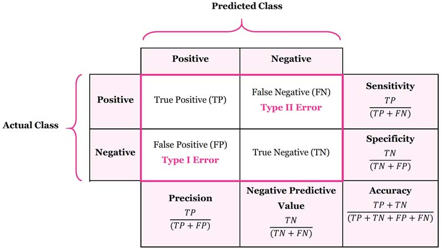
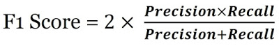

# 2. Iris의 세 가지 품종, 분류해볼 수 있겠어요?

### 학습 목표

---

- scikit-learn에 내장되어 있는 예제 데이터셋의 종류를 알고 활용할 수 있다.
- scikit-learn에 내장되어 있는 분류 모델들을 학습시키고 예측해 볼 수 있다.
- 모델의 성능을 평가하는 지표의 종류에 대해 이해하고, 활용 및 확인해 볼 수 있다.
- Decision Tree, SGD, RandomForest, 로지스틱 회귀 모델을 활용해서 간단하게 학습 및 예측해 볼 수 있다.
- 데이터셋을 사용해서 스스로 분류 기초 실습을 진행할 수 있다.

## 1. 붓꽃 분류 문제


### (1) 어떤 데이터를 사용할 것인가?

---

붓꽃 데이터는 머신러닝에서 많이 사용되는 라이브러리 중 하나인 **사이킷런(scikit-learn)**에 내장되어 있는 데이터이다.

[사이킷런 데이터셋](https://scikit-learn.org/stable/datasets.html)

사이킷런에서는 두 가지 데이터셋을 제공한다

- 비교적 간단하고 작은 데이터셋인 Toy datasets
- 복잡하고 현실 세계를 반영한 Real world datasets

### (2) 데이터 준비

---

```python
# datasets 불러오기
from sklearn.datasets import load_iris

iris = load_iris()
print(type(dir(iris))) # dir()는 객체가 어떤 변수와 메서드를 가지고 있는지 나열함

# 메서드 확인
iris.keys()

iris_data = iris.data # iris.method 로 해당 메소드를 불러올 수 있다.

# shape는 배열의 형상 정보를 출력
print(iris_data.shape)

# 각 label의 이름
iris.target_names

# 데이터셋에 대한 설명
print(iris.DESCR)

# 각 feature의 이름
iris.feature_names

# datasets의 저장된 경로
iris.filename

# pandas 불러오기
import pandas as pd

print(pd.__version__) # pandas version 확인

# DataFreame 자료형으로 변환하기
iris_df = pd.DataFrame(data=iris_data, columns=iris.feature_names)
iris_df["label"] = iris.target
```

### (3) train, test 데이터 분리

---

```python
# train_test_split 함수를 이용하여 train set과 test set으로 나누기
from sklearn.model_selection import train_test_split

x_train, x_test, y_train, y_test = train_test_split(iris_data,
                                                    iris_label,
                                                    test_size=0.2,
                                                    random_state=7)

print(f'x_train 개수: {len(x_train)}, x_test 개수: {len(x_test)}')
```

### (4) 모델 학습 및 예측

---

- 사용할 모델
    - [Decision Tree](https://ratsgo.github.io/machine%20learning/2017/03/26/tree/) (의사 결정 트리)
    - [Random Forest](https://medium.com/@deepvalidation/title-3b0e263605de)
    - [Support Vector Machine](https://excelsior-cjh.tistory.com/66?category=918734) (SVM)
    - [Stochastic Gradient Descent](https://scikit-learn.org/stable/modules/sgd.html#sgd) (SGD)
    - [Logisitic Regression](http://hleecaster.com/ml-logistic-regression-concept/) (로지스틱 회귀)

```python
# Decision Tree 사용하기
from sklearn.tree import DecisionTreeClassifier

decision_tree = DecisionTreeClassifier(random_state=32)

print(decision_tree._estimator_type) # decision_tree 의 type 확인

decision_tree.fit(x_train, y_train)
y_pred = decision_tree.predict(x_test)

print(classification_report(y_test, y_pred))
```

```python
# Random Forest
from sklearn.ensemble import RandomForestClassifier

random_forest = RandomForestClassifier(random_state=32)
random_forest.fit(x_train, y_train)
y_pred = random_forest.predict(x_test)

print(classification_report(y_test, y_pred))
```

```python
# Support Vector Machine (SVM)
from sklearn import svm

svm_model = svm.SVC()
svm_model.fit(x_train, y_train)
y_pred = svm_model.predict(x_test)

print(classification_report(y_test, y_pred))
```

```python
# Stochastic Gradient Desecnt(SGD)
from sklearn.linear_model import SGDClassifier

sgd_model = SGDClassifier()
sgd_model.fit(x_train, y_train)
y_pred = sgd_model.predict(x_test)

print(classification_report(y_test, y_pred))
```

```python
# Logisitc Regression
from sklearn.linear_model import LogisticRegression

logistic_model = LogisticRegression(max_iter=200)
logistic_model.fit(x_train, y_train)
y_pred = logistic_model.predict(x_test)

print(classification_report(y_test, y_pred))
```

단순히 라이브러리에서 데이터와 함수를 불러오는 것 만으로도 쉽게 머신러닝 모델을 만들 수 있다.

## 2. 데이터의 불균형으로 인한 정확도의 오류

### (1) 믿을 수 있는 데이터인가?

---

사이킷런 라이브러리를 이용하여 만든 머신러닝 모델들은 모두 괜찮은 정확도를 보여주었다. 그러나 이 데이터가 정말로 믿을 수 있는, 유효한 데이터인가?

예를 들어, test set의 정답 레이블이 [0, 0, 0, 0, 1, 0, 0, 0, 0, 0] 이라고 할 때, 모델의 학습이 잘못되어서 제대로 판단할 수 없지만 출력값은 0으로 처리한다고 하면 이 모델의 정확도는 90%라고 할 수 있을까?

이것을 판단하기 위해서 Confusion Matrix(혼동 행렬)에 대해 알아보자.

### (2) Confusion Matrix

---

혼동 행렬은 주로 알고리즘 분류 알고리즘의 성능을 시각화 할 수 있는 표이다. 따라서 해당 모델이 True를 얼만큼 True라고 판단했는지, False를 얼만큼 False라고 판단했는지 쉽게 확인할 수 있다.



알고리즘의 성능을 판단할 때에는 어디에 적용되는 알고리즘인가를 먼저 생각한 후에 판단할 수 있다. 예를 들어, 스팸 메일을 분류한다고 할 때, 스팸 메일은 정상 메일로 분류되어도 괜찮지만, 정상 메일은 스팸 메일로 분류되어서는 안된다. 또는 환자의 암을 진단할 때, 음성을 양성으로 진단하는 것 보다 양성을 음성으로 진단하는 것은 큰 문제를 일으킬 수 있다. 따라서 상황에 맞는 지표를 활용할 줄 알아야 한다.

추가로, F1 Score 라는 지표도 있는데, 해당 지표는 Precision과 Recall(Sensitivity)의 조화평균이며, Precision과 Recall이 얼마나 균형을 이루는지 쉽게 알 수 있는 지표이다.



## 3. 다른 모델 분류해보기

이번에는 사이킷런에 있는 다른 데이터셋을 공부한 모델을 이용하여 학습시켜보고 결과를 예측해보자.

### (1) digits 분류하기

---

```python
# (1) 필요한 모듈 import
from sklearn.datasets import load_digits
from sklearn.model_selection import train_test_split
from sklearn.tree import DecisionTreeClassifier
from sklearn.ensemble import RandomForestClassifier
from sklearn import svm
from sklearn.linear_model import SGDClassifier
from sklearn.linear_model import LogisticRegression
from sklearn.metrics import classification_report
from sklearn.metrics import recall_score

# (2) 데이터 준비
digits = load_digits()
digits_data = digits.data
digits_label = digits.target

# (3) train, test 데이터 분리
x_train, x_test, y_train, y_test = train_test_split(digits_data, 
                                                    digits_label, 
                                                    test_size=0.2, 
                                                    random_state=7)

# 정규화
x_train_norm, x_test_norm = x_train / np.max(x_train), x_test / np.max(x_test)

# (4) 모델 학습 및 예측
# Decision Tree
decision_tree = DecisionTreeClassifier(random_state=32)
decision_tree.fit(x_train_norm, y_train)
decision_tree_y_pred = decision_tree.predict(x_test_norm)
print(classification_report(y_test, decision_tree_y_pred))

# RandomForest
random_forest = RandomForestClassifier(random_state=32)
random_forest.fit(x_train_norm, y_train)
random_forest_y_pred = random_forest.predict(x_test_norm)
print(classification_report(y_test, random_forest_y_pred))

# SVM
svm_model = svm.SVC()
svm_model.fit(x_train_norm, y_train)
svm_y_pred = svm_model.predict(x_test_norm)
print(classification_report(y_test, svm_y_pred))

# SGD
sgd_model = SGDClassifier()
sgd_model.fit(x_train_norm, y_train)
sgd_y_pred = sgd_model.predict(x_test_norm)
print(classification_report(y_test, sgd_y_pred))

# Logistic Regression
logistic_model = LogisticRegression(max_iter=256)
logistic_model.fit(x_train_norm, y_train)
logistic_y_pred = logistic_model.predict(x_test_norm)
print(classification_report(y_test, logistic_y_pred))
```

- 예상 결과

    이미지 파일은 2차원 배열이기 때문에 SVM을 이용하여 한 차원 늘려서 Date를 Clustering 한다면 가장 좋은 결과를 얻을 것이다.

    숫자 인식은 해당 숫자를 정확한 숫자로 인식한 결과값만이 의미가 있다고 생각하기 때문에 Recall 값을 비교하여 성능을 판단할 것이다.

- 실제 결과

    ```python
    print('Decision Tree       : {}'.format(recall_score(y_test, decision_tree_y_pred, average='weighted')))
    print('Random Forest       : {}'.format(recall_score(y_test, random_forest_y_pred, average='weighted')))
    print('SVM                 : {}'.format(recall_score(y_test, svm_y_pred, average='weighted')))
    print('SGD                 : {}'.format(recall_score(y_test, sgd_y_pred, average='weighted')))
    print('Logistic Regression : {}'.format(recall_score(y_test, logistic_y_pred, average='weighted')))

    Decision Tree       : 0.8555555555555555
    Random Forest       : 0.9638888888888889
    SVM                 : 0.9888888888888889
    SGD                 : 0.9472222222222222
    Logistic Regression : 0.9611111111111111
    ```

    예상한 것과 마찬가지로 SVM이 가장 좋은 성능을 나타내는 것으로 볼 수 있다.

### (2) wine 분류하기

---

```python
# (1) 필요한 모듈 import
from sklearn.datasets import load_wine
from sklearn.model_selection import train_test_split
from sklearn.tree import DecisionTreeClassifier
from sklearn.ensemble import RandomForestClassifier
from sklearn import svm
from sklearn.linear_model import SGDClassifier
from sklearn.linear_model import LogisticRegression
from sklearn.metrics import classification_report
from sklearn.metrics import recall_score

# (2) 데이터 준비
wines = load_wine()
wines_data = wines.data
wines_label = wines.target

# (3) train, test 데이터 분리
x_train, x_test, y_train, y_test = train_test_split(wines_data, 
                                                    wines_label, 
                                                    test_size=0.2, 
                                                    random_state=7)

# (4) 모델 학습 및 예측
# Decision Tree
decision_tree = DecisionTreeClassifier(random_state=32)
decision_tree.fit(x_train, y_train)
decision_tree_y_pred = decision_tree.predict(x_test)
print(classification_report(y_test, decision_tree_y_pred))

# RandomForest
random_forest = RandomForestClassifier(random_state=32)
random_forest.fit(x_train, y_train)
random_forest_y_pred = random_forest.predict(x_test)
print(classification_report(y_test, random_forest_y_pred))

# SVM
svm_model = svm.SVC()
svm_model.fit(x_train, y_train)
svm_y_pred = svm_model.predict(x_test)
print(classification_report(y_test, svm_y_pred))

# SGD
sgd_model = SGDClassifier()
sgd_model.fit(x_train, y_train)
sgd_y_pred = sgd_model.predict(x_test)
print(classification_report(y_test, sgd_y_pred))

# Logistic Regression
logistic_model = LogisticRegression(max_iter=4096)
logistic_model.fit(x_train, y_train)
logistic_y_pred = logistic_model.predict(x_test)
print(classification_report(y_test, logistic_y_pred))
```

- 예상 결과

    와인은 여러가지 특징에 따라 종류가 나뉘어지기 때문에 Decision Tree 또는 Random Forest가 가장 좋은 성능을 나타낼 것으로 예상된다. 아무래도 발전된 모델인 Random Forest 쪽이 더 좋은 결과가 나올 것 같다.

    와인도 숫자와 마찬가지로 정확하게 분류한 값만이 의미가 있다고 생각하기 때문에 Recall 값을 비교하여 성능을 판단할 것이다.

- 실제 결과

    ```python
    print('Decision Tree       : {}'.format(recall_score(y_test, decision_tree_y_pred, average='weighted')))
    print('Random Forest       : {}'.format(recall_score(y_test, random_forest_y_pred, average='weighted')))
    print('SVM                 : {}'.format(recall_score(y_test, svm_y_pred, average='weighted')))
    print('SGD                 : {}'.format(recall_score(y_test, sgd_y_pred, average='weighted')))
    print('Logistic Regression : {}'.format(recall_score(y_test, logistic_y_pred, average='weighted')))

    Decision Tree       : 0.9444444444444444
    Random Forest       : 1.0
    SVM                 : 0.6111111111111112
    SGD                 : 0.5277777777777778
    Logistic Regression : 0.9722222222222222
    ```

    예상한 것과 마찬가지로 Random Forest가 가장 우수한 성능을 보여준다. 아무래도 Feature에 따라 와인의 종류가 확실하게 구분될 수 있기 때문인 것 같다.

    ### (3) breast cancer 분류하기

    ---

    ```python
    # (1) 필요한 모듈 import
    from sklearn.datasets import load_breast_cancer
    from sklearn.model_selection import train_test_split
    from sklearn.tree import DecisionTreeClassifier
    from sklearn.ensemble import RandomForestClassifier
    from sklearn import svm
    from sklearn.linear_model import SGDClassifier
    from sklearn.linear_model import LogisticRegression
    from sklearn.metrics import classification_report
    from sklearn.metrics import recall_score

    # (2) 데이터 준비
    breast_cancer = load_breast_cancer()
    breast_cancer_data = breast_cancer.data
    breast_cancer_label = breast_cancer.target

    # (3) train, test 데이터 분리
    x_train, x_test, y_train, y_test = train_test_split(breast_cancer_data, 
                                                        breast_cancer_label, 
                                                        test_size=0.2, 
                                                        random_state=7)

    # (4) 모델 학습 및 예측
    # Decision Tree
    decision_tree = DecisionTreeClassifier(random_state=32)
    decision_tree.fit(x_train, y_train)
    decision_tree_y_pred = decision_tree.predict(x_test)
    print(classification_report(y_test, decision_tree_y_pred))

    # RandomForest
    random_forest = RandomForestClassifier(random_state=32)
    random_forest.fit(x_train, y_train)
    random_forest_y_pred = random_forest.predict(x_test)
    print(classification_report(y_test, random_forest_y_pred))

    # SVM
    svm_model = svm.SVC()
    svm_model.fit(x_train, y_train)
    svm_y_pred = svm_model.predict(x_test)
    print(classification_report(y_test, svm_y_pred))

    # SGD
    sgd_model = SGDClassifier()
    sgd_model.fit(x_train, y_train)
    sgd_y_pred = sgd_model.predict(x_test)
    print(classification_report(y_test, sgd_y_pred))

    # Logistic Regression
    logistic_model = LogisticRegression(max_iter=4096)
    logistic_model.fit(x_train, y_train)
    logistic_y_pred = logistic_model.predict(x_test)
    print(classification_report(y_test, logistic_y_pred))
    ```

    - 예상 결과

        유방암의 경우에는 feature의 갯수가 많아서 Decision Tree 또는 Random Forest가 우수한 성능을 나타낼 것으로 예상된다. 또한 양성/음성 이진 분류 문제이기 때문에 Logistic Regression도 좋은 성능을 나타낼 것으로 예상된다.

        유방암은 양성을 양성으로 판단한 값이 중요하지만, 음성을 음성으로 판단한 값도 중요하기 때문에 accuracy를 기준으로 성능을 판단할 것이다. 

    - 실제 결과

        ```python
        print('Decision Tree       : {}'.format(recall_score(y_test, decision_tree_y_pred, average='weighted')))
        print('Random Forest       : {}'.format(recall_score(y_test, random_forest_y_pred, average='weighted')))
        print('SVM                 : {}'.format(recall_score(y_test, svm_y_pred, average='weighted')))
        print('SGD                 : {}'.format(recall_score(y_test, sgd_y_pred, average='weighted')))
        print('Logistic Regression : {}'.format(recall_score(y_test, logistic_y_pred, average='weighted')))

        Decision Tree       : 0.9122807017543859
        Random Forest       : 1.0
        SVM                 : 0.9035087719298246
        SGD                 : 0.9035087719298246
        Logistic Regression : 0.9473684210526315
        ```

        예상한 것과 마찬가지로 Random Forest가 가장 우수한 성능을 보여준다. 아무래도 Feature의 종류가 많아 이진 분류 문제에 정확도를 더 높여줄 수 있었던 것 같다. 물론 Logisitc Regression도 충분히 좋은 성능을 보여주었다.

---

이번엔 머신러닝의 가장 기본적인 모델들에 대해서 학습하였다. 라이브러리를 이용해서 직접 간단한 학습 모델도 구현해보면서 각 모델들에 대한 이해력이 높아졌다. 모델의 성능을 나타낼 때, 정확도가 중요한 것은 알고 있었지만 성능을 나타내는 지표에 이렇게 많은 지표들이 있다는 것은 처음 알게되었다. 생각해보면 당연한 사실이어서 개념이 어렵지는 않았다. 앞으로도 이 정도의 학습량이라면 충분히 문제없이 따라갈 수 있을 것 같다.
