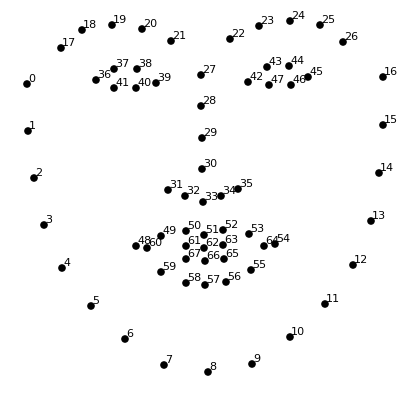

# 3. 카메라 스티커 앱 만들기 첫걸음

### 학습 목표

---

- 카메라앱 만들기를 통해 동영상 처리, 검출, 키포인트 추정, 추적, 카메라 원근 의 기술을 다룬다.
- 간단한 스티커부터 시작해서 각도 변화가 가능하고 거리 변화에 강건한 스티커 까지 만들 수 있다.
- 얼굴인식 카메라의 흐름을 이해할 수 있다.
- dlib 라이브러리를 사용할 수 있다.
- 이미지 배열의 인덱싱 예외 처리를 할 수 있다.

## 1. 카메라 스티커 앱 만들기

스티커를 세밀하고 자연스럽게 적용하기 위해서는 눈, 코, 입, 귀와 같은 얼굴 각각의 위치를 아는 것이 중요하다. 이들을 찾아내는 기술을 **랜드마크**(landmark)또는 **조정**(alignment)이라고 한다. 조금 더 큰 범위로는 *keypoint detection* 이라고 부른다.

1. 얼굴이 포함된 사진을 준비한다.
2. 사진으로무터 **얼굴 영역**(face landmark)를 찾아낸다. (landmark를 찾기 위해서는 얼굴의 **bounding box**를 먼저 찾아야 한다.)
3. 찾아진 영역으로부터 머리에 왕관 스티커를 붙여넣는다.

### (1) 사진 준비하기

---

```bash
# 관련 패키지 설치
pip install opencv-python
pip install cmake
pip install dlib
```

```python
# 필요 라이브러리 import
import cv2
import matplotlib.pyplot as plt
import numpy as np
print("🌫🛸")

# opencv로 이미지 읽어오기
import os
my_image_path = os.getenv('HOME')+'/aiffel/camera_sticker/images/image.jpg'
img_bgr = cv2.imread(my_image_path)    #- OpenCV로 이미지를 읽어서
img_bgr = cv2.resize(img_bgr, (480, 640))    # 640x360의 크기로 Resize
img_show = img_bgr.copy()      #- 출력용 이미지 별도 보관
plt.imshow(img_bgr)
plt.show()

# plt.imshow 이전에 RGB 이미지로 변경
# opencv는 RGB 대신 BGR을 사용하기 때문에 RGB로 변경해주어야 한다.
img_rgb = cv2.cvtColor(img_bgr, cv2.COLOR_BGR2RGB)
plt.imshow(img_rgb)
plt.show()
```

### (2) 얼굴 검출 (Face Detection)

---

Object detection 기술을 이용해서 얼굴의 위치를 찾는다. dlib 의 face detector는 HOG(Histogram of Oriented Gradient) feature를 사용해서 SVM(Support Vector Machine)의 sliding window로 얼굴을 찾는다.

```python
# hog detector 선언
import dlib
detector_hog = dlib.get_frontal_face_detector()

# bounding box 추출
img_rgb = cv2.cvtColor(img_bgr, cv2.COLOR_BGR2RGB)
dlib_rects = detector_hog(img_rgb, 1)   #- (image, num of img pyramid)

# 찾은 얼굴영역 출력
print(dlib_rects)   # 찾은 얼굴영역 좌표
for dlib_rect in dlib_rects:
    l = dlib_rect.left()
    t = dlib_rect.top()
    r = dlib_rect.right()
    b = dlib_rect.bottom()
    cv2.rectangle(img_show, (l,t), (r,b), (0,255,0), 2, lineType=cv2.LINE_AA)
img_show_rgb =  cv2.cvtColor(img_show, cv2.COLOR_BGR2RGB)
plt.imshow(img_show_rgb)
plt.show()
```

### (3) 얼굴 랜드마크 (Face Landmark)

---

이목구비의 위치를 추론하는 것을 face landmark localization 기술이라고 한다. face landmark는 detection의 결과물인 bounding box로 잘라낸(crop) 얼굴 이미지를 이용한다.

- Object keypoint estimation 알고리즘 : 객체 내부의 점을 찾는 기술
    1. top-down : bounding box를 찾고 box 내부의 keypoint를 예측
    2. bottom-up : 이미지 전체의 keypoint를 먼저 찾고 point 관계를 이용해 군집화 해서 box 생성

Dlib landmark localization



```bash
# Dlib 제공 모델 사용

wget http://dlib.net/files/shape_predictor_68_face_landmarks.dat.bz2
mv shape_predictor_68_face_landmarks.dat.bz2 ~/aiffel/camera_sticker/models
cd ~/aiffel/camera_sticker && bzip2 -d ./models/shape_predictor_68_face_landmarks.dat.bz2
```

```python
# landmark 모델 불러오기

import os
model_path = os.getenv('HOME')+'/aiffel/camera_sticker/models/shape_predictor_68_face_landmarks.dat'
landmark_predictor = dlib.shape_predictor(model_path)

# landmark 찾기
list_landmarks = []
for dlib_rect in dlib_rects:
    points = landmark_predictor(img_rgb, dlib_rect)
    list_points = list(map(lambda p: (p.x, p.y), points.parts()))
    list_landmarks.append(list_points)

print(len(list_landmarks[0]))

# landmark 출력
for landmark in list_landmarks:
    for idx, point in enumerate(list_points):
        cv2.circle(img_show, point, 2, (0, 255, 255), -1) # yellow

img_show_rgb = cv2.cvtColor(img_show, cv2.COLOR_BGR2RGB)
plt.imshow(img_show_rgb)
plt.show()

```

### (4) 스티커 적용하기

---

적절한 랜드마크를 기준으로 하여 스티커 이미지를 구현한다.

```bash
# 좌표 확인
for dlib_rect, landmark in zip(dlib_rects, list_landmarks):
    print (landmark[30]) # nose center index : 30
    x = landmark[30][0]
    y = landmark[30][1] - dlib_rect.width()//2
    w = dlib_rect.width()
    h = dlib_rect.width()
    print ('(x,y) : (%d,%d)'%(x,y))
    print ('(w,h) : (%d,%d)'%(w,h))

# 스티커 이미지 Read
import os
sticker_path = os.getenv('HOME')+'/aiffel/camera_sticker/images/king.png'
img_sticker = cv2.imread(sticker_path)
img_sticker = cv2.resize(img_sticker, (w,h))
print (img_sticker.shape)

# 스티커 이미지 좌표
refined_x = x - w // 2  # left
refined_y = y - h       # top
print ('(x,y) : (%d,%d)'%(refined_x, refined_y))

# y좌표가 음수일 때, -y만큼 이미지를 잘라준 후 y 경계값은 0으로 설정
#img_sticker = img_sticker[-refined_y:]
#print (img_sticker.shape)
#refined_y = 0
#print ('(x,y) : (%d,%d)'%(refined_x, refined_y))

# 원본에 스티커 적용
sticker_area = img_show[refined_y:refined_y+img_sticker.shape[0], refined_x:refined_x+img_sticker.shape[1]]
img_show[refined_y:refined_y+img_sticker.shape[0], refined_x:refined_x+img_sticker.shape[1]] = \
    np.where(img_sticker==0,sticker_area,img_sticker).astype(np.uint8)

# 결과 이미지 출력
plt.imshow(cv2.cvtColor(img_show, cv2.COLOR_BGR2RGB))
plt.show()

# bounding box 제거 후 이미지
sticker_area = img_bgr[refined_y:refined_y+img_sticker.shape[0], refined_x:refined_x+img_sticker.shape[1]]
img_bgr[refined_y:refined_y+img_sticker.shape[0], refined_x:refined_x+img_sticker.shape[1]] = \
    np.where(img_sticker==0,sticker_area,img_sticker).astype(np.uint8)
plt.imshow(cv2.cvtColor(img_bgr, cv2.COLOR_BGR2RGB))
plt.show()
```

## 2. 고양이 수염 스티커 만들기

이번엔 귀여운 고양이 수염 스티커를 만들어보자.

```python
# 필요 라이브러리 import
import cv2
import matplotlib.pyplot as plt
import numpy as np
import os
import dlib
import math

print("🌫🛸")

# opencv로 이미지 불러오기
my_image_path = os.getenv('HOME')+'/aiffel/camera_sticker/images/images01.jpg'
img_bgr = cv2.imread(my_image_path)    #- OpenCV로 이미지를 읽어서
#img_bgr = cv2.resize(img_bgr, (img_bgr.shape[0] // 16 * 5, img_bgr.shape[1] // 9 * 5)) # Resize
img_bgr_orig = img_bgr.copy()
img_show = img_bgr.copy()      #- 출력용 이미지 별도 보관
plt.imshow(img_bgr)
plt.show()

# RGB 변환
img_rgb = cv2.cvtColor(img_bgr, cv2.COLOR_BGR2RGB)
plt.imshow(img_rgb)
plt.show()

# HOG Detector 선언
detector_hog = dlib.get_frontal_face_detector()

# Bounding box 추출
dlib_rects = detector_hog(img_rgb, 1)   #- (image, num of img pyramid)

# 찾은 얼굴 영역 좌표
print(dlib_rects)
for dlib_rect in dlib_rects:
    l = dlib_rect.left()
    t = dlib_rect.top()
    r = dlib_rect.right()
    b = dlib_rect.bottom()
    cv2.rectangle(img_show, (l,t), (r,b), (0,255,0), 2, lineType=cv2.LINE_AA)
img_show_rgb =  cv2.cvtColor(img_show, cv2.COLOR_BGR2RGB)
plt.imshow(img_show_rgb)
plt.show()

# landmark model 불러오기
model_path = os.getenv('HOME')+'/aiffel/camera_sticker/models/shape_predictor_68_face_landmarks.dat'
landmark_predictor = dlib.shape_predictor(model_path)

# landmark 찾기
list_landmarks = []
for dlib_rect in dlib_rects:
    points = landmark_predictor(img_rgb, dlib_rect)
    list_points = list(map(lambda p: (p.x, p.y), points.parts()))
    list_landmarks.append(list_points)

print(len(list_landmarks[0])) # landmark 갯수 확인

# landmark 출력
for landmark in list_landmarks:
    for idx, point in enumerate(list_points):
        cv2.circle(img_show, point, 2, (0, 255, 255), -1) # yellow
img_show_rgb = cv2.cvtColor(img_show, cv2.COLOR_BGR2RGB)
plt.imshow(img_show_rgb)
plt.show()

# 좌표 확인
for dlib_rect, landmark in zip(dlib_rects, list_landmarks):
    print (landmark[30]) # nose center index : 30
    x = landmark[30][0]
    y = landmark[30][1]
    w = dlib_rect.width()
    h = dlib_rect.width()
    print ('(x,y) : (%d,%d)'%(x,y))
    print ('(w,h) : (%d,%d)'%(w,h))

# 스티커 이미지 Read
sticker_path = os.getenv('HOME')+'/aiffel/camera_sticker/images/cat-whiskers.png'
img_sticker = cv2.imread(sticker_path)
img_sticker = cv2.resize(img_sticker, (w, h))
img_sticker_rgb = cv2.cvtColor(img_sticker, cv2.COLOR_BGR2RGB)
plt.imshow(img_sticker_rgb)
plt.show
print (img_sticker.shape)

# 스티커 이미지 좌표
refined_x = x - w // 2  # left
refined_y = y - h // 2 # top
print ('(x,y) : (%d,%d)'%(refined_x, refined_y))

# y좌표가 음수일 때, -y만큼 이미지를 잘라준 후 y 경계값은 0으로 설정
if refined_y < 0:
    img_sticker = img_sticker[-refined_y:]
    refined_y = 0
print (img_sticker.shape)
print ('(x,y) : (%d,%d)'%(refined_x, refined_y))

# 원본에 스티커 적용
sticker_area = img_show[refined_y:refined_y+img_sticker.shape[0], refined_x:refined_x+img_sticker.shape[1]]
img_show[refined_y:refined_y+img_sticker.shape[0], refined_x:refined_x+img_sticker.shape[1]] = \
    np.where(img_sticker==255,sticker_area,img_sticker).astype(np.uint8)

# 결과 이미지 출력
plt.imshow(cv2.cvtColor(img_show, cv2.COLOR_BGR2RGB))
plt.show()

# 불투명도 조절
sticker_area = img_bgr_orig[refined_y:refined_y+img_sticker.shape[0], refined_x:refined_x+img_sticker.shape[1]]
img_bgr[refined_y:refined_y+img_sticker.shape[0], refined_x:refined_x+img_sticker.shape[1]] = \
    cv2.addWeighted(sticker_area, 0.5, np.where(img_sticker==255,sticker_area,img_sticker).astype(np.uint8), 0.5, 0)
plt.imshow(cv2.cvtColor(img_bgr, cv2.COLOR_BGR2RGB))
plt.show()

# vector 계산
landmark = list_landmarks[0]
v1 = np.array([0, -1])
v2 = np.array([abs(landmark[33][0] - landmark[27][0]), abs(landmark[33][1] - landmark[27][1])])
unit_vector_1 = v1 / np.linalg.norm(v1)
unit_vector_2 = v2 / np.linalg.norm(v2)
dot_product = np.dot(unit_vector_1, unit_vector_2)
angle = np.arccos(dot_product)

# 회전 변환
rows, cols = img_sticker.shape[:2]
img_sticker_rot = cv2.warpAffine(img_sticker, cv2.getRotationMatrix2D((cols/2, rows/2), math.degrees(angle), 1), (cols, rows))
plt.imshow(img_sticker_rot)
plt.show

# 회전 후 불투명도 조절 -> 실패
sticker_area = img_bgr_orig[refined_y:refined_y+img_sticker.shape[0], refined_x:refined_x+img_sticker.shape[1]]
img_bgr[refined_y:refined_y+img_sticker.shape[0], refined_x:refined_x+img_sticker.shape[1]] = \
    cv2.addWeighted(sticker_area, 0.5, np.where(img_sticker_rot==255,sticker_area,img_sticker_rot).astype(np.uint8), 0.5, 0)
plt.imshow(cv2.cvtColor(img_bgr, cv2.COLOR_BGR2RGB))
plt.show()
```

- 오늘 과제는 구현하는 것 까지는 어렵지 않았지만 기능을 추가하면서 어려움을 느꼈다. 특히 투명도를 조절하는 부분이나 각도를 조절하는 부분이 가장 어려웠던 것 같다. 당연하게도 얼굴 각도가 변하면 그에 맞게 스티커도 변형시켜주어야 해서 회전시키는 것 까지는 좋은 시도였으나, 회전시켜야 할 벡터를 잘못 구하였다. 나는 코를 중심으로 스티커를 적용시켰기 때문에 얼굴의 각도에 따라 회전시키면 된다고 생각했다. 따라서 27, 33번 landmark를 두 점으로 하는 벡터에 수직인 벡터를 구한 후 x축에 평행한 벡터와의 각을 구해야 했으나 다른 벡터를 구하고 있었다.
- 멀리서 촬영한 이미지나 옆으로 누워서 촬영한 이미지는 아무래도 얼굴의 선이나 눈, 코, 입과같은 특징을 찾아내기 어려워서 그런 것 같다.
- 만약 이것을 실제로 앱으로 만들었을 때, 실행 속도나 정확도는 크게 중요하지 않을 것 같다. 물론 실행 속도가 느리면 느리다고 불평하기야 하겠지만 기능에 문제가 있는 것은 아니니 괜찮지 않을까...? 정확도는 가끔 정확하지 않은 쪽이 더 재미를 주는 경우도 있기 때문에 사람들에게 즐거움을 줄 수 있는 오류라면 괜찮다고 생각한다. 물론 개발자한테는 아니겠지만


유용한 링크

[https://opencv-python.readthedocs.io/en/latest/doc/01.imageStart/imageStart.html](https://opencv-python.readthedocs.io/en/latest/doc/01.imageStart/imageStart.html)

[https://medium.com/@jongdae.lim/기계-학습-machine-learning-은-즐겁다-part-4-63ed781eee3c](https://medium.com/@jongdae.lim/%EA%B8%B0%EA%B3%84-%ED%95%99%EC%8A%B5-machine-learning-%EC%9D%80-%EC%A6%90%EA%B2%81%EB%8B%A4-part-4-63ed781eee3c)

[https://opencv-python.readthedocs.io/en/latest/doc/14.imagePyramid/imagePyramid.html](https://opencv-python.readthedocs.io/en/latest/doc/14.imagePyramid/imagePyramid.html)

[https://www.tugraz.at/institute/icg/research/team-bischof/lrs/downloads/aflw/](https://www.tugraz.at/institute/icg/research/team-bischof/lrs/downloads/aflw/)
