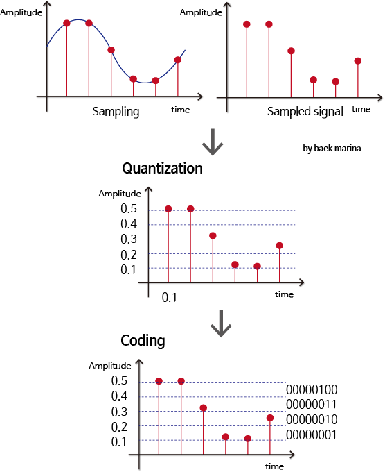
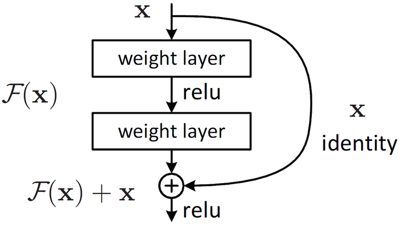
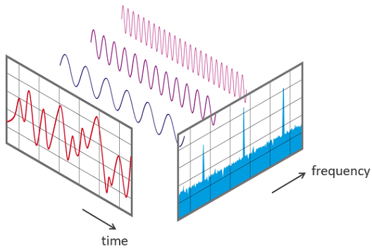
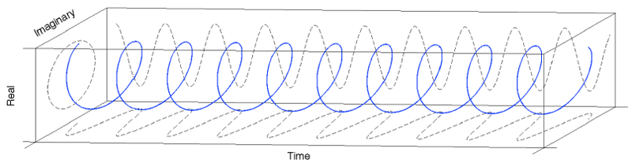
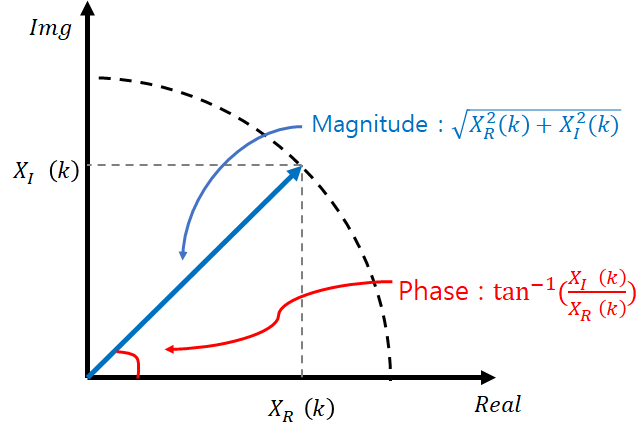
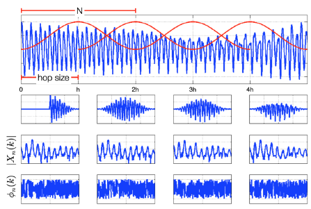
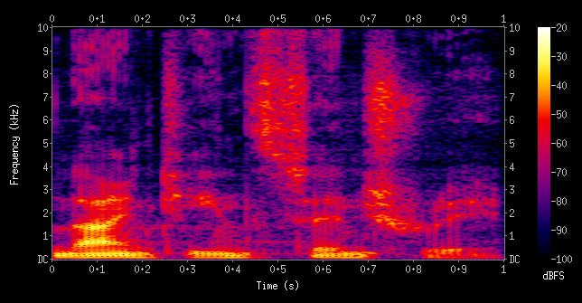

# 5. 사람이 말하는 단어를 인공지능 모델로 구분해보자

## 학습목표

---

- Audio 형태의 데이터를 다루는 방법에 대해서 알아보기
- Wav 파일의 형태와 원리를 이해하기
- 오디오데이터를 다른 다양한 형태로 변형시켜보기
- 차원이 다른 데이터에 사용가능한 classification 모델 직접 제작해보기

## 음성과 오디오 데이터

### (1) 파동으로서의 소리

---

소리는 진동으로 인한 공기의 압축을 이야기하며, 압축이 얼마나됐느냐는 파동(Wave)로 나타낼 수 있다.

- 소리에서 얻을 수 있는 물리량
    - 진폭(Amplitude) → 강도(Intensity)
    - 주파수(Frequency) →소리의 높낮이(Pitch)
    - 위상(Phase) → 음색

### (2) 오디오 데이터의 디지털화

---

연속적인 아날로그 신호 중 가장 단순한 형태인 sin 함수를 수식으로 표현하면 다음과 같다.


```python
# 아날로그 신호의 Sampling
import numpy as np
import matplotlib.pyplot as plt

def single_tone(frequecy, sampling_rate=16000, duration=1):
    t = np.linspace(0, duration, int(sampling_rate))
    y = np.sin(2 * np.pi * frequecy * t)
    return y

y = single_tone(400)

# 시각화
plt.plot(y[:41])
plt.show()

# 시각화
plt.stem(y[:41])
plt.show()
```

일반적으로 사용하는 주파수 영역대는 16kHz, 44.1kHz이며, 16kHz는 보통 Speech에서 많이 사용되고, 44.1kHz는 Music에서 많이 사용한다.

나이키스트-섀넌 표본화에 따르면 Sampling rate는 최대 주파수의 2배 이상을 표본화 주파수로 사용해야 aliasing을 방지할 수 있다고 한다.


연속적인 아날로그 신호는 표본화(Sampling), 양자화(Quantizing), 부호화(Encoding)을 거쳐 이진 디지털 신호(Binary Digital Signal)로 변환시켜 인식한다.



### (3) Wave Data 분석

---

- Bits per Sample(bps)
    - 샘플 하나마다의 소리의 세기를 몇 비트로 저장했는지 나타내는 단위
    - 값이 커질 수록 세기를 정확하게 저장 가능
    - 16bits의 경우, 2^16인 65,536 단계로 표현 가능
- Sampling Frequency
    - 소리로부터 초당 샘플링한 횟수를 의미
    - 샘플링은 나이퀴스트 샘플링 룰에 따라서 복원해야 할 신호 주파수 2배 이상으로 샘플링
    - 가청 주파수 20 ~ 24kHz를 복원하기 위해 사용하며, 음원에서는 44.1kHz를 많이 사용
- Channel
    - 각 채널별로 샘플링된 데이터가 따로 저장
    - 2채널은 왼쪽(L)과 오른쪽(R), 1채널은 왼쪽(L) 데이터만 있으며 재생시엔 LR 동시출력

### (4) 데이터셋 살펴보기

---

npz 파일로 이뤄진 데이터이며, 각각 데이터는 "wav_vals", "label_vals"로 저장되어 있다.

```python
# 데이터 불러오기
import numpy as np
import os

data_path = os.getenv("HOME")+'/aiffel/speech_recognition/data/speech_wav_8000.npz'
speech_data = np.load(data_path)

print("Wave data shape : ", speech_data["wav_vals"].shape)
print("Label data shape : ", speech_data["label_vals"].shape)

# 데이터 확인
import IPython.display as ipd
import random

# 데이터 선택 (랜덤하게 선택하고 있으니, 여러번 실행해 보세요)
rand = random.randint(0, len(speech_data["wav_vals"]))
print("rand num : ", rand)

sr = 8000 # 1초동안 재생되는 샘플의 갯수
data = speech_data["wav_vals"][rand]
print("Wave data shape : ", data.shape)
print("label : ", speech_data["label_vals"][rand])

ipd.Audio(data, rate=sr)
```

## Train/Test 데이터셋 구성하기

### (1) Label Data 처리

---

```python
# 구분해야 할 Data Label list
target_list = ['yes', 'no', 'up', 'down', 'left', 'right', 'on', 'off', 'stop', 'go']

label_value = target_list
label_value.append('unknown')
label_value.append('silence')

print('LABEL : ', label_value)

new_label_value = dict()
for i, l in enumerate(label_value):
    new_label_value[l] = i
label_value = new_label_value

print('Indexed LABEL : ', new_label_value)

# Label Data indexing
temp = []
for v in speech_data["label_vals"]:
    temp.append(label_value[v[0]])
label_data = np.array(temp)

label_data
```

### (2) 데이터 분리

```python
# 사이킷런의 split 함수를 이용하여 데이터 분리
from sklearn.model_selection import train_test_split

sr = 8000
train_wav, test_wav, train_label, test_label = train_test_split(speech_data["wav_vals"], 
                                                                label_data, 
                                                                test_size=0.1,
                                                                shuffle=True)
print(train_wav)

train_wav = train_wav.reshape([-1, sr, 1]) # add channel for CNN
test_wav = test_wav.reshape([-1, sr, 1])

# 데이터셋 확인
print("train data : ", train_wav.shape)
print("train labels : ", train_label.shape)
print("test data : ", test_wav.shape)
print("test labels : ", test_label.shape)

# Hyper-parameter Setting
batch_size = 32
max_epochs = 10

# the save point
checkpoint_dir = os.getenv('HOME')+'/aiffel/speech_recognition/models/wav'

checkpoint_dir
```

### (3) Data Setting

---

`tf.data.Dataset`을 이용해서 데이터셋을 구성한다.

`tf.data.Dataset.from_tensor_slices` 함수에 return 받기 원하는 데이터를 튜플(data, label) 형태로 넣어서 사용할 수 있다.

`map`함수는 dataset이 데이터를 불러올 때 마다 동작시킬 데이터 전처리 함수를 매핑해준다.

```python
# One-hot Encoding
def one_hot_label(wav, label):
    label = tf.one_hot(label, depth=12)
    return wav, label

# Dataset 함수 구성
import tensorflow as tf

# for train
train_dataset = tf.data.Dataset.from_tensor_slices((train_wav, train_label))
train_dataset = train_dataset.map(one_hot_label)
train_dataset = train_dataset.repeat().batch(batch_size=batch_size)
print(train_dataset)

# for test
test_dataset = tf.data.Dataset.from_tensor_slices((test_wav, test_label))
test_dataset = test_dataset.map(one_hot_label)
test_dataset = test_dataset.batch(batch_size=batch_size)
print(test_dataset)
```

## Wave classification 모델 구현

### (1) 모델 설계

---

audio는 1차원 데이터이기 때문에 데이터 형식에 맞게 모델을 구성해주어야 한다.

```python
from tensorflow.keras import layers

input_tensor = layers.Input(shape=(sr, 1))

x = layers.Conv1D(32, 9, padding='same', activation='relu')(input_tensor)
x = layers.Conv1D(32, 9, padding='same', activation='relu')(x)
x = layers.MaxPool1D()(x)

x = layers.Conv1D(64, 9, padding='same', activation='relu')(x)
x = layers.Conv1D(64, 9, padding='same', activation='relu')(x)
x = layers.MaxPool1D()(x)

x = layers.Conv1D(128, 9, padding='same', activation='relu')(x)
x = layers.Conv1D(128, 9, padding='same', activation='relu')(x)
x = layers.Conv1D(128, 9, padding='same', activation='relu')(x)
x = layers.MaxPool1D()(x)

x = layers.Conv1D(256, 9, padding='same', activation='relu')(x)
x = layers.Conv1D(256, 9, padding='same', activation='relu')(x)
x = layers.Conv1D(256, 9, padding='same', activation='relu')(x)
x = layers.MaxPool1D()(x)
x = layers.Dropout(0.3)(x)

x = layers.Flatten()(x)
x = layers.Dense(256)(x)
x = layers.BatchNormalization()(x)
x = layers.Activation('relu')(x)

output_tensor = layers.Dense(12)(x)

model_wav = tf.keras.Model(input_tensor, output_tensor)

model_wav.summary()
```

### (2) Loss function

---

정답 label의 class가 12개이기 때문에 해당 class를 구분하기 위해서는 multi-class classification이 필요하며, 이를 수행하기 위한 Loss function으로는 Categorical Cross-Entropy loss function을 사용한다.

```python
optimizer=tf.keras.optimizers.Adam(1e-4)
model_wav.compile(loss=tf.keras.losses.CategoricalCrossentropy(from_logits=True),
             optimizer=optimizer,
             metrics=['accuracy'])
```

### (3) 모델 훈련

---

callback 함수를 이용하여 학습 중간 중간에 원하는 동작을 하도록 설정할 수 있다.

`ModelCheckpoint` callback은 학습을 진행하면서 fit 함수의 다양한 인자를 지정해 모니터링하며 동작하게 설정할 수 있다. 현재 모델은 validation loss를 모니터하며, loss가 낮아지면 모델 파라미터를 저장하도록 구성되었다.

```python
# callback 설정
cp_callback = tf.keras.callbacks.ModelCheckpoint(checkpoint_dir,
                                                 save_weights_only=True,
                                                 monitor='val_loss',
                                                 mode='auto',
                                                 save_best_only=True,
                                                 verbose=1)

# 모델 훈련
history_wav = model_wav.fit(train_dataset, epochs=max_epochs,
                    steps_per_epoch=len(train_wav) // batch_size,
                    validation_data=test_dataset,
                    validation_steps=len(test_wav) // batch_size,
                    callbacks=[cp_callback]
                    )
```

### (4) 결과 확인

---

```python
import matplotlib.pyplot as plt

acc = history_wav.history['accuracy']
val_acc = history_wav.history['val_accuracy']

loss=history_wav.history['loss']
val_loss=history_wav.history['val_loss']

epochs_range = range(len(acc))

plt.figure(figsize=(8, 8))
plt.subplot(1, 2, 1)
plt.plot(epochs_range, acc, label='Training Accuracy')
plt.plot(epochs_range, val_acc, label='Validation Accuracy')
plt.legend(loc='lower right')
plt.title('Training and Validation Accuracy')

plt.subplot(1, 2, 2)
plt.plot(epochs_range, loss, label='Training Loss')
plt.plot(epochs_range, val_loss, label='Validation Loss')
plt.legend(loc='upper right')
plt.title('Training and Validation Loss')
plt.show()
```

training loss와 validation loss의 차이가 커지는 경우에는 overfitting이 일어나는 것이기 때문에 주의하자.

### (5) 모델 평가

---

```python
# checkpoint callback 함수에서 저장한 weight 불러오기
model_wav.load_weights(checkpoint_dir)

# test 데이터와 비교
results = model_wav.evaluate(test_dataset)

# loss
print("loss value: {:.3f}".format(results[0]))
# accuracy
print("accuracy value: {:.4f}%".format(results[1]*100))
```

### (6) 모델 테스트

---

Test data에서 직접 들어보고 예측이 맞는지 확인해보자.

```python
# 예측 데이터
inv_label_value = {v: k for k, v in label_value.items()}
batch_index = np.random.choice(len(test_wav), size=1, replace=False)

batch_xs = test_wav[batch_index]
batch_ys = test_label[batch_index]
y_pred_ = model_wav(batch_xs, training=False)

print("label : ", str(inv_label_value[batch_ys[0]]))

ipd.Audio(batch_xs.reshape(8000,), rate=8000)

# 실제 데이터가 맞는지 확인
if np.argmax(y_pred_) == batch_ys[0]:
    print("y_pred: " + str(inv_label_value[np.argmax(y_pred_)]) + '(Correct!)')
else:
    print("y_pred: " + str(inv_label_value[np.argmax(y_pred_)]) + '(Incorrect!)')
```

## Skip-Connection model

---

이미지 처리에서 Skip-Connection을 활용한 모델들이 훨씬 안정적으로 높은 성능을 낸다고 한다. 음성처리 모델에도 똑같이 적용할 수 있을까?



skip_connection은 concat을 이용한 방식으로 구현된다.

`tf.concat([#layer output tensor, layer output tensor#], axis=#)`

```python
input_tensor = layers.Input(shape=(sr, 1))

x = layers.Conv1D(32, 9, padding='same', activation='relu')(input_tensor)
x = layers.Conv1D(32, 9, padding='same', activation='relu')(x)
skip_1 = layers.MaxPool1D()(x)

x = layers.Conv1D(64, 9, padding='same', activation='relu')(skip_1)
x = layers.Conv1D(64, 9, padding='same', activation='relu')(x)
x = tf.concat([x, skip_1], -1)
skip_2 = layers.MaxPool1D()(x)

x = layers.Conv1D(128, 9, padding='same', activation='relu')(skip_2)
x = layers.Conv1D(128, 9, padding='same', activation='relu')(x)
x = layers.Conv1D(128, 9, padding='same', activation='relu')(x)
x = tf.concat([x, skip_2], -1)
skip_3 = layers.MaxPool1D()(x)

x = layers.Conv1D(256, 9, padding='same', activation='relu')(skip_3)
x = layers.Conv1D(256, 9, padding='same', activation='relu')(x)
x = layers.Conv1D(256, 9, padding='same', activation='relu')(x)
x = tf.concat([x, skip_3], -1)
x = layers.MaxPool1D()(x)
x = layers.Dropout(0.3)(x)

x = layers.Flatten()(x)
x = layers.Dense(256)(x)
x = layers.BatchNormalization()(x)
x = layers.Activation('relu')(x)

output_tensor = layers.Dense(12)(x)

model_wav_skip = tf.keras.Model(input_tensor, output_tensor)

model_wav_skip.summary()

# Optimization
optimizer=tf.keras.optimizers.Adam(1e-4)
model_wav_skip.compile(loss=tf.keras.losses.CategoricalCrossentropy(from_logits=True),
             optimizer=optimizer,
             metrics=['accuracy'])

# checkpoint
checkpoint_dir = os.getenv('HOME')+'/aiffel/speech_recognition/models/wav_skip'

cp_callback = tf.keras.callbacks.ModelCheckpoint(checkpoint_dir,
                                                 save_weights_only=True,
                                                 monitor='val_loss',
                                                 mode='auto',
                                                 save_best_only=True,
                                                 verbose=1)

# 모델 학습
batch_size = 32 # 메모리가 남길래 batch_size 32에서 64로 변경 했었는데 터져서 다시 32로
history_wav_skip = model_wav_skip.fit(train_dataset, epochs=max_epochs,
                    steps_per_epoch=len(train_wav) // batch_size,
                    validation_data=test_dataset,
                    validation_steps=len(test_wav) // batch_size,
                    callbacks=[cp_callback]
                    )

# 시각화
import matplotlib.pyplot as plt

acc = history_wav_skip.history['accuracy']
val_acc = history_wav_skip.history['val_accuracy']

loss=history_wav_skip.history['loss']
val_loss=history_wav_skip.history['val_loss']

epochs_range = range(len(acc))

plt.figure(figsize=(8, 8))
plt.subplot(1, 2, 1)
plt.plot(epochs_range, acc, label='Training Accuracy')
plt.plot(epochs_range, val_acc, label='Validation Accuracy')
plt.legend(loc='lower right')
plt.title('Training and Validation Accuracy')

plt.subplot(1, 2, 2)
plt.plot(epochs_range, loss, label='Training Loss')
plt.plot(epochs_range, val_loss, label='Validation Loss')
plt.legend(loc='upper right')
plt.title('Training and Validation Loss')
plt.show()

# 모델 평가
model_wav_skip.load_weights(checkpoint_dir)
results = model_wav_skip.evaluate(test_dataset)

# loss
print("loss value: {:.3f}".format(results[0]))
# accuracy
print("accuracy value: {:.4f}%".format(results[1]*100))

# 실제 확인 테스트
inv_label_value = {v: k for k, v in label_value.items()}
batch_index = np.random.choice(len(test_wav), size=1, replace=False)

batch_xs = test_wav[batch_index]
batch_ys = test_label[batch_index]
y_pred_ = model_wav_skip(batch_xs, training=False)

print("label : ", str(inv_label_value[batch_ys[0]]))

ipd.Audio(batch_xs.reshape(8000,), rate=8000)

# 예측 결과
if np.argmax(y_pred_) == batch_ys[0]:
    print("y_pred: " + str(inv_label_value[np.argmax(y_pred_)]) + '(Correct!)')
else:
    print("y_pred: " + str(inv_label_value[np.argmax(y_pred_)]) + '(Incorrect!)')
```

## Spectrogram

waveform은 음성 데이터를 1차원 시계열 데이터로 해석하는 방법이다. 그러나 waveform은 많은 음원의 파형이 합성된 복합파이기 때문에 좀 더 뚜렷하게 다양한 파형들을 주파수 대역별로 나누어 해석할 수 있는 방법이 Spectrogram이다.

### (1) 푸리에 변환 (Fourier transform)

---


푸리에 변환 식은 위와 같다. 그러나 이해하기 어려우니 아래 그림으로 보자.



### (2) 오일러 공식

---

아래 cos과 sin은 주기와 주파수를 가지는 주기함수이다. 즉, 푸리에 변환은 입력 signal에 상관 없이 sin, cos과 같은 주기함수들의 합으로 항상 분해가 가능하다.


 




푸리에 변환이 끝나면 실수부와 허수부를 가지는 복소수가 얻어진다. 복소수의 절댓값은 Spectrum magnitude(주파수의 강도)라고 부르며, angle은 phase spectrum(주파수의 위상)이라고 부른다.



### (3) STFT(Short Time Fourier Transform)

---

FFT(Fast Fourier Transform)는 시간의 흐름에 따라 신호의 주파수가 변했을 때, 어느 시간대에 주파수가 변하는지 모른다. 따라서 STFT는 시간의 길이를 나눠서 푸리에 변환을 한다.


- N은 FFT size이고, Window를 얼마나 많은 주파수 밴드로 나누는 가를 의미한다.
- Duration은 sampling rate를 window로 나눈 값이다. duration은 신호주기보다 5배 이상 길게 잡아야 한다. T(window)=5T(signal). ex) 440Hz의 window size = 5(1/440)
- $\omega$(n)는 window 함수를 나타낸다. 일반적으로는 hann window 가 많이 쓰인다.
- n은 window size다. window 함수에 들어가는 sample의 양으로 n이 작을수록 low-frequency resolution, high-time resolution을 가지게 되고, n이 길어지면 high-frequency, low-time resolution을 가지게 된다.
- H는 hop size를 의미한다. window가 겹치는 사이즈이며, 일반적으로 1/4정도를 겹치게 한다.



### (4) Spectrogram 이란?

---

wav 데이터를 해석하는 방법 중 하나로, 일정 시간동안 wav 데이터 안의 다양한 주파수들이 얼마나 포함되어 있는 지를 보여준다. STFT를 이용하여 Spectrogram을 그릴 수 있다.



- `pip install librosa` : FFT 관련 라이브러리

```python
import librosa

# wav파일을 spectrogram으로 변환하는 함수
def wav2spec(wav, fft_size=258): # spectrogram shape을 맞추기위해서 size 변형
    D = np.abs(librosa.stft(wav, n_fft=fft_size))
    return D

# data를 spectrogram으로 변환
spec = wav2spec(data)
print("Waveform shape : ",data.shape)
print("Spectrogram shape : ",spec.shape)

import librosa.display

# spectrogram을 시각화
librosa.display.specshow(librosa.amplitude_to_db(spec, ref=np.max), x_axis='time')
plt.title('Power spectrogram')
plt.colorbar(format='%+2.0f dB')
plt.xticks(range(0, 1))
plt.tight_layout()
plt.show()
```

## 1D Layer 로 변환하여 학습해보기

---

```python
# 필요한 library import
import numpy as np
import os
import librosa
import librosa.display
import IPython.display as ipd
import matplotlib.pyplot as plt
import random

# data load
data_path = os.getenv("HOME")+'/aiffel/speech_recognition/data/speech_wav_8000.npz'
speech_data = np.load(data_path)

# data list 확인
list(speech_data)

# wav to spectrum function
def wav2spec(wav, fft_size=258): # spectrogram shape을 맞추기위해서 size 변형
    D = np.abs(librosa.stft(wav, n_fft=fft_size))
    return D

# wav data를 spectrum data로 변환
temp = []
for i in speech_data['wav_vals']:
    temp.append(wav2spec(i))
new_speech_data = np.array(temp)

# shape 확인
new_speech_data.shape

# 구분해야 할 Data Label list
target_list = ['yes', 'no', 'up', 'down', 'left', 'right', 'on', 'off', 'stop', 'go']

label_value = target_list
label_value.append('unknown')
label_value.append('silence')

print('LABEL : ', label_value)

new_label_value = dict()
for i, l in enumerate(label_value):
    new_label_value[l] = i
label_value = new_label_value

print('Indexed LABEL : ', new_label_value)

# Label Data indexing
temp = []
for v in speech_data["label_vals"]:
    temp.append(label_value[v[0]])
label_data = np.array(temp)

label_data

# 사이킷런의 split 함수를 이용하여 데이터 분리
from sklearn.model_selection import train_test_split

sr = 16380
# 메모리 부족으로 커널 자꾸 죽어서 train_size 줄여서 train 진행
train_wav, test_wav, train_label, test_label = train_test_split(new_speech_data, 
                                                                label_data, 
                                                                test_size=0.2,
                                                                shuffle=True)
print(train_wav)

train_wav = train_wav.reshape([-1, sr, 1]) # add channel for CNN
test_wav = test_wav.reshape([-1, sr, 1])

# 데이터셋 확인
print("train data : ", train_wav.shape)
print("train labels : ", train_label.shape)
print("test data : ", test_wav.shape)
print("test labels : ", test_label.shape)

# Hyper-parameter Setting
batch_size = 32 # 메모리 부족으로 32 이상 불가
max_epochs = 10

# the save point
checkpoint_dir = os.getenv('HOME')+'/aiffel/speech_recognition/models/wav'

checkpoint_dir

# One-hot Encoding
def one_hot_label(wav, label):
    label = tf.one_hot(label, depth=12)
    return wav, label

# Dataset 함수 구성
import tensorflow as tf

# for train
train_dataset = tf.data.Dataset.from_tensor_slices((train_wav, train_label))
train_dataset = train_dataset.map(one_hot_label)
train_dataset = train_dataset.repeat().batch(batch_size=batch_size)
print(train_dataset)

# for test
test_dataset = tf.data.Dataset.from_tensor_slices((test_wav, test_label))
test_dataset = test_dataset.map(one_hot_label)
test_dataset = test_dataset.batch(batch_size=batch_size)
print(test_dataset)

# 모델 설계
from tensorflow.keras import layers

input_tensor = layers.Input(shape=(sr, 1))

x = layers.Conv1D(32, 9, padding='same', activation='relu')(input_tensor)
x = layers.Conv1D(32, 9, padding='same', activation='relu')(x)
x = layers.MaxPool1D()(x)

x = layers.Conv1D(64, 9, padding='same', activation='relu')(x)
x = layers.Conv1D(64, 9, padding='same', activation='relu')(x)
x = layers.MaxPool1D()(x)

x = layers.Conv1D(128, 9, padding='same', activation='relu')(x)
x = layers.Conv1D(128, 9, padding='same', activation='relu')(x)
x = layers.Conv1D(128, 9, padding='same', activation='relu')(x)
x = layers.MaxPool1D()(x)

x = layers.Conv1D(256, 9, padding='same', activation='relu')(x)
x = layers.Conv1D(256, 9, padding='same', activation='relu')(x)
x = layers.Conv1D(256, 9, padding='same', activation='relu')(x)
x = layers.MaxPool1D()(x)
x = layers.Dropout(0.3)(x)

x = layers.Flatten()(x)
x = layers.Dense(256)(x)
x = layers.BatchNormalization()(x)
x = layers.Activation('relu')(x)

output_tensor = layers.Dense(12)(x)

model_wav = tf.keras.Model(input_tensor, output_tensor)

model_wav.summary()

# optimizer 설정
optimizer=tf.keras.optimizers.Adam(1e-4)
model_wav.compile(loss=tf.keras.losses.CategoricalCrossentropy(from_logits=True),
             optimizer=optimizer,
             metrics=['accuracy'])

# callback 설정
cp_callback = tf.keras.callbacks.ModelCheckpoint(checkpoint_dir,
                                                 save_weights_only=True,
                                                 monitor='val_loss',
                                                 mode='auto',
                                                 save_best_only=True,
                                                 verbose=1)

# 모델 훈련
history_wav = model_wav.fit(train_dataset, epochs=max_epochs,
                    steps_per_epoch=len(train_wav) // batch_size,
                    validation_data=test_dataset,
                    validation_steps=len(test_wav) // batch_size,
                    callbacks=[cp_callback]
                    )

# 훈련 결과 시각화
import matplotlib.pyplot as plt

acc = history_wav.history['accuracy']
val_acc = history_wav.history['val_accuracy']

loss=history_wav.history['loss']
val_loss=history_wav.history['val_loss']

epochs_range = range(len(acc))

plt.figure(figsize=(8, 8))
plt.subplot(1, 2, 1)
plt.plot(epochs_range, acc, label='Training Accuracy')
plt.plot(epochs_range, val_acc, label='Validation Accuracy')
plt.legend(loc='lower right')
plt.title('Training and Validation Accuracy')

plt.subplot(1, 2, 2)
plt.plot(epochs_range, loss, label='Training Loss')
plt.plot(epochs_range, val_loss, label='Validation Loss')
plt.legend(loc='upper right')
plt.title('Training and Validation Loss')
plt.show()

# checkpoint callback 함수에서 저장한 weight 불러오기
model_wav.load_weights(checkpoint_dir)

# test 데이터와 비교
results = model_wav.evaluate(test_dataset)

# loss
print("loss value: {:.3f}".format(results[0]))
# accuracy
print("accuracy value: {:.4f}%".format(results[1]*100))

# 예측 데이터
inv_label_value = {v: k for k, v in label_value.items()}
batch_index = np.random.choice(len(test_wav), size=1, replace=False)

batch_xs = test_wav[batch_index]
batch_ys = test_label[batch_index]
y_pred_ = model_wav(batch_xs, training=False)

print("label : ", str(inv_label_value[batch_ys[0]]))

ipd.Audio(batch_xs.reshape(16380,), rate=16380)

# 실제 데이터가 맞는지 확인
if np.argmax(y_pred_) == batch_ys[0]:
    print("y_pred: " + str(inv_label_value[np.argmax(y_pred_)]) + '(Correct!)')
else:
    print("y_pred: " + str(inv_label_value[np.argmax(y_pred_)]) + '(Incorrect!)')
```

## 2D Layer 로 변환하여 학습해보기

---

```python
# 필요한 Library import
import numpy as np
import os
import librosa
import IPython.display as ipd
import random

# data load
data_path = os.getenv("HOME")+'/aiffel/speech_recognition/data/speech_wav_8000.npz'
speech_data = np.load(data_path)

# data list 확인
list(speech_data)

# wav to spectrum function
def wav2spec(wav, fft_size=258): # spectrogram shape을 맞추기위해서 size 변형
    D = np.abs(librosa.stft(wav, n_fft=fft_size))
    return D

# wav data를 spectrum data로 변환
temp = []
for i in speech_data['wav_vals']:
    temp.append(wav2spec(i))
new_speech_data = np.array(temp)

# shape 확인
new_speech_data.shape

# 구분해야 할 Data Label list
target_list = ['yes', 'no', 'up', 'down', 'left', 'right', 'on', 'off', 'stop', 'go']

label_value = target_list
label_value.append('unknown')
label_value.append('silence')

print('LABEL : ', label_value)

new_label_value = dict()
for i, l in enumerate(label_value):
    new_label_value[l] = i
label_value = new_label_value

print('Indexed LABEL : ', new_label_value)

# Label Data indexing
temp = []
for v in speech_data["label_vals"]:
    temp.append(label_value[v[0]])
label_data = np.array(temp)

label_data

# 사이킷런의 split 함수를 이용하여 데이터 분리
from sklearn.model_selection import train_test_split

train_wav, test_wav, train_label, test_label = train_test_split(new_speech_data, 
                                                                label_data, 
                                                                test_size=0.2,
                                                                shuffle=True)
print(train_wav)

# 데이터셋 확인
print("train data : ", train_wav.shape)
print("train labels : ", train_label.shape)
print("test data : ", test_wav.shape)
print("test labels : ", test_label.shape)

# Hyper-parameter Setting
batch_size = 32
max_epochs = 10

# the save point
checkpoint_dir = os.getenv('HOME')+'/aiffel/speech_recognition/models/wav'

checkpoint_dir

# One-hot Encoding
def one_hot_label(wav, label):
    label = tf.one_hot(label, depth=12)
    return wav, label

# Dataset 함수 구성
import tensorflow as tf

# for train
train_dataset = tf.data.Dataset.from_tensor_slices((train_wav, train_label))
train_dataset = train_dataset.map(one_hot_label)
train_dataset = train_dataset.repeat().batch(batch_size=batch_size)
print(train_dataset)

# for test
test_dataset = tf.data.Dataset.from_tensor_slices((test_wav, test_label))
test_dataset = test_dataset.map(one_hot_label)
test_dataset = test_dataset.batch(batch_size=batch_size)
print(test_dataset)

# 모델 설계
from tensorflow.keras import layers

input_tensor = layers.Input(shape=(130, 126, 1))

x = layers.Conv2D(32, 9, padding='same', activation='relu')(input_tensor)
x = layers.Conv2D(32, 9, padding='same', activation='relu')(x)
x = layers.MaxPool2D()(x)

x = layers.Conv2D(64, 9, padding='same', activation='relu')(x)
x = layers.Conv2D(64, 9, padding='same', activation='relu')(x)
x = layers.MaxPool2D()(x)

x = layers.Conv2D(128, 9, padding='same', activation='relu')(x)
x = layers.Conv2D(128, 9, padding='same', activation='relu')(x)
x = layers.Conv2D(128, 9, padding='same', activation='relu')(x)
x = layers.MaxPool2D()(x)

x = layers.Conv2D(256, 9, padding='same', activation='relu')(x)
x = layers.Conv2D(256, 9, padding='same', activation='relu')(x)
x = layers.Conv2D(256, 9, padding='same', activation='relu')(x)
x = layers.MaxPool2D()(x)
x = layers.Dropout(0.3)(x)

x = layers.Flatten()(x)
x = layers.Dense(256)(x)
x = layers.BatchNormalization()(x)
x = layers.Activation('relu')(x)

output_tensor = layers.Dense(12)(x)

model_wav = tf.keras.Model(input_tensor, output_tensor)

model_wav.summary()

# optimizer 설정
optimizer=tf.keras.optimizers.Adam(1e-4)
model_wav.compile(loss=tf.keras.losses.CategoricalCrossentropy(from_logits=True),
             optimizer=optimizer,
             metrics=['accuracy'])

# callback 설정
cp_callback = tf.keras.callbacks.ModelCheckpoint(checkpoint_dir,
                                                 save_weights_only=True,
                                                 monitor='val_loss',
                                                 mode='auto',
                                                 save_best_only=True,
                                                 verbose=1)

# 모델 훈련
history_wav = model_wav.fit(train_dataset, epochs=max_epochs,
                    steps_per_epoch=len(train_wav) // batch_size,
                    validation_data=test_dataset,
                    validation_steps=len(test_wav) // batch_size,
                    callbacks=[cp_callback]
                    )

# 훈련 결과 시각화
acc = history_wav.history['accuracy']
val_acc = history_wav.history['val_accuracy']

loss=history_wav.history['loss']
val_loss=history_wav.history['val_loss']

epochs_range = range(len(acc))

plt.figure(figsize=(8, 8))
plt.subplot(1, 2, 1)
plt.plot(epochs_range, acc, label='Training Accuracy')
plt.plot(epochs_range, val_acc, label='Validation Accuracy')
plt.legend(loc='lower right')
plt.title('Training and Validation Accuracy')

plt.subplot(1, 2, 2)
plt.plot(epochs_range, loss, label='Training Loss')
plt.plot(epochs_range, val_loss, label='Validation Loss')
plt.legend(loc='upper right')
plt.title('Training and Validation Loss')
plt.show()

# checkpoint callback 함수에서 저장한 weight 불러오기
model_wav.load_weights(checkpoint_dir)

# test 데이터와 비교
results = model_wav.evaluate(test_dataset)

# loss
print("loss value: {:.3f}".format(results[0]))
# accuracy
print("accuracy value: {:.4f}%".format(results[1]*100))

# 예측 데이터
inv_label_value = {v: k for k, v in label_value.items()}
batch_index = np.random.choice(len(test_wav), size=1, replace=False)

batch_xs = test_wav[batch_index]
batch_ys = test_label[batch_index]
y_pred_ = model_wav(batch_xs, training=False)

print("label : ", str(inv_label_value[batch_ys[0]]))

ipd.Audio(batch_xs.reshape(16380,), rate=16380)

# 실제 데이터가 맞는지 확인
if np.argmax(y_pred_) == batch_ys[0]:
    print("y_pred: " + str(inv_label_value[np.argmax(y_pred_)]) + '(Correct!)')
else:
    print("y_pred: " + str(inv_label_value[np.argmax(y_pred_)]) + '(Incorrect!)')
```

## 회고록

- 예전에 음악에 관심이 많았을 때 더 좋은 음질로 노래를 듣기 위해서 공부했을 때의 지식이 과제를 해결하는데 많은 도움이 된 것 같다.
- Wave Classification은 아무래도 데이터가 많아서 그런지 Image Classification이나 NLP보다 훨씬 parameter도 많고 시간도 오래 걸리는 것 같다.
- skip-connection 모델을 알고 있다는 전제하의 학습 노드였는데 사실 잘 몰라서 조금 더 찾아봐야 할 것 같다.
- skip-connection 을 이용하니까 overfitting은 줄어들은 것 같지만 실제로 정확도에는 큰 차이가 없는 것 같다.
- LMS 할 땐 batch_size를 32로 해도 메모리가 남길래 64로 변경해서 진행했었는데, Spectrum으로 변경하니까 parameter 수가 훨씬 많아져서 그런지 batch_size를 32로 조정해도 커널이 자꾸 죽어서 train_size를 줄이는 방향으로 겨우 model을 train시켰다.
- Spectrum을 1D-array로 reshape하여 train한 결과는 약 91%의 정확도가 나왔다!
- 1D-array에 Skip-connect을 적용해봤더니 적용하기 전과 큰 차이는 없는 것 같다.
- 2D-array로 reshape하여 2D-Conv Layer로 model을 train했더니 무려 96%의 정확도가 나왔다! 확실히 차원이 올라갈 수록 특징을 잡아내는 능력은 향상되는 것 같다. 대신 parameter의 수가 어마어마해져서 1epoch당 거의 5분 이상 걸려서 10epoch을 모두 진행하는 데 거의 1시간 정도가 걸렸다.
- 1D-array보다 2D-array쪽이 epoch을 거듭할 수록 train_loss와 val_loss의 차이가 벌어지는 정도가 덜했다. Overfitting이 덜하다는 의미인 것 같다. 실제로 결과도 더 좋았다.

유용한 링크

[https://linecard.tistory.com/20](https://linecard.tistory.com/20) 나이키스트 섀넌 표본화
