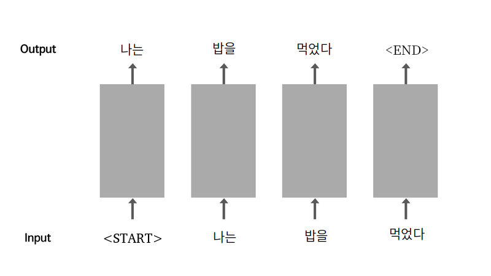
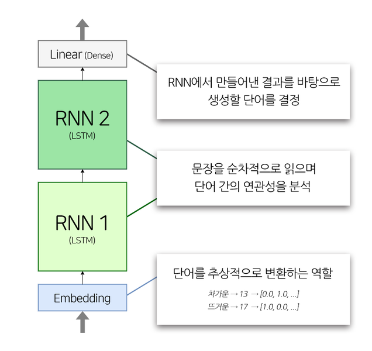

## 학습목표

---

- 인공지능이 문장을 이해하는 방식에 대해 알아본다.
- 시퀀스에 대해 알아본다.

## 시퀀스(Sequence)

시퀀스는 데이터에 순서(번호)를 붙여 나열한 것이다. 시퀀스의 특징은 다음과 같다.

- 데이터를 순서대로 하나씩 나열하여 나타낸 데이터 구조이다.
- 특정 위치(~번째)의 데이터를 가리킬 수 있다.

문장은 각 단어들이 문법이라는 규칙을 따라 배열되어 있기 때문에 시퀀스 데이터로 볼 수 있다.

문법은 복잡하기 때문에 문장 데이터를 이용한 인공지능을 만들 때에는 통계에 기반한 방법을 이용한다.

## 순환신경망(RNN)

나는 공부를 [ ]에서 빈 칸에는 한다 라는 단어가 들어갈 것이다. 문장에는 앞 뒤 문맥에 따라 통계적으로 많이 사용되는 단어들이 있다. 인공지능이 글을 이해하는 방식도 위와 같다. 문법적인 원리를 통해서가 아닌 수많은 글을 읽게하여 통계적으로 다음 단어는 어떤 것이 올지 예측하는 것이다. 이 방식에 가장 적합한 인공지능 모델 중 하나가 **순환신경망(RNN)**이다.



시작은 `<start>`라는 특수한 토큰을 앞에 추가하여 시작을 나타내고, `<end>`라는 토큰을 통해 문장의 끝을 나타낸다.

## 언어 모델

`나는`, `공부를`, `한다` 를 순차적으로 생성할 때, 우리는 `공부를` 다음이 `한다`인 것을 쉽게 할 수 있다. `나는` 다음이 `한다`인 것은 어딘가 어색하게 느껴진다. 실제로 인공지능이 동작하는 방식도 순전히 운이다.

이것을 좀 더 확률적으로 표현해 보면 `나는 공부`를 다음에 `한다`가 나올 확률을 $p(한다|나는, 공부를)$라고 하면,  $p(공부를|나는)$보다는 높게 나올 것이다. $p(한다|나는, 공부를, 열심히)$의 확률값은 더 높아질 것이다.

문장에서 단어 뒤에 다음 단어가 나올 확률이 높다는 것은 그 단어가 자연스럽다는 뜻이 된다. 확률이 낮다고 해서 자연스럽지 않은 것은 아니다. 단어 뒤에 올 수 있는 자연스러운 단어의 경우의 수가 워낙 많아서 불확실성이 높을 뿐이다.

n-1개의 단어 시퀀스 $w_1,⋯,w_{n-1}$이 주어졌을 때, n번째 단어 $w_n$으로 무엇이 올지 예측하는 확률 모델을 **언어 모델(Language Model)**이라고 부른다. 파라미터 $\theta$로 모델링 하는 언어 모델을 다음과 같이 표현할 수 있다.

$$P(w_n|w_1,⋯,w_{n-1};\theta)$$

언어 모델은 어떻게 학습시킬 수 있을까? 언어 모델의 학습 데이터는 어떻게 나누어야 할까? 답은 간단하다. 어떠한 텍스트도 언어 모델의 학습 데이터가 될 수 있다. x_train이 n-1번째까지의 단어 시퀀스고, y_train이 n번째 단어가 되는 데이터셋이면 얼마든지 학습 데이터로 사용할 수 있다. 이렇게 잘 훈련된 언어 모델은 훌륭한 문장 생성기가 된다.

## 인공지능 만들기

### (1) 데이터 준비

---

```python
import re
import numpy as np
import tensorflow as tf
import os

# 파일 열기
file_path = os.getenv('HOME') + '/aiffel/lyricist/data/shakespeare.txt'
with open(file_path, "r") as f:
    raw_corpus = f.read().splitlines() # 텍스트를 라인 단위로 끊어서 list 형태로 읽어온다.

print(raw_corpus[:9])
```

데이터에서 우리가 원하는 것은 문장(대사)뿐이므로, 화자 이름이나 공백은 제거해주어야 한다.

```python
# 문장 indexing
for idx, sentence in enumerate(raw_corpus):
    if len(sentence) == 0: continue   # 길이가 0인 문장은 스킵
    if sentence[-1] == ":": continue  # :로 끝나는 문장은 스킵

    if idx > 9: break
        
    print(sentence)
```

이제 문장을 단어로 나누어야 한다. 문장을 형태소로 나누는 것을 토큰화(Tokenize)라고 한다. 가장 간단한 방법은 띄어쓰기를 기준으로 나누는 것이다. 그러나 문장부호, 대소문자, 특수문자 등이 있기 때문에 따로 전처리를 먼저 해주어야 한다.

```python
# 문장 전처리 함수
def preprocess_sentence(sentence):
    sentence = sentence.lower().strip() # 소문자로 바꾸고 양쪽 공백을 삭제

		# 정규식을 이용하여 문장 처리
    sentence = re.sub(r"([?.!,¿])", r" \1 ", sentence) # 패턴의 특수문자를 만나면 특수문자 양쪽에 공백을 추가
    sentence = re.sub(r'[" "]+', " ", sentence) # 공백 패턴을 만나면 스페이스 1개로 치환
    sentence = re.sub(r"[^a-zA-Z?.!,¿]+", " ", sentence) # a-zA-Z?.!,¿ 패턴을 제외한 모든 문자(공백문자까지도)를 스페이스 1개로 치환

    sentence = sentence.strip()

    sentence = '<start> ' + sentence + ' <end>' # 문장 앞뒤로 <start>와 <end>를 단어처럼 붙여 줍니다
    
    return sentence

print(preprocess_sentence("Hi, This @_is ;;;sample        sentence?"))
```

우리가 구축해야할 데이터셋은 입력이 되는 소스 문장(Source Sentence)과 출력이 되는 타겟 문장(Target Sentence)으로 나누어야 한다.

```python
언어 모델의 입력 문장 : <start> 나는 공부를 한다
언어 모델의 출력 문장 : 나는 공부를 한다 <end>
```

위에서 만든 전처리 함수에서 <end>를 제거하면 소스 문장, <start>를 제거하면 타겟 문장이 된다.

```python
corpus = []

# 모든 문장에 전처리 함수 적용
for sentence in raw_corpus:
    if len(sentence) == 0: continue
    if sentence[-1] == ":": continue
        
    corpus.append(preprocess_sentence(sentence))
        
corpus[:10]
```

이제 문장을 컴퓨터가 이해할 수 있는 숫자로 변경해주어야 한다. 텐서플로우는 자연어 처리를 위한 여러 가지 모듈을 제공하며, `tf.keras.preprocessing.text.Tokenizer` 패키지는 데이터를 토큰화하고, dictionary를 만들어주며, 데이터를 숫자로 변환까지 한 번에 해준다. 이 과정을 벡터화(Vectorize)라고 하며, 변환된 숫자 데이터를 텐서(tensor)라고 한다.

```python
def tokenize(corpus):
    # 텐서플로우에서 제공하는 Tokenizer 패키지를 생성
    tokenizer = tf.keras.preprocessing.text.Tokenizer(
        num_words=7000,   # 전체 단어의 개수 
        filters=' ',      # 전처리 로직
        oov_token="<unk>" # out-of-vocabulary, 사전에 없는 단어
    )
    tokenizer.fit_on_texts(corpus) # 우리가 구축한 corpus로부터 Tokenizer가 사전을 자동구축

    # tokenizer를 활용하여 모델에 입력할 데이터셋을 구축
    tensor = tokenizer.texts_to_sequences(corpus) # tokenizer는 구축한 사전으로부터 corpus를 해석해 Tensor로 변환

    # 입력 데이터의 시퀀스 길이를 일정하게 맞추기 위한 padding  메소드
    # maxlen의 디폴트값은 None. corpus의 가장 긴 문장을 기준으로 시퀀스 길이가 맞춰진다
    tensor = tf.keras.preprocessing.sequence.pad_sequences(tensor, padding='post')  

    print(tensor,tokenizer)
    return tensor, tokenizer

tensor, tokenizer = tokenize(corpus)

print(tensor[:3, :10]) # 생성된 텐서 데이터 확인

# 단어 사전의 index
for idx in tokenizer.index_word:
    print(idx, ":", tokenizer.index_word[idx])

    if idx >= 10: break

src_input = tensor[:, :-1] # tensor에서 마지막 토큰을 잘라내서 소스 문장을 생성. 마지막 토큰은 <end>가 아니라 <pad>일 가능성이 높다.
tgt_input = tensor[:, 1:]  # tensor에서 <start>를 잘라내서 타겟 문장을 생성.

print(src_input[0])
print(tgt_input[0])

# 데이터셋 구축
BUFFER_SIZE = len(src_input)
BATCH_SIZE = 256
steps_per_epoch = len(src_input) // BATCH_SIZE

VOCAB_SIZE = tokenizer.num_words + 1 # 0:<pad>를 포함하여 dictionary 갯수 + 1

dataset = tf.data.Dataset.from_tensor_slices((src_input, tgt_input)).shuffle(BUFFER_SIZE)
dataset = dataset.batch(BATCH_SIZE, drop_remainder=True)
dataset
```

- 데이터셋 생성 과정 요약
    - 정규표현식을 이용한 corpus 생성
    - `tf.keras.preprocessing.text.Tokenizer`를 이용해 corpus를 텐서로 변환
    - `tf.data.Dataset.from_tensor_slices()`를 이용해 corpus 텐서를 tf.data.Dataset객체로 변환

### (2) 모델 학습하기

---

이번에 만들 모델의 구조는 다음과 같다.



```python
# 모델 생성
class TextGenerator(tf.keras.Model):
    def __init__(self, vocab_size, embedding_size, hidden_size):
        super(TextGenerator, self).__init__()
        
        self.embedding = tf.keras.layers.Embedding(vocab_size, embedding_size)
        self.rnn_1 = tf.keras.layers.LSTM(hidden_size, return_sequences=True)
        self.rnn_2 = tf.keras.layers.LSTM(hidden_size, return_sequences=True)
        self.linear = tf.keras.layers.Dense(vocab_size)
        
    def call(self, x):
        out = self.embedding(x)
        out = self.rnn_1(out)
        out = self.rnn_2(out)
        out = self.linear(out)
        
        return out
    
embedding_size = 256 # 워드 벡터의 차원 수
hidden_size = 1024 # LSTM Layer의 hidden 차원 수
model = TextGenerator(tokenizer.num_words + 1, embedding_size , hidden_size)

# 모델의 데이터 확인
for src_sample, tgt_sample in dataset.take(1): break
model(src_sample)
# 모델의 최종 출력 shape는 (256, 20, 7001)
# 256은 batch_size, 20은 squence_length, 7001은 단어의 갯수(Dense Layer 출력 차원 수)

model.summary() # sequence_length를 모르기 때문에 Output shape를 정확하게 모른다.

# 모델 학습
optimizer = tf.keras.optimizers.Adam()
loss = tf.keras.losses.SparseCategoricalCrossentropy(
    from_logits=True,
    reduction='none'
)

model.compile(loss=loss, optimizer=optimizer)
model.fit(dataset, epochs=30)

```

위의 코드에서 embbeding_size 는 워드 벡터의 차원 수를 나타내는 parameter로, 단어가 추상적으로 표현되는 크기를 말한다. 예를 들어 크기가 2라면 다음과 같이 표현할 수 있다.

- 차갑다: [0.0, 1.0]
- 뜨겁다: [1.0, 0.0]
- 미지근하다: [0.5, 0.5]

### (3) 모델 평가하기

---

인공지능을 통한 작문은 수치적으로 평가할 수 없기 때문에 사람이 직접 평가를 해야 한다.

```python
# 문장 생성 함수
def generate_text(model, tokenizer, init_sentence="<start>", max_len=20):
    # 테스트를 위해서 입력받은 init_sentence도 텐서로 변환
    test_input = tokenizer.texts_to_sequences([init_sentence])
    test_tensor = tf.convert_to_tensor(test_input, dtype=tf.int64)
    end_token = tokenizer.word_index["<end>"]

    # 단어를 하나씩 생성
    while True:
        predict = model(test_tensor)  # 입력받은 문장
        predict_word = tf.argmax(tf.nn.softmax(predict, axis=-1), axis=-1)[:, -1]   # 예측한 단어가 새로 생성된 단어 

        # 우리 모델이 새롭게 예측한 단어를 입력 문장의 뒤에 붙이기
        test_tensor = tf.concat([test_tensor, 
																 tf.expand_dims(predict_word, axis=0)], axis=-1)

        # 우리 모델이 <end>를 예측했거나, max_len에 도달하지 않았다면  while 루프를 또 돌면서 다음 단어를 예측
        if predict_word.numpy()[0] == end_token: break
        if test_tensor.shape[1] >= max_len: break

    generated = ""
    # 생성된 tensor 안에 있는 word index를 tokenizer.index_word 사전을 통해 실제 단어로 하나씩 변환
    for word_index in test_tensor[0].numpy():
        generated += tokenizer.index_word[word_index] + " "

    return generated   # 최종 생성된 자연어 문장

# 생성 함수 실행
generate_text(model, tokenizer, init_sentence="<start> i love")
```

## 가사를 이용하여 작사해보기

```python
# 데이터 불러오기
import glob
import os
import re
import numpy as np
import tensorflow as tf
from sklearn.model_selection import train_test_split

txt_file_path = os.getenv('HOME')+'/aiffel/lyricist/data/lyrics/*'

txt_list = glob.glob(txt_file_path)

raw_corpus = []

# 여러개의 txt 파일을 모두 읽어서 raw_corpus 에 넣기
for txt_file in txt_list:
    with open(txt_file, "r") as f:
        raw = f.read().splitlines()
        raw_corpus.extend(raw)

print("데이터 크기:", len(raw_corpus))
print("Examples:\n", raw_corpus[:3])

# 문장 indexing
for idx, sentence in enumerate(raw_corpus):
    if len(sentence) == 0: continue   # 길이가 0인 문장은 스킵

    if idx > 9: break
        
    print(sentence)

# 문장 전처리 함수
def preprocess_sentence(sentence):
    sentence = sentence.lower().strip() # 소문자로 바꾸고 양쪽 공백을 삭제

    # 정규식을 이용하여 문장 처리
    sentence = re.sub(r"([?.!,¿])", r" \1 ", sentence) # 패턴의 특수문자를 만나면 특수문자 양쪽에 공백을 추가
    sentence = re.sub(r'[" "]+', " ", sentence) # 공백 패턴을 만나면 스페이스 1개로 치환
    sentence = re.sub(r"[^a-zA-Z?.!,¿]+", " ", sentence) # a-zA-Z?.!,¿ 패턴을 제외한 모든 문자(공백문자까지도)를 스페이스 1개로 치환

    sentence = sentence.strip()

    sentence = '<start> ' + sentence + ' <end>'
    return sentence

corpus = []

# 모든 문장에 전처리 함수 적용
for sentence in raw_corpus:
    if len(sentence) == 0:
        continue
    if sentence[-1] == ":":
        continue
    temp = preprocess_sentence(sentence)
    if len(temp.split()) <= 15: # 문장 길이 15 이하만 corpus 에 넣기
        corpus.append(temp)

# corpus 확인        
print(corpus[:2])
print(len(corpus))

# 토큰화
def tokenize(corpus):
    # 텐서플로우에서 제공하는 Tokenizer 패키지를 생성
    tokenizer = tf.keras.preprocessing.text.Tokenizer(
        num_words=15000,  # 전체 단어의 개수 
        filters=' ',      # 전처리 로직
        oov_token="<unk>" # out-of-vocabulary, 사전에 없는 단어
    )
    tokenizer.fit_on_texts(corpus) # 우리가 구축한 corpus로부터 Tokenizer가 사전을 자동구축

    # tokenizer를 활용하여 모델에 입력할 데이터셋을 구축
    tensor = tokenizer.texts_to_sequences(corpus) # tokenizer는 구축한 사전으로부터 corpus를 해석해 Tensor로 변환

    # 입력 데이터의 시퀀스 길이를 일정하게 맞추기 위한 padding 메소드
    tensor = tf.keras.preprocessing.sequence.pad_sequences(tensor,
                                                           padding='post',
                                                           maxlen=15)

    print(tensor,tokenizer)
    return tensor, tokenizer

tensor, tokenizer = tokenize(corpus)

print(len(tensor[10,:])) # 생성된 텐서 데이터 확인

# 단어 사전의 index 확인
for idx in tokenizer.index_word:
    print(idx, ":", tokenizer.index_word[idx])

    if idx >= 20: break

# 문장 생성
src_input = tensor[:, :-1] # tensor에서 마지막 토큰을 잘라내서 소스 문장을 생성. 마지막 토큰은 <end>가 아니라 <pad>일 가능성이 높다.
tgt_input = tensor[:, 1:]  # tensor에서 <start>를 잘라내서 타겟 문장을 생성.

# 생성된 문장 확인
print(src_input[0])
print(tgt_input[0])

# train, test data 분리
enc_train, enc_val, dec_train, dec_val = train_test_split(src_input,
                                                          tgt_input,
                                                          test_size=0.2,
                                                          shuffle=True)

# 분리된 데이터 확인
print("Source Train:", enc_train.shape)
print("Target Train:", dec_train.shape)

# 데이터셋 구축
BUFFER_SIZE = len(enc_train)
BATCH_SIZE = 512
steps_per_epoch = len(enc_train) // BATCH_SIZE

VOCAB_SIZE = tokenizer.num_words + 1    # 0:<pad>를 포함하여 dictionary 갯수 + 1

dataset = tf.data.Dataset.from_tensor_slices((enc_train, dec_train)).shuffle(BUFFER_SIZE)
dataset = dataset.batch(BATCH_SIZE, drop_remainder=True)
dataset

# 모델 생성 함수
class TextGenerator(tf.keras.Model):
    def __init__(self, vocab_size, embedding_size, hidden_size):
        super(TextGenerator, self).__init__()
        
        self.embedding = tf.keras.layers.Embedding(vocab_size, embedding_size)
        self.rnn_1 = tf.keras.layers.LSTM(hidden_size, return_sequences=True)
        self.rnn_2 = tf.keras.layers.LSTM(hidden_size, return_sequences=True)
        self.linear = tf.keras.layers.Dense(vocab_size)
        
    def call(self, x):
        out = self.embedding(x)
        out = self.rnn_1(out)
        out = self.rnn_2(out)
        out = self.linear(out)
        
        return out 

# 모델 생성
embedding_size = 256 # 워드 벡터의 차원 수
hidden_size = 1024 # LSTM Layer의 hidden 차원 수
model = TextGenerator(tokenizer.num_words + 1, embedding_size , hidden_size)

# 모델의 데이터 확인
for src_sample, tgt_sample in dataset.take(1): break
model(src_sample)

# 모델의 최종 출력 shape는 (256, 14, 15001)
# 256은 batch_size, 14는 squence_length, 15001은 단어의 갯수(Dense Layer 출력 차원 수)

model.summary() # sequence_length를 모르기 때문에 Output shape를 정확하게 모른다.

# 모델 학습
optimizer = tf.keras.optimizers.Adam()
loss = tf.keras.losses.SparseCategoricalCrossentropy(
    from_logits=True,
    reduction='none'
)

model.compile(loss=loss, optimizer=optimizer)
model.fit(dataset, epochs=30)

# 단어 생성 함수
def generate_text(model, tokenizer, init_sentence="<start>", max_len=20):
    # 테스트를 위해서 입력받은 init_sentence도 텐서로 변환
    test_input = tokenizer.texts_to_sequences([init_sentence])
    test_tensor = tf.convert_to_tensor(test_input, dtype=tf.int64)
    end_token = tokenizer.word_index["<end>"]

    # 단어를 하나씩 생성
    while True:
        predict = model(test_tensor)  # 입력받은 문장
        predict_word = tf.argmax(tf.nn.softmax(predict, axis=-1), axis=-1)[:, -1]   # 예측한 단어가 새로 생성된 단어 

        # 우리 모델이 새롭게 예측한 단어를 입력 문장의 뒤에 붙이기
        test_tensor = tf.concat([test_tensor, tf.expand_dims(predict_word, axis=0)], axis=-1)

        # 우리 모델이 <end>를 예측했거나, max_len에 도달하지 않았다면  while 루프를 또 돌면서 다음 단어를 예측
        if predict_word.numpy()[0] == end_token: break
        if test_tensor.shape[1] >= max_len: break

    generated = ""
    # 생성된 tensor 안에 있는 word index를 tokenizer.index_word 사전을 통해 실제 단어로 하나씩 변환
    for word_index in test_tensor[0].numpy():
        generated += tokenizer.index_word[word_index] + " "

    return generated   # 최종 생성된 자연어 문장

generate_text(model, tokenizer, init_sentence="<start> i love", max_len=20)
```

## 회고록

- range(n)도 reverse() 함수가 먹힌다는 걸 오늘 알았다...
- 예시에 주어진 train data 갯수는 124960인걸 보면 총 데이터는 156200개인 것 같은데 아무리 전처리 단계에서 조건에 맞게 처리해도 168000개 정도가 나온다. 아무튼 일단 돌려본다.
- 문장의 길이가 최대 15라는 이야기는 `<start>, <end>`를 포함하여 15가 되어야 하는 것 같아서 tokenize했을 때 문장의 길이가 13 이하인 것만 corpus로 만들었다.
- 학습 회차 별 생성된 문장 input : `<start> i love`
    - 1회차 `'<start> i love you , i love you <end> '`
    - 2회차 `'<start> i love you , i m not gonna crack <end> '`
    - 3회차`'<start> i love you to be a shot , i m not a man <end> '`
    - 4회차 `'<start> i love you , i m not stunning , i m a fool <end> '`
- batch_size를 각각 256, 512, 1024로 늘려서 진행했는데, 1epoch당 걸리는 시간이 74s, 62s, 59s 정도로 batch_size 배수 만큼의 차이는 없었다. batch_size가 배로 늘어나면 걸리느 시간도 당연히 반으로 줄어들 것이라 생각했는데 오산이었다.
- 1회차는 tokenize 했을 때 length가 15 이하인 것을 train_data로 사용하였다.
- 2, 3, 4회차는 tokenize 했을 때 length가 13 이하인 것을 train_data로 사용하였다.
- 3회차는 2회차랑 동일한 데이터에 padding 을 post에서 pre로 변경하였다. RNN에서는 뒤에 padding을 넣는 것 보다 앞쪽에 padding을 넣어주는 쪽이 마지막 결과에 paddind이 미치는 영향이 적어지기 때문에 더 좋은 성능을 낼 수 있다고 알고있기 때문이다.
- 근데 실제로는 pre padding 쪽이 loss가 더 크게 나왔다. 확인해보니 이론상으로는 pre padding이 성능이 더 좋지만 실제로는 post padding쪽이 성능이 더 잘 나와서 post padding을 많이 쓴다고 한다.
- batch_size를 변경해서 pre padding을 한 번 더 돌려보았더니 같은 조건에서의 post padding 보다 loss가 높았고 문장도 부자연스러웠다. 앞으로는 post padding을 사용해야겠다.
