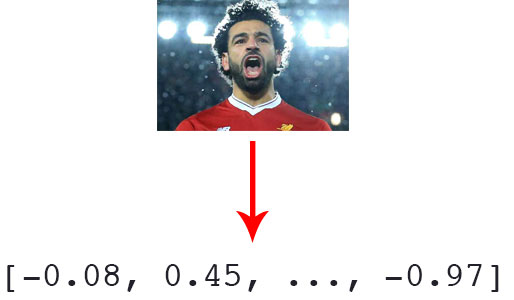
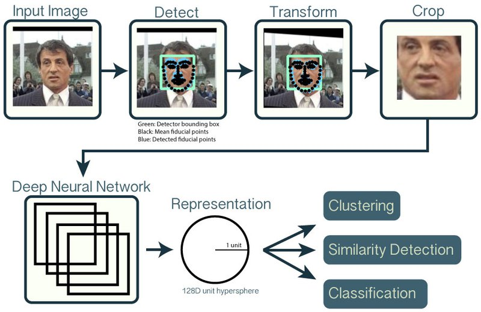
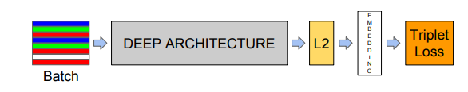
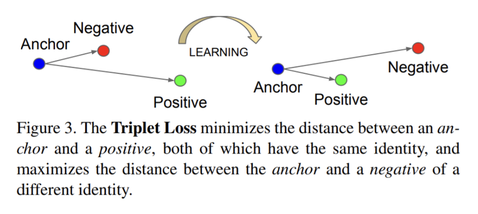
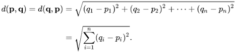

# 7. 나랑 닮은 연예인은 누구?

## 실습목표

- 임베딩에 대해 이해하고 얼굴의 임베딩 벡터를 추출한다.
- 얼굴의 임베딩 벡터로 닮은 꼴인 얼굴을 찾는다.
- 나와 가까운 연예인을 찾아낸다.

## 임베딩이란?

컴퓨터에는 감각기관이 없어서 우리가 쉽게 인지하는 시각, 촉각, 청각 정보들을 즉각적으로 판단하기 어렵다. 오직 0과 1의 조합으로 데이터를 표현해주어야 한다. 우리는 어떻게 컴퓨터에게 다양한 형태의 정보를 표현해줄 수 있을까?

우리는 어떤 벡터 공간(Vector Space)에다가 우리가 표현하고자 하는 정보를 Mapping하는 방법을 사용할 수 밖에 없다. 단어나 이미지 오브젝트나 무언가를 벡터로 표현한다면, 그것은 원점에서 출발한 벡터 공간상의 한 점이 될 것이다. 따라서, 우리가 하고 싶은 것은 점들 사이의 관계를 알아보는 것이다.

오늘 다루어 보고자 하는 '두 얼굴이 얼마나 닮았나'하는 문제는 **두 얼굴 벡터 사이의 거리가 얼마나 되나** 하는 문제로 치환된다. 중요한 것은 두 점 사이의 거리가 실제로 두 오브젝트 사이의 유사도를 정확하게 반영해야 한다는 것이다.

만약 100x100픽셀의 컬러 사진이라면 RGB 3개의 채널까지 고려해 무려 3x100x100 = 30000차원의 벡터를 얼굴 개수만큼 비교해야 한다. 그러나 너무 높은 차원의 공간에서 비교는 사실상 무의미해지기 때문에 **고차원 정보를 저차원으로 변환하면서 필요한 정보만을 보존하는 것**이 바로 **임베딩**이다.



임베딩 벡터에 보존되어야 하는 정보는 상대적인 비교수치이다. 이 상대적인 비교수치를 딥러닝을 통해 학습할 수 있도록 해보자.

## 얼굴 임베딩 만들기

### (1) 얼굴인식

---

이미지 속의 두 얼굴이 얼마나 닮았는지 알아보기 위해서는 우선 이미지 속에서 얼굴 영역만을 정확하게 인식해서 추출하는 작업이 필요하다.



이전에 dlib를 이용하여 얼굴 인식을 해보았기 때문에, 오늘은 dlib을 사용해서 만들어진 Face Recognition 라이브러리를 이용해서 과제를 진행할 예정이다. pip를 이용해 라이브러리를 설치한다.

```python
$ pip install cmake
$ pip install dlib
$ pip install face_recognition --user
```

얼굴 부분을 제대로 가져오는지 확인해보자.

```python
import face_recognition
import os

image_path = os.getenv('HOME')+'/aiffel/face_embedding/images/obama.jpg'
image = face_recognition.load_image_file(image_path)
face_locations = face_recognition.face_locations(image)

print(face_locations)  # 이미지에서 얼굴 영역의 좌표를 출력합니다.

%matplotlib inline
import matplotlib.pyplot as plt

a, b, c, d = face_locations[0]
cropped_face = image[a:c,d:b,:]

plt.imshow(cropped_face)   # 이미지에서 얼굴영역만 잘라낸 cropped_face를 그려 봅니다.
```

이미지 파일 경로를 파라미터로 넘기면 얼굴 영역만 잘라서 출력해주는 함수를 만들어보자.

```python
import face_recognition
import os

def get_gropped_face(image_file):
  image = face_recognition.load_image_file(image_file)
  face_locations = face_recognition.face_locations(image)
  a, b, c, d = face_locations[0]
  cropped_face = image[a:c,d:b,:]
  
  return cropped_face
```

### (2) FaceNet

---



2015년 구글에서 발표한 FaceNet은 일반적인 딥러닝 모델과 크게 다르지 않지만, 네트워크 뒤에 L2 Normalization을 거쳐 임베딩을 만들어내고 여기에 Triplet Loss를 사용하고 있다.



Triplet Loss는 유사한 것은 벡터를 가깝게 위치시키고, 다른 것은 벡터를 멀게 위치시키는 효과를 가져온다. 예를 들어, 같은 사람의 얼굴은 벡터를 가깝게 하고, 다른 사람의 얼굴은 벡터를 멀게 하는 것이다.

```python
import os

# directory의 file list 불러오기
dir_path = os.getenv('HOME')+'/aiffel/face_embedding/images'
file_list = os.listdir(dir_path)

print ("file_list: {}".format(file_list))

# 임베딩 벡터 구하기
image_file = os.path.join(dir_path, 'obama.jpg')
face = get_gropped_face(image_file)   # 얼굴 영역을 구하는 함수(이전 스텝에서 구현)

# 얼굴 영역을 가지고 얼굴 임베딩 벡터를 구하는 함수
def get_face_embedding(face):
    return face_recognition.face_encodings(face)

embedding = get_face_embedding(face)  
embedding

# embedding dict 만드는 함수
def get_face_embedding_dict(dir_path):
    file_list = os.listdir(dir_path)
    embedding_dict = {}
    
    for file in file_list:
      img_path = os.path.join(dir_path, file)
      face = get_gropped_face(img_path)
      embedding = get_face_embedding(face)
      if len(embedding) > 0:
        # splitext = file, extension
        embedding_dict[os.path.splitext(file)[0]] = embedding[0]
        
    return embedding_dict

embedding_dict = get_face_embedding_dict(dir_path)
embedding_dict['trump']
```

## 얼굴 임베딩 사이의 거리측정

---



```python
import numpy as np

A = np.array([0.0019173615146428347, 0.17689529061317444, 0.0763588473200798, -0.024574430659413338, -0.13141091167926788, 0.0344821996986866, -0.0374063216149807, -0.07056370377540588, 0.048655178397893906, -0.03414120525121689, 0.22696012258529663, -0.061402369290590286, -0.24329672753810883, -0.039421431720256805, 0.0621466189622879, 0.1220191940665245, -0.1616966724395752, -0.06176016479730606, -0.18894734978675842, -0.06051916256546974, -0.010404378175735474, -0.05918719246983528, 0.02205268107354641, -0.06932859122753143, -0.20260301232337952, -0.2425234317779541, -0.04454419016838074, -0.11400106549263, -0.02022719383239746, -0.15134216845035553, 0.07622595876455307, -0.0323314443230629, -0.1404413878917694, -0.056338660418987274, -0.04520038887858391, -0.026131991297006607, -0.0352761372923851, -0.0679447203874588, 0.1318240910768509, 0.034210119396448135, -0.17475582659244537, 0.13853909075260162, -0.0027398746460676193, 0.227312833070755, 0.3029572069644928, 0.004932125099003315, 0.05853061378002167, -0.07521739602088928, 0.1443275809288025, -0.2340908795595169, 0.030092637985944748, 0.040133409202098846, 0.1672351360321045, 0.05728958174586296, 0.11475440859794617, -0.07548368722200394, 0.040267568081617355, 0.16487033665180206, -0.21067440509796143, 0.036163005977869034, 0.051559075713157654, -0.05994952470064163, 0.029524143785238266, -0.04122130945324898, 0.13074155151844025, 0.1142958477139473, -0.00561982998624444, -0.09740489721298218, 0.18533651530742645, -0.10422169417142868, -0.11409182846546173, 0.02283927984535694, -0.08339140564203262, -0.13673236966133118, -0.3275497853755951, -0.0002689119428396225, 0.2842463254928589, 0.13883619010448456, -0.29149484634399414, -0.07276060432195663, -0.03179163485765457, 0.011192545294761658, 0.03802505508065224, 0.03392524644732475, -0.03972085565328598, -0.12013585865497589, -0.06272879987955093, -0.026893358677625656, 0.2430601865053177, -0.12022019177675247, -0.010466678068041801, 0.20199882984161377, 0.051095910370349884, -0.13243277370929718, 0.06056740880012512, -0.04802423343062401, -0.12318279594182968, -0.013157366774976254, -0.12076889723539352, -0.07183175534009933, -0.01982908323407173, -0.15032584965229034, -0.026652328670024872, 0.06820419430732727, -0.24668177962303162, 0.1818322390317917, -0.01959969662129879, -0.07208395004272461, -0.0680316612124443, -0.038368165493011475, 0.021410271525382996, 0.06388168036937714, 0.2293335199356079, -0.22541724145412445, 0.19133104383945465, 0.24343697726726532, -0.04034627974033356, 0.07534503191709518, 0.017645064741373062, 0.054646339267492294, -0.046512290835380554, 0.07076910138130188, -0.0960201621055603, -0.12610889971256256, -0.017934376373887062, -0.010262779891490936, 0.01885927841067314, 0.057148948311805725])

B = np.array([-0.08116298168897629, 0.1283080279827118, 0.024102725088596344, -0.03748808428645134, 0.06578215956687927, -0.07137967646121979, -0.10578329861164093, -0.0911930501461029, 0.19589228928089142, -0.09603863954544067, 0.2447616308927536, 0.07736924290657043, -0.17048686742782593, -0.1277867704629898, 0.06390697509050369, 0.12272421270608902, -0.19242052733898163, -0.08341517299413681, -0.11065894365310669, -0.09501136839389801, -0.010332206264138222, -0.008188878186047077, 0.08251037448644638, 0.04358505830168724, -0.1455313265323639, -0.3595622479915619, -0.07877802848815918, -0.18927346169948578, -0.0018955999985337257, -0.06280332803726196, -0.06073163449764252, 0.03181075677275658, -0.15109844505786896, -0.08682074397802353, 0.017340943217277527, -0.020879391580820084, 0.008258359506726265, 0.016738882288336754, 0.16803768277168274, 0.039162665605545044, -0.09613757580518723, 0.06231086328625679, 0.00924085732549429, 0.2418847680091858, 0.26051488518714905, 0.07355985790491104, 0.05239278823137283, -0.08052310347557068, 0.08884726464748383, -0.24261267483234406, 0.05618546903133392, 0.12175332009792328, 0.09056758135557175, 0.04266638681292534, 0.16591356694698334, -0.2005864679813385, 0.01018378883600235, 0.08819808065891266, -0.15550008416175842, 0.0815843716263771, 0.03018287755548954, -0.025435002520680428, -0.06714558601379395, 0.009693139232695103, 0.22243273258209229, 0.13470745086669922, -0.1363328993320465, 0.01635543815791607, 0.18212205171585083, -0.03392908349633217, 0.0398673489689827, 0.0043264636769890785, -0.15493592619895935, -0.2530894875526428, -0.23155181109905243, 0.0678660124540329, 0.31580865383148193, 0.21846994757652283, -0.20842058956623077, 0.012199334800243378, -0.12194785475730896, 0.059383176267147064, 0.0768171101808548, -0.012840969488024712, -0.11975857615470886, -0.11892750859260559, -0.03087366186082363, 0.04432998597621918, 0.09186872839927673, 0.0821407362818718, -0.018520792946219444, 0.1962793618440628, -0.0566205158829689, 0.026071354746818542, 0.007139421068131924, 0.02185123600065708, -0.11292634904384613, -0.044381096959114075, -0.18024618923664093, -0.007845945656299591, 0.010368190705776215, -0.07480168342590332, -0.0035089245066046715, 0.09972234815359116, -0.18773995339870453, 0.0474785715341568, 0.025760797783732414, -0.042169712483882904, 0.0014017894864082336, 0.1201503798365593, -0.05088714882731438, -0.02051539719104767, 0.0884844958782196, -0.2176845818758011, 0.25695914030075073, 0.23358485102653503, 0.019985560327768326, 0.17838242650032043, 0.029055196791887283, 0.04518195986747742, -0.044122979044914246, -0.043431997299194336, -0.15906637907028198, -0.07155231386423111, 0.02525237947702408, 0.02502967044711113, 0.04127159342169762, 0.011846683919429779])

C = np.array([-0.0762145072221756, 0.09951083362102509, 0.0012626983225345612, -0.05529194697737694, -0.006535547785460949, -0.012212716042995453, -0.07667708396911621, -0.07388101518154144, 0.18756520748138428, -0.07589773088693619, 0.2424328476190567, 0.06438330560922623, -0.22197730839252472, -0.13409815728664398, 0.046808283776044846, 0.14692817628383636, -0.1844339370727539, -0.051137253642082214, -0.1149090975522995, -0.1297808736562729, 0.040612753480672836, -0.002555673476308584, 0.10426937788724899, 0.026295233517885208, -0.13127824664115906, -0.35947439074516296, -0.048153407871723175, -0.17165206372737885, -0.0002263905480504036, -0.10254599899053574, -0.08338439464569092, 0.014203382655978203, -0.18179851770401, -0.13200539350509644, 0.03813670203089714, -0.012789442203938961, -0.0030085663311183453, -0.007307708729058504, 0.17558619379997253, 0.025768719613552094, -0.12877899408340454, 0.11051110923290253, 0.03616628795862198, 0.22539083659648895, 0.2838597595691681, 0.07483825087547302, -0.0036694444715976715, -0.09967216849327087, 0.11106447875499725, -0.22961333394050598, 0.06397823244333267, 0.12394970655441284, 0.06568531692028046, 0.037825535982847214, 0.09586739540100098, -0.18721607327461243, 0.01674063131213188, 0.10057111084461212, -0.15766742825508118, 0.008397659286856651, 0.039109550416469574, -0.06041106954216957, -0.046033550053834915, 0.031240269541740417, 0.2121172845363617, 0.103468157351017, -0.1224282756447792, -0.05559460073709488, 0.12153220176696777, -0.018480442464351654, 0.039875734597444534, 0.007489997893571854, -0.18950346112251282, -0.20904967188835144, -0.23732705414295197, 0.0895664244890213, 0.3778454661369324, 0.16606193780899048, -0.20442475378513336, 0.018602905794978142, -0.18367978930473328, 0.04945264756679535, 0.08889186382293701, 0.002995049115270376, -0.06196683272719383, -0.13028381764888763, -0.03548961132764816, 0.053789377212524414, 0.08386979252099991, 0.016627438366413116, -0.040179431438446045, 0.2289249151945114, -0.02149147540330887, 0.05046383664011955, 0.02314644865691662, 0.05424635857343674, -0.1627081036567688, -0.01140156015753746, -0.18031321465969086, -0.06785157322883606, 0.03336677327752113, -0.06467186659574509, 0.0466950424015522, 0.12832939624786377, -0.2377130389213562, 0.06774994730949402, 0.013810726813971996, -0.019034255295991898, 0.04477768391370773, 0.0660984218120575, -0.031004268676042557, -0.03275192156434059, 0.06632497161626816, -0.24120087921619415, 0.2647172510623932, 0.2477877289056778, 0.054315339773893356, 0.17328208684921265, 0.06950142979621887, 0.019016757607460022, -0.01211759727448225, -0.014044362120330334, -0.17701464891433716, -0.03347969055175781, 0.04914966598153114, 0.05660251900553703, 0.0644666999578476, 0.012375651858747005])

# C에 대한 A와 B의 거리 L2 norm
distances = np.linalg.norm([A, B] - C, axis=1, ord=2)
print("Distance between A and C: {}".format(distances[0]))
print("Distance between B and C: {}".format(distances[1]))

# C에 대한 A와 B의 거리 L1 norm
distances = np.linalg.norm([A, B] - C, axis=1, ord=1)
print("Distance between A and C: {}".format(distances[0]))
print("Distance between B and C: {}".format(distances[1]))
# L2 norm 보다 L1 norm이 전체적인 거리값의 분포가 커진다.
```

```python
# 두 얼굴 사이의 거리 구하기
def get_distance(name1, name2):
    return np.linalg.norm(embedding_dict[name1]-embedding_dict[name2], ord=2)

get_distance('obama', 'trump')
```

## 얼굴 임베딩 공간의 시각화

---

임베딩 벡터를 numpy 배열로 보면 벡터들의 거리를 한 눈에 알기 어렵다. 따라서 시각화를 통해 쉽게 이해할 수 있다.

고차원의 데이터를 시각화하기 위해서는 차원을 축소해야 하는데, 그 방법에는 PCA, T-SNE 등이 있다. Tensorflow의 Projector는 고차원 벡터를 차원 축소 기법을 사용해서 눈으로 확인할 수 있게 해준다.

- PCA(Principal Component Analysis, 주성분 분석) : 모든 차원 축에 따른 값의 변화도인 분산(Variance)를 확인한 뒤 그 중 변화가 가장 큰 주요한 축을 남기는 방법
- T-SNE : 고차원 상에서 먼 거리를 저차원 상에서도 멀리 배치되도록 차원을 축소하는 방식. 먼저 random하게 목표하는 차원에 데이터를 배치 후, 각 데이터들을 고차원 상에서의 배치와 비교하면서 위치를 변경해준다.

## 가장 닮은 꼴 얼굴 찾아보기

---

우리가 만들고 싶은 함수는 name parameter로 특정 사람 이름을 주면 그 사람과 가장 닮은 이미지와 거리 정보를 가장 가까운 순으로 표시해주어야 한다.

```python
# name1과 name2의 거리를 비교하는 함수를 생성하되, name1은 미리 지정하고, name2는 호출시에 인자로 받도록 합니다.
def get_sort_key_func(name1):
    def get_distance_from_name1(name2):
        return get_distance(name1, name2)
    return get_distance_from_name1

sort_key_func = get_sort_key_func('trump')   
# 이렇게 생성된 함수 sort_key_func는 sort_key_func('obama') 라고 호출할 때 trump와 obama 사이의 임베딩 벡터 거리를 계산합니다.

# 가장 닮은 얼굴 찾기
def get_nearest_face(name, top=5):
  sort_key_func = get_sort_key_func(name)
  sorted_faces = sorted(embedding_dict.items(), key=lambda x:sort_key_func(x[0]))
  
  for i in range(top+1):
    if i == 0:
      continue
    if sorted_faces[i]:
      print(f'tnsdnl {i} : 이름 ({sorted_faces[i][0]}), 거리({sort_key_func(sorted_faces[i][0])})')
```

## 나랑 닮은 연예인을 찾아보자

```python
# 필요 module import
import os
import face_recognition
import numpy as np
import matplotlib.pyplot as plt

# directory의 file list 불러오기
dir_path = os.getenv('HOME')+'/aiffel/face_embedding/images/actor'
file_list = os.listdir(dir_path)
print ("file_list: {}".format(file_list))

# 얼굴 영역만 잘라서 출력하는 함수
def get_cropped_face(image_file):
    image = face_recognition.load_image_file(image_file)
    face_locations = face_recognition.face_locations(image)
    if face_locations:
        a, b, c, d = face_locations[0]
        cropped_face = image[a:c,d:b,:]
        return cropped_face
    else:
        return []

# 임베딩 벡터 구하기
image_file = os.path.join(dir_path, '내사진.jpg')
cropped_face = get_cropped_face(image_file)   # 얼굴 영역을 구하는 함수(이전 스텝에서 구현)

# 이미지 확인
%matplotlib inline

plt.imshow(cropped_face)

# 얼굴 영역을 가지고 얼굴 임베딩 벡터를 구하는 함수
def get_face_embedding(face):
    return face_recognition.face_encodings(face)

embedding = get_face_embedding(cropped_face)  
embedding

# embedding dict 만드는 함수
def get_face_embedding_dict(dir_path):
    file_list = os.listdir(dir_path)
    embedding_dict = {}
    cropped_dict = {}
    
    for file in file_list:
        img_path = os.path.join(dir_path, file)
        face = get_cropped_face(img_path)
        if face == []:
            continue
        embedding = get_face_embedding(face)
        if len(embedding) > 0:
            # splitext = file, extension
            embedding_dict[os.path.splitext(file)[0]] = embedding[0]
            cropped_dict[os.path.splitext(file)[0]] = face
            
    return embedding_dict, cropped_dict

# embedding_dict 만들기
embedding_dict, cropped_dict = get_face_embedding_dict(dir_path)
embedding_dict['내사진']

# 두 얼굴 사이의 거리 구하기
def get_distance(name1, name2):
    return np.linalg.norm(embedding_dict[name1]-embedding_dict[name2], ord=2)

# 내 사진으로 비교
get_distance('내사진','내사진1')

# name1과 name2의 거리를 비교하는 함수
def get_sort_key_func(name1):
    def get_distance_from_name1(name2):
        return get_distance(name1, name2)
    return get_distance_from_name1

# 거리를 비교할 name1 미리 지정
sort_key_func = get_sort_key_func('내사진')

# 순위에 맞는 이미지 출력
def get_nearest_face_images(sorted_faces, top=5):
    fig = plt.figure(figsize=(15, 5))
    fig.add_subplot(2, top, 1)
    plt.imshow(cropped_dict[sorted_faces[0][0]])
    for i in range(1, top+1):
        fig.add_subplot(2, top, i+5)
        plt.imshow(cropped_dict[sorted_faces[i][0]])

# 가장 닮은 꼴 찾기
def get_nearest_face(name, top=5):
    sort_key_func = get_sort_key_func(name)
    sorted_faces = sorted(embedding_dict.items(), key=lambda x:sort_key_func(x[0]))
    
    for i in range(top+1):
        if i == 0:
            continue
        if sorted_faces[i]:
            print(f'순위 {i} : 이름 ({sorted_faces[i][0]}), 거리({sort_key_func(sorted_faces[i][0])})')
    return sorted_faces

# 순위 출력
sorted_faces = get_nearest_face('내사진')

# 순위에 따른 이미지 출력
get_nearest_face_images(sorted_faces)
```

## 회고록

- 임베딩이란 개념에 대해 지난 번에 한번 학습했었던 경험이 있다보니 이번 과제의 난이도가 조금 덜 어렵게 느껴진다.
- 고차원을 가지는 이미지를 저차원에서 시각화 하는 개념에 대해 조금 생소하게 느껴졌지만 tensowflow의 Projector로 확인해보니 바로 이해할 수 있었다.
- 한 사람에 한 장의 이미지 만으로는 아무래도 닮은 정도를 비교하기 어려운 것 같다. 나랑 거리가 가까운 연예인이라고 나온 결과를 내 사진과 비교해 보니 전혀 아닌듯 ㅎ...
- 오늘은 혼자서 matplotlib을 이용하여 결과를 조금 더 보기 좋게 꾸며봤다.
- 혹시나 해서 한국 연예인 얼굴 사진 Dataset이 있는지 찾아봤는데 보이질 않았다. 내가 못 찾는건지, 아니면 초상권 등으로 인해서 없는건지...
- 오늘 진행한 과제는 따로 학습하거나 하는 과정이 크게 없어서 빠르게 진행할 수 있었다.

유용한 링크

[https://cloud.google.com/solutions/machine-learning/overview-extracting-and-serving-feature-embeddings-for-machine-learning?hl=ko](https://cloud.google.com/solutions/machine-learning/overview-extracting-and-serving-feature-embeddings-for-machine-learning?hl=ko) 임베딩

[https://github.com/ageitgey/face_recognition](https://github.com/ageitgey/face_recognition)

[https://arxiv.org/abs/1503.03832](https://arxiv.org/abs/1503.03832) FaceNet: A Unified Embedding for Face Recognition and Clustering
[https://www.youtube.com/watch?v=d2XB5-tuCWU](https://www.youtube.com/watch?v=d2XB5-tuCWU) Triplet Loss

[https://huyhoang17.github.io/128D-Facenet-LFW-Embedding-Visualisation/](https://huyhoang17.github.io/128D-Facenet-LFW-Embedding-Visualisation/) 시각화

[https://bcho.tistory.com/1209?category=555440](https://bcho.tistory.com/1209?category=555440) PCA 분석

[https://www.youtube.com/watch?v=NEaUSP4YerM](https://www.youtube.com/watch?v=NEaUSP4YerM) T-SNE
