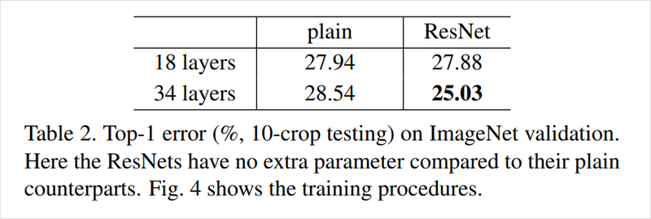
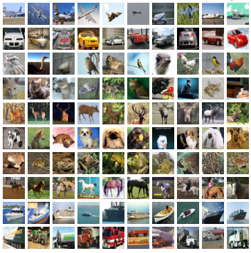
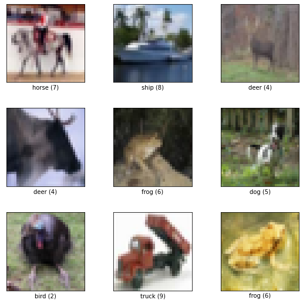
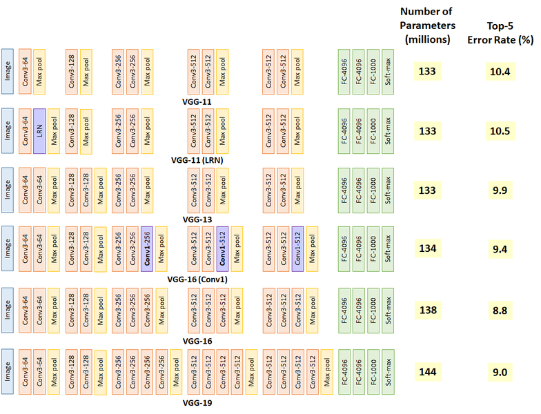
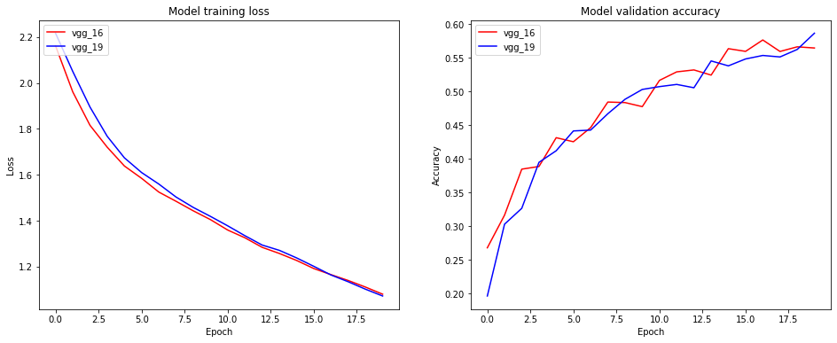
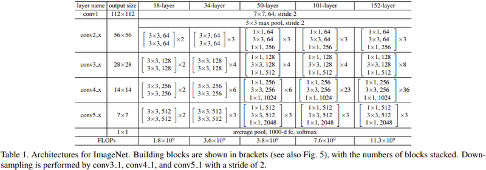
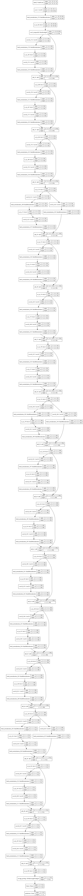

# 2. ResNet Ablation Study

딥러닝 논문에서는 다양한 방법들을 적용하며, 그 방법 적용 전후의 차이를 실험 결과로 보여준다. 이때 논문에는 어느 정도 구현방법과 실험의 설정이 나와있으니, 하드웨어 자원을 엄청나게 필요로 하거나 특정한 데이터셋이 필요한 경우를 제외하면 어느 정도 따라해볼 수 있다. 평소 논문을 보고 이해하는 데 집중했다면, 이번 시간에는 모델을 구현하고, 모델에 각 기법을 적용했을 때와 아닐 때를 비교해 보면서 효과를 직접 체감해보는 시간을 갖도록 해보자.

## 학습 목표

- 직접 ResNet 구현하기
- 모델을 config에 따라서 변경가능하도록 만들기
- 직접 실험해서 성능 비교하기

## Ablation Study

지금부터 해볼 프로젝트는 **애블레이션 연구**(ablation study)로, 직역하자면 '제거 연구' 정도로 해석할 수 있다.

딥러닝 논문은 여러 가지 방법들을 결합해서 어떤 문제를 해결하는 방법을 제시한다. 이때 제안한 방법들의 유효함을 증명하기 위해서 보통 딥러닝 논문에서는 해당 방법을 "제거"한 모델로 수행한 실험과, 해당 방법을 추가한 모델로 수행한 실험의 결과를 비교한다. 애블레이션 연구란 이처럼 "아이디어를 제거해 봄으로써" 제안한 방법이 어떻게 성능이나 문제에 해결에 효과를 주는지 확인하는 실험이다.

아래는 ResNet 논문에서 제시한 residual connection의 애블레이션 연구이다. 이미지넷(ImageNet) 검증 데이터셋(validation dataset)에 대한 Top-1 error rate을 지표로 사용해 residual connection이 없는 일반 네트워크(plain net)와 ResNet을 비교하였다. 이 비교를 통해서 ResNet이 residual connection을 활용해서 깊은 네트워크를 쌓았을 때, 이를 통한 성능 향상을 얻을 수 있음을 증명하고 있다.



## Ablation Study 실습 (1) CIFAR-10 데이터셋 준비하기

**ResNet**이 막 공개된 시점으로 돌아갔다고 생각해 보자. 이 방법이 논문으로는 유효하다고 들었지만 직접 실험을 해 성능을 평가하고, 다른 실험에 적용해 보기로 한다.

ResNet의 성능을 평가하기 위해서 원래 논문과 동일한 이미지넷의 훈련/검증 데이터셋을 사용해 학습과 평가를 진행하면 좋겠지만, 컴퓨팅 자원이 부족하므로 이미지넷보다는 적당한 크기의 CIFAR-10 데이터셋으로 평가해보도록 하자.
지금부터 실험은 CIFAR-10에 대해 일반 네트워크와 ResNet을 구현해서 이 둘을 비교하여 ResNet 및 residual connection의 유효성을 확인하는 것이다. ResNet에 대한 설명은 ResNet 이론 자료를 다시 한 번 확인하도록 하자.

- [Deep residual learning for image recognition](https://openaccess.thecvf.com/content_cvpr_2016/papers/He_Deep_Residual_Learning_CVPR_2016_paper.pdf)

### 1) CIFAR-10

---



- [CIFAR-10 from Tensorflow dataset](https://www.tensorflow.org/datasets/catalog/cifar10)

CIFAR-10 데이터셋은 10개 카테고리에 대해 총 6만 장의 이미지가 있고, 각 이미지들의 가로, 세로는 각각 32 픽셀(pixel)이다. MNIST에서 손글씨가 나타내는 숫자를 분류해내었던 것처럼 CIFAR-10 데이터셋을 사용해 물체의 종류를 분류해보도록 하자.

먼저 데이터셋을 준비한다. 텐서플로우에서 제공하는 **tensorflow-datasets** 패키지가 설치되어 있지 않다면 아래 명령어로 설치한다.

```python
$ pip install tensorflow-datasets
```

```python
# TensorFlow and tf.keras
import tensorflow as tf
from tensorflow import keras

# Helper libraries
import numpy as np
import matplotlib.pyplot as plt

import tensorflow_datasets as tfds

# Tensorflow가 활용할 GPU가 장착되어 있는지 확인해 봅니다.
tf.config.list_physical_devices('GPU')
```

데이터셋이 준비되면 클래스의 수와 클래스에 따른 이름을 볼 수 있다. **DatasetBuilder**의 **info**를 통해 정보를 확인할 수 있다.

**tfds.load()**는 기본적으로 **~/tensorflow_datasets** 경로에 데이터셋을 다운로드한다. 데이터셋 경로를 바꾸고 싶다면, **data_dir** 인자를 사용하면 된다.

```python
import urllib3
urllib3.disable_warnings()

#tfds.disable_progress_bar()

(ds_train, ds_test), ds_info = tfds.load(
    'cifar10',
    split=['train', 'test'],
    shuffle_files=True,
    with_info=True,
)

# Tensorflow 데이터셋을 로드하면 꼭 feature 정보를 확인
print(ds_info.features)

"""
FeaturesDict({
    'id': Text(shape=(), dtype=tf.string),
    'image': Image(shape=(32, 32, 3), dtype=tf.uint8),
    'label': ClassLabel(shape=(), dtype=tf.int64, num_classes=10),
})
"""

# 데이터 개수 확인
print(tf.data.experimental.cardinality(ds_train))
print(tf.data.experimental.cardinality(ds_test))
```

Tensorflow의 데이터셋은 Numpy가 아니므로 **shape** 메소드가 존재하지 않는다. 위와 같은 방법으로 데이터셋의 이미지 shape와 전체 데이터의 갯수, 라벨 클래스의 갯수 등 가장 중요한 정보들을 확인할 수 있다.

### 2) Input Normalization

---

모델에 이미지를 넣어주기 전에는 각 채널별 최댓값인 255로 정규화(normalize)를 해주어 이미지의 표현이 0과 1 사이로 들어오도록 만들어준다.

```python
def normalize_and_resize_img(image, label):
    """Normalizes images: `uint8` -> `float32`."""
    # image = tf.image.resize(image, [32, 32])
    return tf.cast(image, tf.float32) / 255., label

def apply_normalize_on_dataset(ds, is_test=False, batch_size=16):
    ds = ds.map(
        normalize_and_resize_img, 
        num_parallel_calls=1
    )
    ds = ds.batch(batch_size)
    if not is_test:
        ds = ds.repeat()
        ds = ds.shuffle(200)
    ds = ds.prefetch(tf.data.experimental.AUTOTUNE)
    return ds
```

MNIST 데이터셋 클래스는 0부터 9까지의 숫자, 총 10가지가 있다. CIFAR-10 데이터셋 또한 이름에서 알 수 있듯이 10개 클래스를 가진다. 아래 코드로 각 클래스가 어떻게 구성되는지, 어떤 이미지가 있는지 확인해 보자.

```python
ds_info.features["label"].num_classes
ds_info.features["label"].names

fig = tfds.show_examples(ds_train, ds_info)
fig = tfds.show_examples(ds_test, ds_info)
```



## Ablation Study 실습 (2) 블록 구성하기

모델을 프로그램으로 구현하는 과정에서는 논문의 모델을 그대로 구현하는 것도 중요하지만, 구현 시에 반복되는 부분을 줄여서 하이퍼파라미터 또는 변수를 변경하거나 모델 구조가 변경될 때 손쉽게 바꿀 수 있도록 만들어 놓는 것이 필요하다.

최근 나오는 일반적인 딥러닝 모델에서 이렇게 주요 구조를 모듈화 시켜 조금씩 바꾸어 쓸 수 있는 단위를 **블록(block)** 이라고 부른다. **레이어(layer)** 는 기본적으로 텐서플로우(TensorFlow), 케라스(Keras), 파이토치(PyTorch) 등에서 기본적으로 제공하는 단위다. 여기서 한 단계 위인 "블록"을 단위로 모델을 만들 수 있어야 한다.

프로젝트로 구현할 ResNet을 보면 ResNet-18, 34, 50, 101, 152로 다섯 가지 네트워크가 있다. 각 네트워크를 하나씩 구현하는 방법도 있지만 매우 수고스럽고 변경사항이 생기면 모두 고쳐줘야 하는 불편함이 생기게 된다. 따라서 이후 실습에서 ResNet의 기본 구조인 블록을 먼저 구현해보자.

### VGG로 기본 블록 만들기

---



VGG는 여러 가지 버전이 있다. 이 중 VGG의 VGG-16과 VGG-19의 기본 구조가 되는 블록을 만든다고 가정하고 블록을 구현해 보자.

VGG의 블록은 개략적으로 CNN 레이어 여러 개와 Max pooling 레이어 한 개로 이루어진다. CNN은 모두 커널 크기가 3x3 라는 대표적인 특징을 가지고 있다. 그리고 블록 내 CNN 레이어의 채널은 하나로 유지되지만 서로 다른 블록 간 CNN 레이어의 채널 수는 다를 수 있다. 블록에 따라서 CNN 레이어의 갯수 또한 달라진다. 블록의 마지막에는 항상 Max Pooling 레이어가 붙는다. 따라서 블록은 CNN 레이어 여러 개와 Max pooling 레이어 한 개로 이루어질 것이고, CNN의 레이어 수와 채널을 조절할 수 있어야 한다.

**block_num**은 레이어의 이름을 붙여주기 위해서 추가되었고 **input_shape**는 summary를 출력하기 위해서 넣어주었다.

```python
# function for building VGG Block

def build_vgg_block(input_layer,
                    num_cnn=3, 
                    channel=64,
                    block_num=1,
                   ):
    # 입력 레이어
    x = input_layer

    # CNN 레이어
    for cnn_num in range(num_cnn):
        x = keras.layers.Conv2D(
            filters=channel,
            kernel_size=(3,3),
            activation='relu',
            kernel_initializer='he_normal',
            padding='same',
            name=f'block{block_num}_conv{cnn_num}'
        )(x)    

    # Max Pooling 레이어
    x = keras.layers.MaxPooling2D(
        pool_size=(2, 2),
        strides=2,
        name=f'block{block_num}_pooling'
    )(x)

    return x
```

이제 위에서 만든 VGG 블록을 추가하는 함수를 이용해서 **input_layer** 에 추가한다. 입력 레이어는 아까 데이터셋에서 확인한 32, 32의 가로 세로 크기를 가지고 채널로 3을 가지므로 (32,32,3) 이 된다. 이 입력 레이어를 인자로 받아 **build_vgg_block()** 는 블록의 레이어를 build하고 출력값을 얻을 수 있다. 이제 케라스의 Model 클래스에서 input과 output을 정의해주면 간단히 블록의 모델을 확인해볼 수 있다.

```python
vgg_input_layer = keras.layers.Input(shape=(32,32,3))   # 입력 레이어 생성
vgg_block_output = build_vgg_block(vgg_input_layer)    # VGG 블록 생성

# 블록 1개짜리 model 생성
model = keras.Model(inputs=vgg_input_layer, outputs=vgg_block_output)  

model.summary()
```

## Ablation Study 실습 (3) VGG Complete Model

이제 기본적인 블록을 만들 수 있는 함수를 만들었으니 이를 합쳐서 전체 모델을 만들 수 있는 함수를 만들어보자.

### 1) VGG-16

---

먼저 작은 네트워크인 VGG-16을 먼저 만들어 보자. 블록 내의 CNN 레이어 수와 채널 수는 블록마다 달라진다. 이는 VGG-16과 VGG-19에 따라서 같이 변화되므로 함수에 전달되어야 한다. 여기서는 각 블록 별 CNN의 수와 채널을 리스트로 전달했다.

```python
# VGG 모델 자체를 생성하는 함수입니다.
def build_vgg(input_shape=(32,32,3),
              num_cnn_list=[2,2,3,3,3],
              channel_list=[64,128,256,512,512],
              num_classes=10):
    
    assert len(num_cnn_list) == len(channel_list) #모델을 만들기 전에 config list들이 같은 길이인지 확인합니다.
    
    input_layer = keras.layers.Input(shape=input_shape)  # input layer를 만들어둡니다.
    output = input_layer
    
    # config list들의 길이만큼 반복해서 블록을 생성합니다.
    for i, (num_cnn, channel) in enumerate(zip(num_cnn_list, channel_list)):
        output = build_vgg_block(
            output,
            num_cnn=num_cnn, 
            channel=channel,
            block_num=i
        )
        
    output = keras.layers.Flatten(name='flatten')(output)
    output = keras.layers.Dense(4096, activation='relu', name='fc1')(output)
    output = keras.layers.Dense(4096, activation='relu', name='fc2')(output)
    output = keras.layers.Dense(num_classes, activation='softmax', name='predictions')(output)
    
    model = keras.Model(
        inputs=input_layer, 
        outputs=output
    )
    return model

# 기본값을 그대로 사용해서 VGG 모델을 만들면 VGG-16이 됩니다.
vgg_16 = build_vgg()

vgg_16.summary()
```

### 2) VGG-19

---

위에서 16을 만들어봤으니 쉽게 구성(configuration)을 바꿔서 VGG-19를 만들 수 있다.

```python
# 원하는 블록의 설계에 따라 매개변수로 리스트를 전달해 줍니다.
vgg_19 = build_vgg(
    num_cnn_list=[2,2,4,4,4],
    channel_list=[64,128,256,512,512]
)

vgg_19.summary()
```

## Ablation Study 실습 (4) VGG-16 vs VGG-19

이제 본격적으로 위에서 준비한 데이터셋과 모델의 성능 비교를 위해서 모델을 훈련하고 평가해보자. VGG는 레이어의 차이를 위해서 VGG-16과 VGG-19를 비교해보도록 한다.

```python
BATCH_SIZE = 256
EPOCH = 20
# CIFAR-10 dataset load
(ds_train, ds_test), ds_info = tfds.load(
    'cifar10',
    split=['train', 'test'],
    as_supervised=True,
    shuffle_files=True,
    with_info=True,
)
ds_train = apply_normalize_on_dataset(ds_train, batch_size=BATCH_SIZE)
ds_test = apply_normalize_on_dataset(ds_test, batch_size=BATCH_SIZE)
```

```python
# VGG-16
vgg_16.compile(
    loss='sparse_categorical_crossentropy',
    optimizer=tf.keras.optimizers.SGD(lr=0.01, clipnorm=1.),
    metrics=['accuracy'],
)

history_16 = vgg_16.fit(
    ds_train,
    steps_per_epoch=int(ds_info.splits['train'].num_examples/BATCH_SIZE),
    validation_steps=int(ds_info.splits['test'].num_examples/BATCH_SIZE),
    epochs=EPOCH,
    validation_data=ds_test,
    verbose=1,
    use_multiprocessing=True,
)
```

```python
# VGG-19
vgg_19.compile(
    loss='sparse_categorical_crossentropy',
    optimizer=tf.keras.optimizers.SGD(lr=0.01, clipnorm=1.),
    metrics=['accuracy'],
)

history_19 = vgg_19.fit(
    ds_train,
    steps_per_epoch=int(ds_info.splits['train'].num_examples/BATCH_SIZE),
    validation_steps=int(ds_info.splits['test'].num_examples/BATCH_SIZE),
    epochs=EPOCH,
    validation_data=ds_test,
    verbose=1,
    use_multiprocessing=True,
)
```

```python
# 시각화
import matplotlib.pyplot as plt
figure = plt.figure(figsize=(16, 6))

plt.subplot(1, 2, 1)
plt.plot(history_16.history['loss'], 'r')
plt.plot(history_19.history['loss'], 'b')
plt.title('Model training loss')
plt.ylabel('Loss')
plt.xlabel('Epoch')
plt.legend(['vgg_16', 'vgg_19'], loc='upper left')

plt.subplot(1, 2, 2)
plt.plot(history_16.history['val_accuracy'], 'r')
plt.plot(history_19.history['val_accuracy'], 'b')
plt.title('Model validation accuracy')
plt.ylabel('Accuracy')
plt.xlabel('Epoch')
plt.legend(['vgg_16', 'vgg_19'], loc='upper left')
plt.show()
```



epochs를 늘리면 VGG-19가 조금 더 높은 정확도를 보이는 것을 확인할 수 있다.

## 프로젝트 : ResNet Ablation Study

### 1) ResNet 기본 블록 구성하기

---

이제 실전으로 돌아와서 ResNet-34와 ResNet-50 네트워크를 직접 만든다고 생각해보자. 우선 ResNet-34와 ResNet-50에서 사용되는 블록의 공통점을 찾고 차이점을 찾는다.

- [Deep Residual Learning for Image Recognition(paper)](https://arxiv.org/pdf/1512.03385.pdf)



## 회고록

- 매번 있는 모델만 복사 붙여넣기 하다가 처음으로 논문만 보고 모델을 바닥부터 짜는 것을 해보니 생각보다 쉽지 않았다.
- 특히 Block단위로 만드는 부분이 어려웠던 것 같다. 아무래도 익숙하지 않기 때문인 것 같다.
- 그래도 직접 모델을 구현해보니 다른 논문을 구현할 때 어떻게 해야 할지 조금은 감이 생긴 것 같다.
- 논문을 보고 똑같이 구현했음에도 불구하고 논문과 같은 결과를 얻진 못했다.
- cats_vs_dogs Dataset은 test set이 없어서 train set에서 8:2 비율로 나누어 사용하였다.


