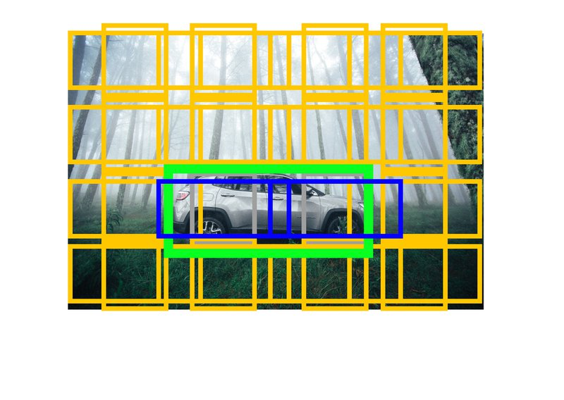

# 5. Object Detection


**Object detection**이란 이미지 내에서 물체의 위치와 그 종류를 찾아내는 것이다. 이번 시간에는 딥러닝을 기반으로 하는 object detection에 대해서 알아보도록 하자.
Object detection은 이미지 기반의 문제를 풀기 위해서 다양한 곳에서 필수적으로 사용되는 중요한 기법이다. 대표적으로는 자율주행을 위해서 차량이나 사람을 찾아내거나 얼굴 인식을 위해 사람 얼굴을 찾아내는 경우를 생각해 볼 수 있으며, 그 외에도 다양한 방식으로 이용되고 있다.

## 학습 목표

- 딥러닝 기반의 Object detection 기법을 배운다.
- Anchor box의 개념에 대해 이해한다.
- single stage detection model과 two stage detection 모델의 차이를 이해한다.

## 용어 정리

### 1) Object Localization

---

!(images01.png](./images/images01.png)

**Object detection**은 물체의 클래스를 **분류(classification)**할 뿐만 아니라 **위치 측정 (localization)**까지 함께 수행하는 작업이다.

**Localization**이란 이미지 내에 **하나의 물체(Object)**가 있을 때 그 물체의 위치를 특정하는 것인데, **Detection**이라 함은 **다수의 물체(Object)**가 존재할 때 각 Object의 **존재 여부를 파악**하고 **위치를 특정**하며 **클래스 분류(Classification)**까지 수행하는 것이다.

기본적으로 물체 한 개의 위치를 찾아낼 수 있다면 반복 과정을 통해 여러 물체를 찾아낼 수 있을 것이다. 그러니 먼저 localization부터 파헤쳐 보도록 하자. Localization을 통해 이미지 내의 물체의 위치를 찾는다면 이를 어떻게 표현할 수 있을 것인가?

- [딥러닝 객체 검출 용어 정리](https://light-tree.tistory.com/75)
- [Review of Deep Learning Algorithms for Object Detection](https://medium.com/zylapp/review-of-deep-learning-algorithms-for-object-detection-c1f3d437b852)

### 2) 바운딩 박스(Bounding Box)

---

!(images02.png](./images/images02.png)

- [이미지 인식 문제의 개요(Sualab Blog)](https://sualab.github.io/introduction/2017/11/29/image-recognition-overview-2.html)

**바운딩 박스(Bounding box)**는 이미지 내에서 물체의 위치를 사각형으로 감싼 형태의 도형으로 정의하고 이를 꼭지점의 좌표로 표현하는 방식이다.

이때 2개의 점을 표현하는 방식은 두 가지가 있다. 첫 번째로 전체 이미지의 좌측 상단을 원점으로 정의하고 바운딩 박스의 좌상단 좌표와 우하단 좌표 두 가지 좌표로 표현하는 방식이 있다. 두 번째는 이미지 내의 절대 좌표로 정의하지 않고 바운딩 박스의 폭과 높이로 정의하는 방식이다. 이 경우 좌측 상단의 점에 대한 상대적인 위치로 물체의 위치를 정의할 수 있다.

이번에는 직접 이미지에 박스를 그려보자. 아래 person.jpg 이미지를 다운받아 images 폴더로 이동시키고, 원본 이미지 위에 인물을 감싸는 사각형을 그려보자.

!(images03.png](./images/images03.png)

```python
from PIL import Image, ImageDraw
import os

img_path=os.getenv('HOME')+'/aiffel/object_detection/images/person.jpg'
img = Image.open(img_path)

draw = ImageDraw.Draw(img)
draw.rectangle((130, 30, 670, 600), outline=(0,255,0), width=2)

img
```

!(images04.png](./images/images04.png)

### 3) Intersection over Union

---

!(images05.png](./images/images05.png)

위에서 정의한 바운딩 박스가 있을 때 우리가 만든 localization 모델이 인식한 결과를 평가할 때, 각 좌표값의 차이를 L1이나 L2로 정의할 수도 있겠지만 이는 박스가 크면 그 값이 커지고 작아지면 그 값이 작아져 크기에 따라 달라지는 문제가 생긴다.
이렇게 면적의 절대적인 값에 영향을 받지 않도록 두 개 박스의 차이를 상대적으로 평가하기 위한 방법 중 하나가 **IoU(Intersection over Union)** 이다. 영문 그대로, 교차하는 영역을 합친 영역으로 나눈 값이다.

위의 그림에서 좀 더 직관적으로 볼 수 있습니다. 빨간색 영역 Ap는 예측(prediction)과 정답 Agt(ground truth)의 교집합인 영역이고 회색 영역이 합집합인 영역일 때, IoU는 빨간 영역을 회색 영역으로 나눠준 값이다.

## Localization

### 1) Target Label

---

물체의 영역을 숫자로 표현할 수 있게 되었다. 이제 localization을 위한 모델을 배워보자.

Classification 모델을 만들 때는 convolution layer로 구성된 백본 네트워크(backbone network)를 통해서 이미지의 특성을 추출하고 그 다음에 클래스 간 분류를 위한 fully connected layer를 추가했다. Classification 문제를 풀 때는 표현해야 할 클래스에 따라 최종 결과 노드의 갯수가 정해졌다.

이제 우리는 localization을 위해 박스의 위치를 표현할 output 노드 4개를 convolution layer로 구성된 백본 네트워크 다음에 추가해야 한다.

!(images06.png](./images/images06.png)

이를 위한 라벨은 위와 같다. `Pc`는 물체가 있을 확률이고, 물체가 있을 때, `c1, c2, c3`는 각각 클래스 1, 2, 3에 속할 확률이 된다. `Pc`가 0인 경우에는 배경일 것이다. 필요에 따라서는 `c1, c2, c3`와 `Pc`를 분리하여 다른 활성화 함수를 적용하고 손실을 계산할 수 있다.

그리고 여기에 바운딩 박스를 정의하기 위한 4개의 노드가 추가된다. 여기서는 바운딩 박스 좌측 상단의 점의 위치와 바운딩 박스의 폭과 높이로 표현했다. `bx, by`는 좌측 상단의 점을 표현하는 x축과 y축의 좌표이고, `bh`와 `bw`는 바운딩 박스의 높이와 폭이 된다.

단, `bx, by, bh, bw`는 모두 입력 이미지의 너비 w, 높이 h로 각각 Normalize된 상대적인 좌표와 높이/폭으로 표시된다.

- 참고 자료: [C4W3L01 Object Localization](https://www.youtube.com/watch?v=GSwYGkTfOKk)

```python
import tensorflow as tf
from tensorflow import keras

output_num = 1+4+3 # object_prob 1, bbox coord 4, class_prob 3

input_tensor = keras.layers.Input(shape=(224, 224, 3), name='image')
base_model = keras.applications.resnet.ResNet50(
    input_tensor=input_tensor,
    include_top=False,
    weights='imagenet',
    pooling=None,
)
x = base_model.output
preds = keras.layers.Conv2D(output_num, 1, 1)(x)
localize_model=keras.Model(inputs=base_model.input, outputs=preds)

localize_model.summary()
```

방금 만들어본 모델에는 위 그림에서 설명한 y가 target label로 제공된다. 이때의 target label이 어떻게 될지 직접 계산해보자.

!(images07.png](./images/images07.png)

위에 제공된 입력 이미지에서 object detection을 위한 target label y를 직접 만들어 보자. 단, 이 경우엔 개(dog)에 대한 단일 object detection이므로 class label은 고려하지 않는다. Ground Truth가 되는 bounding box의 좌표(position)은 위 그림과 같이 x1, y1, x2, y2이다. 그리고 입력 image의 너비(width)는 w, 높이(height)는 h로 주어진다. 

Target label y=[1, x1/w, y1/h, (y2-y1)/h, (x2-x1)/w] 이다.

## Detection

이제 localization을 확장해서 object detection을 해보도록 한다. Localization을 위한 모델은 입력값으로 들어온 이미지에서 특정 물체가 있는지 확인하고, 물체가 있다면 그 위치를 찾아내도록 했다. 하지만 이제는 Multi object detection을 통해 앞서 설명한 바와 같이 이미지에 있는 여러 물체를 한꺼번에 찾아내야 한다.

### 1) 슬라이딩 윈도우(Sliding Window)

---

!(images08.png](./images/images08.png)

위에서 계산한 localization은 일정한 크기의 입력 이미지에 어떤 물체가 있는지 확인하고 그 위치를 찾아내는 방법이었다. 큰 이미지에서 여러 물체를 찾으려면 우선 전체 이미지를 적당한 크기의 영역으로 나눈 후에, 각각의 영역에 대해 이전 스텝에서 만든 Localization network를 반복 적용해 보는 방식을 생각해 볼 수 있다. 이러한 방식을 **슬라이딩 윈도우(sliding window)**라고 한다. Localization network의 입력으로 만들기 위해서 원본 이미지에서 잘라내는 크기를 윈도우 크기로 하여, 동일한 윈도우 사이즈의 영역을 이동 시키면서(sliding) 수행해주는 방식이다. 마치 컨볼루션(Convolution)의 커널이 슬라이딩하는 것처럼 이해하면 된다.

그러나 Sliding Window방식은 매우 많은 개수의 window 영역에 대해 이미지의 localization을 돌아가면서 하나씩 진행해야 하므로 처리해야할 window 갯수만큼 시간이 더 걸린다. 또한 물체의 크기가 다양해지면 단일 크기의 window로 이를 커버할 수 없으므로 더욱 처리 속도 문제가 심각해진다.

### 2) 컨볼루션(Convolution)

---

!(images09.png](./images/images09.png)

Sliding window의 단점인 연산량과 속도를 개선하기 위한 방법 중 하나는 Sliding window 대신 convolution을 사용하는 것이다. Sliding window에서 언급했던 것과 같이, 이 아이디어는 convolution과 닮은 데가 있다. 위 그림에서 14X14 크기의 입력에 대해 convolution을 수행했을 때 최종적으로 얻어지는 1X1 사이즈의 출력을 sliding window 영역의 localization 결과라고 해석한다면, 거꾸로 14X14 크기의 receptive field가 바로 sliding window 영역이 되는 효과가 있다. 그러나 sling window로 localization을 수행하는 방식처럼 순차적으로 연산이 실행되는 게 아니라 병렬적으로 동시에 진행되므로 convolution은 속도면에서 훨씬 효율적이다.

결과적으로 Sliding window를 한번에 Convolution으로 연산을 할 수 있다. 이전 스텝에서 localization을 위한 output이 flat vector 형태로 생성되었다면, convolution의 결과로 얻어지는 1x1 형태의 output도 동일하게 localization 결과로 대체될 수 있을 것이다.

- 참고 자료: [라온피플 머신러닝 아카데미 - Fully Convolution Network](https://m.blog.naver.com/laonple/220958109081)

위의 그림에서는 입력 이미지가 들어왔을 때 특성을 추출하기 위한 첫번째 스테이지를 거친 후 classifier로 넘어간다. 이때 14x14, 16x16 크기의 입력 두 가지를 볼 수 있는데 14x14에서는 1칸에 대한 결과를 볼 수 있지만 16x16에서는 윈도우가 4개가 되어 4칸에 대한 결과를 볼 수 있다.

우리가 만드는 것이 차량을 찾는 Localization 모델이라면, 차량의 존재 여부에 대한 확률과 바운딩 박스를 정의하기 위한 4개의 값으로 크기가 5인 1x1 벡터가 의 1x1 한칸에 들어가게 된다.

- [C4W3L04 Convolutional Implementation Sliding Windows](https://www.youtube.com/watch?v=XdsmlBGOK-k)

### 3) 앵커 박스(Anchor Box)

---


이제 확인했던 Detection 모델로 위의 그림을 인식한다고 가정해 보자. 차 사이에 사람이 있을 때, 우리는 한 칸에 한 가지 물체만을 감지하기 때문에 만약 모두 차를 잡게 된다면 사람을 놓칠 수 밖에 없다.

**앵커 박스(anchor box)**는 서로 다른 형태의 물체와 겹친 경우에 대응할 수 있다. 일반적으로 차는 좌우로 넓고 사람은 위아래로 길쭉하다. 따라서 사람의 형태와 유사한 형태와 차와 유사한 형태의 가상의 박스 두 개를 정의한다.

기존에 위에서 본 모델의 구조에서 두 개의 클래스로 확장한다. 차와 사람 클래스에 대해서 물체를 감지하기 위해서는 한 개의 그리드 셀에 대한 결과값 벡터가 물체가 있을 확률, 2개의 클래스, 그리고 바운딩 박스 4개로 총 7개의 차원을 가지게 될 것이다. 따라서 입력값이 16x16일때, 이 그림을 2x2로 총 4칸의 그리드로 나누었다고 하면, 결과값의 형태는 7개의 채널을 가져 2x2x7이 된다.

이때 7개의 차원을 한 번 더 늘려주어 한 개의 물체의 수를 늘려준다. 앵커 박스가 두 개가 된다면 결과값의 형태는 2x2x14가 된다.

- [C4W3L08 Anchor Boxes](https://www.youtube.com/watch?v=RTlwl2bv0Tg)


위에서 설명한 앵커 박스는 위와 같다. **Anchor box #1**은 사람을 위해 설정한 크기이고 **Anchor box #2**는 차를 위해 설정한 크기이다. y의 라벨을 보면 앵커 박스가 2개가 됨에 따라서 output dimension이 두 배가 된 것을 볼 수 있다. 그리고 각각은 정해진 Anchor box에 매칭된 물체를 책임지게 된다.

그림 가장 우측에는 차만 있는 경우 사람을 담당하는 **Anchor box #1**의 pc가 0이 되고 차를 담당하는 **Anchor box #2**는 pc는 1이 되도록 클래스와 바운딩 박스를 할당하는 것을 볼 수 있다. 한 그리드 셀에서 앵커 박스에 대한 물체 할당은 위에서 배운 IoU로 할 수 있다. 인식 범위 내에 물체가 있고 두 개의 앵커 박스가 있는 경우 IoU가 더 높은 앵커 박스에 물체를 할당하게 된다.

- 바운딩 박스 : 네트워크가 predict한 object의 위치가 표현된 박스로서, 네트워크의 출력이다.
- 앵커 박스 : 네트워크가 detect해야 할 object의 shape에 대한 가정(assumption)으로서, 네트워크의 입력이다.

예를 들어, 차와 사람을 Detection하기 위한 모델의 output이 4x4 grid이고 각 cell에 Anchor box를 9개씩 정의한 경우 output의 dimension은 [Batch_size, 4, 4, 9x(1+4+2)]가 된다.

### 4) NMS(Non-Max Suppression)

---


- [C4W3L07 Nonmax Suppression](https://www.youtube.com/watch?v=VAo84c1hQX8)

2x2 또는 더 큰 Grid cell에서 물체가 있는 지에 대한 결과를 받게 되면 매우 많은 물체를 받게 된다. Anchor box를 사용하지 않더라도 2x2격자에 모두 걸친 물체가 있는 경우 하나의 물체에 대해 4개의 Bounding box를 얻게 될 것이다. 이렇게 겹친 여러 개의 박스를 하나로 줄여줄 수 있는 방법 중 하나가 **NMS(non-max suppression)** 이다.

NMS는 겹친 박스들이 있을 경우 가장 확률이 높은 박스를 기준으로 기준이 되는 IoU 이상인 것들을 없앤다. 이때 IoU를 기준으로 없애는 이유는 어느 정도 겹치더라도 다른 물체가 있는 경우가 있을 수 있기 때문이다. 이때 Non-max suppression은 같은 class인 물체를 대상으로 적용하게 된다.

### 5) 정리

---

- Convolutional implementation of Sliding Windows
- Anchor box
- Non-max suppression(NMS)

지금까지 위의 세 가지 개념과 CNN을 활용한 물체 검출(Object detection) 방법을 배워보았다.

Convolution으로 슬라이딩 윈도우를 대신함으로써 여러 window에서 Object localization을 병렬로 수행할 수 있게 되어 속도 측면의 개선이 있었다.
Anchor box는 겹친 물체가 있을 때, IoU를 기준으로 서로 다른 Anchor에 할당하도록 하여 생긴 영역이 다른 물체가 겹쳤을 때도 물체를 검출할 수 있도록 할 수 있게 되었다.
마지막으로 Non-max suppression은 딥러닝 모델에서 나온 Object detection 결과들 중 겹친 결과들을 하나로 줄이면서 더 나은 결과를 얻을 수 있게 했다.

이제는 위 3가지를 토대로 접근한 다양한 검출 모델을 확인해 보도록 하겠습니다.

## Detection Architecture

앞에서 봐왔던 바운딩 박스 regression과 앵커 박스, 그리고 NMS를 이용하면 어느 정도 동작하는 Detection 모델을 만들 수 있다. Detection task는 많은 분야에서 필요하듯이 연구도 활발하게 진행되고 있다. 활발한 연구만큼 다양한 방법들이 존재한다.

딥러닝 기반의 Object Detection 모델은 크게 **Single stage detector**와 **Two stage detector**로 구분할 수 있다.

- Many stage라고 적혀있는 방법에서는 물체가 있을 법한 위치의 **후보(proposals)** 들을 뽑아내는 단계, 이후 실제로 물체가 있는 지를 **Classification**하고, 정확한 바운딩 박스를 구하는 **Regression**을 수행하는 단계가 분리되어 있다. 대표적으로는 Faster-RCNN을 예로 들 수 있다.
- One stage Detector는 객체의 검출과 분류, 그리고 바운딩 박스 regression을 한 번에 하는 방법이다.


간단하게 single-stage와 two-stage로 구분해서 봤지만 딥러닝을 활용한 Object Detection 논문을 정리해도 아래와 같이 엄청나게 많다. 이 중에서 대표적인 Two-stage detector인 Fast R-CNN => Faster R-CNN의 변천사와 One-stage detector인 YOLO 및 SSD를 살펴보도록 하자.


### 1) Two-Stage Detector

---

- [R-CNNs Tutorial](https://blog.lunit.io/2017/06/01/r-cnns-tutorial/)
- [C4W3L10 Region Proposals](https://www.youtube.com/watch?v=6ykvU9WuIws)

**R-CNN**


위에서 보이는 Detection 모델들 중 먼저 **R-CNN**이라는 이름들이 눈에 띈다. 이 논문들이 대표적인 two-stage 방법들이다. R-CNN은 **물체가 있을 법한 후보 영역을 뽑아내는 "Region proposal" 알고리즘**과 **후보 영역을 분류하는 CNN**을 사용한다. 이때 Proposal을 만들어내는 데에는 Selective search라는 비신경망알고리즘이 사용된다. 이후에 후보 영역의 Classification과 바운딩 박스의 regression을 위해 신경망을 사용한다.

**Fast R-CNN**


위에서 본 R-CNN의 경우 region proposal을 selective search로 수행한 뒤 약 2,000개에 달하는 후보 이미지 각각에 대해서 컨볼루션 연산을 수행하게 된다. 이 경우 한 이미지에서 특성을 반복해서 추출하기 때문에 비효율적이고 느리다는 단점이 있다.

Fast R-CNN에서는 **후보 영역의 classification과 바운딩 박스 regression을 위한 특성을 한 번에 추출**하여 사용한다. R-CNN과의 차이는 이미지를 Sliding Window 방식으로 잘라내는 것이 아니라 해당 부분을 CNN을 거친 특성 맵(Feature Map)에 투영해, 특성 맵을 잘라낸다는 사실이다. 이렇게 되면 이미지를 잘라 개별로 CNN을 연산하던 R-CNN과는 달리 한 번의 CNN을 거쳐 그 결과물을 재활용할 수 있으므로 연산 수를 줄일 수 있다.

이때 잘라낸 특성 맵의 영역은 여러 가지 모양과 크기를 가지므로, 해당 영역이 어떤 클래스에 속하는지 분류하기 위해 사용하는 fully-connected layer에 배치(batch) 입력값을 사용하려면 영역의 모양과 크기를 맞추어 주어야 하는 문제가 생긴다. 논문에서는 RoI(Region of Interest) pooling이라는 방법을 제안해서 후보 영역에 해당하는 특성을 원하는 크기가 되도록 pooling하여 사용한다.


**Faster R-CNN**


Fast R-CNN은 반복되는 CNN 연산을 크게 줄여냈지만 **region proposal 알고리즘이 병목**이 된다. Faster R-CNN에서는 기존의 Fast R-CNN을 더 빠르게 만들기 위해서 region proposal 과정에서 **RPN(Region Proposal Network)**라고 불리는 신경망 네트워크를 사용한다.

이미지 모델을 해석하기 위해 많이 사용하는 CAM(Classification Activation Map)에서는 물체를 분류하는 태스크만으로도 활성화 정도를 통해 물체를 어느 정도 찾을 수 있다. 이처럼 먼저 이미지에 CNN을 적용해 특성을 뽑아내면, 특성 맵만을 보고 물체가 있는지 알아낼 수 있다. 이때 특성맵을 보고 후보 영역들을 얻어내는 네트워크가 RPN이다. 후보 영역을 얻어낸 다음은 Fast R-CNN과 동일하다.

### 2) One-Stage Detector

---

**YOLO (You Only Look Once)**


**YOLO**는 이미지를 그리드로 나누고, 슬라이딩 윈도우 기법을 컨볼루션 연산으로 대체해 Fully Convolutional Network 연산을 통해 그리드 셀 별로 바운딩 박스를 얻어낸 뒤 바운딩 박스들에 대해 NMS를 한 방식이다. 논문을 보면 이미지를 7x7짜리 그리드로 구분하고 각 그리드 셀마다 박스를 두 개 regression하고 클래스를 구분하게 한다. 이 방식의 경우 그리드 셀마다 클래스를 구분하는 방식이기 때문에 두 가지 클래스가 한 셀에 나타나는 경우 정확하게 동작하지는 않는다. 하지만 매우 빠른 인식 속도를 자랑하는 방법이다.

- 참고: [YOLO, Object Detection Network](http://blog.naver.com/PostView.nhn?blogId=sogangori&logNo=220993971883)
- 참고: [curt-park님의 YOLO 분석](https://curt-park.github.io/2017-03-26/yolo/)

**SSD (Single-Shot Multibox Detector)**


CNN에서 뽑은 특성 맵의 한 칸은 생각보다 큰 영역의 정보를 담게 된다. 여러 컨볼루션 레이어와 pooling을 거치기 때문에 한 특성 맵의 한 칸은 최초 입력 이미지의 넓은 영역을 볼 수 있게 된다.

YOLO의 경우 이 특성이 담고 있는 정보가 동일한 크기의 넓은 영역을 커버하기 때문에 작은 물체를 잡기에 적합하지 않다. 이러한 단점을 해결하고 다양한 크기의 특성 맵을 활용하고자 한 것이 SSD이다. SSD는 위의 모델 아키텍쳐에서 볼 수 있듯이 다양한 크기의 특성 맵으로부터 classification과 바운딩 박스 regression을 수행한다. 이를 통해서 다양한 크기의 물체에 대응할 수 있는 detection 네트워크를 만들 수 있다.

- 참고: [yeomko님의 갈아먹는 Object Detection 6 SSD: SIngle Shot Multibox Detector](https://yeomko.tistory.com/20)

## Anchor

### 1) Matching

---

지금까지 딥러닝 기반의 Object detection을 알아보았다. Anchor를 쓰지 않는 FCOS(Fully Convolutional One-Stage Object Detection)와 같은 방법도 있지만 많은 방법들이 Anchor를 기반으로 구현되고 있으니 이를 기반으로 어떻게 학습되는지 알아보도록 하자.
YOLO와 Faster-RCNN에서 Anchor를 기반으로 Loss를 계산하는 방식에는 두 가지 Intersection over Union(IoU)를 threshold로 사용한다. 하나는 Background IoU threshold 그리고 다른 하나는 Foreground IoU threshold이다. 이런 방식은 Faster R-CNN에서 먼저 확인할 수 있다. 객체와의 IoU가 0.7이상일 경우 Foreground로 할당하고 0.3 이하일 경우는 배경(Background)으로 할당한다. 0.3과 0.7의 중간인 Anchor들은 불분명한 영역으로 학습에 활용하지 않는다.


위의 차량을 Detection하기 위한 Detection model을 상상해보면 Feature map의 Grid 한 칸 마다 다양한 크기 및 Apsect ratio를 가진 Anchor를 만들고 이와 차량의 크기를 비교해서 학습을 해야할 것이다.
위의 예시를 보면 Anchor의 크기가 차량의 박스 크기에 비해 매우 작은 것을 알 수 있다. 이 경우 차량 영역에 들어간 Anchor box이라도 교차(intersection)하는 면적이 작기 때문에 IoU가 작아 매칭이 되지 않는 것을 알 수 있다. 이러한 이유 때문에 탐지하고자 하는 물체에 따라서 Anchor box의 크기나 aspect ratio를 조정해주어야 한다.
만약 세로로 긴 물체를 주로 탐지해야 하면 세로로 긴 Anchor box를 많이 만들고 Matching되는 box를 늘려야 학습이 잘될 수 있다.



차량을 Detection하기 위해서 Anchor의 크기를 키우고 Aspect raito를 조정하여 가로로 길게 만들 수 있다. 위의 예시에서는 Anchor의 크기를 키우고 Aspect ratio를 조정했다.
그리고 Anchor box와 녹색의 차량 bounding box 간의 IoU를 계산해서 물체와의 IoU가 0.3 이하인 경우는 배경으로 그리고 0.7 이상인 경우는 차량으로 할당되고 두 가지 모두에 해당하지 않는 경우에는 Loss가 학습에 반영되지 않도록 한다.
위의 이미지에서는 노란색의 경우 배경으로 할당되고 회색은 학습에 반영되지 않으며, 녹색은 물체로 학습이 됩니다. 이전에 학습했던 것처럼 노란색의 경우에는 배경이므로 물체의 bounding box를 추정하기 위한 Regression은 loss에 반영되지 않는다. 따라서 파란색 anchor box만이 regression을 학습할 수 있는 sample이 된다.
다양한 물체에 Anchor Box가 걸쳐있는 경우 가장 높은 IoU를 가진 물체의 Bounding box를 기준으로 계산이 된다.

### 2) Bounding box Regression

---


Anchor box는 물체를 예측하기 위한 기준이 되는 Box이다. 그럼 Anchor box에서 Bounding box는 어떤 식으로 계산이 될까?
여러가지 접근 방법이 있지만 YOLOv3를 기준으로 설명하면, YOLOv3의 전신인 YOLOv2부터 Bounding box Regression 방식을 사용한다. 각 Anchor box에 대응되는 network는 tx, ty, tw, th의 4가지 output으로 bounding box를 regression해서 정확한 box를 표현하게 된다.

Bounding box를 예측하기 위해 예측해야 할 것은 bounding box의 중심점(bx, by), 그리고 width(bw)와 height(bh)이다. 그러나 이 값을 직접 예측하는 것이 아니라 위 그림에 있는 수식과 같이 anchor box의 정보 cx, cy, pw, ph와 연관 지어 찾는 방법을 사용한다.

기존의 Anchor box 위 좌측 상단이 cx, cy이고 width, height가 pw, ph이다. 이를 얼마나 x축 또는 y축방향으로 옮길지 그리고 크기를 얼마나 조절해야 하는지를 예측하여 물체의 bounding box를 추론하게 된다.
