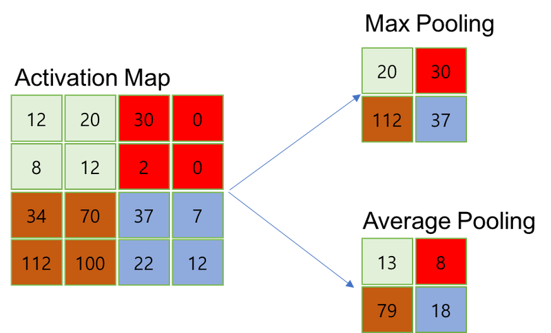
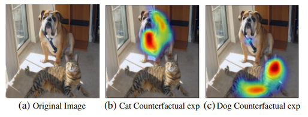

# 9. Activation Map

지금까지 딥러닝 모델을 기반으로 이미지를 분류, 탐지하는 여러 가지 모델을 공부했을 것이다. 이미지를 모델의 입력에 맞게 전처리해주고 모델에 통과시킨 뒤 결과를 해석해서 추론값을 얻어내는 과정이 익숙할 것이다.

그런데 모델이 잘 동작한다는 것을 확인하고 끝내기에는 궁금한 것들이 많다. 예를 들면 개와 고양이를 분류하는 딥러닝 모델을 만들었다고 할 때, 이 모델이 이미지의 어느 부분을 보고 개라는 결론을 내렸는지 알 수 없을 것이다. 그동안 우리가 다룬 딥러닝은 모델의 추론 근거를 알 수 없는 블랙박스(Black Box) 모델이었다. 그래서 이 모델을 신뢰할 수 있는지조차 명확하지 않다. 그래서 이번 시간에는 모델과 추론의 신뢰성에 대한 답을 찾는 **XAI(Explainable Artificial Intelligence, 설명 가능한 인공지능)** 분야에 대해 알아볼 것이다. XAI 기법은 모델의 성능을 개선할 수 있는 단서로도 유용하게 활용될 것이다.

## 실습목표

- 분류 모델의 활성화 맵을 이해한다.
- 다양한 활성화 맵을 구하는 방법을 알아간다.
- 약지도학습(weakly supervised learning)을 이해한다.

## Explainable AI

많은 AI 모델들이 다양한 분야에 적용되어 좋은 성과를 내고 있. 하지만 이렇게 현실 문제에 신경망 모델을 적용할 때에는 실습 문제를 풀 때처럼 단순히 모델의 가중치(weight)를 최적화하는 과정만을 믿고, 곧바로 모델이 올바르게 동작한다고 넘겨짚기는 어렵다. 이때 모델이 잘못된 답변을 준다면 어떻게 개선할 수 있을지, 잘 동작한다면 왜 이런 선택을 했는지 알고자 하는 것을 XAI(explainable AI) 라고 한다. 아래 영상을 보고 XAI가 어떤 것이며 왜 필요한 것인지 알아보도록 하자.

- [이유를 설명해주는 딥러닝, XAI (Explainable AI)](https://www.youtube.com/watch?v=U43fxbC-4JQ)

### 이미지 분류 문제(Image Classification)

---

위 그림처럼 분류 모델에 이미지가 입력으로 들어온다고 생각해보자. 먼저 일반적인 이미지 분류 모델은 이미지의 local feature를 추출하기 위해 CNN으로 구성된 특성 추출용 백본 네트워크(backbone network)가 앞에 있다. 백본 네트워크에서 추출된 특성 맵(feature map)을 fully connected layer에 통과시켜 얻어진 logit을 소프트맥스(softmax) 활성화 함수에 통과시키면, 입력 이미지가 각 클래스에 속할 확률을 얻을 수 있다. 여기서 logit, sigmoid, softmax 함수의 관계에 대해 잠시 짚고 넘어가자.

- 참고: [한 페이지 머신러닝-logit, sigmoid, softmax의 관계](https://opentutorials.org/module/3653/22995)

위 링크의 설명을 통해, logit이 아래와 같이 sigmoid의 역함수이며, softmax는 sigmoid를 K개의 클래스로 일반화한 것임을 알 수 있다.

$$t = logit(y) = \frac{y}{1-y}$$

$$y = sigmoid(t) = \frac{1}{1+exp(t)}$$

이미지 분류 문제에서 딥러닝 모델이 어떤 클래스로 정답을 냈을 때, 모델 내부에서 그 이유를 찾아보기 위해서는 레이어마다 Feature map을 시각화해서 Activation이 어떻게 됐는지 확인해볼 수 있을 것이다.

## CAM : Class Activation Map

많은 연구자들이 앞서 대답하신 질문의 답을 찾으려 노력해 왔다. 지금부터 배울 **CAM(Class Activation Map)** 은 이미지 분류 분야에서의 노력의 결과 중 하나다. 단순화 시켜 이야기 하면 "모델이 어떤 곳을 보고 각 클래스임을 짐작하고 있는지" 확인할 수 있는 지도이다. CAM은 MIT 연구진의 Learning Deep Features for Discriminative Localization 논문에서 확인할 수 있다.

우선 위 논문의 저자인 Bolei Zhou의 What the CNN is looking 영상을 보고 CNN이 어떤 영역을 활성화 시키는지 확인해 보도록 하자.

- [What the CNN is looking](https://www.youtube.com/watch?v=fZvOy0VXWAI&t=20s)

본격적으로 CAM을 공부하기 전에 먼저 논문에 나오는 GAP(global average pooling) 기법부터 공부할 것이다. CAM 논문의 연구진은 CAM을 얻기 위해서 GAP을 사용했으며, 이를 통해서 어떤 클래스가 어느 영역에 의해서 활성화되었는지 알 수 있도록 한다.

### 1) GAP (Global Average Pooling)

---

- [Network In Network](https://arxiv.org/abs/1312.4400)
- [navisphere.net의 Network In Network리뷰](http://www.navisphere.net/5493/network-in-network/)
- [C4W1L09 Pooling Layers](https://www.youtube.com/watch?v=8oOgPUO-TBY)

분류 모델의 마지막 부분에서 fully connected layer 대신 GAP을 사용하는 방법은 Network in Network라는 논문에서 제안되었다.

우리는 일반적으로 이미지 분류를 위해서 여러 CNN 레이어를 거쳐 우선 특성을 추출하고, 그 특성 맵을 flattening 한 후 fully connected layer에 입력해 줌으로써 각 클래스에 따른 logit을 구하고 최종 활성화 함수를 거치게 한다.

GAP(Global Average Pooling)은 매 채널별로, 위에서 보았던 average pooling을 채널의 값 전체에 global하게 적용한다. 위 그림에서 볼 수 있듯이 크기가 6x6이고 채널이 3개인 특성맵에 대해서 GAP을 수행하면 각 채널이 딱 한 개의 숫자로 요약되어, 1x1 크기에 채널이 3개인 벡터를 얻게 된다. 이때 결과 벡터의 각 차원의 값은 6x6 크기의 특성 맵을 채널 별로 평균을 낸 값이 된다.

Network in Network 논문에서는 CNN 이후 fully connected layer를 사용하는 대신 아래 그림처럼 GAP 연산을 한 후 이에 대해 소프트맥스 활성화 함수를 적용한다. 이때 마지막 CNN 레이어의 채널 수는 데이터의 클래스 수에 맞춰 각 클래스에 따른 확률을 얻을 수 있도록 했다. 원 논문에서는 이렇게 하면 특성 맵의 각 채널이 클래스별 신뢰도를 나타내게 되어 해석이 쉬울 뿐만 아니라, fully connected layer과 달리 최적화할 파라미터가 존재하지 않으므로 과적합(overfitting)을 방지할 수 있다고 설명한다.

### 2) CAM

---

- [Learning Deep Features for Discriminative Localization](http://cnnlocalization.csail.mit.edu/Zhou_Learning_Deep_Features_CVPR_2016_paper.pdf)
- [POD_Deep-LearningCAM - Class Activation Map의 CAM - Class Activation Map리뷰](https://poddeeplearning.readthedocs.io/ko/latest/CNN/CAM%20-%20Class%20Activation%20Map/)

**CAM(Class Activation Map)** 은 이름에서 보이듯이 클래스가 활성화되는 지도다. 일반적인 CNN은 커널 윈도우에 따라서 특성을 추출하므로 CNN 레이어를 거친 특성 맵에도 입력값의 위치정보가 유지된다. 따라서 우리는 특성 맵의 정보를 이미지 검출(detection)나 세그멘테이션(Segmentation) 등의 문제를 푸는 데 이용하기도 한다.

CAM을 얻을 수 있는 네트워크는 위 그림에서 볼 수 있다. 먼저 CNN 레이어를 거쳐 뽑아낸 특성 맵에 대해서 GAP을 적용한다. 그리고 이에 대해서 소프트맥스 레이어(소프트맥스 활성화 함수를 가지고 bias가 없는 fully connected layer)를 적용한다.

CNN을 거친 특성맵에서 각 클래스에 대한 정보는 결과값의 여러 채널에 걸쳐 나타나게 된다. GAP을 통해 각 채널 별 정보를 요약하면 소프트맥스 레이어는 이 정보를 보고 각 클래스에 대한 개별 채널의 중요도를 결정한다. 이렇게 클래스 별로 소프트맥스 레이어를 통해 각 채널의 가중합을 구하면 각 클래스가 활성화 맵의 어떤 부분을 주로 활성화 시키는지 확인할 수 있다.

우리가 이렇게 얻은 특성 맵은 CNN의 출력값 크기와 같게 된다. 이를 보간(interpolation)을 통해 적절히 원본 이미지 크기로 확대해 주면 위와 같은 CAM을 얻을 수 있다.

이제 수식을 하나씩 살펴보도록 하자. 아래 수식은 위 그림을 수식으로 설명한 것에 불과하므로, 위 그림과 비교하여 살펴본다.

k = 1, 2, ..., n 인 k번째 채널에 대해서, $w^c_k$는 각 클래스 (c)노드와 k번째 채널 사이의 가중치 값이다.
$f_k(x, y)$는 k번째 채널의 x, y요소의 활성화 값이다. 위 그림에서는 파란색 네모 박스로 시각화되어 있다. 이 두 가지를 곱하고 모든 채널과 x, y축에 대해 더해줌으로써 클래스별 점수 Sc를 구할 수 있다. 이렇게 구한 것이 위 그림 우하단의 최종 Class Activation Map으로 시각화되어 있다.

CAM을 얻기 위해서는 위에서 점수를 얻기 위해서 모든 위치의 활성화 정도를 더해준 것과 달리 각 x, y위치에서 k개의 채널만 더해주어 위치정보가 남도록 한다. 이를 통해서 얻어진 CAM은 각 위치에서 채널 별 활성화 정도의 가중합인 $M_c(x, y)$가 된다. $M_c(x, y)$은 모델이 클래스 c에 대해 각 위치를 얼마나 보고 있는지 나타내는 것이다.

## Grad-CAM

- [Grad-CAM: Visual Explanations from Deep Networks via Gradient-based Localization](https://arxiv.org/abs/1610.02391)

위에서 본 CAM의 경우에는 활성화 맵을 얻기 위해서 GAP을 사용하여 $f_k$를 구하고, 그 뒤로 fully connected layer $w^c_k$를 추가로 붙여야 한다. 또 가장 마지막 CNN 레이어의 결과물만을 시각화할 수 있다. Grad-CAM(Gradient CAM)은 이렇게 모델의 구조가 제한되는 문제를 해결하고 다양한 모델의 구조를 해석할 수 있는 방법을 제안합니다. Grad-CAM을 사용하면 CNN 기반의 네트워크는 굳이 모델 구조를 변경할 필요가 없으며, 분류 문제 외의 다른 태스크들에 유연하게 대처할 수 있습니다.

위의 이미지는 개와 고양이가 있는 이미지에 대해서 Guided Backprop, Grad-CAM, Occlussion map의 시각화를 비교하고 있다. Grad-CAM에서는 높은 분별력과 큰 dimension을 갖는 CAM을 만드는 것을 중요하게 보았다.

Grad-CAM의 전체적인 구조는 위와 같다. 그림의 왼쪽에서 모델의 구조를 볼 수 있다. 위에서 보았던 이미지를 입력으로 CNN을 거쳐 특성 맵을 추출하고 그 뒤로 태스크에 따라서 다양한 레이어들이 사용된다.

오른쪽의 "Image Classification"과 "Image captioning", "Visual question Answering"은 Grad-CAM이 적용될 수 있는 다양한 컴퓨터 비전 문제들을 설명한다. Image Classification은 익히 들어오셨겠지만 Image Captioning이나 Visual Question answering은 생소할 것이다. **Image Captioning**은 이미지에 대한 설명을 만들어내는 태스크이다. **Visual question answering**은 VQA라고도 불린다. 어떤 질문과 이미지가 주어졌을 때 이에 대한 답변을 내는 태스크이다. 이렇게 복잡한 모델들은 다양한 모델이 한 번에 사용되고 이로 인해 설명하기가 매우 어렵다고 볼 수 있다. Grad-CAM은 이런 복잡한 태스크에 사용되는 모델에서도 사용될 수 있다는 점을 장점으로 내세운다.

### Gradient를 통한 Weight Score 계산

---

위에서 보았던 CAM에서는 소프트맥스를 가진 fully connected layer의 가중치를 통해서 어떤 클래스에 대한 각 채널의 중요도 또는 가중치를 얻어냈다. Grad-CAM에서는 그래디언트(gradient)를 사용하여 CAM을 얻어낸다. 원하는 클래스에 대해서 관찰하는 레이어로 들어오는 그래디언트를 구한다면, 해당 클래스를 활성화하는 데 레이어의 특성 맵에서 어떤 채널이 중요하게 작용하는지 알 수 있다.

아래의 식은 클래스에 대해서 backpropagation을 통해 얻은 k번째 채널의 그래디언트를 통해 가중치 점수(Weight score)를 구하는 식입니다. 아래의 식에서 y는 모델의 출력값이고 A는 활성화 맵을 의미한다. i, j는 각각 x축, y축으로 볼 수 있다. Z는 전체 map의 크기이다.  i=1, 2, ..., u이고,  j=1, 2, ..., v라면  Z=u*v가 되어 활성화 맵 전체에 대한 global average를 구하기 위한 분모가 된다.

이제 위의 식을 통해서 개의 채널을 가진 활성화 맵에서 각 채널이 어떤 클래스를 활성화하는 데 얼마나 중요하게 작용하는지 가중치 점수를 구할 수 있다. 이 가중치를 구하기 위해 CAM처럼 별도의 weight 파라미터를 도입할 필요가 없다는 것을 알 수 있다.

Grad-CAM은 정보를 합쳐 활성화 맵에서 어떤 클래스의 위치에 따른 활성화를 보기 위해서 k번째 활성화 맵과 이 가중치를 곱해주어 합한 뒤 ReLU 활성화 함수를 통해서 클래스에 따른 Grad-CAM을 얻는다. 이 수식을 시각화한 것이 맨 위에서 소개한 고양이와 개에 대한 Grad-CAM의 (c), (i)번째 예시이다.

Grad-CAM에서는 활성화된 영역을 확인해야 하기 때문에 불필요한 음의 값을 줄여주기 위하여 ReLU함수를 사용한다.

## ACoL : Adversarial Complementary Learning

- [Adversarial Complementary Learning for Weakly Supervised Object Localization](https://openaccess.thecvf.com/content_cvpr_2018/papers/Zhang_Adversarial_Complementary_Learning_CVPR_2018_paper.pdf)

CAM을 보면서 신기한 점은 우리는 클래스와 이미지만을 데이터로 학습을 하는데 덤으로 위치정보까지 얻을 수 있다는 것이다. 이렇게 직접적으로 정답 위치정보를 주지 않아도 간접적인 정보를 활용하여 학습을 하고 원하는 정보를 얻어낼 수 있도록 모델을 학습하는 방식을 **약지도학습(weakly supervised learning)** 이라고 한다. 지금까지 봐왔던 CAM, Grad-CAM 그리고 지금 설명하는 ACoL은 약지도학습 기법을 활용한 물체 검출(object detection)을 수행할 수 있다.

### 1) 약지도학습(Weakly supervised learning)

---

딥러닝 관련 공부를 하다보면 약지도학습과 준지도학습(semi-supervised learning)이라는 단어를 만날 수 있다. 두 개념이 실제로도 다소 혼동스럽게 사용되고 있기 때문에, 다음과 같은 경우들로 나누어 생각해 볼 수 있다. 아래 분류는 [A brief introduction to weakly supervised learning](https://academic.oup.com/nsr/article/5/1/44/4093912) 논문에서 정의된 것을 가져와서 정리한 것이다.

- **incomplete supervision** : 학습 데이터 중 일부에만 라벨이 달려 있는 경우 (예: 개와 고양이 분류 학습시 10000개의 이미지 중 1000개만 라벨이 있는 경우) 이 경우가 일반적으로 말하는 준지도학습과 같은 경우이다.
- **inexact supervision** : 학습데이터의 라벨이 충분히 정확하게 달려있지 않은 경우. (예: 개나 고양이를 Object Detection 또는 Semantic Segmentation해야 하는데, 이미지 내에 정확한 bounding box는 주어져 있지 않고 이미지가 개인지 고양인지 정보만 라벨로 달려있는 경우)
- **inaccurate supervision** : 학습 데이터에 Noise가 있는 경우 (예: 개나 고양이의 라벨이 잘못 달려있는 경우)

약지도학습이란 위 3가지 경우를 포괄적으로 일컫도록 사용되곤 하지만, 오늘 우리가 다루고자 하는 것은 바로 **inexact supervision**에 해당하는 경우이다. 일반적으로 Image Classification용 학습데이터보다는 bounding box 정보까지 정확하게 포함해야 하는 Object Detection이나 Semantic Segmentation을 위한 학습데이터가 훨씬 제작비용이 많이 든다.

아래는 Grad-CAM 논문에서 언급한 약지도학습을 통한 Object Detection과 Semantic Segmentation의 예시이다.

위 사진은 Grad-CAM을 통한 Counterfactual Explanation 예시이다. 아이디어는 간단하다. Grad-CAM을 통해 개와 고양이의 특징이 두드러지게 하는 영역의 가중치 점수를 계산할 수 있었다면, 오히려 해당 가중치 점수를 제거해 주면 Image classification 모델에서 해당 클래스에 대한 prediction이 바뀌게 될수도 있다. 그렇게 제거했을 때 prediction이 바뀌도록 하는 가중치 영역을 모으면 한번도 bounding box 라벨을 보지 않고서도 object detection을 해낼 수 있다는 것이다.

또한 Grad-CAM을 이용해서, 위와 비슷한 논리로 Semantic Segmentation도 수행 가능함을 보여준다. 또 다른 예로, [네이버랩스의 이미지기반의 차선변경 알고리즘(SLC)은 무엇을 보면서 판단을 할까?](https://www.naverlabs.com/storyDetail/16) 에서는 자율주행 연구에 약지도학습을 활용한 예를 확인할 수 있다.

### 2) Adversarial Complementary Learning

---

Adversarial의 뜻은 "적대적인"이다. 논문 제목에서 사용된 adversarial complementary learning(ACoL)은 위 그림에서 볼 수 있듯이 모델의 학습에는 끝단이 두 브랜치(branch)로 나눈다. CAM을 만들기 위해 활용했던 특성 맵을 두 가지로 분리한 것이다.

CAM, Grad-CAM도 Weaky-supervised 방식의 Object Detection, Segmentation 의 가능성을 보여 주었다. 그러나 이들 방식에는 한가지 문제가 있다. CAM을 통해 본 활성화 맵을 보면 가장자리보다는 특징이 주로 나타나는 위치에 중점적으로 활성화가 되는 모습을 볼 수 있다. 하지만 물체 검출(Object detection)은 새의 부리나 동물의 눈, 시계의 숫자와 같이 부분적 특성이 아닌 물체의 전체적인 형태와 윤곽을 정확하게 구분해 내는 것이 중요하다. CAM 모델이 특정 부위에 집중해 학습하는 것을 막기 위해서 ACoL은 브랜치를 두 가지로 두어 너무 높은 점수를 지워줌으로서 주변의 특성 또한 반영하도록 했다. 이러한 과정을 논문에서는 Adversial, 즉 적대적인 학습방법이라고 한다.

먼저 위쪽 주황색 브랜치를 거친다. 특성 맵은 GAP을 거쳐 CAM에서 보았던 소프트맥스 레이어인 `Classifier A`를 거치게 된다. 이 브랜치는 loss로 학습된다. ACoL은 여기서 얻어진 활성화 맵을 적대적인 방법으로 사용한다. 일정 값 이상 활성화된 활성화 맵을 지우도록 하는 것이다. `Classifier A`는 쉽게 전체적인 이미지를 보고 클래스를 판별할 수 있는 반면에 `Classifier B`는 A의 CAM에서 크게 활성화된 영역을 지운 활성화 맵에서 분류를 해야하기 때문에 더 어려운 문제를 푸는 것으로 볼 수 있다. 이렇게 두 가지 `Classifier A`와 `Classifier B`를 학습시킴으로써 더 넓은 영역을 판별의 근거로 삼을 수 있다. 이 과정을 통해서 모델은 쉽게 맞출 수 있는 샘플을 어렵게 다시 한 번 학습을 하는 Adversarial Complementary Learning 과정을 거치게 된다.

결과적으로 위 그림에서는 기존 CAM이 활성화 되는 부분과 달리 ACoL은 물체의 전반적인 영역으로 CAM이 활성화되는 효과를 확인할 수 있다.

### 3) 1x1 Conv

---

CAM에서는 CAM을 얻기 위해서 대상이 되는 네트워크에 feed forward를 하고 활성화 맵과 가중치 계산을 다시 해주어야 한다. 이 과정은 관찰하고자 하는 분류 모델의 feed forward와 별개의 작업이므로, 물체 검출을 위한 모델로 사용하기 위해서는 모델의 feed forward 외 별도의 연산을 해주어야 하는 단점이 있다.

ACoL 논문은 이를 개선하기 위해서 **커널 사이즈는 1x1**, **출력 채널의 개수는 분류하고자 하는 클래스 개수**를 가진 컨볼루션 레이어를 특성 맵에 사용하고 여기에 GAP를 적용하여 Network in Network에서 본 구조와 유사한 방식을 사용하고 있다. 여기서 컨볼루션 레이어의 출력값은 곧바로 활성화 맵이 된다. 이렇게 구해진 활성화 맵과 CAM을 비교한 결과를 위 그림의 왼쪽에서 볼 수 있다.

## 생각해보기

이제 분류 모델을 사용할 수 있을 뿐만 아니라 활성화 맵을 통해서 모델이 어느 영역을 보고 답을 내리는지도 알 수 있게 되었다.

CAM을 활용하면 멋진 프로젝트들을 만들 수 있다. 예컨대 [황준식님의 CAM: 대선주자 얼굴 위치 추적기](https://jsideas.net/class_activation_map/)에서는 2017년 대선주자의 얼굴을 분류하고 이 모델을 기반으로 어느 위치에 얼굴이 있는지를 찾는 실험까지 구현한다.

이번에는 남들이 해둔 것이 아니라 직접 분류 및 시각화 모델을 만든다고 생각하고 이를 생각해보는 시간을 갖도록 하자. 아래의 질문들을 중심으로 어떻게 문제를 풀어나갈지 생각해보고, 나중에 이를 직접 구현해본다면 정말 멋진 경험이 될 것이다.

### 생각해 볼 거리

---

- 어떤 분류문제를 풀고 싶은가?
- 데이터를 어떻게 모을 수 있을까?
- 어떤 모델을 기반으로 사용할까?
- Class Activation Map을 활용해서 보여준다면 어떤 점이 좋을까?
