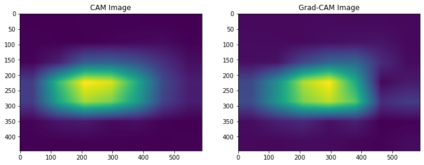
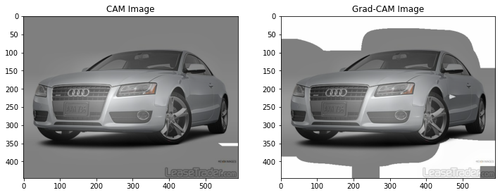

# 10. Class Activation Map 만들기


이번 시간에는 CAM(Class Activation Map)을 얻기 위한 방법 중 **기본 CAM**과 **Grad-CAM**을 구현해보고 이를 시각화해 보자. 그리고 CAM을 활용해서 물체의 위치를 찾는 object detection을 수행하고 이를 정답 데이터와 비교해 볼 것이다.

## 실습목표

- Classification model로부터 CAM을 얻어낼 수 있다.
- CAM으로 물체의 위치를 찾을 수 있다.
- CAM을 시각화 비교할 수 있다.

## CAM, Grad-CAM용 모델 준비하기 (1) 데이터셋 준비하기

**CAM(Class Activation Map)**은 특성을 추출하는 CNN 네트워크 뒤에 GAP(Global Average Pooling)와 소프트맥스 레이어(softmax layer)가 붙는 형태로 구성되어야 한다는 제약이 있다. 반면에 Grad-CAM은 이러한 제약이 없다.

이번엔 두 가지를 모두 구현해 볼 것이다. 우선 CAM을 위한 모델을 먼저 구성해 기본적인 CAM을 추출해보고, 이 모델에서 Grad-CAM을 활용해 다시 시각화 결과물을 추출한다. Grad-CAM은 모델의 구조에 제약이 없기 때문에 CAM에만 모델을 맞춰도 충분하기 때문이다.

CAM은 클래스에 대한 활성화 정도를 나타낸 지도이다. 따라서 기본적으로 우리의 모델은 분류(classfication)를 수행하는 모델이어야 한다. 하지만 우리의 최종 목표는 이미지 내에서 클래스가 활성화 된 위치를 확인하고 이를 정답과 비교하는 것이므로 위치 정보가 기록된 데이터가 함께 있어야 한다.

`Tensorflow Datasets`의 카탈로그에서 이러한 데이터를 확인할 수 있다. 여기서는 `Cars196` 데이터셋을 사용할 것이다. 이는 196종의 자동차 종류를 사진으로 판별하는 분류 문제 데이터셋으로, 라벨이 위치정보인 바운딩 박스(bounding box) 정보를 포함하고 있다.

- [Cars196 in Tensorflow Datasets](https://www.tensorflow.org/datasets/catalog/cars196)

```python
# TensorFlow and tf.keras
import tensorflow as tf
from tensorflow import keras

# Helper libraries
import numpy as np
import matplotlib.pyplot as plt

import tensorflow_datasets as tfds

import copy
import cv2
from PIL import Image

tf.config.list_physical_devices('GPU')
```

`cars196` 데이터셋은 8,144장의 학습용 데이터셋과 8,041장의 평가용 데이터셋으로 구성되어있다. `tfds.load()`를 활용해서 데이터셋을 다운로드 하자.

```python
# 최초 수행시에는 다운로드가 진행됩니다. 오래 걸릴 수 있으니 유의해 주세요.  
import urllib3
urllib3.disable_warnings()
(ds_train, ds_test), ds_info = tfds.load(
    'cars196',
    split=['train', 'test'],
    shuffle_files=True,
    with_info=True,
)
```

`tfds.show_examples()`를 통해서 각 이미지의 클래스와 그 인덱스(index)를 확인할 수 있다.

```python
tfds.show_examples(ds_train, ds_info)
tfds.show_examples(ds_test, ds_info)
```

## CAM, Grad-CAM용 모델 준비하기 (2) 물체의 위치정보

원본 이미지 위에 물체의 위치정보는 어떻게 시각화 하여 표시할 수 있을까? 데이터셋의 메타 정보인 `df_info`를 조회해 `features`가 어떻게 구성되어 있는지 확인해 보자.

```python
ds_info.features

"""
FeaturesDict({
    'bbox': BBoxFeature(shape=(4,), dtype=tf.float32),
    'image': Image(shape=(None, None, 3), dtype=tf.uint8),
    'label': ClassLabel(shape=(), dtype=tf.int64, num_classes=196),
})
"""
```

먼저 `image`와 `label`은 입력 이미지와 이미지에 해당하는 정답 클래스의 인덱스이다. **bbox**(바운딩 박스)는 아래 그림과 같이 물체의 위치를 사각형 영역으로 표기하는 방법으로, 위에서 확인한 바로는 `BBoxFeature`이라는 타입으로 정의되어 있다.

- (참고) [BBoxFeature](https://www.tensorflow.org/datasets/api_docs/python/tfds/features/BBoxFeature)


**바운딩 박스를 표시하는 방법들**

바운딩 박스를 라벨링하는 방법은 아주 다양하다. 그 중 주로 사용되는 방법은 'xywh' 또는 'minmax'로 표기하는 방법이다.

- **'xywh'**는 바운딩박스 중심점을 x, y로 표기하고, 사각형의 너비 w와 높이 h를 표기하는 방법이다.
    - ex) `(x_center, y_center, width, height)`
    - x, y가 중심점이 아니라 좌측 상단의 점을 가리킬 수도 있다.
- **'minmax'**는 바운딩박스를 이루는 좌표의 최소값과 최대값을 통해 표기하는 방법이다.
    - ex) `(x_min, x_max, y_min, y_max)`
    - 좌표의 절대값이 아니라, 전체 이미지의 너비와 높이를 기준으로 normalize한 상대적인 값을 표기하는 것이 일반적이다.
- 위 두 가지 뿐만 아니라 이미지의 상하좌우 끝단으로부터 거리로 표현하는 방법, 좌우측의 x값과 상하측의 y값 네 개로 표시하는 방법(LRTB), 네 점의 x, y 좌표 값을 모두 표시하는 방법(QUAD) 등 여러 가지 방법이 있다. 따라서 새로운 데이터셋을 접하거나 라이브러리를 활용하실 때는 간단한 바운딩 박스 정보라도 한 번 더 표기법을 확인하고 넘어가는 것이 좋다.

## CAM, Grad-CAM용 모델 준비하기 (3) CAM을 위한 모델 만들기

이번에는 본격적으로 CAM을 얻어내기 위한 모델을 만들어 볼 것이다. 이번에는 미리 이미지넷(`imagenet`) 데이터에 훈련된 `resnet50`을 기반으로 활용하고, 이후 pooling layer 뒤에 소프트맥스 레이어를 붙여 Grad-CAM 모델을 만든다. 참고로, 소프트맥스 레이어는 소프트맥스 함수를 활성화 함수로 사용하는 fully connected 레이어이다.

**구현해 보기**

아래에서 직접 `resnet50` 뒤에 필요한 레이어를 붙여 CAM을 구하기 위한 기본 모델을 완성한다.

```python
num_classes = ds_info.features["label"].num_classes
base_model = keras.applications.resnet.ResNet50(
    include_top=False,    # Imagenet 분류기  fully connected layer 제거
    weights='imagenet',
    input_shape=(224, 224, 3),
    pooling='avg',      # GAP를 적용  
)
x = base_model.output
preds = tf.keras.layers.Dense(num_classes, activation='softmax')(x)
cam_model=keras.Model(inputs=base_model.input, outputs=preds)

cam_model.summary()
```

CAM 모델은 우리가 해왔던 분류 문제를 위한 모델과 크게 다른 점이 없다. 다만 마지막 fully connected layer 대신 GAP을 사용해주어야 한다. 우리의 경우 `keras.application`의 `ResNet50`의 매개변수 `pooling`에 `'avg'`를 매개변수로 전달함으로써 쉽게 GAP 연산을 붙일 수 있다.

- 참고: [tf.keras.applications.ResNet50](https://www.tensorflow.org/api_docs/python/tf/keras/applications/ResNet50)

## CAM, Grad-CAM용 모델 준비하기 (4) CAM 모델 학습하기

이제 학습을 위한 과정은 이전과 비슷하다. 학습 데이터와 검증 데이터에 normalizing과 resizing을 포함한 간단한 전처리를 `normalize_and_resize_img()`에서 수행하며, 이를 포함하여 `apply_normalize_on_dataset()`에서 배치를 구성한다.

`input`에 이전과 다르게 `bbox` 정보가 포함되어있지만, 지금 수행해야 할 CAM 모델의 학습에는 필요가 없으므로 `normalize_and_resize_img`과정에서 제외하였다. CAM 모델은 object detection이나 segmentation에도 활용될 수 있지만, bounding box같은 직접적인 라벨을 사용하지 않고 weakly supervised learning을 통해 물체 영역을 간접적으로 학습시키는 방식이기 때문이다.

```python
def normalize_and_resize_img(input):
    """Normalizes images: `uint8` -> `float32`."""
    image = tf.image.resize(input['image'], [224, 224])
    input['image'] = tf.cast(image, tf.float32) / 255.
    return input['image'], input['label']

def apply_normalize_on_dataset(ds, is_test=False, batch_size=16):
    ds = ds.map(
        normalize_and_resize_img, 
        num_parallel_calls=2
    )
    ds = ds.batch(batch_size)
    if not is_test:
        ds = ds.repeat()
        ds = ds.shuffle(200)
    ds = ds.prefetch(tf.data.experimental.AUTOTUNE)
    return ds
```

```python
# 데이터셋에 전처리와 배치처리를 적용합니다. 
ds_train_norm = apply_normalize_on_dataset(ds_train)
ds_test_norm = apply_normalize_on_dataset(ds_test)

# 구성된 배치의 모양을 확인해 봅니다. 
for input in ds_train_norm.take(1):
    image, label = input
    print(image.shape) # (16, 224, 224, 3)
    print(label.shape) # (16,)
```

```python
tf.random.set_seed(2021)
cam_model.compile(
    loss='sparse_categorical_crossentropy',
    optimizer=tf.keras.optimizers.SGD(lr=0.01),
    metrics=['accuracy'],
)
```

```python
history_cam_model = cam_model.fit(
    ds_train_norm,
    steps_per_epoch=int(ds_info.splits['train'].num_examples/16),
    validation_steps=int(ds_info.splits['test'].num_examples/16),
    epochs=15,
    validation_data=ds_test_norm,
    verbose=1,
    use_multiprocessing=True,
)
```

```python
import os

cam_model_path = os.getenv('HOME')+'/aiffel/class_activation_map/cam_model.h5'
cam_model.save(cam_model_path)
print("저장 완료!")
```

## CAM

이제 학습한 모델을 활용하여 CAM을 생성해 볼 것이다. 메모리 부족으로 인해 이후 실습에 문제가 발생할 수 있으므로, 이번 스텝 시작 전에 커널을 재시작할 것을 권장한다.

```python
# 커널 재시작 이후 실습을 위해, 이전 스텝의 코드를 모아서 한꺼번에 실행합니다.
import tensorflow as tf
from tensorflow import keras
import numpy as np
import matplotlib.pyplot as plt
import tensorflow_datasets as tfds
import copy
import cv2
from PIL import Image
import urllib3
urllib3.disable_warnings()
(ds_train, ds_test), ds_info = tfds.load(
    'cars196',
    split=['train', 'test'],
    shuffle_files=True,
    with_info=True,
)

def normalize_and_resize_img(input):
    """Normalizes images: `uint8` -> `float32`."""
    image = tf.image.resize(input['image'], [224, 224])
    input['image'] = tf.cast(image, tf.float32) / 255.
    return input['image'], input['label']

def apply_normalize_on_dataset(ds, is_test=False, batch_size=16):
    ds = ds.map(
        normalize_and_resize_img, 
        num_parallel_calls=2
    )
    ds = ds.batch(batch_size)
    if not is_test:
        ds = ds.repeat()
        ds = ds.shuffle(200)
    ds = ds.prefetch(tf.data.experimental.AUTOTUNE)
    return ds
```

이제 학습된 모델에서 CAM을 생성한다. CAM 생성 작업은 데이터셋 배치 단위가 아니라 개별 이미지 데이터 단위로 이루어지기 때문에, `get_one()`함수로 데이터셋에서 한 장씩 뽑을 수 있도록 했다.

```python
def get_one(ds):
    ds = ds.take(1)
    sample_data = list(ds.as_numpy_iterator())
    bbox = sample_data[0]['bbox']
    image = sample_data[0]['image']
    label = sample_data[0]['label']
    return sample_data[0]
```

```python
item = get_one(ds_test)
print(item['label'])
plt.imshow(item['image'])
```


이제 데이터가 준비되었으니 CAM을 생성하기 위해 이전 스텝에서 학습한 모델을 불러온다.

```python
import os
cam_model_path = os.getenv('HOME')+'/aiffel/class_activation_map/cam_model.h5'
cam_model = tf.keras.models.load_model(cam_model_path)
```

CAM을 생성하기 위해서는 **(1) 특성 맵**, **(2) 클래스 별 확률을 얻기 위한 소프트맥스 레이어의 가중치**, 그리고 **(3) 원하는 클래스의 출력값**이 필요하다. 또 이미지에서 모델이 어떤 부분을 보는지 직관적으로 확인하려면 네트워크에서 나온 CAM을 입력 이미지 사이즈와 같게 만들어 함께 시각화 해야한다. 이를 고려해서 `model`과 `item`을 받았을 때 입력 이미지와 동일한 크기의 CAM을 반환하는 함수를 만들어야 한다.

`generate_cam()`을 구현하기 위해 아래에서는 `conv_ouputs`와 같이 특정 레이어의 결과값을 output으로 받기 위해 새로운 모델을 정의하고, feedforward를 거친 후 CAM을 계산하도록 구현하였다. 마지막에는 입력 이미지의 크기에 맞춰 CAM을 resize 해주었다.

```python
def generate_cam(model, item):
    item = copy.deepcopy(item)
    width = item['image'].shape[1]
    height = item['image'].shape[0]
    
    img_tensor, class_idx = normalize_and_resize_img(item)
    
    # 학습한 모델에서 원하는 Layer의 output을 얻기 위해서 모델의 input과 output을 새롭게 정의해줍니다.
    # model.layers[-3].output에서는 우리가 필요로 하는 GAP 이전 Convolution layer의 output을 얻을 수 있습니다.
    cam_model = tf.keras.models.Model([model.inputs], [model.layers[-3].output, model.output])
    conv_outputs, predictions = cam_model(tf.expand_dims(img_tensor, 0))
    
    conv_outputs = conv_outputs[0, :, :, :]
    class_weights = model.layers[-1].get_weights()[0] #마지막 모델의 weight activation을 가져옵니다.
    
    cam_image = np.zeros(dtype=np.float32, shape=conv_outputs.shape[0:2])
    for i, w in enumerate(class_weights[:, class_idx]):
        # W * f 를 통해 class별 activation map을 계산합니다.
        cam_image += w * conv_outputs[:, :, i]

    cam_image /= np.max(cam_image) # activation score를 normalize합니다.
    cam_image = cam_image.numpy()
    cam_image = cv2.resize(cam_image, (width, height)) # 원래 이미지의 크기로 resize합니다.
    return cam_image
```

이제 위에서 작성한 함수를 실행하면 아래와 같은 CAM을 얻을 수 있다. 생각보다 위치를 정확하게 표현하고 있다.

```python
cam_image = generate_cam(cam_model, item)
plt.imshow(cam_image)
```


이렇게 그려진 CAM 이미지를 원본 이미지와 합친다.

```python
def visualize_cam_on_image(src1, src2, alpha=0.5):
    beta = (1.0 - alpha)
    merged_image = cv2.addWeighted(src1, alpha, src2, beta, 0.0)
    return merged_image

origin_image = item['image'].astype(np.uint8)
cam_image_3channel = np.stack([cam_image*255]*3, axis=-1).astype(np.uint8)

blended_image = visualize_cam_on_image(cam_image_3channel, origin_image)
plt.imshow(blended_image)
```


생성된 CAM이 차종을 식별하는데 중요한 이미지 부분을 잘 포착하고 있는 것을 확인할 수 있다. 주로 차량의 전면 엠블럼이 있는 부분이 강조되는 경향이 있는데, 이것은 사람이 차종을 식별할 때 유의해서 보는 부분과 일맥상통하다는 것을 확인할 수 있을 것이다.

## Grad-CAM

이번에는 Grad-CAM을 이용해서 CAM을 얻어보도록 한다. 적용 모델을 유연하게 선택할 수 있는 Grad-CAM의 특성 상 위에서 만들었던 모델을 다시 활용해도 괜찮기 때문에 관찰 대상 모델은 `cam_model`을 그대로 활용한다.

```python
item = get_one(ds_test)
print(item['label'])
plt.imshow(item['image'])
```


이번에는 Grad-CAM을 이용해서 CAM을 만들어 보자. `grad_cam`은 관찰을 원하는 레이어와 정답 클래스에 대한 예측값 사이의 그래디언트를 구하고, 여기에 GAP 연산을 적용함으로써 관찰 대상이 되는 레이어의 채널별 가중치를 구한다. 최종 CAM 이미지를 구하기 위해서는 레이어의 채널별 가중치(weights)와 레이어에서 나온 채널별 특성 맵을 가중합 해주어 `cam_image`를 얻게 된다.

위에서 본 CAM 함수와 달리, Grad-CAM은 이번에는 어떤 레이어든 CAM 이미지를 뽑아낼 수 있으므로, 그래디언트 계산을 원하는 관찰 대상 레이어 `activation_layer`를 뽑아서 쓸 수 있도록 `activation_layer`의 이름을 받고 이를 활용해야 한다.

아래 `generate_grad_cam()`에서는 원하는 레이어의 `output`과 특정 클래스의 prediction 사이의 그래디언트 `grad_val`을 얻고 이를 `weights`로 활용한다.

```python
def generate_grad_cam(model, activation_layer, item):
    item = copy.deepcopy(item)
    width = item['image'].shape[1]
    height = item['image'].shape[0]
    img_tensor, class_idx = normalize_and_resize_img(item)
    
    # Grad cam에서도 cam과 같이 특정 레이어의 output을 필요로 하므로 모델의 input과 output을 새롭게 정의합니다.
    # 이때 원하는 레이어가 다를 수 있으니 해당 레이어의 이름으로 찾은 후 output으로 추가합니다.
    grad_model = tf.keras.models.Model([model.inputs], [model.get_layer(activation_layer).output, model.output])
    
    # Gradient를 얻기 위해 tape를 사용합니다.
    with tf.GradientTape() as tape:
        conv_output, pred = grad_model(tf.expand_dims(img_tensor, 0))
    
        loss = pred[:, class_idx] # 원하는 class(여기서는 정답으로 활용) 예측값을 얻습니다.
        output = conv_output[0] # 원하는 layer의 output을 얻습니다.
        grad_val = tape.gradient(loss, conv_output)[0] # 예측값에 따른 Layer의 gradient를 얻습니다.

    weights = np.mean(grad_val, axis=(0, 1)) # gradient의 GAP으로 class별 weight를 구합니다.
    grad_cam_image = np.zeros(dtype=np.float32, shape=conv_output.shape[0:2])
    for k, w in enumerate(weights):
        # 각 class별 weight와 해당 layer의 output을 곱해 class activation map을 얻습니다.
        grad_cam_image += w * output[:, :, k]
        
    grad_cam_image /= np.max(grad_cam_image)
    grad_cam_image = grad_cam_image.numpy()
    grad_cam_image = cv2.resize(grad_cam_image, (width, height))
    return grad_cam_image
```

이제 만든 함수로 여러 레이어의 CAM 이미지를 뽑아서 직접 확인해볼 수 있다. 레이어의 이름은 `cam_model.summary()`에서 찾을 수 있다.

```python
grad_cam_image = generate_grad_cam(cam_model, 'conv5_block3_out', item)
plt.imshow(grad_cam_image)
```


```python
grad_cam_image = generate_grad_cam(cam_model, 'conv4_block3_out', item)
plt.imshow(grad_cam_image)
```


```python
grad_cam_image = generate_grad_cam(cam_model, 'conv3_block3_out', item)
plt.imshow(grad_cam_image)
```


## Detection with CAM

### 바운딩 박스

---

마지막으로 이번에는 CAM에서 물체의 위치를 찾는 detection을 해보자.

```python
item = get_one(ds_test)
print(item['label'])
plt.imshow(item['image'])
```


```python
cam_image = generate_cam(cam_model, item)
plt.imshow(cam_image)
```


이전의 `generate_cam`을 활용해서 CAM 이미지를 뽑는다. 아래 `get_bbox()` 함수는 바운딩 박스를 만들기 위해서 `score_thresh`를 받아 역치값 이하의 바운딩 박스는 없앤다. 그 다음 OpenCV의 `findContours()`와 `minAreaRect()`로 사각형을 찾는다. 이때 `rotated_rect` 라는 회전된 바운딩 박스를 얻을 수 있다. `boxPoints()`로 이를 꼭지점으로 바꾸어 준다. 마지막에는 `int` 자료형으로 변환해 준다.

```python
def get_bbox(cam_image, score_thresh=0.05):
    low_indicies = cam_image <= score_thresh
    cam_image[low_indicies] = 0
    cam_image = (cam_image*255).astype(np.uint8)
    
    contours,_ = cv2.findContours(cam_image, cv2.RETR_TREE, cv2.CHAIN_APPROX_SIMPLE)
    cnt = contours[0]
    rotated_rect = cv2.minAreaRect(cnt)
    rect = cv2.boxPoints(rotated_rect)
    rect = np.int0(rect)
    return rect
```

아래에서 `cam_image`를 통해 `bbox`를 얻고 이를 이미지 위에 시각화한 모습을 볼 수 있다.

```python
image = copy.deepcopy(item['image'])
rect = get_bbox(cam_image)
rect

image = cv2.drawContours(image,[rect],0,(0,0,255),2)
plt.imshow(image)
```


### Intersection Over Union

---

위에서 CAM과 Grad-CAM 두 가지 방법을 통해서 얻은 바운딩 박스가 있다. 정답 데이터인 바운딩 박스와 이를 비교 평가하기 위하여 IoU를 사용한다.


`IoU(Intersection over Union)`는 두 개 영역의 합집합인 "union" 영역으로 교집합 영역인 "intersection" 영역의 넓이를 나누어준 값이다. 이를 통해 찾고자 하는 물건의 절대적인 면적과 상관없이, 영역을 정확하게 잘 찾아내었는지 상대적인 비율을 구할 수 있으므로 모델이 영역을 잘 찾았는지 비교하는 좋은 지표가 된다.

- [C4W3L06 Intersection Over Union](https://www.youtube.com/watch?v=ANIzQ5G-XPE)

```python
# rect의 좌표는 (x, y) 형태로, bbox는 (y_min, x_min, y_max, x_max)의 normalized 형태로 주어집니다. 
def rect_to_minmax(rect, image):
    bbox = [
        rect[:,1].min()/float(image.shape[0]),  #bounding box의 y_min
        rect[:,0].min()/float(image.shape[1]),  #bounding box의 x_min
        rect[:,1].max()/float(image.shape[0]), #bounding box의 y_max
        rect[:,0].max()/float(image.shape[1]) #bounding box의 x_max
    ]
    return bbox
```

위에서 구했던 `rect`를 minmax `bbox` 형태로 치환한다.

```python
pred_bbox = rect_to_minmax(rect, item['image'])
pred_bbox
```

이 데이터의 ground truth bbox를 확인한다.

```python
item['bbox'] # array([0.10769231, 0.2007722 , 0.74358976, 0.8687259 ], dtype=float32)
```

CAM 추론 결과로 얻어진 bbox가 ground truth bbox와 얼마나 유사한지 IoU를 계산해서 확인한다.

```python
def get_iou(boxA, boxB):
    y_min = max(boxA[0], boxB[0])
    x_min= max(boxA[1], boxB[1])
    y_max = min(boxA[2], boxB[2])
    x_max = min(boxA[3], boxB[3])
    
    interArea = max(0, x_max - x_min) * max(0, y_max - y_min)
    boxAArea = (boxA[2] - boxA[0]) * (boxA[3] - boxA[1])
    boxBArea = (boxB[2] - boxB[0]) * (boxB[3] - boxB[1])
    iou = interArea / float(boxAArea + boxBArea - interArea)

    return iou

get_iou(pred_bbox, item['bbox']) # 0.7401634900323132
```

## 프로젝트 : CAM을 만들고 평가해보자

### CAM 구현하기

---

1) 이번 노드에 나왔던 Grad-CAM을 직접 구현해 보자. 예제 코드를 최대한 보지 말고, 설명과 이론을 보고 구현해본다.

```python
def generate_cam(model, item):
    cam_image = None
    # TODO: generate cam image
    return cam_image
```

2) 만든 함수로 CAM 이미지를 생성한다.

```python
cam_image = generate_cam(cam_model, item)
plt.imshow(cam_image)
```

3) 원본 이미지와 CAM 이미지를 입력으로 받고 두 개의 이미지의 투명도를 조정, 하나의 이미지에서 원본과 CAM을 겹쳐 보여주는 `visualize_cam_on_image()` 함수를 만든다.

```python
def visualize_cam_on_image(image, cam_image):
    # TODO: blend image
    merged_image = None
    return merged_image
```

```python
# visualize_cam_on_image() 함수 사용

type(item['image'].numpy())

origin_image = item['image'].numpy().astype(np.uint8)
cam_image_3channel = np.stack([cam_image*255]*3, axis=-1).astype(np.uint8)

blended_image = visualize_cam_on_image(cam_image_3channel, origin_image)
plt.imshow(blended_image)
```

### Grad-CAM 구현하기

---

1) 이번 노드에 나왔던 Grad-CAM을 직접 구현해보자.

```python
def generate_grad_cam(model, activation_layer, item):
    grad_cam_image = None
    # TODO: generate grad_cam_image

    return grad_cam_image
```

2) 만든 함수로 여러 레이어의 CAM 이미지를 뽑아서 직접 확인한다.

3) 위에서 만든 이미지 `visualize_cam_on_image()` 함수로 이미지를 시각화 한다.

### 바운딩 박스 구하기

---

1) 제시된 코드를 참고해, 직접 Grad-CAM으로 얻은 CAM을 통해서 바운딩 박스를 얻는다.

2) 1)에서 얻은 바운딩 박스를 시각화 한다.

### IoU 구하기

---

1) **정답 바운딩 박스(ground truth)**와 **예측값 바운딩 박스(prediction box)** 두 가지를 이용해서 IoU를 계산하는 **get_iou()** 함수를 만든다.

```python
def get_iou(gt_bbox, pred_bbox):
    iou = None
    # TODO: get iou between two bbox
    return iou
```

2) CAM과 Grad-CAM으로 얻은 바운딩 박스와 정답 바운딩 박스와의 IoU를 각각 비교해 본다.

### 결과 비교하기

---

```python
cam_image = generate_cam(cam_model, item)
grad_cam_image = generate_grad_cam(cam_model, 'conv5_block3_out', item)

plt.figure(figsize=(12, 6))
plt.subplot(1, 2, 1)
plt.title('CAM Image')
plt.imshow(cam_image)
plt.subplot(1, 2, 2)
plt.title('Grad-CAM Image')
plt.imshow(grad_cam_image)
```



```python
origin_image = item['image'].astype(np.uint8)
cam_image_3channel = np.stack([cam_image*255]*3, axis=-1).astype(np.uint8)
grad_cam_image_3channel = np.stack([grad_cam_image*255]*3, axis=-1).astype(np.uint8)

cam_blended_image = visualize_cam_on_image(cam_image_3channel, origin_image)
grad_blended_image = visualize_cam_on_image(grad_cam_image_3channel, origin_image)

plt.figure(figsize=(12, 6))
plt.subplot(1, 2, 1)
plt.title('CAM Image')
plt.imshow(cam_blended_image)
plt.subplot(1, 2, 2)
plt.title('Grad-CAM Image')
plt.imshow(grad_blended_image)
```



```python
cam_rect = get_bbox(cam_image)
grad_cam_rect = get_bbox(grad_cam_image)

cam_bbox_image = cv2.drawContours(copy.deepcopy(item['image']), [cam_rect], 0, (0, 0, 255), 2)
grad_cam_bbox_image = cv2.drawContours(copy.deepcopy(item['image']), [grad_cam_rect], 0, (0, 0, 255), 2)

plt.figure(figsize=(12, 6))
plt.subplot(1, 2, 1)
plt.title('CAM Image')
plt.imshow(cam_bbox_image)
plt.subplot(1, 2, 2)
plt.title('Grad-CAM Image')
plt.imshow(grad_cam_bbox_image)
```


```python
cam_pred_bbox = rect_to_minmax(cam_rect, item['image'])
grad_cam_pred_bbox = rect_to_minmax(grad_cam_rect, item['image'])

cam_iou = get_iou(cam_pred_bbox, item['bbox'])
grad_cam_iou = get_iou(grad_cam_pred_bbox, item['bbox'])

print(f'CAM IoU : {cam_iou}')
print(f'Grad-CAM IoU : {grad_cam_iou}')

CAM IoU : 0.8145994258076465
Grad-CAM IoU : 0.6921025395733914
```

### 원본 이미지의 bounding box

---

```python
y1 = int(item['image'].shape[0] * item['bbox'][0])
y2 = int(item['image'].shape[0] * item['bbox'][2])
x1 = int(item['image'].shape[1] * item['bbox'][1])
x2 = int(item['image'].shape[1] * item['bbox'][3])
orig_rect = np.array([[x1, y1], [x2, y1], [x2, y2], [x1, y2]])

orig_bbox_image = cv2.drawContours(copy.deepcopy(item['image']), [orig_rect], 0, (0, 0, 255), 2)
plt.imshow(orig_bbox_image)
```


```python
cam_bbox_image = cv2.drawContours(cam_bbox_image, [orig_rect], 0, (0, 0, 255), 2)
grad_cam_bbox_image = cv2.drawContours(grad_cam_bbox_image, [orig_rect], 0, (0, 0, 255), 2)

plt.figure(figsize=(12, 6))
plt.subplot(1, 2, 1)
plt.title('CAM Image')
plt.imshow(cam_bbox_image)
plt.subplot(1, 2, 2)
plt.title('Grad-CAM Image')
plt.imshow(grad_cam_bbox_image)
```


## 결과 확인

- IoU는 Grad-CAM보다 CAM이 더 높게 나왔다.
- 실제 이미지의 bbox를 시각화해보니 육안으로 봤을 때 CAM 이미지 쪽이 겹치는 부분이 더 많아보였다.

## 회고록

- CAM은 이론으로만 배워서 어떻게 하는지 궁금했는데 이번 노드를 통해서 배울 수 있게 되어서 좋았다.
- 앞에서 학습했던 여러가지 개념들을 잘 이해하고 있어야 이번 노드도 잘 학습할 수 있는 것 같다.
- CAM보다 Grad-CAM의 성능이 더 좋을 것으로 예상했는데 IoU를 비교해본 결과 CAM 쪽이 더 높은 것으로 나타났다. 이 부분에 대해서는 bounding box가 직사각형 형태로만 그려질 수 있어서 그런 것 같다.
