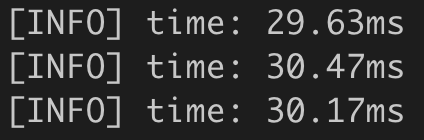

# 13. 내가 만든 카메라앱, 무엇이 문제일까?

이전에 만들었던 카메라앱을 통해 얼굴 인식, 랜드마크 탐색, 이미지 처리를 통한 보정 등의 가장 기본적인 개념을 아주 간단히 살펴보았을 것이다. 하지만, 정말 서비스로 출시할만한 완성도 높은 카메라앱이 되기엔 몇 프로 부족한 느낌을 받았을 것이다.

오늘은 그 왠지 모를 부족함의 원인이 무엇인지 살펴보고, 보다 완성도 높은 카메라앱을 만들기 위해 고려해야 할 점을 정리해 볼 것이다.

## 학습목표

- Detection, Landmark, Angle, Tracker의 필요성 공감하기
- 컴퓨터비전 프로그램의 성능 이해하기
- 스티커앱 성능 분석하기
- 동영상 처리
- 칼만 필터로 동영상 성능 개선하기

```bash
# 필요 라이브러리 설치
sudo apt install libgtk2.0-dev pkg-config

pip install cmake dlib opencv-contrib-python

wget http://dlib.net/files/shape_predictor_68_face_landmarks.dat.bz2
bzip2 -d ~/aiffel/video_sticker_app/models/shape_predictor_68_face_landmarks.dat.bz2
```

## 스티커앱의 원리


이미지에서 얼굴을 찾고 눈, 코, 입의 랜드마크를 검출한다. 랜드마크를 기준으로 스티커를 합성하면 원하는 위치에 스티커가 따라다니게 된다.

- 참고: [Facial landmarks with dlib, OpenCV, and Python](https://www.pyimagesearch.com/2017/04/03/facial-landmarks-dlib-opencv-python/)

## 동영상에 스티커 붙이기 (1) 동영상이란

이미 우리는 유튜브 등을 통해서 동영상에 굉장히 익숙해졌다. 동영상은 움직이는 영상(映像)이다. 대부분의 사람들은 '영상'이라는 단어를 동영상과 많이 혼용해서 사용한다. 하지만 영어 번역을 보면 영상은 "image"이고 동영상은 "video"로 구분되는 것을 알 수 있다.

이때 움직인다는 표현을 다시 생각해볼 필요가 있다. 동영상은 여러 개의 이미지(image frame)가 일정한 시간 간격으로 이어진 이미지의 시퀀스(image sequence)이다.


따라서 매 프레임의 이미지마다 스티커를 적용해서 다시 동일한 간격으로 이어 붙이면 스티커가 적용된 동영상을 만들 수 있다.

### 동영상에서의 용어

---

- **Frame** : 동영상 특정 시간대의 이미지 1장
- **FPS** : frame per second, 초 당 프레임 수

게임을 즐기는 사람들은 FPS라는 표현을 많이 들어 봤을 것이다. 배틀그라운드 등을 할 때 60fps를 만족하도록 장비를 구성한다고 많이 표현한다. 이 때 60fps는 초당 60개의 이미지(frame)가 표시된다는 의미이다.

참고로 인간은 최소 15fps의 동영상을 "동영상"으로 인식한다고 한다. 애니메이션이 15fps부터 시작한다고 한다. 30fps부터는 자연스러운 동영상으로 느끼기 때문에 대부분의 동영상들이 30fps로 제작되고, 게임 등 빠른 순간을 잡아야 하는 영역에서는 60fps, 144fps 등을 사용한다고 한다. 사실 이론적으로 사람의 눈으로 60fps 이상부터는 체감하기 힘들다고 한다.

## 동영상에 스티커 붙이기 (2) 동영상 처리 방법

### 동영상 확인하기

---

먼저 우리가 사용하고 있는 주피터 노트북(Jupyter notebook)에서 동영상을 재생하는 방법을 알아본다. 사용할 파일의 트리 구조는 다음과 같다.

```
video_sticker_app
├── images
    └── video2.mp4
├── models
    └── shape_predictor_68_face_landmarks.dat
├── addsticker.py
├── addsticker_modified.py
├── addsticker_timecheck.py
├── checkfourcc.py
├── savevideo.py
└── videocheck.py
```

`moviepy` 패키지를 이용할 것이다. 주피터에서 동영상을 다루는 여러 패키지가 있지만 경험 상 `moviepy` 가 가장 간단한 방법으로 동영상을 불러오고 노트북에 임베딩 시킬 수 있었다.

```bash
pip install moviepy
```

기기에 저장된 영상 파일을 이용할 것이기 때문에 관련 패키지를 import 한다.

```python
from moviepy.editor import VideoFileClip
from moviepy.editor import ipython_display
```

`VideoFileClip` 은 비디오 파일을 읽어올 때 사용되는 클래스이며, `ipython_display()` 는 동영상을 주피터 노트북에 렌더링할 수 있게 도와주는 함수이다.

비디오 파일의 크기가 `HD(1280x720)`이기 때문에 노트북에서 보기 쉽도록 크기를 줄인다. 이 비디오 클립을 `ipython_display()` 함수를 사용하면 쉽게 출력할 수 있다. `loop` 와 `autoplay` 는 각각 반복 재생과 자동 재생 옵션이다.

```python
import os
video_path = os.getenv('HOME')+'/aiffel/video_sticker_app/images/video2.mp4'
clip = VideoFileClip(video_path)
clip = clip.resize(width=640)
clip.ipython_display(fps=30, loop=True, autoplay=True, rd_kwargs=dict(logger=None))
```

### 동영상 처리하기

---

`moviepy`를 이용하면 쉽게 비디오를 읽어오고 화면에 출력할 수 있다. 그러나 실시간으로 동영상을 처리하면서 모든 프레임을 관찰하는 어렵다. 동영상을 처리하기 위해서는

1. 동영상을 읽고
2. 프레임별 이미지를 numpy 형태로 추출하고
3. 얼굴 검출 같은 이미지 처리를 수행하고
4. 다시 동영상 등으로 조합

해야 한다.

`moviepy` 는 동영상을 읽는 것은 쉽지만 `NumPy` 데이터로 변환하기 위한 과정을 거쳐야 하고, 프레임 이미지에 검출 모델을 적용하더라도, 결과 동영상을 확인하기 위해서는 동영상 파일을 저장했다 다시 읽어야 하기 때문이다. 이런 문제 때문에 동영상을 다룰 때는 주피터 노트북을 잘 사용하지 않는다. 대부분 코드 에디터와 터미널을 이용해서 작업한다. 

이제 OpenCV를 이용해서 동영상을 다룰 것이다. 압축파일에 포함된 `videocheck.py` 의 내용은 아래와 같다.

```python
import cv2

# 원하는 동영상을 읽는다. 오디오 정보는 포함되지 않으며 비디오의 기술자(descriptor) 역할을 한다.
vc = cv2.VideoCapture('./images/video2.mp4')

# 동영상이 갖고 있는 정보를 vc의 get() 함수로 읽을 수 있다. FRAME_COUNT 은 비디오 전체 프레임 개수를 의미한다.
vlen = int(vc.get(cv2.CAP_PROP_FRAME_COUNT))
print (vlen) # video length

for i in range(vlen):
		# vc 객체에서 read() 함수로 img 를 읽는다. ret 은 read() 함수에서 이미지가 반환되면 True, 반대의 경우 False를 받는다.
    ret, img = vc.read()
		# ret 값이 False일 때 정지
    if ret == False:
        break
		# 이미지를 표시할 때와 마찬가지로 imshow() 함수를 사용해서 출력한다.
    cv2.imshow('show', img)
    key = cv2.waitKey(1)
    if key == 27:
        break
```

주목할 점은 `waitKey()` 함수 파라미터에 wait time 값을 적절히 넣으면 루프를 돌면서 이미지가 연속적으로 화면에 출력된다는 것이다. 이미지를 연속으로 재생시키면 우리는 동영상을 볼 수 있게 될 것이다. 이때 wait time 값은 ms 단위이다. 보통 동영상들이 30fps를 가지고 있으니 33을 입력하면 원래의 동영상 속도와 거의 비슷한 속도를 보여줄 수 있을 것이다. 물론 이미지 처리 시간을 고려하면 더 줄여야 할 것이다.

`waitKey()` 함수는 키보드가 입력될 때 키보드 값을 반환한다. if key == 27 는 '27번 키 값을 가지고 있는 키보드 버튼이 입력될 때'를 의미한다. 27번 키는 ESC이다.

## 동영상에 스티커 붙이기 (3) 이미지 시퀀스에 스티커앱 적용하기

이제 우리는 동영상이 시간 순서대로 나열된 이미지의 조합이라는 것을 알았다. 그리고 OpenCV를 통해 개별 프레임에 하나씩 접근하는 법도 경험했다. 본격적으로 동영상에 스티커앱을 적용해 볼 것이다. 우선 아래 파일을 다운 받아 `~/aiffel/video\_sticker\_app/images` 내부에 압축을 푼다. 우리가 사용할 스티커 이미지 `king.png`가 `images`폴더 내부에 있어야 한다.

먼저, 이미지 한 장을 처리하는 스티커앱 함수를 만든다. 이번에도 아래 코드는 `addsticker.py` 파일로 압축파일에 이미 포함되어 있다.

```python
import dlib
import cv2

def img2sticker_orig(img_orig, img_sticker, detector_hog, landmark_predictor):
    # preprocess
    img_rgb = cv2.cvtColor(img_orig, cv2.COLOR_BGR2RGB)

    # detector
    dlib_rects = detector_hog(img_rgb, 0)
    if len(dlib_rects) < 1:
        return img_orig

    # landmark
    list_landmarks = []
    for dlib_rect in dlib_rects:
        points = landmark_predictor(img_rgb, dlib_rect)
        list_points = list(map(lambda p: (p.x, p.y), points.parts()))
        list_landmarks.append(list_points)

    # head coord
    for dlib_rect, landmark in zip(dlib_rects, list_landmarks):
        x = landmark[30][0] # nose
        y = landmark[30][1] - dlib_rect.width()//2
        w = dlib_rect.width()
        h = dlib_rect.width()
        break

    # sticker
    img_sticker = cv2.resize(img_sticker, (w,h), interpolation=cv2.INTER_NEAREST)

    refined_x = x - w // 2
    refined_y = y - h

    if refined_y < 0:
        img_sticker = img_sticker[-refined_y:]
        refined_y = 0

    img_bgr = img_orig.copy()
    sticker_area = img_bgr[refined_y:refined_y+img_sticker.shape[0], refined_x:refined_x+img_sticker.shape[1]]

    img_bgr[refined_y:refined_y+img_sticker.shape[0], refined_x:refined_x+img_sticker.shape[1]] = \
        cv2.addWeighted(sticker_area, 1.0, img_sticker, 0.7, 0)

    return img_bgr
```

정지된 이미지를 위해 스티커앱을 만든다면 스티커가 머리 위로 이미지 경계를 벗어나는 상황은 크게 고려하지 않아도 될지 모른다. 하지만 동영상은 다양한 환경이 나올 수 있기 때문에 이 경우도 고려해 주어야 할 것이다. `refined_y` 가 0보다 작을 때 `img_sticker[-refined_y:]`만 표시되게 했다. 기본적인 이미지 처리 함수와 원본 동영상을 준비했으니 이제 동영상에 스티커를 적용하면 된다.

```python
detector_hog = dlib.get_frontal_face_detector()
landmark_predictor = dlib.shape_predictor('./models/shape_predictor_68_face_landmarks.dat')

vc = cv2.VideoCapture('./images/video2.mp4')
img_sticker = cv2.imread('./images/king.png')

vlen = int(vc.get(cv2.CAP_PROP_FRAME_COUNT))
print (vlen) # 비디오 프레임의 총 개수
```

이전 코드처럼 비디오 기술자 `vc` 에서 `img` 를 읽는다. 이 `img` 를 `img2sticker_orig()` 에 입력한다. 스티커가 적용된 이미지가 출력될 것이다. `imshow` 함수로 `img_result` 를 화면에 렌더링 한다.

`img2sticker_orig()` 함수의 시간을 측정하기 위해 함수 앞뒤로 시간 측정 코드를 추가한다. `OpenCV`에서는 `getTickCount()` 와 `getTickFrequency()` 를 사용해서 시간을 측정한다. 초 단위로 나오기 때문에 보통 이미지 한 장을 처리할 때는 1,000을 곱해 ms 단위로 프로그램 속도를 관찰한다.

```python
for i in range(vlen):
    ret, img = vc.read()
    if ret == False:
        break

    ## 추가된 부분
    start = cv2.getTickCount()
    img_result = img2sticker_orig(img, img_sticker.copy(), detector_hog, landmark_predictor)
    time = (cv2.getTickCount() - start) / cv2.getTickFrequency() * 1000
    print ('[INFO] time: %.2fms'%time)

    cv2.imshow('show', img_result)
    key = cv2.waitKey(1)
    if key == 27:
        break

cv2.destroyAllWindows()
```

## 동영상에 스티커 붙이기 (4) 동영상 저장하기

꼭 필요한 부분은 아니지만 `OpenCV`로 처리한 동영상을 저장하는 방법이 궁금할 수 있다. 영상처리 개발 업무를 담당하면 리더와 동료에게 결과를 공유할 일이 빈번히 일어난다. 동영상을 공유하는 것이 큰 도움이 되기 때문에 알아 두면 좋다. `OpenCV`로 동영상을 저장하는 방법이다.

```python
fourcc = cv2.VideoWriter_fourcc(*'mp4v')
vw = cv2.VideoWriter('./images/result.mp4', fourcc, 30, (1280, 720))
```

`VideoWriter` 로 동영상 핸들러를 정의한다. 저장할 파일 이름, 코덱정보, fps, 동영상 크기를 파라미터로 입력한다. 코드의 "fourcc"는 "four character code"의 약자로, 코덱의 이름을 명기하는 데 사용한다. 컴퓨터 os 등에 따라 지원되는 코덱이 다르므로 `avc1`, `mp4v`, `mpeg`, `x264` 등에서 적절히 선택해서 사용하면 된다. (참고 : 우분투에서 mp4 동영상을 생성하실 때는 mp4v를 사용하셔야 정상 동작할 것이다. )

재생이 잘 되기 위해서는 코덱을 적절히 고르는 것이 중요하다. 입력된 동영상과 같은 코덱이면 조금 수월할 것이다. 아래는 입력 동영상의 fourcc를 알아내는 방법이다.

```python
fourcc = int(vc.get(cv2.CAP_PROP_FOURCC))
fourcc_str = "%c%c%c%c"%(fourcc & 255, (fourcc >> 8) & 255, (fourcc >> 16) & 255, (fourcc >> 24) & 255)
print ("CAP_PROP_FOURCC: ", fourcc_str)
```

프레임 수를 얻었던 방법처럼 여기서도 `vc.get()`을 사용한다. 이 때 얻을 수 있는 값은 정수형이기 때문에 비트연산을 이용해서 char 형태로 변경한다. 이번 강의에서 사용하는 `video2.mp4` 는 `avc1` 을 사용하고 있는 것을 확인할 수 있다. `checkfourcc.py`에 입력 동영상의 `fourcc`를 알아내는 코드 예제를 작성해 두었다.

최종적으로, 원본 동영상에 스티커를 붙여 합성한 영상을 다시 `result.mp4`라는 파일로 최종 저장하는 코드는 아래와 같다.

```python
detector_hog = dlib.get_frontal_face_detector()
landmark_predictor = dlib.shape_predictor('./models/shape_predictor_68_face_landmarks.dat')

vc = cv2.VideoCapture('./images/video2.mp4')
img_sticker = cv2.imread('./images/king.png')

vlen = int(vc.get(cv2.CAP_PROP_FRAME_COUNT))
print (vlen) # 비디오 프레임의 총 개수

# writer 초기화
fourcc = cv2.VideoWriter_fourcc(*'mp4v')
vw = cv2.VideoWriter('./images/result.mp4', fourcc, 30, (1280, 720))

for i in range(vlen):
    ret, img = vc.read()
    if ret == False:
        break

    start = cv2.getTickCount()
    img_result = img2sticker_orig(img, img_sticker.copy(), detector_hog, landmark_predictor)
    time = (cv2.getTickCount() - start) / cv2.getTickFrequency() * 1000
    print ('[INFO] time: %.2fms'%time)

        # 매 프레임 마다 저장합니다.    
    vw.write(cv2.resize(img_result, (1280,720)))

    cv2.imshow('show', img_result)
    key = cv2.waitKey(1)
    if key == 27:
        break

vw.release()
cv2.destroyAllWindows()
```

## 동영상에서 문제점 찾기

동영상으로 돌려보니 몇 가지 문제점이 보인다. 하나씩 확인해보자.

### 느린 처리 속도

---

앞의 코드는 개별 프레임을 처리하는 시간을 측정해서 터미널에 출력한다. 


프레임 한 장을 처리하는 데 걸리는 시간이 105ms정도라는 말이다. 참고로 해당 컴퓨터의 CPU는 Intel i5 - 8core입니다. i7, i9 등 좋은 성능의 CPU를 사용하면 더 빠른 속도를 얻을 수 있다. 반대로 i3나 coreM 같은 경우는 더 느려질 수 있다.

문제는 이렇게 처리 속도가 느리면 실제 사용자가 보게 되는 동영상 결과도 자연스럽지 않다는 점이다. 이 프로그램은 약 `10fps`의 속도를 가지기 때문에 이전 스텝에서 `addsticker.py`를 실행했을 땐 동영상이라기보다 이미지가 한 장씩 넘어가는 느낌이 든다. 

프레임 처리 시간을 `33ms` 이하로 줄일 수 있다면 `30fps`를 만족할 것이다. 프로그램 내 병목이 있는 함수를 파악하고 시간이 오래 걸리는 함수를 개선해야 한다.

### 스티커가 안정적이지 못하다

---

관찰해보면 거의 비슷한 구간임에도 스티커 합성이 자연스럽지 못한 경우들이 있다.


왼쪽 사진은 스티커 크기가 작은 반면 오른쪽 스티커는 크기가 크다. 이런 현상이 발생하는 이유는 다음과 같다.

1. 얼굴 검출기의 바운딩 박스 크기가 매 프레임마다 변경되기 때문에
2. 바운딩 박스의 x, y 위치를 측정할 때 에러가 존재 (가우시안 노이즈 형태)

1번이 발생하는 이유는 알고리즘 문제로 볼 수 있고 2번의 경우 학습 데이터의 라벨 정확도 문제로 볼 수 있다.

### 고개를 돌리면 자연스럽지 못하다

---

머리를 좌우로 돌리는 경우나 고개를 갸우뚱 하는 경우 스티커도 맞춰서 모습이 변해야 한다.


이런 현상이 발생하는 이유는 바운딩 박스가 얼굴의 각도를 반영하지 못하기 때문이다. 특히 3차원 공간을 2차원으로 투영하기 때문에 고개를 좌우로 돌리면서 갸우뚱 하는 경우는 **원근(perspective)** 변환을 적용해야 한다. 이 변환을 하기 위해서는 3차원에서 `yaw`, `pitch`, `roll` 각도를 알고 있어야 한다.

### 얼굴을 잘 못 찾는 것 같다

---

카메라에서 조금만 멀어져도 얼굴을 찾기 힘들어진다. 얼굴 검출기의 성능이 낮기 때문이다. HOG 알고리즘을 기반으로 학습된 박스는 일정 크기 이상의 박스를 내놓는다. 얼굴 크기가 작을 수록(멀리 있을 수록) 학습된 박스 크기와 다르게 나올 가능성이 커진다.

## 더 빠른 스티커앱 (1) 실행시간 분석하기

속도가 느린 문제를 확인하기 위해 `img2sticker_orig()` 함수 내부의 알고리즘 속도를 분석할 것이다. `img2sticker_orig()` 함수는 크게 다섯 단계로 나눠진다.

1. 전처리 (Preprocess)
2. 얼굴 검출 (Detection)
3. 랜드마크 검출 (Landmark)
4. 좌표변환 (Coord)
5. 스티커 합성 (Sticker)

위 다섯 단계 각각의 시간을 측정해 본다.

```python
def img2sticker_orig(img_orig, img_sticker, detector_hog, landmark_predictor):
    # preprocess
    start = cv2.getTickCount()
    img_rgb = cv2.cvtColor(img_orig, cv2.COLOR_BGR2RGB)
    preprocess_time = (cv2.getTickCount() - start) / cv2.getTickFrequency() * 1000

    # detector
    start = cv2.getTickCount()
    dlib_rects = detector_hog(img_rgb, 0)
    if len(dlib_rects) < 1:
        return img_orig
    detection_time = (cv2.getTickCount() - start) / cv2.getTickFrequency() * 1000

    # landmark
    start = cv2.getTickCount()
    list_landmarks = []
    for dlib_rect in dlib_rects:
        points = landmark_predictor(img_rgb, dlib_rect)
        list_points = list(map(lambda p: (p.x, p.y), points.parts()))
        list_landmarks.append(list_points)
    landmark_time = (cv2.getTickCount() - start) / cv2.getTickFrequency() * 1000

    # head coord
    start = cv2.getTickCount()
    for dlib_rect, landmark in zip(dlib_rects, list_landmarks):
        x = landmark[30][0] # nose
        y = landmark[30][1] - dlib_rect.width()//2
        w = dlib_rect.width()
        h = dlib_rect.width()
        # x,y,w,h = [ele*2 for ele in [x,y,w,h]]
        break
    coord_time = (cv2.getTickCount() - start) / cv2.getTickFrequency() * 1000

    # sticker
    start = cv2.getTickCount()
    img_sticker = cv2.resize(img_sticker, (w,h), interpolation=cv2.INTER_NEAREST)

    refined_x = x - w // 2
    refined_y = y - h

    if refined_y < 0:
        img_sticker = img_sticker[-refined_y:]
        refined_y = 0

    img_bgr = img_orig.copy()
    sticker_area = img_bgr[refined_y:refined_y+img_sticker.shape[0], refined_x:refined_x+img_sticker.shape[1]]

    img_bgr[refined_y:refined_y+img_sticker.shape[0], refined_x:refined_x+img_sticker.shape[1]] = \
        cv2.addWeighted(sticker_area, 1.0, img_sticker, 0.7, 0)
    sticker_time = (cv2.getTickCount() - start) / cv2.getTickFrequency() * 1000

    print (f'p:{preprocess_time:.1f}ms, d:{detection_time:.1f}ms, l:{landmark_time:.1f}ms, c:{coord_time:.1f}ms, s:{sticker_time:.1f}ms')

    return img_bgr
```

각 단계마다 시간을 측정하고 함수 마지막에서 출력한다. 터미널에서 결과를 확인해보면 실행 시간 대부분이 `d`, detection에서 소모되는 것을 알 수 있다. `(101.8 / 105.86) ~ 96%` 의 시간이 검출 단계에서 소모된다. 검출 시간을 줄이는 것을 가장 큰 목표로 정하는 것이 좋겠다.


## 더 빠른 스티커앱 (2) 얼굴 검출기 이해하기 - 속도, 안정성

`dlib` 얼굴 검출기(face detector)는 **HOG(histogram of oriented gradient)** 기반 알고리즘을 사용한다. 아래 링크에서 HOG 에 대한 설명이 아주 쉽게 되어 있다.

- [기계 학습(Machine Learning, 머신 러닝)은 즐겁다! Part 4](https://medium.com/@jongdae.lim/%EA%B8%B0%EA%B3%84-%ED%95%99%EC%8A%B5-machine-learning-%EC%9D%80-%EC%A6%90%EA%B2%81%EB%8B%A4-part-4-63ed781eee3c)

`dlib`은 HOG 특징 공간에서 **슬라이딩 윈도우(sliding window)** 기법을 통해 얼굴을 검출한다.

- [Sliding Windows for Object Detection with Python and OpenCV - PyImageSearch](https://www.pyimagesearch.com/2015/03/23/sliding-windows-for-object-detection-with-python-and-opencv/)

HOG 특성 맵(feature map)에서 입력 이미지 크기(HD: 1280x720)만큼 슬라이딩 윈도우를 수행하기 때문에 프로그램은

$$O(1280 * 720 * (bbox~size) * 피라미드~개수) = O(n^3)$$

의 시간을 가지므로 당연히 느려질 수 밖에 없다. 속도 개선 방법 중 가장 간단한 방법은 사용되는 이미지 크기를 줄이거나 피라미드 수를 줄이는 방법이다.

```python
def img2sticker_orig(img_orig, img_sticker, detector_hog, landmark_predictor):
    # preprocess
    img_rgb = cv2.cvtColor(img_orig, cv2.COLOR_BGR2RGB)

    # detector
    # detector*와 landmark*에 입력되는 img_rgb 이미지를 VGA 크기로 1/4만큼 감소시킵니다.
    img_rgb_vga = cv2.resize(img_rgb, (640, 360))
    dlib_rects = detector_hog(img_rgb_vga, 0)
    if len(dlib_rects) < 1:
        return img_orig

    # landmark
    # 줄인만큼 스티커 위치를 다시 2배로 복원해야 합니다.
    list_landmarks = []
    for dlib_rect in dlib_rects:
        points = landmark_predictor(img_rgb_vga, dlib_rect)
        list_points = list(map(lambda p: (p.x, p.y), points.parts()))
        list_landmarks.append(list_points)

    # head coord
    for dlib_rect, landmark in zip(dlib_rects, list_landmarks):
        x = landmark[30][0] # nose
        y = landmark[30][1] - dlib_rect.width()//2
        w = dlib_rect.width()
        h = dlib_rect.width()
        # 줄인 만큼 스티커 위치를 다시 2배로 복원해야 합니다.
        x,y,w,h = [ele*2 for ele in [x,y,w,h]]
        break

    # sticker
    img_sticker = cv2.resize(img_sticker, (w,h), interpolation=cv2.INTER_NEAREST)

    refined_x = x - w // 2
    refined_y = y - h

    if refined_y < 0:
        img_sticker = img_sticker[-refined_y:]
        refined_y = 0

    img_bgr = img_orig.copy()
    sticker_area = img_bgr[refined_y:refined_y+img_sticker.shape[0], refined_x:refined_x+img_sticker.shape[1]]

    img_bgr[refined_y:refined_y+img_sticker.shape[0], refined_x:refined_x+img_sticker.shape[1]] = \
        cv2.addWeighted(sticker_area, 1.0, img_sticker, 0.7, 0)

    return img_bgr
```

이론적으로는 가로, 세로 크기의 절반씩 전체 1/4 계산량이 감소하기 때문에 소모 시간도 25% 정도 되어야 한다.



실제 시간은 `30 / 105 = 29%` 정도로 감소한 것을 볼 수 있다. landmark 등 기타 단계 시간이 3ms 정도 되기 때문에 검출기는 약 27% 정도로 시간 소모를 줄였다고 생각할 수 있다. 예외 처리 같은 단계가 검출기에 포함되기 때문에 2% 정도의 손실은 존재할 수 있다. 33ms 이내 시간으로 실행할 수 있기 때문에 이제는 동영상처럼 재생이 가능하다.


## 동영상 안정화(Stabilizer) 설계 방법 (1) 신호와 신호처리

### 신호(Signal)와 노이즈(Noise)

---

시간과 공간에 따라 변화하는 물리량을 나타내는 함수를 **신호(signal)**라고 한다. 주로 시간과 관련된 물리량을 나타낼 때 많이 사용하고 있다. 대표적으로 우리가 매일 사용하는 220V 교류 전원이 있다. 우리나라 전기는 초당 60번으로 진동하는 특징(220V 60Hz)을 가지고 있다. 시간 축으로 그래프를 그리면 아래와 같이 나타난다.


위 이미지는 마치 사인(sin) 함수와 같은 형태로 아름답게 파형을 이루고 있다. 하지만 실제로 신호를 측정해 보면 깔끔한 형태의 파형이 잘 나오지 않는다.


노이즈가 섞인 신호

신호에 노이즈(noise)가 섞이는 이유는 크게 두 가지이다.

1. 신호를 출력하는 모델의 노이즈
2. 신호를 측정할 때 생기는 노이즈

예를 들어 사람이 뛰는 장면을 측정한다고 상상해 본다. 이 사람은 평균 **20km/h**의 속도로 달리고 있다. 이 때 생기는 노이즈를 생각해 보자.

1. 뛰는 사람이 힘들어서 **19km/h** 로 뛰다가 다시 **21km/h** 로 뛰는 경우
2. 측정 카메라가 사람 다리를 측정할 때, 머리를 측정할 때 속도가 달라지는 경우

이론적인 값을 얻기 힘들다는 것을 쉽게 알 수 있다. 스티커앱도 마찬가지이다. 얼굴 검출기는 매 프레임 얼굴의 위치를 측정한다. 하지만 측정 오차로 인해 매번 같은 위치의 얼굴을 찾아내기 힘들다는 한계가 있다.

### 신호처리(Signal Processing)

---

신호가 아닌 노이즈는 같은 시간 동안 신호의 크기가 급격하게 변화한다. 이런 특징을 "주파수가 높다(high frequency)" 고 표현한다. 그럼 주파수가 높은 성분만 제거하고 주파수가 낮은 신호만 통과하게 하면 될 것이다. 이렇게 원본 신호를 우리가 원하는 신호의 형태로 만드는 방법을 **신호처리(signal processing)** 라고 한다. 저역 주파수만 통과하게 만드는 기술은 신호처리 분야에서 널리 사용되어 왔다. **LPF(low pass filter)** 라고 부르는 기술이다. 아래 동영상을 통해 LPF가 무엇인지 알아보자.

- [[아두이노 중급] 노이즈 필터링 2탄! 로우패스 필터에 대해 알아보자](https://www.youtube.com/watch?v=JezOJN1yhTA)

## 동영상 안정화(Stabilizer) 설계 방법 (2) 칼만 필터

**칼만 필터(Kalman filter)**는 시스템 모델과 측정 모델을 만들고 데이터 입력을 바탕으로 각 모델을 예측하는 알고리즘을 의미한다. 예측된 모델을 바탕으로 현재의 실제 값을 추정할 수 있고 다음 시점의 모델 출력을 예측할 수 있다. 이 때 시스템 모델과 측정 모델은 모두 선형이고(linear)하고 가우시안(gaussian) 분포를 따르는 경우를 가정한다. 칼만 필터의 자세한 내용은 아래 링크를 참고한다.

- [Kalman filter 소개](https://medium.com/@celinachild/kalman-filter-%EC%86%8C%EA%B0%9C-395c2016b4d6)


우리 코드에서 **얼굴 검출(detection)**과 **얼굴 랜드마크(landmark)**는 프레임마다 가우시안 오차를 갖는 측정 시스템이라고 가정할 수 있다. 라벨링 할 때 사람도 매번 같은 위치를 찍을 수 없으며 자연 상태의 측정값은 대체로 정규분포를 따르기 때문이다. 얼굴 랜드마크에 칼만 필터를 적용하면 안정적인 스티커 결과를 얻을 수 있을 것을 예상할 수 있다.

## 칼만 필터 적용하기

얼굴 랜드마크에 칼만 필터를 사용하기 위해 이미지 좌표에서 객체의 위치와 속도에 대한 모델을 만들어야 한다. 이번 단계에서는 간단한 칼만 필터를 직접 만들어 볼 것이다.

```python
import numpy as np
import matplotlib.pyplot as plt
from numpy.linalg import inv
```

예를 들어, 20m/s 속도로 달릴 수 있다고 가정한다. 초기 위치 0에서 시작해서 시간 단위 `dt` 로 `idx` 만큼 달린다고 하면, `position = initial_position + sum([20 * dt for i in range(idx)])`으로 표현할 수 있다.

```python
def get_pos_vel(idx, dt, init_pos=0, init_vel=20):
    w = np.random.normal(0, 1)                # w: system noise.
    v = np.random.normal(0, 2)                # v: measurement noise.

    vel_true = init_vel + w                   # nominal velocity = 80 [m/s].
    pos_true = init_pos + sum([vel_true*dt for i in range(idx)])
    z_pos_meas = pos_true + v                 # z_pos_meas: measured position (observable)
    
    return z_pos_meas, vel_true, pos_true#, v, w
```

매번 같은 속도로 달릴 수 없기 때문에 w~N(0, 1)만큼 오차가 발생한다. 위치를 측정하는 기계 또한 매번 같은 결과를 내지 못하기 때문에 v~N(0, 2)만큼 오차가 발생한다고 가정한다. 1초 단위로 10번 측정해보면 다음과 같은 결과를 얻을 수 있다.

```python
for i in range(0,10):
    print (get_pos_vel(i, 1))

"""
(-0.32527339508699044, 19.71481600464928, 0)
(20.564986011249466, 21.33213397443804, 21.33213397443804)
(36.451917639297996, 19.587347187298807, 39.174694374597614)
(64.14014633380054, 21.259595844226858, 63.778787532680575)
(89.64441778385405, 21.66451392957338, 86.65805571829353)
(97.44744244090354, 19.781987650453637, 98.90993825226818)
(114.35864068915407, 19.442533562040644, 116.65520137224385)
(126.91825651722658, 18.306467735106136, 128.14527414574295)
(185.39229775336133, 22.76642684814379, 182.13141478515033)
(179.3422781189289, 19.801524063321583, 178.21371656989425)
"""
```

칼만 필터를 구현하는 `kalman_filter()` 함수를 구현한다.

```python
def kalman_filter(z, x, P):
# Kalman Filter Algorithm
    # 예측 단계
    xp = A @ x
    Pp = A @ P @ A.T + Q

    # 추정 단계
    K = Pp @ H.T @ inv(H @ Pp @ H.T + R)
    x = xp + K @ (z - H @ xp)
    P = Pp - K @ H @ Pp
    return x, P
```

위 수식에 나오는 `@` 연산자는 파이썬의 Matrix Multiplication 연산자다. 상세한 내용은 [여기](https://alysivji.github.io/python-matrix-multiplication-operator.html)를 참고하자.

아래와 같이 칼만 필터 시스템 행렬 등의 초기 값을 지정한다.

```python
# time param
time_end = 5
dt= 0.05
```

위치 모델은 시간과 속도의 영향을 받는다. 칼만 필터 입력으로 위치와 속도을 사용한다 `(x = [pos, vel])`. 따라서 시스템 모델 A를 `pos + vel * dt` 형태의 연산이 가능하도록 설계한다.

```python
# init matrix
A = np.array([[1, dt], [0, 1]]) # pos * 1 + vel * dt = 예측 위치
H = np.array([[1, 0]])
Q = np.array([[1, 0], [0, 1]])
R = np.array([[200]])
```

위와 같이 오차 행렬을 대략 초기화하였다. 칼만 필터 행렬 초기화 방법에 대한 명확한 기준을 제시하긴 어렵지만, 아래 링크에서 실용적인 힌트를 얻을 수 있을 것이다.

- [오차 행렬 초기화에 대한 참고자료](https://www.researchgate.net/post/How-to-initialize-the-error-covariance-matrix-and-process-noise-covariance-matrix-How-are-they-different-and-in-what-way-they-impact-the-filter/561e6af65f7f71e2648b4615/citation/download)

```python
# Initialization for estimation.
x_0 = np.array([0, 20])  # position and velocity
P_0 = 1 * np.eye(2)
```

### 결과

---

결과를 저장할 공간을 만든다. 시간 축으로 `time_end * dt` 개의 공간이 필요하다.

```python
time = np.arange(0, time_end, dt)
n_samples = len(time)
pos_meas_save = np.zeros(n_samples)
vel_true_save = np.zeros(n_samples)
pos_esti_save = np.zeros(n_samples)
vel_esti_save = np.zeros(n_samples)
```

저장할 공간에 실제 위치와 칼만 필터 결과를 대입한다.

```python
pos_true = 0
x, P = None, None
for i in range(n_samples):
    z, vel_true, pos_true = get_pos_vel(i, dt)
    if i == 0:
        x, P = x_0, P_0
    else:
        x, P = kalman_filter(z, x, P)

    pos_meas_save[i] = z
    vel_true_save[i] = vel_true
    pos_esti_save[i] = x[0]
    vel_esti_save[i] = x[1]
```

`matplotlib`를 이용하여 플롯을 그린다.

```python
fig, axes = plt.subplots(nrows=1, ncols=2, figsize=(12, 6))

plt.subplot(1, 2, 1)
plt.plot(time, pos_meas_save, 'r*--', label='Measurements', markersize=10)
plt.plot(time, pos_esti_save, 'bo-', label='Estimation (KF)')
plt.legend(loc='upper left')
plt.title('Position: Meas. v.s. Esti. (KF)')
plt.xlabel('Time [sec]')
plt.ylabel('Position [m]')

plt.subplot(1, 2, 2)
plt.plot(time, vel_true_save, 'g*--', label='True', markersize=10)
plt.plot(time, vel_esti_save, 'bo-', label='Estimation (KF)')
plt.legend(loc='lower right')
plt.title('Velocity: True v.s. Esti. (KF)')
plt.xlabel('Time [sec]')
plt.ylabel('Velocity [m/s]')
```


왼쪽 그래프는 시간과 위치의 그래프이고 오른쪽은 시간과 속도의 그래프이다. 빨간색으로 표현된 실제 위치는 오차가 있기 때문에 노이즈가 있다. 반면 칼만 필터가 적용된 위치(파란색)는 안정적으로 나타나는 것을 볼 수 있다. 속도도 시스템 오차가 포함된 값에 비해 칼만 필터가 적용된 값이 실제`(20m/s)`에 가깝게 표현된다. 이 예제를 2차원으로 확장시키면 동영상에 동일하게 적용할 수 있다. 이를 이용하면 스티커앱의 동작을 직접 개선해 볼 수 있을 것이다.


