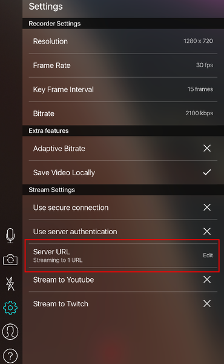

# 14. 카메라 스티커앱을 개선하자

이전에 만들었던 카메라 스티커앱이 동영상을 처리할 수 있도록 개선하는 프로젝트를 진행하려고 한다. 하지만 지난 시간에 살펴 보았듯이, 동영상을 처리하는 카메라앱을 만들기 위해서는 단순 이미지를 처리하는 작업 이상으로 고려해야 할 것들이 있었다. 피사체인 사람이 움직이기 때문에 발생하는 여러가지 예외상황, 처리속도의 문제, 화면떨림 등의 안정성 문제 등에 대응하는 방법이 필요하다는 것을 알 수 있었다.

## 학습 목표

- 동영상 쉽게 다룰 수 있는 방법 익히기
- 스티커앱 성능 분석하기 + 간단한 개선 방법
- 원하는 스펙을 수치로 지정하기
- 칼만 필터로 동영상 성능 개선하기

## 프로젝트 (1) moviepy로 비디오 처리하기

먼저 우리는 동영상을 쉽게 다룰 수 있는 방법을 찾고 있다. 그래서 대안으로 떠오른 것은 `moviepy`라는 파이썬 기반의 동영상 처리 라이브러리다.

하지만 우리는 동영상을 다룰 때의 실행시간, 즉 처리 속도가 중요하다는 것도 알고 있다. 그래서 `moviepy`를 쓰는 것이 성능면에서 적합한지 알아보려고 한다.

**1. moviepy를 이용해서 주피터 노트북 상에서 비디오를 읽고 쓰는 프로그램을 작성한다.**

```python
from moviepy.editor import VideoClip, VideoFileClip
from moviepy.editor import ipython_display
import cv2
import numpy as np
import os
```

샘플로 제공된 `video2.mp4`를 `moviepy`로 읽어서 `width=640`으로 축소하여 화면에 플레이해 보고, 플레이한 내용을 `mvpyresult.mp4`라는 파일로 저장해 볼 것이다. 저장이 완료되면 샘플 원본과 새롭게 저장된 동영상 파일을 열어서 두 영상의 화면크기나 파일 사이즈를 비교해 본다.

```python
# 읽기
video_path = os.getenv('HOME')+'/aiffel/video_sticker_app/images/video2.mp4'
clip = VideoFileClip(video_path)
clip = clip.resize(width=640)
clip.ipython_display(fps=30, loop=True, autoplay=True, rd_kwargs=dict(logger=None))

# 쓰기
result_video_path = os.getenv('HOME')+'/aiffel/video_sticker_app/images/mvpyresult.mp4'
clip.write_videofile(result_video_path)
```

**2. moviepy 로 읽은 동영상을 numpy 형태로 변환하고 영상 밝기를 50% 어둡게 만든 후에 저장한다.**

```python
# 읽기
video_path = os.getenv('HOME')+'/aiffel/video_sticker_app/images/video2.mp4'
clip = VideoFileClip(video_path)
clip = clip.resize(width=640)
clip.ipython_display(fps=30, loop=True, autoplay=True, rd_kwargs=dict(logger=None))

# clip 에서 numpy 로 데이터 추출
vlen = int(clip.duration*clip.fps)
video_container = np.zeros((vlen, clip.size[1], clip.size[0], 3), dtype=np.uint8)
for i in range(vlen):
    img = clip.get_frame(i/clip.fps)
    video_container[i] = (img * 0.5).astype(np.uint8)

# 새 clip 만들기
dur = vlen / clip.fps
outclip = VideoClip(lambda t: video_container[int(round(t*clip.fps))], duration=dur)

# 쓰기
result_video_path2 = os.getenv('HOME')+'/aiffel/video_sticker_app/images/mvpyresult2.mp4'
outclip.write_videofile(result_video_path2, fps=30)
```

**3. 영상을 읽고 쓰는 시간을 측정한다. OpenCV를 사용할 때와 차이를 측정한다.**

```python
# CASE 1 : moviepy 사용
start = cv2.getTickCount()
clip = VideoFileClip(video_path)
clip = clip.resize(width=640)

vlen = int(clip.duration*clip.fps)
video_container = np.zeros((vlen, clip.size[1], clip.size[0], 3), dtype=np.uint8)

for i in range(vlen):
    img = clip.get_frame(i/clip.fps)
    video_container[i] = (img * 0.5).astype(np.uint8)

dur = vlen / clip.fps
outclip = VideoClip(lambda t: video_container[int(round(t*clip.fps))], duration=dur)

mvpy_video_path = os.getenv('HOME')+'/aiffel/video_sticker_app/images/mvpyresult.mp4'
outclip.write_videofile(mvpy_video_path, fps=30)

time = (cv2.getTickCount() - start) / cv2.getTickFrequency()
print (f'[INFO] moviepy time : {time:.2f}ms')
```

```python
# CASE 2 : OpenCV 사용
start = cv2.getTickCount()
vc = cv2.VideoCapture(video_path)

cv_video_path = os.getenv('HOME')+'/aiffel/video_sticker_app/images/cvresult.mp4'
fourcc = cv2.VideoWriter_fourcc(*'mp4v')
vw = cv2.VideoWriter(cv_video_path, fourcc, 30, (640,360))

vlen = int(vc.get(cv2.CAP_PROP_FRAME_COUNT))

for i in range(vlen):
    ret, img = vc.read()
    if ret == False: break
    
    img_result = cv2.resize(img, (640, 360)) * 0.5
    vw.write(img_result.astype(np.uint8))
    
time = (cv2.getTickCount() - start) / cv2.getTickFrequency()
print (f'[INFO] cv time : {time:.2f}ms')
```

**4. moviepy 를 이용할 때의 장단점을 분석한다. 주피터 노트북에 답변을 작성해 코드와 함께 제출한다.**

- OpenCV의 읽기, 쓰기 속도가 moviepy에 비해 두 배 정도 빠른 것 같다.
- OpenCV는 웹캠을 이용하여 실시간 Inference가 가능하지만 moviepy는 저장된 영상에만 적용 가능하다.
- 저장된 영상을 다루는 데에는 moviepy쪽이 더 간편한 것 같다.

## 프로젝트 (2) 어디까지 만들고 싶은지 정의하기

### **1. 실시간 카메라 스티커앱을 만들어본다.**

이전 노드에서 우리는 `img2sticker_orig`라는 이름의 메소드를 구현하여 `addsticker.py`에 저장하였다. 해당 메소드를 그대로 복사하여 `img2sticker`라는 이름의 메소드를 만들고 이를 `newaddsticker.py`에 저장할 것이다. 오늘의 프로젝트는 이 메소드를 보완하여, 구현하는 방식으로 진행될 것이다.

동영상 입력을 받는 방법에는 여러가지가 있다. 만약 지금 사용하고 있는 컴퓨터에 웹캠이 달려 있다면 아주 손쉽게 진행 가능하다. 만약 웹캠을 이용할 수 없다 해도 가지고 있는 스마트폰에는 카메라가 달려있을 것이다.

- CASE 1 : 웹캠 입력을 사용하는 경우

`cv2.VideoCapture(0)`를 이용하면 웹캠 입력을 받아올 수 있다. 현재의 기본적인 `img2sticker` 를 활용하여 가장 기본적인 웹캠 실시간 스티커앱을 아래와 같이 빠르게 만들어 볼 것이다. 여기서 파라미터로 주어지는 0은 시스템에 연결된 영상 입력장치의 인덱스이다. 대부분의 경우 웹캠이 하나만 달려있을 테니, 0을 사용하면 된다.

```python
import numpy as np
import cv2
import dlib

from newaddsticker import img2sticker

detector_hog = dlib.get_frontal_face_detector()
landmark_predictor = dlib.shape_predictor('./models/shape_predictor_68_face_landmarks.dat')

def main():
    cv2.namedWindow('show', 0)
    cv2.resizeWindow('show', 640, 360)

    vc = cv2.VideoCapture(0)   # 연결된 영상 장치의 인덱스, 하나만 있는 경우 0을 사용
    img_sticker = cv2.imread('./images/king.png')

    vlen = int(vc.get(cv2.CAP_PROP_FRAME_COUNT))
    print (vlen) # 웹캠은 video length 가 0 입니다.

    # 정해진 길이가 없기 때문에 while 을 주로 사용합니다.
    # for i in range(vlen):
    while True:
        ret, img = vc.read()
        if ret == False:
            break
        start = cv2.getTickCount()
        img = cv2.flip(img, 1)  # 보통 웹캠은 좌우 반전

        # 스티커 메소드를 사용
        img_result = img2sticker(img, img_sticker.copy(), detector_hog, landmark_predictor)   

        time = (cv2.getTickCount() - start) / cv2.getTickFrequency() * 1000
        print ('[INFO] time: %.2fms'%time)

        cv2.imshow('show', img_result)
        key = cv2.waitKey(1)
        if key == 27:
            break

if __name__ == '__main__':
    main()
```

위 코드를 `webcam_sticker.py`에 저장하였다. 이후 터미널에서 실행해볼 수 있다.

- CASE 2 : 스마트폰 영상의 스트리밍 입력을 사용하는 경우

만약 클라우드 환경에서 학습중이라면 실행환경에서 활용할 수 있는 웹캡이 없을 것이다. 그래서 이번엔 여러분의 스마트폰에 있는 영상촬영 어플리케이션을 통해 녹화된 동영상 스트리밍을 입력으로 해서 진행해볼 것이다. 절차가 다소 복잡하겠지만, 잘 따라오시면 위 CASE 1과 동일하게 프로젝트를 진행할 수 있다.

동영상 스트리밍을 위한 다양한 프로토콜 중, OpenCV로 처리할 수 있는 것으로 `RTMP`를 활용하도록 한다. `RTMP`에 대한 자세한 기술적인 내용은 이번 노드의 범위를 벗어나는 내용이므로 생략한다. 이 [링크](https://juyoung-1008.tistory.com/30)의 글을 참고하면 `RTMP`가 다양한 동영상 스트리밍 서비스에 널리 사용되고 있음을 알 수 있다.

RTMP 스트리밍을 우리의 스티커앱의 입력으로 사용하기 위해서 다음과 같이 진행한다.

**1) 본인의 스마트폰에 RTMP 스트리밍 어플리케이션 설치**

스마트폰 카메라로 촬영한 영상을 RTMP로 스트리밍할 수 있게 해주는 어플리케이션은 많다. 그러나, RTMP 스트리밍을 위해서는 별도의 서버에서 rtmp:// url을 오픈해 주어야 한다. 아래 어플리케이션은 그런 과정을 생략하고 RTMP url을 자동 생성해 주므로 편리하기 때문에 추천한다. 다른 어플리케이션을 활용하셔도 무방하다.


**2) 어플리케이션에서 동영상을 송출할 RTMP url을 지정**

영상촬영을 시작하기 전에 환경설정을 통해 동영상을 송출할 RTMP url을 지정해 주어야 한다. 위 어플리케이션의 환경설정 화면은 아래 그림과 같다.



빨간 테두리로 표시한 Server URL 항목을 누르면 아래 그림과 같이 rtmp url을 지정하는 화면이 나타난다. 이 어플리케이션의 좋은 점은 rtmp url을 자동 생성해 준다는 점이다. 그림에 있는 url은 생성될 때마다 달라질 것이다.


화면에 보이는 rtmp:// url 전체를 복사해서 보관해 둔다.

**3) 어플리케이션에서 영상 촬영 시작**

이제 RTMP 설정이 완료되었으므로, 촬영을 시작한다.

**4) 카메라 스티커앱 구동**

이제 `cv2.VideoCapture()`를 이용해 촬영중인 동영상 스트리밍을 입력으로 받아올 수 있다. 단, 웹캠의 경우처럼 파라미터로 0을 줄 수는 없기 떄문에, 2)단계에서 복사해 두었던 rtmp url을 사용하면 된다. `webcam_sticker.py`에서 `cv2.VideoCapture()` 부분을 아래와 같이 바꾸기만 하면 충분합니다.

```python
vc = cv2.VideoCapture('rtmp://rtmp.streamaxia.com/streamaxia/XXXXXX')
```

이제 터미널에서 실행하면, 스마트폰에서 촬영된 스트리밍 영상을 입력으로 하는 카메라 스티커앱이 동작하는 것을 확인할 수 있다.

### 2. 스티커앱을 실행하고 카메라를 고정하고 서서히 멀어져본다. 혹은 아주 가까이 다가가 본다. 얼굴을 찾지 못하는 거리를 기록한다.

일반적으로 약 15ch ~ 1m 30cm 범위 사이에서 얼굴 인식이 가능하다고 한다. 실제로 측정했을 때 어떠한지 결과를 기록한다.

### 3. 다시 자리로 돌아온 후 고개를 상하좌우로 움직인다. yaw, pitch, roll 각도의 개념을 직접 실험해 보고 각각 몇 도까지 정상적으로 스티커앱이 동작하는지 기록한다.

- yaw : y축 기준 회전 → 높이 축
- picth : x축 기준 회전 → 좌우 축
- roll : z축 기준 회전 → 거리 축

일반적인 허용 범위는 아래와 같다고 알려져 있다.

- yaw : -45 ~ 45도
- pitch : -20 ~ 30도
- roll : -45 ~ 45도

실제 측정해 본 결과는 어떠한지 기록한다.

### 4. 만들고 싶은 스티커앱의 스펙(허용 거리, 허용 인원 수, 허용 각도, 안정성)을 정한다.

(예시)

- 거리 : 25cm ~ 1m → 너무 가까우면 스티커의 의미가 없음, 셀카봉을 들었을 때의 유효거리
- 인원 수 : 4명 → 4인 가족 기준
- 허용 각도 : pitch : -20 ~ 30도, yaw : -45 ~ 45도, roll : -45 ~ 45도 → 화면을 바라볼 수 있는 각도
- 안정성 : 위 조건을 만족하면서 FPPI (false positive per image) 기준 < 0.003, MR (miss rate) < 1 300장당 1번 에러 = 10초=30*10에 1번 에러

기준의 이유를 어떻게 정했는지가 중요하다. → 서비스 관점, 엔지니어링 관점으로 설명하면 좋다.

## 프로젝트 (3) 스티커 Out Bound 예외처리하기

### 1. 지금까지 만든 스티커앱을 이용해서 예외 상황을 찾는다. 특히 서서히 영상에서 좌우 경계 밖으로 나가며 코드의 행동을 확인한다.

웹캠을 이용해서 자유롭게 촬영하면 된다. 발생하는 예외 상황을 꼼꼼하게 기재하자.

### 2. 문제가 어디에서 발생하는지 코드에서 확인한다.

(힌트) 얼굴이 카메라 왼쪽 경계를 벗어나서 detection 되는 경우 `refined_x` 의 값이 음수가 된다.
`img_bgr[..., refined_x:...]` 에서 numpy array의 음수 index에 접근하게 되므로 예외가 발생한다.

`newaddsticker.py`의 `img2sticker` 메소드에서 아래 부분을 수정해 주어야 한다.

```python
### (이전 생략) ###

# sticker
img_sticker = cv2.resize(img_sticker, (w,h), interpolation=cv2.INTER_NEAREST)

refined_x = x - w // 2
refined_y = y - h

if refined_y < 0:
    img_sticker = img_sticker[-refined_y:]
    refined_y = 0

###
# TODO : x 축 예외처리 코드 추가
###

img_bgr = img_orig.copy()
sticker_area = img_bgr[refined_y:refined_y+img_sticker.shape[0], refined_x:refined_x+img_sticker.shape[1]]

img_bgr[refined_y:refined_y+img_sticker.shape[0], refined_x:refined_x+img_sticker.shape[1]] = \
    cv2.addWeighted(sticker_area, 1.0, img_sticker, 0.7, 0)

return img_bgr
```

### 3. Out bound 오류(경계 밖으로 대상이 나가서 생기는 오류)를 해결한다.

위 예외처리 코드 부분에 들어가야 하는 코드는 아래와 같다. newaddsticker.py 파일을 수정한다.

```python
if refined_x < 0:
	img_sticker = img_sticker[:, -refined_x:]
	refined_x = 0
elif refined_x + img_sticker.shape[1] >= img_orig.shape[1]:
	img_sticker = img_sticker[:, :-(img_sticker.shape[1]+refined_x-img_orig.shape[1])]
```

### 4. 다른 예외는 어떤 것들이 있는지 정의한다. 어떤 것이 문제가 되는지 스스로 정해보자.

꼼꼼히 찾아보면 위에서 수정한 것과 같은 명백한 오류 발생 케이스 이외에도 다양한 예외 상황을 찾아볼 수 있을 것이다. 정확한 정답은 없다. 본인이 정의하기 나름이다. 예를 들어, '고개를 왼쪽 아래로 향하게 할 때 스티커의 모양이 일정한 것' 을 예외 상황이라고 정의할 수 있다.

## 프로젝트 (4) 스티커앱 분석 - 거리, 인원 수, 각도, 시계열 안정성

### 1. 멀어지는 경우에 왜 스티커앱이 동작하지 않는지 분석한다. detection, landmark, blending 단계 중 무엇이 문제일까?

dlib detection이 문제이다. 멀어지면 `detector_hog` 단계에서 bbox가 출력되지 않는다.

```python
# preprocess
img_rgb = cv2.cvtColor(img_orig, cv2.COLOR_BGR2RGB)
# detector
img_rgb_vga = cv2.resize(img_rgb, (640, 360))
dlib_rects = detector_hog(img_rgb_vga, 0)
if len(dlib_rects) < 1:
    return img_orig
```

### 2. detector_hog의 문제를 해결하기 위해, 이미지 피라미드를 조절하여 성능을 향상시키는 간단한 방법이 있다. 이 방법을 활용하여 img2sticker 메소드를 간단히 고쳐보자.

```python
def img2sticker(img_orig, img_sticker, detector_hog, landmark_predictor):
    # preprocess
    img_rgb = cv2.cvtColor(img_orig, cv2.COLOR_BGR2RGB)

    # detector
    img_rgb_vga = cv2.resize(img_rgb, (640, 360))
    dlib_rects = detector_hog(img_rgb_vga, 1) # <- 이미지 피라미드 수 변경
    if len(dlib_rects) < 1:
        return img_orig

    # landmark
    list_landmarks = []
    for dlib_rect in dlib_rects:
        points = landmark_predictor(img_rgb_vga, dlib_rect)
        list_points = list(map(lambda p: (p.x, p.y), points.parts()))
        list_landmarks.append(list_points)
```

수정 후에 `webcam_sticker.py` 를 다시 한번 실행시켜 스티커앱이 잘 샐행되는지 확인한다.

### 3. 위에서 새롭게 시도한 방법의 문제점

속도가 현저히 느려진다. 기존 30ms/frame에서 120ms/frame 으로 약 4배 느려짐 → 실시간 구동이 불가능하다.

### 4. 실행시간을 만족할 수 있는 방법을 찾아본다.

hog 디텍터를 딥러닝 기반 디텍터로 변경할 수 있다. hog 학습 단계에서 다양한 각도에 대한 hog 특징을 모두 추출해서 일반화 하기 어렵기 때문에 딥러닝 기반 검출기의 성능이 훨씬 좋다.

딥러닝 기반 detection 방법을 조사한다. 아래 링크를 참고하면 도움이 될 것이다.

- [How does the OpenCV deep learning face detector work?](https://www.pyimagesearch.com/2018/02/26/face-detection-with-opencv-and-deep-learning/)

OpenCV는 intel cpu 을 사용할 때 dnn 모듈이 가속화를 지원하고 있다. 따라서 mobilenet 과 같은 작은 backbone 모델을 사용하고 ssd 를 사용한다면 충분히 만족할 만한 시간과 성능을 얻을 수 있다.

### 5. 인원 수, 각도 등 각 문제에 대해서 1-4번을 반복한다

자유롭게 설계한다. 각도 문제에 대해서는 아래 방법을 적용해볼 수 있다.

[Facial Landmark Detection](https://learnopencv.com/facial-landmark-detection/)

## 프로젝트 (5) 칼만 필터 적용하기

### 1. 카메라 앞에서 가만히 있을 때 스티커의 움직임을 관찰한다. 어떤 문제가 발생하는가?

가만히 있어도 스티커의 크기가 일정하게 유지되지 않고, 떨리는 것처럼 보이는 현상이 발생한다.

### 2. 이론 강의에서 배운 칼만 필터를 적용해서 스티커 움직임을 안정화시킨다.

칼만 필터를 구현한 모듈인 `kalman.py`와 이를 이용하여 tracker를 구현한 `kpkf.py`를 이용하여 칼만필터를 적용한 `webcam_sticker_kf.py`를 함께 첨부했다. 실행해 보면 현재는 웹캠이 아니라 샘플 동영상에 칼만필터가 적용된 것을 확인하실 수 있다.

동영상 입력을 웹캠으로 바꾸면 우리가 만들고 있는 웹캠에도 동일하게 적용할 수 있다. `webcam_sticker_kf.py`를 참고하여 자신만의 `webcam_sticker.py`를 완성해 보자.

## 회고록

- 웹캠을 이용해 이미지를 처리하는 방법에 대해 궁금했었는데 이번 노드를 통해 알게 되어서 웹캠을 이용한 Object Detection 서비스도 만들어볼 수 있을 것 같다.
- 스티커앱 이외에 다른 필터들도 한번 만들어보고 싶다.
