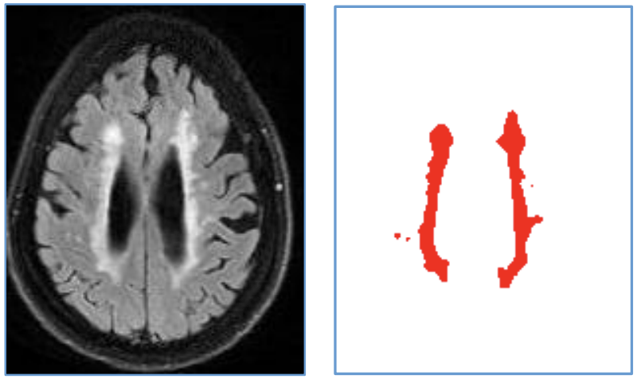

# 15. 데이터를 직접 모아보기

**ML Coarse-to-Fine 전략과 Active Learning 기초**

머신러닝 서비스를 만들때 가장 중요한 것 하나만 꼽으라고 한다면 데이터라고 말할 수 있다.

그러나 우리가 만들고자 하는 머신러닝 서비스에 꼭 알맞는 데이터셋을 늘 구할 수 있는 것은 아니다. 오히려 그런 이상적인 경우는 극히 드물다고 봐야 할 것이다. 현실 문제에 부딪혔을 때 우리는 모델을 어떻게 만들 것인가 보다 훨씬 많은 시간을 데이터를 어떻게 수집, 가공할 것이냐의 문제로 고민하게 될 것이다. 언제나 그렇듯 확보한 데이터의 갯수는 턱없이 부족하고, 이를 메꾸기 위한 예산은 확보되어 있지 않으며, 서비스 딜리버리 타임은 얼마 남지 않은 현실을 우리는 어떻게 헤쳐 나갈 수 있을까?

그래서 이번 시간에는 머신러닝 엔지니어가 늘 고민해 오는 문제, 바로 **데이터를 효율적으로 모으는 방법**에 대해 이야기할 것이다.

## 학습목표

- 데이터를 직접 모아보기
- 딥러닝이 아닌 머신러닝 방법을 사용하기
- Keypoints Regressor 제작하기
- 라벨링 툴 다뤄보기

### 준비물

모델 파일을 다운받아 압축을 풀어준다.

```python
$ wget http://dlib.net/files/shape_predictor_68_face_landmarks.dat.bz2
$ bzip2 -d shape_predictor_68_face_landmarks.dat.bz2
```

## 카메라앱에 당황한 표정 효과를 추가하려면?

다음과 같은 효과를 구현하려면 어떻게 해야 할까?


우선 눈을 찾아야 한다. 기본적으로 랜드마크(landmark)를 이용해 눈의 위치를 찾는 방법은 아마 알고 있을 것이다. 하지만 일반적인 랜드마크는 눈이 바라보고 있는 방향까지는 포함하고 있지 않다.

아래 사진처럼 시선의 방향이 왼쪽으로 향하고 있다는 정보를 이용하려 한다. 눈동자의 위치를 알 수 있다면 더 섬세한 표현이 가능할 것을 예상할 수 있다.


### 눈동자를 찾는 방법

---

`dlib`과 같은 오픈소스 라이브러리는 눈의 외곽선 위치만 찾아줄 뿐 시선을 나타내는 눈동자는 찾아주지 않는다. 우리는 눈의 외곽선 정보를 사용해 눈을 찾아내고 그 내부에서 눈동자를 검출해야 한다.


문제를 해결하기 위해 눈동자 검출 데이터셋을 찾아본다. 대체로 아래와 같은 데이터셋을 찾을 수 있다.

- [Labeled pupils in the wild: A dataset for studying pupil detection in unconstrained environments](https://arxiv.org/pdf/1511.05768.pdf)


이 데이터셋은 분명 눈동자 검출과 관련이 있는 데이터이지만 우리가 목표로 하는 촬영 환경과 많이 다르다. 우리는 핸드폰 카메라 기반의 팔 너비 정도의 촬영 환경을 가지는 반면 공개된 데이터셋은 AR 기기를 위한 10cm 이내의 근거리 촬영 환경이다.

실제 서비스를 만들 때에도 우리가 만들고 싶은 환경에 꼭 맞는 데이터셋을 찾기는 매우 어렵다. 따라서 머신러닝 개발자는 공개된 데이터와 모델이 모두 없을 때 문제를 접근하는 방법에 대해 고민하고, 해결책을 찾을 수 있어야 한다.

딥러닝 기반 방법을 적용하려면 아주 많은 데이터가 필요하다. 자본이 풍부한 상황이라면 데이터와 주변 환경을 구매하는 방법으로 해결할 수 있다. 하지만 처음 시도하는 업무에 대규모 자본을 투자하기란 현실적으로 굉장히 어렵다. (성공할 수 있을지, 성과를 낼 수 있을지 확신하기 어렵기 때문) 따라서 초기 컨셉 증명 단계에서는 소규모의 자본과 인력으로 프로토타입을 만들어야하는데 이 때 딥러닝을 적용하기가 쉽지 않다.

기존 머신러닝 방법을 적절히 이용하는 방법과 잘 가공된 어노테이션(annotation) 도구를 만들 수 있다면 바로 딥러닝 방법을 적용하는 것보다 빠르게 문제를 해결해 나갈 수 있다.

오늘 노드에서는

- 기존 머신러닝 방법을 적용한 눈동자 검출 모듈을 만드는 방법에 대해 설명한다.
- 딥러닝 방법을 이용한 눈동자 검출 모듈을 제작하고
- 앞에서 만들어진 데이터와 함께 높은 품질의 라벨을 얻을 수 있는 라벨링 툴(labeling tool) 대해 설명한다.
- 마지막으로 앞의 과정을 어떻게 효율적인 순서로 진행할 수 있는지 논의한다.

## 대량의 Coarse Point Label 모아보기

### (1) 도메인의 특징을 파악하자

---

딥러닝을 적용하지 않고 머신러닝 방법을 이용한다는 말은 곧 **handcraft feature(사람이 정의한 특징)**를 사용해야 한다는 말과 같다. 이때 모델이 사용할 특징을 정의하기 위해서는 해당 분야에 대한 이해가 필요하다. 즉, 도메인 전문가가 좋은 모델을 만들 확률이 높다.

이 방법이 어떻게 적용될 수 있고 왜 필요한지 예시를 들어볼까 한다.

2018년에 알츠하이머 치매 진단 보조 솔루션을 만들었다. MRI를 촬영한 후 뇌 조직을 분석해서 알츠하이머 환자와 정상군의 분포를 파악하는 업무를 진행했다. 다양한 치매의 종류를 접할 수 있었고 그 중 한 사례를 이야기하려 한다.

**혈관성 치매(Vascular Dementia)** 는 뇌혈관 문제로 뇌조직이 손상을 입게 되어 발생하는 치매다. 치매는 현재 치료법이 없기 때문에 발병을 미리 예측하고 대비해서 진행을 늦추는 방법이 최선이다. 그만큼 조기 진단으로 병의 분류와 원인을 찾는 것이 중요하다. 다른 알츠하이머와 마찬가지로 이 경우도 MRI 이미지를 통해 진단을 도울 수 있다. MRI에는 T1w, T2w, FLAIR 등 다양한 촬영 방식(protocol)이 있다. FLAIR 이미지를 한 장 살펴보자.


처음보면 어디가 정상이고 어디가 문제인지 전혀 파악할 수 없다. 이 이미지에서는 "회백질"이 어디인지, "백질"이 어디인지 구분이 잘 되지 않는다(둘은 뇌의 각 부분의 이름이다). 사실 FLAIR 이미지에서는 백질과 회백질을 구분하기 어려운 대신 뇌척수액과 같은 물은 비교적 구분하기 쉽다. ([What Does Hyperintensity Mean On An Mri Report?](https://www.healthcentral.com/article/what-does-hyperintensity-mean-mri-report)) 아래 그림을 보자.


빨간색 영역과 같이 뇌척수액 부분은 주변보다 흰 값으로 나타나게 된다. 뇌혈관에 문제가 생기게 되면 피 등의 액체가 백질에 스며들게 되고 뇌조직에 문제가 생길 수 있다. 백질이 보다 밝은 값으로 나타난다고 해서 WMH(White Matter Hyperintensity)라고 한다. WMH가 있다고 반드시 문제가 생기는 것은 아니지만 문제가 생긴 환자 중에서 많은 사례가 WMH를 가지고 있다.

그래서 뇌의학 선생님들은 WMH를 찾는 것을 중요하게 생각하고 있다. 글쓴이도 자동으로 찾아야 했는데 문제는 라벨이 마땅하지 않았다. (물론 지금은 오픈데이터가 조금씩 생기고 있다.) 세그멘테이션(segmentation)은 라벨링(labeing)이 어렵기 때문에 초기에는 딥러닝을 사용하지 않는 방법을 사용해야 했다.

이 문제는 생각해보면 아주 쉽게 초기 모델(baseline)을 만들어볼 수 있다. WMH의 뜻을 다시 살펴보면 WM Hyperintensity, 즉 이름처럼 하얗게 표시되는 부분은 높은 픽셀 값을 가지고 있다. 그러므로 255 범위 내에서 200 이상의 값을 가지는 픽셀들만 찾아내면 간단한 초기 모델을 만들 수 있다.



이렇게 초기 모델을 만들고 이 데이터를 바탕으로 딥러닝 모델을 학습시켜 나가면 좋은 성과를 얻을 수 있다. 이렇게 근사적인(coarse) 데이터셋을 간단히 만들고, 이를 이용해 초기 모델을 만든 후 그 모델을 더욱 정교하게 훈련시켜가는 전략을 **ML Coarse-to-Fine** 전략이라고 한다.

이 이야기에서 중요한 점은 

1. 풀고 싶은 **도메인의 지식**을 익힐 것 : 혈관성 치매와 WMH, MRI 에서 어떤 패턴을 보이는지
2. **딥러닝이 아닌 방법**을 적용할 수 있는 능력 : Image threshold 등 영상처리 기법

등을 생각하고 적용할 수 있어야 한다는 것이다.

### (2) 가우시안 블러

---

다시 우리 문제로 돌아와서, "눈동자에는 어떤 특징이 있을까?"를 고민해 보자. WMH와 반대로 눈동자는 어둡다. 어두운 부분의 중간을 찾으면 될 것 같다.


글쓴이는 그렇게 접근했다. (물론 더 좋은 방법이 있다는 사실을 늘 염두에 두어야 한다.)
랜드마크(landmark)를 이용해서 눈을 crop 하고 눈에서 가장 어두운 부분의 중심을 찾는다. 눈동자에 빛이 반사되는 경우가 있는데 노이즈(noise) 성분을 없애기 위해 (대체적으로 눈동자가 어두운 경향을 따르기 위해) 가우시안 블러(gaussian blur)를 적용했다. 가우시안 블러에 대한 설명은 아래 링크를 참고하자.

- [Gaussian Blur](https://en.wikipedia.org/wiki/Gaussian_blur)

블러 후 흑백을 반전시켰다. 여기서 가장 높은 값을 갖는 픽셀을 고르면 아래 그림처럼 눈의 위치를 찾을 수 있다.


'가장 높은 값'의 기준은 여러 방향으로 정의할 수 있다. 2D 이미지 상에서 바로 (x, y) 위치를 추정하는 방법argmax(image)이 있을 수 있고 위 그림에서 오른쪽과 아래 부분에 보이듯이 1차원으로 누적하는 방법이 있다.
위 2차원 이미지에서 눈의 중심 부분 근처 픽셀은 거의 모두 255로 최대값을 나타낸다. 따라서 눈동자를 특정하기가 어렵다. 가우시안 블러를 적용하면 눈동자 중심을 평균으로 하는 가우시안 분포를 볼 수 있다. 물론 최대값 255로 truncate 되어 있고 눈동자만 밝은 것이 아니기 때문에 mixture density처럼 나타나진다.

- 참고: [수식없이 이해하는 Gaussian Mixture Model](https://3months.tistory.com/154)

이때 1차원으로 누적해서 표현하면 255로 truncated 되는 문제와 주변 노이즈에 조금 더 강건하게 대처할 수 있다.

### (3) 구현 : 눈 이미지 얻기

---

이론적인 부분을 코드로 나타내 보자. 사용할 라이브러리는 아래와 같다.

```python
import matplotlib.pylab as plt
import tensorflow as tf
import os
from os.path import join
from glob import glob
from tqdm import tqdm
import numpy as np
import cv2
import math
import dlib
```

이미지를 준비한다.

```python
import os
img_path = os.getenv('HOME')+'/aiffel/coarse_to_fine/images/image.jpg'
img = cv2.imread(img_path)
print (img.shape)
plt.imshow(cv2.cvtColor(img, cv2.COLOR_BGR2RGB))
plt.show()
```

지금까지 해온 방법대로 얼굴과 랜드마크를 검출한다.

```python
img_bgr = img.copy()

detector_hog = dlib.get_frontal_face_detector() # detector 선언
dlib_model_path = os.getenv('HOME')+'/aiffel/coarse_to_fine/models/shape_predictor_68_face_landmarks.dat'
landmark_predictor = dlib.shape_predictor(dlib_model_path)

img_rgb = cv2.cvtColor(img_bgr, cv2.COLOR_BGR2RGB)
dlib_rects = detector_hog(img_rgb, 1) # (image, num of img pyramid)

list_landmarks = []
for dlib_rect in dlib_rects:
    points = landmark_predictor(img_rgb, dlib_rect)
    list_points = list(map(lambda p: (p.x, p.y), points.parts()))
    list_landmarks.append(list_points)

for dlib_rect in dlib_rects:
    l = dlib_rect.left()
    t = dlib_rect.top()
    r = dlib_rect.right()
    b = dlib_rect.bottom()
    cv2.rectangle(img_rgb, (l,t), (r,b), (0,255,0), 2, lineType=cv2.LINE_AA)

for landmark in list_landmarks:
    for idx, point in enumerate(list_points):
        cv2.circle(img_rgb, point, 2, (255, 255, 0), -1) # yellow

plt.imshow(img_rgb)
plt.show()
```

랜드마크를 이용해서 눈 위치만 crop한다. `dlib`의 랜드마크 자료형은 68개의 점을 가지고 있다.

- [Facial landmarks with dlib, OpenCV, and Python - PyImageSearch](https://www.pyimagesearch.com/2017/04/03/facial-landmarks-dlib-opencv-python/)

```python
def eye_crop(bgr_img, landmark):
    # dlib eye landmark: 36~41 (6), 42~47 (6)
    np_left_eye_points = np.array(landmark[36:42])
    np_right_eye_points = np.array(landmark[42:48])

    np_left_tl = np_left_eye_points.min(axis=0)
    np_left_br = np_left_eye_points.max(axis=0)
    np_right_tl = np_right_eye_points.min(axis=0)
    np_right_br = np_right_eye_points.max(axis=0)

    list_left_tl = np_left_tl.tolist()
    list_left_br = np_left_br.tolist()
    list_right_tl = np_right_tl.tolist()
    list_right_br = np_right_br.tolist()
    
    left_eye_size = np_left_br - np_left_tl
    right_eye_size = np_right_br - np_right_tl
    
    ### if eye size is small
    if left_eye_size[1] < 5:
        margin = 1
    else:
        margin = 6
    
    img_left_eye = bgr_img[np_left_tl[1]-margin:np_left_br[1]+margin, np_left_tl[0]-margin//2:np_left_br[0]+margin//2]
    img_right_eye = bgr_img[np_right_tl[1]-margin:np_right_br[1]+margin, np_right_tl[0]-margin//2:np_right_br[0]+margin//2]

    return [img_left_eye, img_right_eye]
```

`landmark`의 오차로 눈을 검출하기 어려울 수 있기 때문에 적당한 `margin` 값을 설정한다. 실제로 눈을 crop해 보자.

```python
img_left_eye, img_right_eye = eye_crop(img_bgr, list_landmarks[0])

print (img_left_eye.shape)
plt.imshow(cv2.cvtColor(img_right_eye, cv2.COLOR_BGR2RGB))
plt.show()
```


### (4) 구현 : 눈동자 찾기

---

눈 중심을 찾는 함수를 만들 것이다. 먼저, 눈 이미지를 low pass filter를 이용해서 smoothing 합니다. 여기서는 `bilateralFilter`를 이용했다.

- (참고) [OpenCV 영상 화질 향상 기법 #5 - Bilateral Filter](http://egloos.zum.com/eyes33/v/6092269)

다음으로 1차원 값으로 누적시킨 후 y 축 기준으로 최대값을 찾아서 `center_y` 좌표를 먼저 얻어낸다. (y 축은 x 축에 비해 상대적으로 변화가 적기 때문에 간단하게 구현할 수 있다)

x축은 1차원 max point를 기준으로 mean shift를 수행한다. 양 끝단에 수렴하는 예외를 처리한 후 결과를 출력한다.

```python
def findCenterPoint(gray_eye, str_direction='left'):
    if gray_eye is None:
        return [0, 0]

    # smoothing
    filtered_eye = cv2.bilateralFilter(gray_eye, 7, 75, 75)
    filtered_eye = cv2.bilateralFilter(filtered_eye, 7, 75, 75)
    filtered_eye = cv2.bilateralFilter(filtered_eye, 7, 75, 75)

    # 2D images -> 1D signals
    row_sum = 255 - np.sum(filtered_eye, axis=0)//gray_eye.shape[0]
    col_sum = 255 - np.sum(filtered_eye, axis=1)//gray_eye.shape[1]

    # normalization & stabilization
    def vector_normalization(vector):
        vector = vector.astype(np.float32)
        vector = (vector-vector.min())/(vector.max()-vector.min()+1e-6)*255
        vector = vector.astype(np.uint8)
        vector = cv2.blur(vector, (5,1)).reshape((vector.shape[0],))
        vector = cv2.blur(vector, (5,1)).reshape((vector.shape[0],))            
        return vector
    row_sum = vector_normalization(row_sum)
    col_sum = vector_normalization(col_sum)

    def findOptimalCenter(gray_eye, vector, str_axis='x'):
        axis = 1 if str_axis == 'x' else 0
        center_from_start = np.argmax(vector)
        center_from_end = gray_eye.shape[axis]-1 - np.argmax(np.flip(vector,axis=0))
        return (center_from_end + center_from_start) // 2

    center_x = findOptimalCenter(gray_eye, row_sum, 'x')
    center_y = findOptimalCenter(gray_eye, col_sum, 'y')

    inv_eye = (255 - filtered_eye).astype(np.float32)
    inv_eye = (255*(inv_eye - inv_eye.min())/(inv_eye.max()-inv_eye.min())).astype(np.uint8)

    resized_inv_eye = cv2.resize(inv_eye, (inv_eye.shape[1]//3, inv_eye.shape[0]//3))
    init_point = np.unravel_index(np.argmax(resized_inv_eye),resized_inv_eye.shape)

    x_candidate = init_point[1]*3 + 1
    for idx in range(10):
        temp_sum = row_sum[x_candidate-2:x_candidate+3].sum()
        if temp_sum == 0:
            break
        normalized_row_sum_part = row_sum[x_candidate-2:x_candidate+3].astype(np.float32)//temp_sum
        moving_factor = normalized_row_sum_part[3:5].sum() - normalized_row_sum_part[0:2].sum()
        if moving_factor > 0.0:
            x_candidate += 1
        elif moving_factor < 0.0:
            x_candidate -= 1
    
    center_x = x_candidate

    if center_x >= gray_eye.shape[1]-2 or center_x <= 2:
        center_x = -1
    elif center_y >= gray_eye.shape[0]-1 or center_y <= 1:
        center_y = -1
    
    return [center_x, center_y]
```

왼쪽, 오른쪽 두 눈 이미지에 대해 위 함수들을 수행한다.

```python
def detectPupil(bgr_img, landmark):
    if landmark is None:
        return

    img_eyes = []
    img_eyes = eye_crop(bgr_img, landmark)

    gray_left_eye = cv2.cvtColor(img_eyes[0], cv2.COLOR_BGR2GRAY)
    gray_right_eye = cv2.cvtColor(img_eyes[1], cv2.COLOR_BGR2GRAY)

    if gray_left_eye is None or gray_right_eye is None:
        return 

    left_center_x, left_center_y = findCenterPoint(gray_left_eye,'left')
    right_center_x, right_center_y = findCenterPoint(gray_right_eye,'right')

    return [left_center_x, left_center_y, right_center_x, right_center_y, gray_left_eye.shape, gray_right_eye.shape]
```

결과를 뽑아보면 아래와 같은 좌표를 얻을 수 있다.

```python
left_center_x, left_center_y, right_center_x, right_center_y, le_shape, re_shape = detectPupil(img_bgr, list_landmarks[0])
print ((left_center_x, left_center_y), (right_center_x, right_center_y), le_shape, re_shape)
```

오른쪽 눈을 이미지로 출력해보자.

```python
show = img_right_eye.copy()
    
show = cv2.circle(show, (right_center_x, right_center_y), 3, (0,255,255), -1)

plt.imshow(cv2.cvtColor(show, cv2.COLOR_BGR2RGB))
plt.show()
```


왼쪽 눈도 확인해본다.

```python
show = img_left_eye.copy()
    
show = cv2.circle(show, (left_center_x, left_center_y), 3, (0,255,255), -1)

plt.imshow(cv2.cvtColor(show, cv2.COLOR_BGR2RGB))
plt.show()
```


눈동자는 찾았지만 중심이 아닌 경우에 다른 방법을 적용해볼 수 있다.

- [[기계 학습] Mean Shift 클러스터링](https://bab2min.tistory.com/637)

기존의 머신러닝 방법들은 도메인 지식을 적용해서 간단하고 빠르게 구현할 수 있는 장점이 있다. 반면 일정 수준 이상의 성능을 만족하기 어렵다. 따라서 조금 모자란 성능으로 대량의 coarse한 라벨을 수집한 뒤, 딥러닝 모델을 개선해 나가는 학습 전략을 사용해야 한다.

## 키포인트 검출 딥러닝 모델 만들기

이제 더 나은 성능을 위해 딥러닝 모델을 만드는 것을 고려해야 한다. 앞에서는 도메인 지식을 활용해서 수작업으로 특성들을(hand-crafted features) 만들었다면 이제부터는 도메인 지식 없이 신경망이 특징을 자동으로 뽑을 수 있도록 설계한다.

지금까지 우리는 VGG, Resnet 등 기본(base) 모델을 이미지 분류 문제를 위해 사용해 왔다. 주로 수십 개 이내의 클래스 중 하나를 찾는 문제에 적용했는데 이 모델을 우리의 목표인 눈동자로 변형해 주어야 한다.


이미지 분류 모델은 이미지를 CNN에 입력해서 최종적으로 해당 클래스의 인덱스를 찾아낸다. 즉, 모델의 출력은 클래스를 나타내는 단일 idx 값(또는 one-hot vector)이 됩니다. 눈동자 위치를 찾기 위해서 아래와 같은 구조로 모델을 변경해야 한다.


가장 먼저, 출력의 개수가 변경된다. 이미지 분류 문제에서는 소프트맥스(softmax)를 통과해 1개의 클래스 인덱스를 출력했지만 눈동자 중심 위치인 x, y 좌표를 출력해야 한다. 이 때 값은 분류 모델의 정수형 불연속 값이 아닌 연속형 값이어야 한다. 이런 문제를 회귀(regression) 문제라고 한다.

**각 태스크의 출력 특징**

- Image Classification : argmax(softmax)의 불연속 정수형 값
- Image Localization(regression) : 연속형 실수 값

소프트맥스 - 크로스 엔트로피(cross-entropy) 방법은 이미지 클래스를 구분하기 위해 사용하는 가장 대표적인 손실 함수이다. 회귀에서는 여러 개의 값이 연속형 실수로 출력되어야 하기 때문에 MSE와 같은 손실 함수를 고려할 수 있다.


이제 만든 모델을 학습시키면 된다. 그러나 실전은 항상 더 어렵다. 내 니즈에 꼭 맞는 커스텀 태스크의 경우는 데이터가 대부분 부족하다. 오늘 강의에서도 높은 퀄리티의 눈동자 라벨을 얻기가 꽤 어렵다는 사실을 느꼈을 것이다.

이런 경우에 접근할 수 있는 방법은 미리 학습된 가중치(weight)를 가지고 와서 fine tuning 하는 것이다. 가져온 가중치가 학습된(pretrained) 태스크가 나의 태스크와 같은 도메인이면 더 좋겠지만 아니어도 효과는 있다. 그래서 보통은 이미지넷(ImageNet)이나 COCO 데이터셋으로 학습한 모델 가중치를 가져와서 fine tuning 한다.


위 방법을 코드로 표현하면 다음과 같다.

1. 기본 ResNet 모델을 구현하고
2. ImageNet 데이터셋으로 pretraining 을 열심히 한 후
3. ResNet의 fully connected layer 를 수정하고 회귀 손실 함수를 구현해서
4. 눈동자 위치를 학습시킵니다.

1 ~ 3번까지 직접 작업하려면 ImageNet 훈련이 매우 오래 걸리기 때문에 꽤 번거로운 작업이다. 하지만 텐서플로우에서 `tensorflow_hub` 를 제공하기 때문에 ImageNet으로 학습된 모델을 가지고 오는 방법을 제공한다.

```python
!pip install tensorflow_hub # 설치되어 있지 않은 경우 주석 해제
import tensorflow_hub as hub
from tensorflow.keras import layers
from tensorflow.keras import models
from tensorflow.keras.callbacks import LearningRateScheduler
```

`tensorflow_hub` 를 import 한다. `hub` 에는 VGG 네트워크 외에도 많은 모델을 제공하고 있다.

- [TensorFlow Hub](https://tfhub.dev/ml-kit/collections/image-classification/1)

많은 모델들이 사용 설명과 함께 제공된다. 그 중 ResNet-50을 사용할 것이다.

- [ResNet: Deep Residual Learning for Image Recognition](https://curaai00.tistory.com/1)

마침 `tensorflow_hub` 에서 적절한 ResNet-50 모델을 구현해 제공하고 있다.

- 참고: [TensorFlow Hub ResNet-50 V2](https://tfhub.dev/google/imagenet/resnet_v2_50/feature_vector/4)

해당 모델은 같은 링크의 웹페이지에서 확인할 수 있다. 모델은 resnet50, 학습된 dataset 은 ImageNet 이라는 정보를 확인할 수 있다.

TensorFlow Hub 모델을 코드로 불러온다. `tensorflow_hub` 에서 ResNet의 특성 추출기 부분을 백본으로 사용한다.

```python
''' tf hub feature_extractor '''
feature_extractor_url = "https://tfhub.dev/google/imagenet/resnet_v2_50/feature_vector/4"
feature_extractor_layer = hub.KerasLayer(feature_extractor_url,
                                         input_shape=(80,120,3))
```

좌표를 학습할 수 있도록 Dense 레이어를 추가한다.

```python
num_classes = 6

feature_extractor_layer.trainable = False
model = tf.keras.Sequential([
    feature_extractor_layer,
    #layers.Dense(1024, activation='relu'),
    #layers.Dropout(0.5),
    layers.Dense(num_classes, activation='sigmoid'),
])
```

모델의 구조를 확인한다.

```python
model.summary()
```

## 라벨링 툴 (1) 소개

이전 단계에서 coarse label로 모델을 어느 정도 수준까지 만들었다. 이제 **fine label**을 얻어서 모델을 향상시켜야 한다. 양질의 라벨을 빠르게 얻기 위해선 **어노테이션 툴(annotation tool)** 또는 **라벨링 툴(labeling tool)**을 사용해야 한다.

잘 알려진 비전 태스크(image classification, object detection, semantic segmentation)는 공개된 어노테이션 도구가 많다.

OpenCV의 **CVAT** 은 이미지 검출(object detection) 등에 이용할 수 있고 무료로 공개되어 있다.

- [OpenCV/cvat](https://github.com/openvinotoolkit/cvat)

imglab 이라는 툴도 공개되어 있는데, COCO 데이터셋 형태로 저장할 수 있고 키포인트 라벨링(keypoints labeling)도 할 수 있다.

- [COCO Dataset](https://cocodataset.org/#home)
- [NaturalIntelligence/imglab](https://github.com/NaturalIntelligence/imglab)

여러 어노테이션 도구들을 살펴보면 몇 가지 특징을 알 수 있다.

1. QT 등의 GUI 프레임워크를 이용하는 방법과 웹 기반 방법으로 나누어진다.
2. 단축키와 라벨 저장 포맷 등 편의성을 향상시킬 수 있는 기능을 적극적으로 적용한다.

높은 편의성을 앞세워서 공개하고 있지만 막상 사용해보면 우리가 원하는 태스크에 딱 맞지 않는 경우가 대부분 이다. (3D 환경에서 세그멘테이션 해야 하는 일 등)

우리는 눈동자의 위치를 선택할 수 있는 도구가 필요하다. imglab에는 키포인트(keypoint) 도구가 있기 때문에 사용해 볼 수는 있다. 하지만 문제는 COCO 데이터셋에서 라벨링한 스타일을 지켜야하기 때문에 17개의 키포인트를 정해야 하는 규칙이 있다는 점이다. 우리는 눈동자 1개를 찍거나 양 눈 옆 2개의 점이 필요한데 이 조건에 꼭 맞는 라벨링 도구를 만나기는 쉽지 않다.

결국 일을 하다 보면 입맛에 맞는 도구를 직접 만들게 된다. 마침 적절한 제작기가 있으니 한번 읽어보자.

- [Linewalks - Data tech company for healthcare system](https://blog.linewalks.com/archives/6240)

문제는 초보자들은 웹 프레임워크나 GUI 프로그래밍에 익숙하지 않다는 점이다. 라벨링 툴을 제작하려 생각하다보면 QT, MFC, 심지어 HTML/CSS/JavaScript를 익히고 어플리케이션 수준까지 만들 고민을 하는 상황을 맞이하게 된다. 머신러닝 엔지니어 입장에서 배보다 배꼽이 더 큰 상황이 되므로 상당한 부담을 느낄 수 있다.

따라서 가장 간단하고 효율적인 형태로 라벨링 툴을 제작해야 한다. 글쓴이는 라벨링을 할 때 두 단계로 라벨링을 하고 있다. 

1. 기존에 만들어진 라벨이 잘 예측하는지 True / False 분류
2. 해당 태스크의 어노테이션 툴 (우리의 경우 키포인트 어노테이션)

오늘 다룰 눈동자 검출은 1, 2번 모두 OpenCV만을 이용해서 아주 간단하게 만들 수 있다. 이번 시간에는 1번을 만들어 볼 것이다.

## 라벨링 툴 (2) 직접 제작하기

파이썬과 OpenCV만을 이용해서 아래와 같이 터미널 명령으로 아주 쉽게 실행 할 수 있는 어노테이션 도구를 만들 것이다. 이번에 만들 어노테이션 도구는 디렉토리 안에 들어있는 많은 이미지들에 대해 True/False Binary Classification을 위한 라벨링을 해주는 도구이다. 파일명은 `my_labeler_1st.py`로 한다.

```bash
# 우리가 제작하고자 하는 라벨링 툴의 사용법
$ python my_labeler_1st.py [imgpath or dir] [mask path or dir]
```

단축키는 아래와 같이 매핑한다.

```python
esc : program off 
n : next image
p : previous image
f : true tag & next image
d : false tag & next image
s : save
v : current label show
```

원본 이미지와 키포인트 위치에 라벨링이 되어있는 정답을 모두 이미지 형태로 저장해두었다. 답이 맞는지 알기 위해서 `img_path` 와 `mask_path` 에서 각 이미지를 읽는다.

```python
import os
from os.path import join
from glob import glob
import cv2
import numpy as numpy
import argparse
import numpy as np
import json
from pprint import pprint

args = argparse.ArgumentParser()

# hyperparameters
args.add_argument('img_path', type=str, nargs='?', default=None)
args.add_argument('mask_path', type=str, nargs='?', default=None)

config = args.parse_args()
```

읽은 이미지들은 적절한 `blend_mask()` 함수를 통해 화면에 출력할 이미지로 만든다.

```python
def blend_mask(img_orig, img_mask, alpha=0.3):
    '''
    alpha : alpha blending ratio. 0 ~ 1
    '''
    imgBlack = np.zeros(img_mask.shape, dtype=np.uint8)
    mask = (img_mask / img_mask.max()) * 255
    mask = mask.astype(np.uint8)

    if len(np.unique(mask)) > 2:
        # multi channel mask
        mask_color = cv2.applyColorMap(mask, cv2.COLORMAP_JET)
        mask_white = cv2.merge((mask,mask,mask))
        mask_color = np.where(mask_white != 0, mask_color, 0)
    else:
        # 1 channel mask
        mask_color = cv2.merge((imgBlack, mask, mask))

    img_show = cv2.addWeighted(img_orig, 0.9, mask_color, alpha, 0.0)
    return img_show
```

`alpha` 값은 알파 블렌딩(alpha-blending) 기법의 블렌딩 상수다.

- 참고: [알파블렌딩(Alpha-blending)이란 무엇일까?](https://blog.daum.net/trts1004/12109286)

이미지, 예상 라벨의 경로에 문제가 없는지 체크한다. `img_path` 가 디렉토리로 입력되는 경우(`os.path.isdir(config.img_path)`), 디렉토리 내에 있는 이미지 전체 인덱스를 찾고 첫 번째 이미지를 읽는다. 마스크로는, `mask_path` 디렉토리에서 읽어진 이미지와 같은 이름을 갖는 라벨 이미지를 가지고 올 예정이다.

```python
def check_dir():
    flg_mask = True
    if config.mask_path is None \
        or len(config.mask_path) == 0 \
        or config.mask_path == '':
        print ('[*] mask file not exist')
        flg_mask = False

    if config.img_path is None \
        or len(config.img_path) == 0 \
        or config.img_path == '' \
        or os.path.isdir(config.img_path):
        root = os.path.realpath('./')
        if os.path.isdir(config.img_path):
            root = os.path.realpath(config.img_path)
        img_list = sorted(glob(join(root, '*.png')))
        img_list.extend(sorted(glob(join(root, '*.jpg'))))
        config.img_path = img_list[0]

    img_dir = os.path.dirname(os.path.realpath(config.img_path))
    mask_dir = os.path.dirname(os.path.realpath(config.mask_path)) if flg_mask else None
    mask_dir = os.path.realpath(config.mask_path) if flg_mask and os.path.isdir(config.mask_path) else mask_dir

    return img_dir, mask_dir, flg_mask
```

다음 이미지로 넘어가는 함수다. 키워드로 입력된 `pos` 변수를 이용해서 순서(`idx`)를 하나씩 조절한다. `idx` 가 리스트 크기 이상으로 될 때 순서를 다시 0으로 조정한다.

```python
def move(pos, idx, img_list):
    if pos == 1:
        idx += 1
        if idx == len(img_list):
            idx = 0
    elif pos == -1:
        idx -= 1
        if idx == -1:
            idx = len(img_list) - 1
    return idx
```

메인이 되는 함수를 만든다. `img_list` 의 이미지들을 하나씩 읽으면서 `json_file`에 라벨을 하나씩 입력한다. 현재 이미지 순서를 알 수 있도록 출력하고 `p` 와 `f` 를 입력할 때 `dict_label` 에 정답을 입력하도록 만든다. `s` 를 누르면 json 파일 형태로 저장한다.

```python
def blend_view():
    cv2.namedWindow('show', 0)
    cv2.resizeWindow('show', 500, 500)

    img_dir, mask_dir, flg_mask = check_dir()

    fname, ext = os.path.splitext(config.img_path)
    img_list = [os.path.basename(x) for x in sorted(glob(join(img_dir,'*%s'%ext)))]

    dict_label = {}
    dict_label['img_dir'] = img_dir
    dict_label['mask_dir'] = img_dir
    dict_label['labels'] = []

    json_path = os.getenv('HOME')+'/aiffel/coarse_to_fine/annotation.json'
    json_file = open(json_path, 'w', encoding='utf-8')

    idx = img_list.index(os.path.basename(config.img_path))
    while True:
        start = cv2.getTickCount()
        fname = img_list[idx]
        mname = fname
        orig = cv2.imread(join(img_dir, fname), 1)

        img_show = orig
        if flg_mask:
            mask = cv2.imread(join(mask_dir, mname), 0) 
            img_show = blend_mask(orig, mask)

        time = (cv2.getTickCount() - start) / cv2.getTickFrequency() * 1000

        print (f'[INFO] ({idx+1}/{len(img_list)}) {fname}... time: {time:.3f}ms')

        cv2.imshow('show', img_show)

        key = cv2.waitKey(0)
        if key == 27:   # Esc to Stop and Save Json result.
            return -1
        if key == ord('n'):
            idx = move(1, idx, img_list)
        elif key == ord('p'):
            idx = move(-1, idx, img_list)
        elif key == ord('f'):
            dict_label['labels'].append({'name':fname, 'class':1})
            idx = move(1, idx, img_list)
            print (f'[INFO] {fname}, class: true')
        elif key == ord('d'):
            dict_label['labels'].append({'name':fname, 'class':0})
            idx = move(1, idx, img_list)
            print (f'[INFO] {fname}, class: False')
        elif key == ord('v'):
            print ()
            pprint (dict_label)
            print ()
        elif key == ord('s'):
            json.dump(dict_label, json_file, indent=2)
            print (f'[INFO] < {json_path} > saved!')
    json_file.close()

if __name__ == '__main__':
    blend_view()
```

가볍고 빠른 라벨링 툴을 만들었다. 머신러닝 업무에서 데이터가 가장 중요한 만큼, 필요하다면 라벨링 툴을 만들어 직접 데이터를 수집할 수 있어야 한다. 위와 같은 만들어본 라벨링 툴 소스코드를 위와 같이 첨부하였다. 아래와 같이 실행해 보면서 라벨링을 직접 수행해 보자. `img_path`는 이미지가 담겨 있는 디렉토리를 임의로 부여하면 된다. 아래 예시는 `~/aiffel/coarse_to_fine/images` 디렉토리를 사용한 경우이다.

```python
# 라벨링 수행
python my_labeler_1st.py ./images
```

정의한 단축키 정보를 기억하자. `f`나 `d`를 이용해서 라벨을 부여하고, `s`를 눌러 저장한 후 `esc`를 눌러 파일에 저장한 후 프로그램을 종료한다. 위 소스코드에서 지정한 대로, 라벨링 파일은 `~/aiffel/coarse_to_fine/annotation.json`으로 저장된다.

```python
esc : program off 
n : next image
p : previous image
f : true tag & next image
d : false tag & next image
s : save
v : current label show
```

## Human-in-the-loop & Active Learning

이번 스텝에서는 지금까지 만들어온 학습 시스템을 한눈에 정리해보고 학습 시스템을 어떻게 만들면 효율적인지, 라벨링을 어떤 시점에서 시작해야 하는지 살펴볼 것이다.

가장 먼저 시선 검출을 위해 모델들을 설계했다. 전처리 후 키포인트 검출 모델을 만들어서 눈동자 위치를 예측했다.

### 1. Coarse Dataset 만들기

---

데이터가 없는 업무 초반에는 mean shift와 같은 머신러닝 방법들을 이용해서 coarse한 예측 결과를 만들 수 있었다. 이 예측 결과는 딥러닝 모델에 학습 데이터로 사용할 수 있었다.


### 2. Fine Dataset 만들기

---

coarse dataset은 라벨 자체의 정확도가 떨어지기 때문에 fine한 라벨을 얻을 수 있도록 개선시켜야 한다. 가장 간단하게 라벨링할 수 있는 방법은 기존 결과가 `좋다/나쁘다` 로 분류하는 것이다.


결과가 좋고 나쁜 것을 기록해 두면 그 자체로도 라벨이 된다. 이 정보를 이용해서 이미지 분류기(classifier)를 만들 수가 있다. 이 때 CAM(class activation map)을 추가하면 어디가 잘못되었는지 조금 더 쉽게 관찰할 수 있다.

- 참고: [Class Activation Map(Learning Deep Features for Discriminative Localization)](https://kangbk0120.github.io/articles/2018-02/cam)

만들어진 이미지 분류기는 fine label을 만들 때 효과적으로 사용할 수 있다. 예측 결과가 '좋음'으로 나온 결과는 fine한 라벨이라 생각하고 학습시킬 수 있고 반면 '나쁨'으로 나오면서 CAM 결과도 좋지 않다면 라벨링을 했을 때 효과적인 데이터셋을 만들 수 있을 것이다.

### 3. Active Learning

---

위 개념이 바로 액티브 러닝(active learning) 방법론의 시작이다. 라벨링을 할 때 어떤 데이터를 선정할 것인지 고민하고 사람에게 모델이 피드백을 주는 학습방법이라고 생각할 수 있다. 이렇게 뽑아진 후보군을 직접 라벨링한다.


우리가 만든(앞으로 만들) 라벨링 툴을 사용해서 양질의 라벨로 만들어낸다. 글쓴이는 이 데이터셋을 **"fine dataset"**이라 부르고 있다. 만들어진 데이터셋으로 다시 학습을 시키면 모델 개선의 반복문이 만들어진다.


학습하고 다시 예측하면서 모델의 성능을 효율적으로 끌어올리는 방법이다.


사람이 학습 시스템에 가장 효율적으로 개입하는 방법(human-in-the-loop), active하게 학습 데이터를 추출하고 라벨을 개선시키는 방법에 대해 알아보았다. 모델 자체를 잘 설계하는 것도 중요하지만 머신러닝 엔지니어라면 어떻게 하면 데이터를 효율적으로 모을 수 있을지 잘 고민해야 한다고 생각한다. 오늘 다루었던 다양한 방법들은 다음 노드의 프로젝트 수행 시 다시 활용하게 될 것이다.
