# 16. 불안한 시선 이펙트 추가하기

## 학습 목표

- 공개 데이터 사용해서 라벨 직접 모아보기
- 색상 값을 이용한 검출 방법
- 라벨링 툴 만들기 - point selection
- 째려보는 효과 구현하기

## 위치 측정을 위한 라벨링 툴 만들기 (1) OpenCV 사용

이전 노드에서는 True/False를 라벨링(labeling)할 수 있는 도구를 만들어 보았다. 품질이 좋지 못한 데이터에 위치를 직접 입력하려면 어떻게 해야 할까? 이번에는 눈동자 위치를 선택할 수 있는 도구를 만들어 볼 것이다. 

예를 들어, 아래와 같은 눈 이미지가 있다.

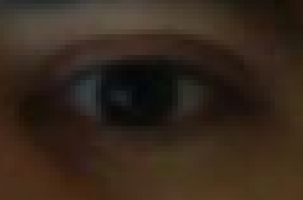

기존 예측 결과는 이상한 곳을 측정했다. 이런 경우 눈동자 위치를 새로 지정해서 Fine 라벨로 만들어야 한다.

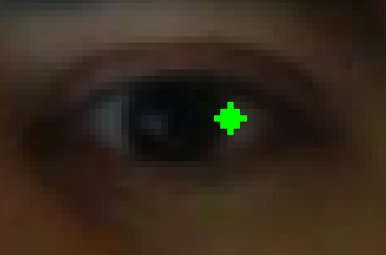

정확한 곳을 지정하기 위해서 마우스를 사용해야 할 것이다.

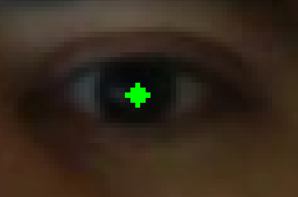

`OpenCV`에서는 마우스 이벤트를 callback 함수 형태로 지원한다.

- [콜백 함수(Callback)의 정확한 의미는 무엇일까?](https://satisfactoryplace.tistory.com/18)

`OpenCV`에서 지원하는 마우스 이벤트 형태는 아래 참고자료를 통해 확인해보자.

- [Mouse로 그리기 - gramman 0.1 documentation](https://opencv-python.readthedocs.io/en/latest/doc/04.drawWithMouse/drawWithMouse.html)

## 위치 측정을 위한 라벨링 툴 만들기 (2) 툴 만들기

이제 OpenCV의 마우스 이벤트를 이용해서 라벨링 툴(labeling tool)을 만들어볼 것이다. 아래 코드를 복사해 `keypoint_using_mouse.py`로 저장한다. 아래 코드는 필요한 패키지를 불러온다. 주로 `cv2` 를 이용한다. 이번에는 기존 라벨을 읽지 않고 새로 위치를 정하기 때문에 `img_path` 만 불러오면 된다. `flg_button` 은 마우스 이벤트가 발생할 때 사용할 불리언(boolean) 타입 전역변수이다.

```python
import os
from os.path import join
from glob import glob
import cv2
import argparse
import numpy as np
import json
from pprint import pprint

args = argparse.ArgumentParser()

# hyperparameters
args.add_argument('img_path', type=str, nargs='?', default=None)

config = args.parse_args()

flg_button = False
```

사용할 함수를 만들어보자. 해당 함수에서는 먼저 `img_path` 가 유효한지 체크한다. `img_path` 로 디렉토리가 입력될 경우 해당 디렉토리 내의 첫 번째 이미지를 `img_path` 에 입력하고 경로를 반환한다. 이미지 간 이동할 `move()` 함수도 선언한다.

```python
def check_dir():
    if config.img_path is None \
        or len(config.img_path) == 0 \
        or config.img_path == '' \
        or os.path.isdir(config.img_path):
        root = os.path.realpath('./')
        if os.path.isdir(config.img_path):
            root = os.path.realpath(config.img_path)
        img_list = sorted(glob(join(root, '*.png')))
        img_list.extend(sorted(glob(join(root, '*.jpg'))))
        config.img_path = img_list[0]

    img_dir = os.path.dirname(os.path.realpath(config.img_path))

    return img_dir

def move(pos, idx, img_list):
    if pos == 1:
        idx += 1
        if idx == len(img_list):
            idx = 0
    elif pos == -1:
        idx -= 1
        if idx == -1:
            idx = len(img_list) - 1
    return idx
```

mouse callback 함수를 정의한다. 전역변수인 `gparam` 에는 `img`와 `point` 정보를 저장한다. 마우스 왼쪽 버튼이 눌러졌다 떨어질 때 `gparam` 의 `point` 에 `x`, `y` 를 리스트로 저장한다.

```python
# Mouse callback function
def select_point(event, x,y, flags, param):
    global flg_button, gparam
    img = gparam['img']

    if event == cv2.EVENT_LBUTTONDOWN:
        flg_button = True

    if event == cv2.EVENT_LBUTTONUP and flg_button == True:
        flg_button = False
        print (f'({x}, {y}), size:{img.shape}')
        gparam['point'] = [x,y]
```

main 함수인 `blend_view()` 를 구현한다.

```python
def blend_view():
    global gparam
    gparam = {}
    cv2.namedWindow('show', 0)
    cv2.resizeWindow('show', 500, 500)

    img_dir = check_dir()

    fname, ext = os.path.splitext(config.img_path)
    img_list = [os.path.basename(x) for x in sorted(glob(join(img_dir,'*%s'%ext)))]

    dict_label = {}
    dict_label['img_dir'] = img_dir
    dict_label['labels'] = {}

    json_path = os.getenv('HOME')+'/aiffel/coarse_to_fine/eye_annotation.json'
    json_file = open(json_path, 'w', encoding='utf-8')

    idx = img_list.index(os.path.basename(config.img_path))
    pfname = img_list[idx]
    orig = None
    local_point = [] # 저장할 point list
    while True:
        start = cv2.getTickCount()
        fname = img_list[idx]
                # 파일의 변경이 없거나 이미지가 없을 때, point 를 초기화함
        if pfname != fname or orig is None:
            orig = cv2.imread(join(img_dir, fname), 1)
            gparam['point'] = []
            pfname = fname
                # 저장할 point(local point) 와 새로 지정한 gparam['point'] 가 변경된 경우,
                # local_point 를 업데이트
        if local_point != gparam['point']:
            orig = cv2.imread(join(img_dir, fname), 1)
            local_point = gparam['point']

        img_show = orig
        gparam['img'] = img_show
        cv2.setMouseCallback('show', select_point) # mouse event

        if len(local_point) == 2:
            img_show = cv2.circle(img_show, tuple(local_point),
                                  2, (0,255,0), -1)
            dict_label['labels'][fname] = local_point # label 로 저장

        time = (cv2.getTickCount() - start) / cv2.getTickFrequency() * 1000

        if img_show.shape[0] > 300:
            cv2.putText(img_show, '%s'%fname, (5,10), cv2.FONT_HERSHEY_COMPLEX_SMALL, 0.5, (255,255,255))

        print (f'[INFO] ({idx+1}/{len(img_list)}) {fname}... time: {time:.3f}ms', end='\r')

        cv2.imshow('show', img_show)

        key = cv2.waitKey(1)
        if key == 27:
            return -1
        if key == ord('n'):
            idx = move(1, idx, img_list)
        elif key == ord('p'):
            idx = move(-1, idx, img_list)
        elif key == ord('v'):
            print ()
            pprint (dict_label)
            print ()
        elif key == ord('s'):
            json.dump(dict_label, json_file, indent=2)
            print (f'[INFO] < {json_path} > saved!')

if __name__ == '__main__':
    blend_view()
```

main 함수인 `blend_view()` 는 이론 노드에서 만든 라벨링 툴의 구조와 비슷하게 구현했다. 달라진 점은 다음과 같다.

- 마우스 이벤트를 사용하기 위해 무한루프를 사용해서 gparam을 입력 받을 수 있게 한 것
- 이미지 변경이 없다면 gparam['point'] 를 초기화하지 않을 것
- 이미지 변경이 없더라도 callback 함수에서 gparam 변경이 일어나는 경우는 수정할 것

만든 프로그램을 실행시켜서 마우스로 점을 찍어 보자. 우선 위 이미지를 다운받아, `eye.png` 이름으로 현재 프로젝트 폴더의 하위 디렉토리인 `data` 에 저장한 후, 아래 코드를 터미널에서 실행한다.

```bash
python keypoint_using_mouse.py ./data/eye.png
```

눈동자 지점을 클릭한 후 `s`를 눌러 저장하면 `esc`를 눌러 프로그램을 종료할 때 `~/aiffel/coarse_to_fine/eye_annotation.json` 에 레이블이 저장된다.

## 데이터를 모아보자

이제 라벨링할 초기 데이터를 수집해야 한다. 직접 촬영한 데이터를 쓸 수도 있지만 들이는 노력에 비해 데이터가 많이 모이지 않는다. 때문에 공개된 데이터를 적극적으로 활용할 필요가 있다. 우리가 모아야 할 라벨은 눈동자 위치이기 때문에 아래 순서로 데이터셋을 찾으면 좋다.

1. 눈이 crop 되어 있고 눈동자 위치를 라벨로 가지고 있는 데이터
2. 얼굴 랜드마크(face landmark)를 가지고 있는 데이터
3. 얼굴 이미지를 가지고 있는 데이터

1번에 해당하는 데이터셋은 **BioID** 가 있습니다.

- [BioID Face Database | Dataset for Face Detection | facedb - BioID](https://www.bioid.com/facedb/)

BioID의 경우 우리가 해결해야 할 문제를 위한 데이터셋이지만 규모가 너무 작다는 단점이 있다. 충분한 양의 이미지를 수집하기 위해 다른 데이터셋도 조사해야 한다.

얼굴 랜드마크가 제공되는 데이터를 생각해보자. 랜드마크가 제공되는 경우는 눈 부분의 사진을 쉽게 crop해서 사용할 수 있기 때문에 라벨을 쉽게 만들 수 있다.

### 랜드마크를 제공하는 데이터셋을 찾아보자

---

랜드마크를 제공하는 데이터셋을 찾아보자. 우리는 `dlib` 패키지의 얼굴 랜드마크를 사용해오고 있다. 그렇다면 `dlib` 패키지를 구현하기 위해 사용된 랜드마크는 어떤 데이터셋으로 학습되었을지를 생각해보면 간단히 데이터를 찾을 수 있다. 구글에 "dlib face landmark dataset"을 검색해봅시다. 검색 첫 페이지에서 아래 링크를 찾을 수 있습니다.

- [http://dlib.net/face_landmark_detection.py.html](http://dlib.net/face_landmark_detection.py.html)

주석을 몇 줄 읽어보면 어떤 데이터셋을 사용해서 학습했는지 친절하게 안내되어 있다.

```
#   and was trained on the iBUG 300-W face landmark dataset (see
#   https://ibug.doc.ic.ac.uk/resources/facial-point-annotations/):
```

`iBUG 300-W` 라는 데이터셋으로 학습했다고 한다. 이 데이터셋을 이용하는 방법도 유용할 것이다. 하지만 실무에서 대부분의 경우는 내가 풀고자 하는 문제의 관련 도메인 데이터셋이 없기 때문에 위에서 알아본 방법 중 3번 방법도 고려해야 한다.

3번 방법을 연습해 보기 위해, 오늘은 LFW 데이터셋을 사용해 보자. 이 데이터셋은 `안면 인식(face recognition)`과 관련된 데이터셋이다 (해당 사진이 누구의 얼굴인지 판단하는 데이터셋). 얼굴이 포함된 이미지만 있고 얼굴의 랜드마크에 대한 정보는 없는 데이터셋이다. 이 이미지에 `dlib`을 적용해서 얼굴 위치와 랜드마크 위치를 찾고 눈을 잘라낸 뒤 라벨링을 할 수 있다.

데이터는 아래 링크에서 다운로드 받을 수 있습니다.

- [http://vis-www.cs.umass.edu/lfw/lfw.tgz](http://vis-www.cs.umass.edu/lfw/lfw.tgz)

```bash
& wget http://vis-www.cs.umass.edu/lfw/lfw.tgz
$ tar -xvzf lfw.tgz
```

위와 같이 다운로드 후 압축을 풀면 아래와 같은 이미지를 볼 수 있다.


## Mean-shift를 이용한 눈동자 검출 방법 (1) 이론

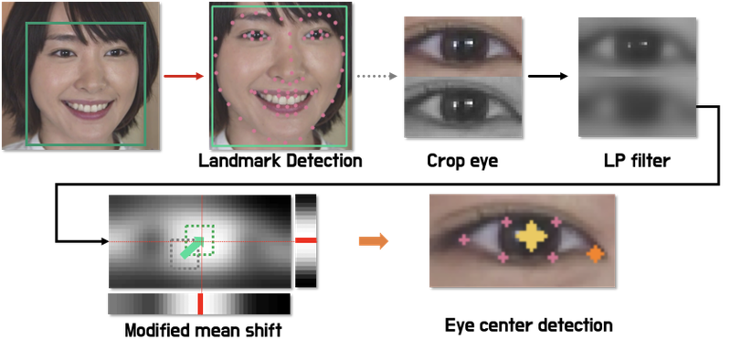

눈동자를 검출하기 위한 방법 중 쉽게 떠오르는 방법은 "눈동자는 주변 부분에 비해 어두운 색을 지니고 있다."를 가정으로 반전된 1D 이미지에서 최댓값을 찾는 방법이다.

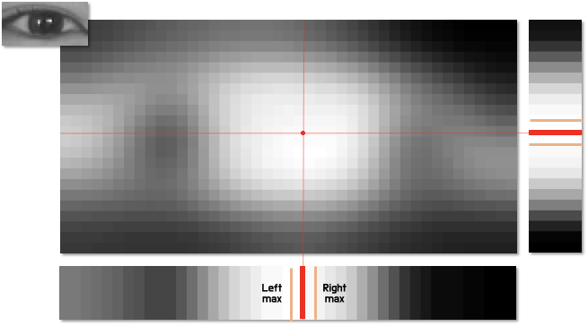

물론 이와 같은 가우시안 블러가 모든 상황을 해결할 수 있는 방법은 아니다. 아래 이미지와 같이 눈 근처에 머리카락이 나타나서 눈 가장자리에 검정색이 큰 비중으로 등장하는 경우는 눈동자보다 가장자리에 수렴할 확률이 높다. 특히 머리가 긴 분들에게 자주 나타날 수 있는 현상이다.

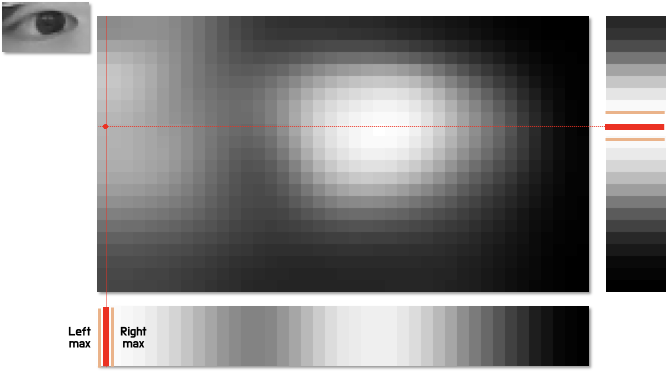

2차원 블러 특성 이미지(feature image)에서는 눈동자가 2차원 정규분포로 나타나는 영역이 있는 것으로 보인다. 하지만 1차원 누적 그래프를 보면 x축으로 2개의 봉우리를 가지는 것을 관찰할 수 있다. 최댓값을 찾는 알고리즘을 왼쪽부터 시작했다면 가장 왼쪽에서 만나는 255에 수렴할 것이다. 따라서 우리는 1D 누적 그래프와 2D 특성 이미지를 모두 사용한다. 2D에서는 어떻게 최고점을 찾아갈 것인가?

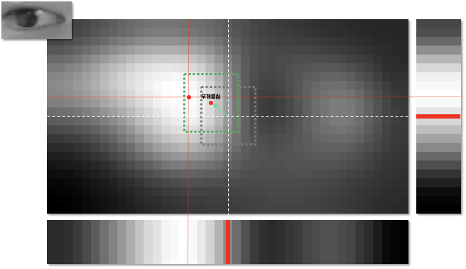

1. 이미지 중심점을 초기값으로 설정한다.
눈의 중심에 눈동자가 있을 확률이 높기 때문에 초기값으로 정하기에 아주 좋다.
2. 중심점을 기준으로 작은 box를 설정한다.
box의 크기는 문제에 따라 적절한 값을 설정해야 한다. 그림에서 회색박스를 생각하시면 된다.
3. box 내부의 pixel 값을 이용해서 '무게중심'을 찾는다.
이 때 무게중심은 pixel intensity를 weight 로 사용할 수 있습니다.
4. 찾은 무게중심을 새로운 box의 중심으로 설정한다.
이 단계에서 박스가 이동하게 된다. 이제 회색박스에서 초록색박스로 관심영역이 이동했다.
5. 다시 초록색 박스를 기준으로 2-4를 반복한다.
6. 중심점이 수렴할 때 까지 2~5를 반복하면 수렴한 점의 위치로 눈동자를 찾을 수 있다.

머신러닝에 이미 비슷한 알고리즘이 존재한다. 현재 위치와 탐색반경을 가질 때 평균의 위치를 이용해서 반복적으로 움직이는 알고리즘인 **Mean Shift** 라는 알고리즘이다.

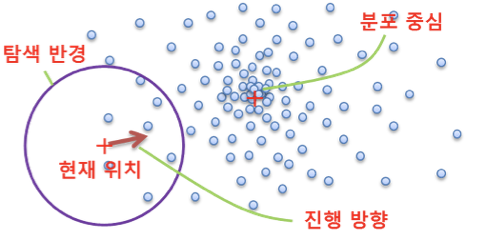

mean shift는 탐색반경 내 데이터 포인트의 평균을 구하고 평균 위치로 이동을 반복해 가면서 데이터 분포의 중심으로 이동한다.

- [영상추적#1 - Mean Shift 추적](https://darkpgmr.tistory.com/64)'

## Mean-shift를 이용한 눈동자 검출 방법 (2) 실습

눈동자를 검출하는 mean shift 기법을 코드로 구현해 보자. 오늘의 시작포인트는 바로 지난 노드에서 구현해 보았던 눈동자 찾기 실습코드이다. 해당 코드를 하나의 파일로 정리하여 `eye_center_basic.py`에 저장하였다. 이 코드를 이후 실습의 베이스라인으로 사용할 것이다.

```python
import matplotlib.pylab as plt
import tensorflow as tf
import os
from os.path import join
from glob import glob
from tqdm import tqdm
import numpy as np
import cv2
import math
import dlib
import argparse

args = argparse.ArgumentParser()

# hyperparameters
args.add_argument('show_substep', type=bool, nargs='?', default=False)

config = args.parse_args()

img = cv2.imread('./images/image.png')
print (img.shape)

if config.show_substep:
    plt.imshow(cv2.cvtColor(img, cv2.COLOR_BGR2RGB))
    plt.show()

img_bgr = img.copy()

detector_hog = dlib.get_frontal_face_detector() # detector 선언
landmark_predictor = dlib.shape_predictor('./models/shape_predictor_68_face_landmarks.dat')

img_rgb = cv2.cvtColor(img_bgr, cv2.COLOR_BGR2RGB)
dlib_rects = detector_hog(img_rgb, 1) # (image, num of img pyramid)

list_landmarks = []
for dlib_rect in dlib_rects:
    points = landmark_predictor(img_rgb, dlib_rect)
    list_points = list(map(lambda p: (p.x, p.y), points.parts()))
    list_landmarks.append(list_points)

for dlib_rect in dlib_rects:
    l = dlib_rect.left()
    t = dlib_rect.top()
    r = dlib_rect.right()
    b = dlib_rect.bottom()
    cv2.rectangle(img_rgb, (l,t), (r,b), (0,255,0), 2, lineType=cv2.LINE_AA)

for landmark in list_landmarks:
    for idx, point in enumerate(list_points):
        cv2.circle(img_rgb, point, 2, (255, 255, 0), -1) # yellow

if config.show_substep:
    plt.imshow(img_rgb)
    plt.show()

def eye_crop(bgr_img, landmark):
    # dlib eye landmark: 36~41 (6), 42~47 (6)
    np_left_eye_points = np.array(landmark[36:42])
    np_right_eye_points = np.array(landmark[42:48])

    np_left_tl = np_left_eye_points.min(axis=0)
    np_left_br = np_left_eye_points.max(axis=0)
    np_right_tl = np_right_eye_points.min(axis=0)
    np_right_br = np_right_eye_points.max(axis=0)

    list_left_tl = np_left_tl.tolist()
    list_left_br = np_left_br.tolist()
    list_right_tl = np_right_tl.tolist()
    list_right_br = np_right_br.tolist()

    left_eye_size = np_left_br - np_left_tl
    right_eye_size = np_right_br - np_right_tl

    ### if eye size is small
    if left_eye_size[1] < 5:
        margin = 1
    else:
        margin = 6

    img_left_eye = bgr_img[np_left_tl[1]-margin:np_left_br[1]+margin, np_left_tl[0]-margin//2:np_left_br[0]+margin//2]
    img_right_eye = bgr_img[np_right_tl[1]-margin:np_right_br[1]+margin, np_right_tl[0]-margin//2:np_right_br[0]+margin//2]

    return [img_left_eye, img_right_eye]

# 눈 이미지 crop
img_left_eye, img_right_eye = eye_crop(img_bgr, list_landmarks[0])

print (img_left_eye.shape) # (26, 47, 3)

if config.show_substep:
    plt.imshow(cv2.cvtColor(img_right_eye, cv2.COLOR_BGR2RGB))
    plt.show()

# 눈 이미지에서 중심을 찾는 함수
def findCenterPoint(gray_eye, str_direction='left'):
    if gray_eye is None:
        return [0, 0]
    filtered_eye = cv2.bilateralFilter(gray_eye, 7, 75, 75)
    filtered_eye = cv2.bilateralFilter(filtered_eye, 7, 75, 75)
    filtered_eye = cv2.bilateralFilter(filtered_eye, 7, 75, 75)

    # 2D images -> 1D signals
    row_sum = 255 - np.sum(filtered_eye, axis=0)//gray_eye.shape[0]
    col_sum = 255 - np.sum(filtered_eye, axis=1)//gray_eye.shape[1]

    # normalization & stabilization
    def vector_normalization(vector):
        vector = vector.astype(np.float32)
        vector = (vector-vector.min())/(vector.max()-vector.min()+1e-6)*255
        vector = vector.astype(np.uint8)
        vector = cv2.blur(vector, (5,1)).reshape((vector.shape[0],))
        vector = cv2.blur(vector, (5,1)).reshape((vector.shape[0],))            
        return vector
    row_sum = vector_normalization(row_sum)
    col_sum = vector_normalization(col_sum)

    def findOptimalCenter(gray_eye, vector, str_axis='x'):
        axis = 1 if str_axis == 'x' else 0
        center_from_start = np.argmax(vector)
        center_from_end = gray_eye.shape[axis]-1 - np.argmax(np.flip(vector,axis=0))
        return (center_from_end + center_from_start) // 2

    center_x = findOptimalCenter(gray_eye, row_sum, 'x')
    center_y = findOptimalCenter(gray_eye, col_sum, 'y')

    if center_x >= gray_eye.shape[1]-2 or center_x <= 2:
        center_x = -1
    elif center_y >= gray_eye.shape[0]-1 or center_y <= 1:
        center_y = -1

    return [center_x, center_y]

# 눈동자 검출 wrapper 함수
def detectPupil(bgr_img, landmark):
    if landmark is None:
        return

    img_eyes = []
    img_eyes = eye_crop(bgr_img, landmark)

    gray_left_eye = cv2.cvtColor(img_eyes[0], cv2.COLOR_BGR2GRAY)
    gray_right_eye = cv2.cvtColor(img_eyes[1], cv2.COLOR_BGR2GRAY)

    if gray_left_eye is None or gray_right_eye is None:
        return 

    left_center_x, left_center_y = findCenterPoint(gray_left_eye,'left')
    right_center_x, right_center_y = findCenterPoint(gray_right_eye,'right')

    return [left_center_x, left_center_y, right_center_x, right_center_y, gray_left_eye.shape, gray_right_eye.shape]

# 눈동자 중심 좌표 출력
left_center_x, left_center_y, right_center_x, right_center_y, le_shape, re_shape = detectPupil(img_bgr, list_landmarks[0])
print ((left_center_x, left_center_y), (right_center_x, right_center_y), le_shape, re_shape)

# 이미지 출력
show = img_right_eye.copy()

show = cv2.circle(show, (right_center_x, right_center_y), 2, (0,255,255), -1)

plt.imshow(cv2.cvtColor(show, cv2.COLOR_BGR2RGB))
plt.show()
```

이 코드의 동작은 아래와 같이 확인해 볼 수 있다. `show_substep` argument의 옵션을 True로 주게 되면 매 스텝의 작동을 차례차례 확인해볼 수 있다. 옵션을 False로 주거나 생략(기본옵션)하면 최종 결과만 확인하게 된다.

```python
python eye_center_basic.py True
```

이제 mean shift 알고리즘을 적용해 보자. `eye_center_basic.py` 파일을 복사하여 `eye_center_meanshift.py`를 생성합니다.

`eye_center_meanshift.py` 파일을 편집기로 열어 기존 함수 중 `findCenterPoint`를 다음과 같이 수정합니다.

```python
def findCenterPoint(gray_eye, str_direction='left'):
    if gray_eye is None:
        return [0, 0]
    filtered_eye = cv2.bilateralFilter(gray_eye, 7, 75, 75)
    filtered_eye = cv2.bilateralFilter(filtered_eye, 7, 75, 75)
    filtered_eye = cv2.bilateralFilter(filtered_eye, 7, 75, 75)

    # 2D images -> 1D signals
    row_sum = 255 - np.sum(filtered_eye, axis=0)//gray_eye.shape[0]
    col_sum = 255 - np.sum(filtered_eye, axis=1)//gray_eye.shape[1]

    # normalization & stabilization
    def vector_normalization(vector):
        vector = vector.astype(np.float32)
        vector = (vector-vector.min())/(vector.max()-vector.min()+1e-6)*255
        vector = vector.astype(np.uint8)
        vector = cv2.blur(vector, (5,1)).reshape((vector.shape[0],))
        vector = cv2.blur(vector, (5,1)).reshape((vector.shape[0],))            
        return vector
    row_sum = vector_normalization(row_sum)
    col_sum = vector_normalization(col_sum)

    def findOptimalCenter(gray_eye, vector, str_axis='x'):
        axis = 1 if str_axis == 'x' else 0
        center_from_start = np.argmax(vector)
        center_from_end = gray_eye.shape[axis]-1 - np.argmax(np.flip(vector,axis=0))
        return (center_from_end + center_from_start) // 2

    # x 축 center 를 찾는 알고리즘을 mean shift 로 대체합니다.
    # center_x = findOptimalCenter(gray_eye, row_sum, 'x')
    center_y = findOptimalCenter(gray_eye, col_sum, 'y')

    # 수정된 부분
    inv_eye = (255 - filtered_eye).astype(np.float32)
    inv_eye = (255*(inv_eye - inv_eye.min())/(inv_eye.max()-inv_eye.min())).astype(np.uint8)

    resized_inv_eye = cv2.resize(inv_eye, (inv_eye.shape[1]//3, inv_eye.shape[0]//3))
    init_point = np.unravel_index(np.argmax(resized_inv_eye),resized_inv_eye.shape)

    x_candidate = init_point[1]*3 + 1
    for idx in range(10):
        temp_sum = row_sum[x_candidate-2:x_candidate+3].sum()
        if temp_sum == 0:
            break
        normalized_row_sum_part = row_sum[x_candidate-2:x_candidate+3].astype(np.float32)//temp_sum
        moving_factor = normalized_row_sum_part[3:5].sum() - normalized_row_sum_part[0:2].sum()
        if moving_factor > 0.0:
            x_candidate += 1
        elif moving_factor < 0.0:
            x_candidate -= 1

    center_x = x_candidate

    if center_x >= gray_eye.shape[1]-2 or center_x <= 2:
        center_x = -1
    elif center_y >= gray_eye.shape[0]-1 or center_y <= 1:
        center_y = -1

    return [center_x, center_y]
```

먼저, 눈 이미지를 low pass filter를 이용해서 smoothing 한다. 여기서는 bilateral filter를 이용했다. 다음으로 1차원 값으로 누적시킨 후 `y` 축 기준으로 최대값을 찾아서 `y`축의 중심점 좌표를 먼저 얻어낸다. (y 축은 x 축에 비해 상대적으로 변화가 적기 때문에 간단하게 구현한다.)

`x`축은 1차원 최댓값 지점을 기준으로 mean shift를 수행한다. 양 끝단에 수렴하는 예외를 처리한 후 결과를 출력한다.

```python
# 눈동자 중심 좌표 출력
left_center_x, left_center_y, right_center_x, right_center_y, le_shape, re_shape = detectPupil(img_bgr, list_landmarks[0])
print ((left_center_x, left_center_y), (right_center_x, right_center_y), le_shape, re_shape)

# 이미지 출력
show = img_right_eye.copy()
show = cv2.circle(show, (right_center_x, right_center_y), 2, (0,255,255), -1)

plt.imshow(cv2.cvtColor(show, cv2.COLOR_BGR2RGB))
plt.show()
```

결과를 확인해본다.

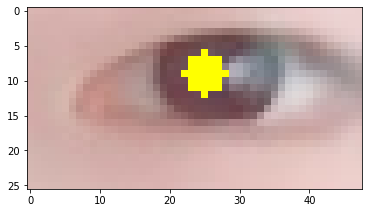

여전히 눈동자 중심은 아니어서 조금 아쉽다. 기존 머신러닝 기반 알고리즘으로는 성능을 큰 폭으로 향상시키기 어렵다. 하지만 예외 상황에 대해 더 강건한 모델을 만들 수 있는 장점이 있다. 일반화에 한 걸음 더 가까워지고 있다.

## 키포인트 검출 딥러닝 모델 만들기 (1) 데이터 확인

더 나은 성능을 위해 딥러닝 모델을 만들어 보자. 지난 이론 시간에 배웠던 딥러닝 모델링 기법을 적용해 실제로 학습을 수행해볼 것이다.

이번 단계에서는 대량의 눈동자 위치 라벨이 필요하다. 앞에서 만든 coarse dataset 또는 직접 어노테이션 한 라벨이 10,000개 이상 있어야 성능을 확인할 수 있다.

이전 스텝에서 다룬 눈동자 검출 방법을 LFW 데이터셋에 적용하여 필요한 만큼의 데이터셋을 생성해 보자. 데이터셋을 생성하는 코드 `prepare_eye_dataset.py`를 실행하면 아래 사용할 데이터셋이 LFW 데이터셋으로부터 가공 생성된다. 생성된 데이터셋은 `~/lfw/data/train`, `~/lfw/data/valid` 아래에서 확인할 수 있다.

```python
import tensorflow as tf
import numpy as np
import math
import tensorflow_hub as hub
from tensorflow.keras import layers
from tensorflow.keras import models
from tensorflow.keras.callbacks import LearningRateScheduler
```

TensorFlow Hub에서 제공하는 **pretrained image feature embedding**을 가지고 fine tuning을 해볼 것이다. 가지고 있는 데이터를 케라스 `ImageDataGenerator` 형식으로 읽습니다. 글쓴이는 라벨을 `image` 형태로 저장해 두었다.

```python
import glob
import os

home_dir = os.getenv('HOME')+'/lfw'
list_image = sorted(glob.glob(home_dir+'/data/train/input/img/*.png'))
list_label = sorted(glob.glob(home_dir+'/data/train/label/mask/*.png'))
print (len(list_image), len(list_label))

# 32의 배수를 벗어나는 파일 경로들을 담은 list
list_image_out_of_range = list_image[len(list_image) - (len(list_image) % 32):]
list_label_out_of_range = list_label[len(list_label) - (len(list_label) % 32):]

# 해당 list가 존재한다면, 파일 삭제
if list_image_out_of_range:
    for path in list_image_out_of_range:
        os.remove(path)
if list_label_out_of_range:
    for path in list_label_out_of_range:
        os.remove(path)

IMAGE_SHAPE = (80, 120)
data_root = home_dir+'/data/train/input'
label_root = home_dir+'/data/train/label'

image_generator = tf.keras.preprocessing.image.ImageDataGenerator()
label_generator = tf.keras.preprocessing.image.ImageDataGenerator()
image_data = image_generator.flow_from_directory(str(data_root), class_mode=None, target_size=IMAGE_SHAPE, batch_size=32)
label_data = label_generator.flow_from_directory(str(label_root), class_mode=None, target_size=IMAGE_SHAPE, batch_size=32)
```

train 데이터셋이 23,712쌍, val 데이터셋이 2,638쌍 생성될 것이다. 경우에 따라서는 train 데이터셋의 갯수가 23,712쌍과 다소 다르게 만들어질 수 있다. batch_size 32의 배수인 23,712쌍과 같아지도록 이미지 데이터의 갯수를 맞춰주도록 하자. 32의 배수 조건만 만족하면 된다.

아래 코드에서는 `image_generator`, `label generator`를 학습할 수 있는 입출력 형식으로 편집한다. Tensorflow의 제너레이터(generator) 형식을 사용하고 있기 때문에 출력 형식도 맞추어 준다.

- 참고: [제너레이터](https://tensorflow.blog/%ED%9A%8C%EC%98%A4%EB%A6%AC%EB%B0%94%EB%9E%8C%EC%9D%84-%ED%83%84-%ED%8C%8C%EC%9D%B4%EC%8D%AC/%EC%A0%9C%EB%84%88%EB%A0%88%EC%9D%B4%ED%84%B0/)

학습 라벨을 만들 때 3개의 점을 `label` 이미지에 표시했다. 눈의 왼쪽 끝점을 `1`의 값으로, 오른쪽 끝점은 `2`의 값으로, 가장 중요한 눈 중심(눈동자)는 `3`으로 인코딩 했다. `np.where()` 함수로 이미지에서 좌표로 복원한다.

```python
def user_generation(train_generator, label_generator):
    h, w = train_generator.target_size
    for images, labels in zip(train_generator, label_generator):
        images /= 255.
        images = images[..., ::-1] # rgb to bgr

        list_point_labels = []
        for img, label in zip(images, labels):

            eye_ls = np.where(label==1) # leftside
            eye_rs = np.where(label==2) # rightside
            eye_center = np.where(label==3)

            lx, ly = [eye_ls[1].mean(), eye_ls[0].mean()]
            rx, ry = [eye_rs[1].mean(), eye_rs[0].mean()]
            cx, cy = [eye_center[1].mean(), eye_center[0].mean()]

            if len(eye_ls[0])==0 or len(eye_ls[1])==0:
                lx, ly = [0, 0]
            if len(eye_rs[0])==0 or len(eye_rs[1])==0:
                rx, ry = [w, h]
            if len(eye_center[0])==0 or len(eye_center[1])==0:
                cx, cy = [0, 0]

            np_point_label = np.array([lx/w,ly/h,rx/w,ry/h,cx/w,cy/h], dtype=np.float32)

            list_point_labels.append(np_point_label)
        np_point_labels = np.array(list_point_labels)
        yield (images, np_point_labels)
```

만들어진 제네레이터로 데이터 포인트를 뽑아 관찰해본다.

```python
user_train_generator = user_generation(image_data, label_data)
for i in range(2):
    dd = next(user_train_generator)
    print (dd[0][0].shape, dd[1][0])

"""
(80, 120, 3) [0.        0.        1.        1.        0.5804054 0.24375  ]
(80, 120, 3) [0.         0.         1.         1.         0.4625     0.22232144]
"""
```

120x80의 정해진 크기로 이미지가 잘 출력되고 라벨 또한 0~1 값으로 정규화(normalize) 되어 있는 것을 확인할 수 있다.

## 키포인트 검출 딥러닝 모델 만들기 (2) 모델 설계

데이터가 준비되었으니 이제 네트워크를 디자인한다. 우리는 데이터가 없는 상황이기 때문에 미리 학습된 모델을 적극적으로 활용해야 합니다. TensorFlow Hub에서 ResNet의 특성추출기 부분을 백본(backbone)으로 사용한다.

`tf.keras.Sequential()`을 이용해서 백본 네트워크와 fully connected layer를 쌓아서 아주 쉽게 모델을 완성할 수 있다. 데이터 제너레이터를 만들 때 출력을 6개((x, y) 좌표 2개 * 점 3개) 로 했기 때문에 `num_classes` 는 6으로 설정한다.

```python
''' tf hub feature_extractor '''
feature_extractor_url = "https://tfhub.dev/google/imagenet/resnet_v2_50/feature_vector/4"
feature_extractor_layer = hub.KerasLayer(feature_extractor_url,
                                            input_shape=(80,120,3))

image_batch = next(image_data)
feature_batch = feature_extractor_layer(image_batch)
print(feature_batch.shape)

num_classes = 6

feature_extractor_layer.trainable = False
model = tf.keras.Sequential([
    feature_extractor_layer,
    #layers.Dense(1024, activation='relu'),
    #layers.Dropout(0.5),
    layers.Dense(num_classes, activation='sigmoid'),
])

model.summary()
```

이 문제는 점을 맞는 위치로 추정하는 position regression 문제이기 때문에 `loss`와 `metric`을 각각 `mse` 와 `mae` 로 설정했다. `mae` 를 통해서 픽셀 위치가 평균적으로 얼마나 차이나는지 확인하면서 학습할 수 있다.

```python
model.compile(
  optimizer=tf.keras.optimizers.Adam(),
  loss='mse',
  metrics=['mae']
  )
```

학습률(learning rate)을 조절하는 함수도 제작해 준다. 여기서는 지수적으로 감소하게 만들었다.

```python
def lr_step_decay(epoch):
      init_lr = 0.0005 #self.flag.initial_learning_rate
      lr_decay = 0.5 #self.flag.learning_rate_decay_factor
      epoch_per_decay = 2 #self.flag.epoch_per_decay
      lrate = init_lr * math.pow(lr_decay, math.floor((1+epoch)/epoch_per_decay))
      return lrate
```

학습을 진행한다.

```python
steps_per_epoch = image_data.samples//image_data.batch_size
print (image_data.samples, image_data.batch_size, steps_per_epoch)
# 23712 32 741 -> 데이터를 batch_size(32) 의 배수로 맞춰 준비해 주세요. 

assert(image_data.samples % image_data.batch_size == 0)  # 데이터가 32의 배수가 되지 않으면 model.fit()에서 에러가 발생합니다.

learning_rate = LearningRateScheduler(lr_step_decay)

history = model.fit(user_train_generator, epochs=10,
                    steps_per_epoch=steps_per_epoch,
                    callbacks = [learning_rate]
                    )
```

## 키포인트 검출 딥러닝 모델 만들기 (3) 평가

검증(validation)용 데이터는 섞어줄(shuffle) 필요가 없기 때문에 `shuffle=False` 옵션을 추가했다.

```python
IMAGE_SHAPE = (80, 120)

home_dir = os.getenv('HOME')+'/lfw'

val_data_root = home_dir + '/data/val/input'
val_label_root = home_dir + '/data/val/label'

image_generator_val = tf.keras.preprocessing.image.ImageDataGenerator()
label_generator_val = tf.keras.preprocessing.image.ImageDataGenerator()
image_data_val = image_generator.flow_from_directory(str(val_data_root), class_mode=None, target_size=IMAGE_SHAPE, shuffle=False)
label_data_val = label_generator.flow_from_directory(str(val_label_root), class_mode=None, target_size=IMAGE_SHAPE, shuffle=False)
```

제네레이터를 만들고 `evaluate_generator()`로 평가를 수행한다.

```python
user_val_generator = user_generation(image_data_val, label_data_val)
mse, mae = model.evaluate_generator(user_val_generator, image_data_val.n // 32)
print(mse, mae) # 0.012652858160436153 0.05165359377861023
```

글쓴이는 평균 에러가 0.026 정도 나왔다. 우리가 찍은 점들은 120 픽셀을 기준으로 `120*0.026 = 3.12` 픽셀 정도 에러가 나는 것을 확인할 수 있다. 실제로 이미지에 출력해보자.

```python
# img test
import cv2
import matplotlib.pyplot as plt

img = cv2.imread(val_data_root+'/img/eye_000010_l.png')
plt.imshow(cv2.cvtColor(img, cv2.COLOR_BGR2RGB))
plt.show()
```

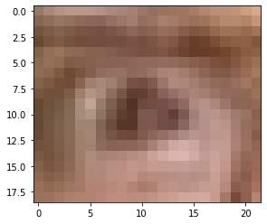

입력을 위해 이미지를 120x80 으로 resize 한 후, 배치(batch)를 나타낼 수 있는 4차원 텐서로 변경한다. 우선 이미지 1장에 대해서 출력을 하려 하니 지금은 배치 크기(batch size)를 1로 만들면 될 것이다.

```python
np_inputs = np.expand_dims(cv2.resize(img, (120, 80)), axis=0)
preds = model.predict(np_inputs/255., 1)

repred = preds.reshape((1, 3, 2))
repred[:,:,0] *= 120
repred[:,:,1] *= 80
print (repred)

"""
[[[5.73401153e-03 3.92975798e-03]
  [1.19998795e+02 7.99998932e+01]
  [5.81881523e+01 2.85411797e+01]]]
"""
```

출력결과를 뽑아보면 다음과 같이 나온다. 1행부터 좌측, 우측, 중앙 좌표를 나타낸다. 결과를 이미지에 출력해보자. `pt` 값은 120x80 으로 뽑았는데 우리가 사용하는 데이터 크기는 60x40이다. 따라서 `pt` 에 0.5 를 곱해서 그림에 출력한다. `pt`값을 뽑을때의 이미지 크기 기준(120X80)은 고정이지만, 사용하는 데이터의 크기는 매번 달라질 것이다. 보정치 설정에 유의하자.

```python
show = img.copy()
for pt in repred[0]:
    print (pt.round())
    show = cv2.circle(show, tuple((pt*0.5).astype(int)), 3, (0,255,255), -1)

plt.imshow(cv2.cvtColor(show, cv2.COLOR_BGR2RGB))
plt.show()
```

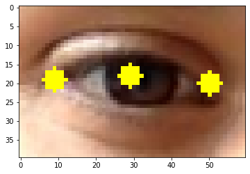

눈의 왼쪽은 정말 잘 찾은 것 같다. 반면 눈 중심과 오른쪽 위치는 5픽셀 정도의 오차를 보이는 것 같다. 더 정확한 성능(적은 에러)를 원한다면 데이터를 추가로 넣어야 할 것 같다.

## 프로젝트 : 카메라 앱에 당황한 표정 효과를 적용해보기


그림처럼 놀라서 눈이 튀어나오는 듯 한 효과를 내보자. 우선 눈을 찾고, 눈에 효과를 적용해 본다. 어려워 보여도 차근차근 한다면 충분히 간단한 프로토타입을 구현할 수 있다.

### 1. 이론 시간에 다룬 모델을 참고하여 딥러닝 모델을 설계해 봅시다.

---

7~9번 스텝에서 키포인트 검출을 위한 딥러닝 모델을 만들어본 바 있다. 이를 활용해서 눈 이미지에서 적합한 키포인트를 찾는 딥러닝 모델을 구현해 본다. 이 모델의 학습을 위해서는 오늘 다룬 것처럼 데이터를 모아 데이터셋을 구축하는 과정이 함께 진행되어야 할 것이다.

### 2. 눈동자 효과를 추가해 봅시다.

---

추출된 눈 위치에 위의 당황한 표정의 눈 이미지를 합성해 보자. 이렇게 합성된 이미지를 제출하는 것까지가 오늘 프로젝트 과제의 목표이다.

## 회고록

- 뒤로 갈 수록 노드가 점점 엉망인 것 같다. 라벨링 하는 도구가 눈의 위치를 제대로 찾지 못하는 것 같다.
- 모델이 눈의 위치를 제대로 찾지 못하여 이미지를 합성할 수 없었다.
