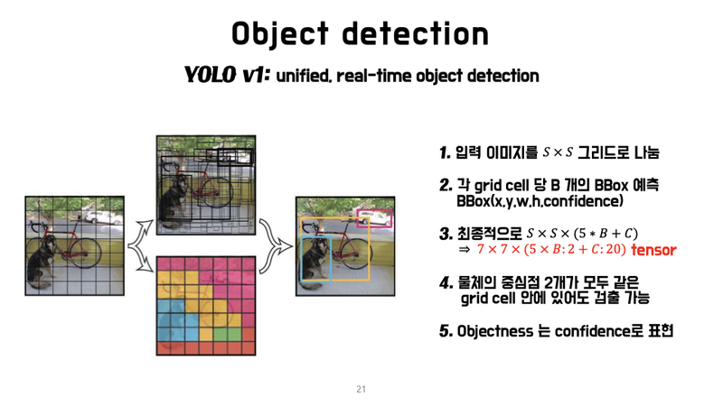
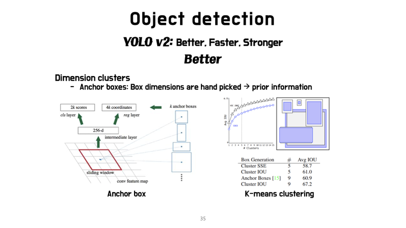

# 17. 멀리 있지만 괜찮아

## Dlib 얼굴 인식의 문제점

### Face detection, 얼마나 작고 빨라질 수 있을까?

---

우리는 지난 시간까지 카메라 스티커앱을 만들면서 이미지 속의 얼굴을 빠르고 정확하게 인식하는 방법에 대해 고민해 왔다. 첫번째로 고려해본 방법은 Dlib 라이브러리를 이용해서 Face Landmark를 찾아내는 것이었다. 하지만 그것만으로는 충분하지 않았다. 다음과 같은 문제점들이 발견되었다.

- 얼굴을 잘 못찾는다.
- 동영상을 처리하기엔 너무 느리다.
- 얼굴 각도, 방향, 크기 등의 변화에 취약하다.

### 왜 작아지고 빨라지는게 중요한가?

---

우선 비대면 인증수단으로 얼굴인식이 보편적으로 사용되기 시작했다는 점을 들 수 있다. 그런데 이런 얼굴 인식을 위해 딥러닝 서버 구동이 필요한 모델을 활용할 수 있을까?

서버로 이미지를 보낸 후 처리하는 방식은 네트워크 비용 + 서버비용 + 인터넷 속도의 영향을 고려하지 않을 수 없다. 네트워크 상황과 무관하게 항상 동작해야 하는 핸드폰 인증 수단으로는 적합하지 않을 것이다. 그래서 edge device(= 핸드폰)를 바로 이용할 수 있어야 한다.

핸드폰에 모델을 올리려면 weight 가 작은 모델이 관리에 유리하다. 하지만 일반적으로 작은 모델은 성능이 떨어지기 때문에 어떻게 보완할 수 있을지 고민이 시작된다.

국내 IT 대기업들도 이미 관련 연구를 활발히 진행하고 있다. 아래 글들을 통해 상세한 내용을 참고하자.

- 카카오 얼굴인식 관련 리서치 글 : [https://tech.kakaoenterprise.com/63](https://tech.kakaoenterprise.com/63)
- 네이버 얼굴검출 관련 오픈소스 : [https://github.com/clovaai/EXTD_Pytorch](https://github.com/clovaai/EXTD_Pytorch)

### 어떻게 빠르게 만들 수 있을까?

---

- sliding window 를 버려야 빨라진다. 2-stage 방식의 detection은 좋은 대안이 되질 못한다.
- 병렬화가 가능해야 한다.
- CNN 은 GPU 에서 병렬화가 가능하겠지만, 핸드폰에서도 병렬화가 가능한가?
- Apple 은 CoreML 이라는 라이브러리를 지원한다.
    - [https://developer.apple.com/documentation/coreml](https://developer.apple.com/documentation/coreml)
    - [http://machinethink.net/blog/ios-11-machine-learning-for-everyone/](http://machinethink.net/blog/ios-11-machine-learning-for-everyone/)
    - 사례 : 16core 뉴럴엔진을 넣은 아이폰12 iPhone 12 Pro 및 iPhone 12 Pro Max
- 스마트폰 제조사가 병렬화를 지원하지 않는다면? 어떤 대안이 있을까?
    - 안드로이드는 구글 것
    - ML kit : [https://www.slideshare.net/inureyes/ml-kit-machine-learning-sdk](https://www.slideshare.net/inureyes/ml-kit-machine-learning-sdk)
    - tflite : [https://www.tensorflow.org/lite?hl=ko](https://www.tensorflow.org/lite?hl=ko)
    - tflite가 안된다면 직접 병렬프로그래밍으로 pytorch, tensorflow 같은 툴을 제작한다. (난이도 ★★★★★)
    - (참고) 최근에는 면접에서 아래와 같은 병렬화 도구 경험을 묻는 사례가 많이 등장하고 있다. 주로 모바일 기반 유명 서비스 회사들이 그런 경우가 많다.
        - SIMD : [https://stonzeteam.github.io/SIMD-병렬-프로그래밍/](https://stonzeteam.github.io/SIMD-%EB%B3%91%EB%A0%AC-%ED%94%84%EB%A1%9C%EA%B7%B8%EB%9E%98%EB%B0%8D/)
        - OpenCL : [https://www.khronos.org/opencl/](https://www.khronos.org/opencl/)
        - OpenGL ES : [https://developer.android.com/guide/topics/graphics/opengl?hl=ko](https://developer.android.com/guide/topics/graphics/opengl?hl=ko)

하지만 무엇보다도 적은 파라미터 수로도 정확한 성능을 가지는 모델을 설계하는 게 중요하다.

## Single Stage Object Detection

여러분은 아마도 2-stage detector 의 실행속도가 느리다는 것을 이미 공부해서 알고 있을 것이다. 이전 스텝에서 살펴본 것처럼, 얼굴인식 같이 딥러닝 모델이 가벼워야하는 task 는 1-stage 기반을 사용하는 것이 유리할 것이다.

- object detection 모델을 자세히 설명 : [Object Detection Part 4: Fast Detection Models](https://lilianweng.github.io/lil-log/2018/12/27/object-detection-part-4.html)
- single shot object detectors : [What do we learn from single shot object detectors (SSD, YOLOv3), FPN & Focal loss (RetinaNet)?](https://jonathan-hui.medium.com/what-do-we-learn-from-single-shot-object-detectors-ssd-yolo-fpn-focal-loss-3888677c5f4d)
- 위 글의 번역본 : [https://murra.tistory.com/17](https://murra.tistory.com/17)

이후 스텝에서 우리는 1-stage(Single stage) Object detection 모델들 위주로 Face detection에 적합한 딥러닝 모델들에 대해 탐색해 볼 것이다. YOLO, SSD, RetinaNet 등 이 분야의 모델들의 발전사는 딥러닝 분야에서도 매우 흥미진진한 이력을 가지고 있으니, 함께 살펴보자.

## YOLO (1) YOLO v1의 등장

### YOLO : You Only Look Once

---

YOLO라는 모델의 네이밍 센스는 과연 어디에서 왔을까? YOLO라는 유명한 모델을 언급하려면 절대 빼놓을 수 없는 한 사람이 있다. 바로 Joseph Redmon, YOLO 논문의 1저자이자, C로 구현된 오픈소스 뉴럴 네트워크 Darknet의 제작자이다.

### YOLO v1, bigwave의 시작

---

- YOLO의 출현 : 당시 전 세계 computer vision 학계와 업계에 충격적일 정도의 기술 진보를 보여준 사례

CVPR 2016. 무려 2016년도에 CVPR oral session 에서 실시간 데모를 해버린다. 지금은 자연스러워 보일 수도 있지만, 당시 기술 수준을 생각해보면 object detection을 실시간으로 학회장에서 보여줬다는 것은 충격과 공포 그 자체였다.

CVF 채널에서 유튜브 조회수 1위 동영상이다. 참고로 2위는 2 stage detector 기반인 Mask-R-NN이다. Detection이 얼마나 관심이 많은지 알 수 있는 대목이다.

## YOLO (2) YOLO v1의 원리

### R-CNN와 YOLO

---

대표적인 2-stage detector인 R-CNN과 YOLO 모델은 아래와 같이 기본 가정에서부터 차이점이 있다.

- RCNN 계열의 가정 :
"물체가 존재할 것 같은 곳을 backbone network 로 표현할 수 있다." → region proposal network
- YOLO v1 의 가정 :
"이미지 내의 작은 영역을 나누면 그 곳에 물체가 있을 수 있다." → grid 내에 물체가 존재한다.
- backbone 을 통과한 7x7 feature map 에서 1px 가 1개의 grid 를 의미함 Q. 원본 이미지에서 1개의 grid box 의 사이즈를 구하시오 A. 448 / 7 = 64 ⇒ 64x64
- 7x7 feature map 에서 1) Bounding box 와 관련된 Bbox 개수 x (x, y, w, h, confidence) 5 개 값 2) Class 확률 C 개의 tensor 를 출력
- 즉 최종 출력 개수는 7x7x(5xB + C) 가 됩니다.

### YOLO의 grid cell

---

Q. 1개의 grid 당 2개의 Bbox 와 20개 클래스를 예측하는 YOLO 를 만들고 싶은 경우 output tensor 의 flatten 했을 때 크기는? A. 7 x 7 x (5 x 2 + 20) = (1470,)

- 자전거에 해당하는 grid 가 많은데 이런 경우는 해당 grid 들이 모두 자전거를 나타내는가? ⇒ 그렇다. 학습이 잘 된 경우 모두 비슷한 크기로 자전거의 bbox 를 잡는다.
- 그러면 한 물체를 잡는 bbox 가 많아지는 경우는 어떻게 하는가? ⇒ 이미 배웠듯이 NMS 와 같은 기법을 이용한다.
- YOLO 의 목표는 grid 에 해당하는 물체를 잘 잡아내는 것이다.

- grid cell 에 속하는 물체를 검출할 책임이 있다고 생각하면 된다.
- 따라서 1개 grid 에 귀속된 bbox 정보 (x,y,w,h) 의 학습 목표는 bbox gt 와 최대한 동일하게 학습되어야 한다. (이때 IoU 를 사용한다)

### YOLO의 특징

---

- 기존 R-CNN 계열 방법은 검출속도가 느리다.
- Faster R-CNN은 RPN 후보군을 뽑고 localization, classification 을 수행한다. 이 때 RPN 에서 300개 영역을 제안하는데, objectness 의 숫자가 많을 수록 느려지며 7x7= 49 grid 와 비교해서 봐야할 부분이다.

### YOLO의 Inference 과정

---

- 7x7 grid 마지막 layer를 해석한다.
- 7x7 x (30) 에서 30 = 5(x,y,w,h,c) + 5 + 20 (class) 로 이루어진다.
- classification 은 이미 우리가 익히 알고 있는 P( real | pred ) 인 likelihood 를 사용한다.

(참고) [https://www.slideshare.net/TaegyunJeon1/pr12-you-only-look-once-yolo-unified-realtime-object-detection](https://www.slideshare.net/TaegyunJeon1/pr12-you-only-look-once-yolo-unified-realtime-object-detection)

- confidence score 를 loss 로 만들 때는 P(class | object) * P(object) * IoU 로 표현한다.
- 즉 7x7x2 개의 class confidence score 가 계산된다.

## YOLO (3) YOLO v1의 성능

### YOLO v1의 loss 함수

---

### YOLO의 성능

---

- arXiv 논문 발표에서는 mAP 가 63.4 였지만 CVPR 2016 발표때는 69.0 으로 향상시켜서 발표했다.
- Faster RCNN 과 큰 차이가 나지 않으면서 속도는 6배 이상인 혁신적인 연구였다.

### YOLO v1의 단점

---

- 각각 grid cell 이 하나의 클래스만 예측 가능하므로 작은 object 에 대해 예측이 어렵다.
- bbox 형태가 training data 를 통해 학습 → bbox 분산이 너무 넓어 새로운 형태의 bbox 예측이 잘 되지 않았다.
- 모델 구조상 backbone 만 거친 feature map 대상으로 bbox 정보를 예측하기 때문에 localization 이 다소 부정확하다.

## YOLO (4) YOLO v2

- 혁신을 가져온 Redmon 은 1년 뒤인 CVPR 2017 에 YOLO를 v2 로 발전시켜 가지고 나왔다.

joseph redmon 의 발표자료에서 intro 를 발췌해서 yolo v2 를 설명하자면,

YOLO 자체로도 좋았지만 정확도가 아쉬웠다.

- CVPR 2016 에서 데모 중에 redmon 이 잠깐 사라졌을 때, 뒷문을 화장실로 인식해버리는 사고가 발생했다. CVPR 2017 에서 이 때 장면을 캡쳐해서 가지고 나왔다.

### YOLO v2의 목적

---

- Make it better
- Do it faster
- Makes us stronger

각각에 대응 되는 특징을 짧게 정리 했다.

**Make it better**

**Do it faster**

**Makes us stronger**

YOLO v2 는 실제로 YOLO9000 이라는 이름으로 발표되었다. 9000개의 class 를 classification 하면서 detection 까지 해내는 놀라움을 다시 한 번 보여주는데요. 9000개 class를 구성하는 방법까지는 다루지 않겠다. 궁금하다면 아래 링크를 참고하자.

- [https://dhhwang89.tistory.com/136](https://dhhwang89.tistory.com/136)

### YOLO v2의 성능비교

---

- YOLO v2 당시 SSD, R-FCN 등이 이미 발표된 상황이었다. 특히 SSD 와 YOLO 는 같은 single stage 방법을 지향하고 있었기 때문에 경쟁모델이 되었고, YOLO v2 입장에서는 SSD 와의 성능 차이를 부각시키는게 중요한 과제였다.

아래는 TED의 YOLO v2 데모영상이다.

[https://www.ted.com/talks/joseph_redmon_how_computers_learn_to_recognize_objects_instantly?language=ko](https://www.ted.com/talks/joseph_redmon_how_computers_learn_to_recognize_objects_instantly?language=ko)

## YOLO (5) YOLO v3

### RetinaNet의 도발

---

RetinaNet figure 를 보시면 YOLO v2를 언급하면서 figure 에는 그려주지도 않는 신선함을 보여준다. 실제로 RetinaNet 성능이 좋기도 했다.

그러나 Redmon은 새로운 YOLO를 들고 RetinaNet과 정면 비교를 한다.

RetinaNet figure 를 그대로 가지고 와서 YOLO v3 성능을 박아 넣었다. 해당 figure 는 YOLO 프로젝트 페이지에도 그대로 사용되었다.

### YOLO v3 원리

---

[https://taeu.github.io/paper/deeplearning-paper-yolov3/](https://taeu.github.io/paper/deeplearning-paper-yolov3/)

### YOLO v3 그 이후

---

Redmon 은 computer vision 연구가 자신의 목적과는 다르게 군사적으로 사용되고 있는 것에 큰 회의감을 느끼고 컴퓨터비전 연구를 그만두겠다고 선언한다. YOLO 등 darknet 프로젝트는 Alexey Bochkovskiy 가 메인테이너로 이어받게 되었다.

- [https://arxiv.org/pdf/2004.10934.pdf](https://arxiv.org/pdf/2004.10934.pdf)

20년 현재 yolo v4 가 발표되었고 1저자는 Alexey Bochkovskiy가 되었지만 redmon이 빠진 것은 안타까운 일이다.

## SSD (1) SSD의 특징

### SSD : Single Shot MultiBox Detector

---

YOLO 가 1 stage 로 object detection 이 가능해진다는 증명을 한 뒤 1 stage detector 가 수 많은 발전을 이루기 시작했고, SSD 는 YOLO v1 에서 grid 를 사용해서 생기는 단점을 해결할 수 있는 몇 가지 테크닉을 제안했다.

- image pyramid
- pre-defined anchor box

### Image Pyramid

---

- ImageNet 으로 pretrained 된 VGG16 을 사용
- VGG 에서 pooling 을 거친 block 은 하나의 image feature 로 사용가능
    - YOLO 에서 7x7 feature map 하나만을 사용했다면, SSD 는 38x38, 19x19, 10x10, 5x5, 3x3 … 을 사용함
- 각 feature map 은 YOLO 에 관점에서 보면 원본 이미지에서 grid 크기를 다르게 하는 효과가 있음
    - 즉, 5x5 feature map 에서 grid 가 너무 커서 small object 를 못찾는 문제를 38x38 feature map 에서 찾을 수 있는 단서를 마련

Q. Image feature pyramid 의 단점은 무엇인가? 

A. YOLO 대비 최소 feature map 의 개수만큼 계산량이 많다. 38x38 feature map은 box 를 계산하기에는 충분히 깊지 않은 network 일 수 있다.

### Workflow

---

- YOLO v1 의 두번째 단점은 box 정보 (x,y,w,h) 를 예측하기 위한 seed 정보가 없기 때문에 넓은 bbox 분포를 모두 학습할 수 없다는 점 → 이로 인한 성능 손실이 존재할 수 있다.
- faster R-CNN 등 에서 사용하는 anchor 를 적용할 필요가 있다. ex) 개가 등장하는 bounding box 만의 x, y, w, h 특성이 존재할 것 → pre-defined 된 box 부터 x,y,w,h 를 refinement 하는 layer 를 추가하는 것이 이득이다. 이 anchor box 를 SSD 에서는 default box 라고 부른다.

- SSD 의 framework
    - (a) : 이미지, GT 데이터셋
    - (b) : (vgg backbone 에 가까운) fine-grained feature map. 8x8 grid 에서 각각의 grid 에 3개 anchor box 를 적용할 수 있다. 고양이는 크기가 작기 때문에 (a) 의 고양이는 8x8 feature map 내 grid 중 1개의 anchor box 로 부터 학습될 수 있다.
    - (c) : 개의 경우 크고 세로로 긴 경향을 보이기 때문에 receptive field 가 넓은 4x4 feature map 이 사용된다.

Default box를 위한 Scale. 여러 크기의 default box 생성을 위해 아래와 같은 식을 사용한다.

## SSD (2) SSD의 Loss와 성능

### SSD Loss Function

---

- [SSD- Single Shot Multibox Detector](https://seongkyun.github.io/papers/2019/07/01/SSD/)

### Hard negative mining

---

### SSD의 성능

---

### FCOS

---

**anchor free**

[https://hoya012.github.io/blog/ICCV-2019-paper-preview/](https://hoya012.github.io/blog/ICCV-2019-paper-preview/)

[https://blog.naver.com/jinyuri303/221876480557](https://blog.naver.com/jinyuri303/221876480557)

## Face Detection을 위한 모델들

지금까지 One-Stage Detection의 가장 대표적인 두 가지 모델인 YOLO와 SSD에 대해 살펴보았다. 다음 실습에서는 SSD를 활용한 Face Detection을 실제로 구현해 보는 과정을 통해 더욱 깊이 있게 알아보게 될 것이다.

하지만 이후로 특히 Face Detection 과 관련하여 아래와 같은 논문들이 지속적으로 발표되었다. 아래 언급된 내용들을 추가적으로 살펴보는 것을 권장한다.

**S3FD**
[https://seongkyun.github.io/papers/2019/03/21/S3FD/](https://seongkyun.github.io/papers/2019/03/21/S3FD/)[https://arxiv.org/abs/1708.05237](https://arxiv.org/abs/1708.05237)

**DSFD**
[https://arxiv.org/pdf/1810.10220.pdf](https://arxiv.org/pdf/1810.10220.pdf)

**RetinaFace**
[https://arxiv.org/pdf/1905.00641.pdf](https://arxiv.org/pdf/1905.00641.pdf)
