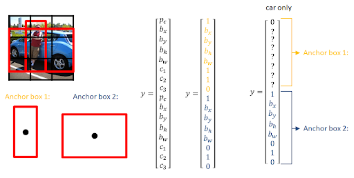

# 18. 멀리 있는 사람도 스티커를 붙여주자

## WIDER FACE 데이터셋

오늘 우리가 Face Detection 모델의 학습을 위해 다루게 될 데이터셋은 바로 [WIDER FACE 데이터셋](http://shuoyang1213.me/WIDERFACE/index.html)이다. 빠른 인퍼런스 타임을 위해 사용할 YOLO, SSD 같은 single stage model을 학습시키는 것은 흔히 COCO 데이터셋 같은 것이 사용되겠지만, 오늘 우리가 추구하는 [먼 거리에 흩어져 있는 다수의 사람 얼굴을 빠르게 detect하는 모델]을 만들기 위해서는 그에 적합하게 '보다 넓은 공간에 있는 다수의 사람이 등장하는 이미지 데이터셋'이 필요할 것이다. 아래 그림에서 확인할 수 있듯, WIDER FACE 데이터셋은 그런 용도로 활용하기에 적절해 보인다.


마지막으로, 오늘의 실습코드를 프로젝트로 구성한 파일을 첨부했다. 위의 `face_detector.zip`을 다운로드하여 `~/aiffel/face_detector` 디렉토리에 압축이 풀리도록 하자.

## 데이터셋 전처리 (1) 분석

### WIDER FACE Bounding Box

---

오늘 다루게 될 WIDER FACE 데이터셋은 Face detection을 위한 데이터셋이므로 입력데이터는 이미지 파일, Ground Truth는 Bounding box 정보로 되어 있다. 이전 스텝에서 다운로드받아 압축을 풀면 아래와 같이 4개의 디렉토리를 확인할 수 있다.

```bash
$ cd ~/aiffel/face_detector/widerface && ls
wider_face_split  WIDER_test  WIDER_train  WIDER_val
```

여기서 **`WIDER_xxxx`** 로 되어 있는 3개의 디렉토리에는 입력용 이미지 파일만 들어 있다. 좀더 구체적으로 분석해 보아야 할 것은 **`wider_face_split`** 디렉토리 내에 있는 **`wider_face_train_bbx_gt.txt`**, **`wider_face_val_bbx_gt.txt`** 2개 파일 안에 포함되어 있는 Bounding box 정보다. 실제 이 파일들이 어떻게 생겼는지 열어보자.

```bash
$ more wider_face_train_bbx_gt.txt
0--Parade/0_Parade_marchingband_1_849.jpg
1
449 330 122 149 0 0 0 0 0 0
0--Parade/0_Parade_Parade_0_904.jpg
1
361 98 263 339 0 0 0 0 0 0
0--Parade/0_Parade_marchingband_1_799.jpg
21
78 221 7 8 2 0 0 0 0 0
78 238 14 17 2 0 0 0 0 0
113 212 11 15 2 0 0 0 0 0
134 260 15 15 2 0 0 0 0 0
163 250 14 17 2 0 0 0 0 0
201 218 10 12 2 0 0 0 0 0
182 266 15 17 2 0 0 0 0 0
245 279 18 15 2 0 0 0 0 0
304 265 16 17 2 0 0 0 2 1
328 295 16 20 2 0 0 0 0 0
(이하생략)
```

텍스트로 이루어진 이 파일 포맷은 다음과 같은 반복구조로 이루어져 있음을 쉽게 파악할 수 있다.

```bash
[이미지 파일 경로]
0--Parade/0_Parade_marchingband_1_849.jpg
[face bounding box 갯수]
1
[face bounding box 좌표 등 상세정보]
449 330 122 149 0 0 0 0 0 0
```

10개의 숫자로 이루어진 [face bounding box 좌표 등 상세정보]는 다음과 같은 의미를 가진다.

```
x0, y0, w, h, blur, expression, illumination, invalid, occlusion, pose
```

bounding box가 관련해서 가장 중요한 4개의 숫자는 왼쪽의 4개(좌상 꼭지점 X좌표, Y좌표, 너비, 높이)이다. 이 파일을 분석하는 코드는 아래와 같다.

```python
def get_box(data):
    x0 = int(data[0])
    y0 = int(data[1])
    w = int(data[2])
    h = int(data[3])
    return x0, y0, w, h
```

```python
def parse_widerface(config_path):
    boxes_per_img = []
    with open(config_path) as fp:
        line = fp.readline()
        cnt = 1
        while line:
            num_of_obj = int(fp.readline())
            boxes = []
            for i in range(num_of_obj):
                obj_box = fp.readline().split(' ')
                x0, y0, w, h = get_box(obj_box)
                if w == 0:
                    # remove boxes with no width
                    continue
                if h == 0:
                    # remove boxes with no height
                    continue
                # Because our network is outputting 7x7 grid then it's not worth processing images with more than
                # 5 faces because it's highly probable they are close to each other.
                # You could remove this filter if you decide to switch to larger grid (like 14x14)
                # Don't worry about number of train data because even with this filter we have around 16k samples
                boxes.append([x0, y0, w, h])
            if num_of_obj == 0:
                obj_box = fp.readline().split(' ')
                x0, y0, w, h = get_box(obj_box)
                boxes.append([x0, y0, w, h])
            boxes_per_img.append((line.strip(), boxes))
            line = fp.readline()
            cnt += 1

    return boxes_per_img
```

위 메소드는 이미지별 bounding box 정보를 `wider_face_train_bbx_gt.txt`에서 파싱해서 리스트로 추출하는 것이다. boudbing box 정보는 [x, y, w, h] 형태로 저장되어 있는데, 아래 코드를 통해 `x_min`, `y_min`, `x_max`, `y_max` 형태의 꼭지점 좌표 정보로 변환하여 출력해 보자.

```python
def process_image(image_file):
    image_string = tf.io.read_file(image_file)
    try:
        image_data = tf.image.decode_jpeg(image_string, channels=3)
        return 0, image_string, image_data
    except tf.errors.InvalidArgumentError:
        logging.info('{}: Invalid JPEG data or crop window'.format(image_file))
        return 1, image_string, None
```

```python
def xywh_to_voc(file_name, boxes, image_data):
    shape = image_data.shape
    image_info = {}
    image_info['filename'] = file_name
    image_info['width'] = shape[1]
    image_info['height'] = shape[0]
    image_info['depth'] = 3

    difficult = []
    classes = []
    xmin, ymin, xmax, ymax = [], [], [], []

    for box in boxes:
        classes.append(1)
        difficult.append(0)
        xmin.append(box[0])
        ymin.append(box[1])
        xmax.append(box[0] + box[2])
        ymax.append(box[1] + box[3])
    image_info['class'] = classes
    image_info['xmin'] = xmin
    image_info['ymin'] = ymin
    image_info['xmax'] = xmax
    image_info['ymax'] = ymax
    image_info['difficult'] = difficult

    return image_info
```

```python
import os
import tensorflow as tf
dataset_path = os.getenv('HOME')+'/aiffel/face_detector/widerface'
anno_txt = 'wider_face_train_bbx_gt.txt'
file_path = 'WIDER_train'
for i, info in enumerate(parse_widerface(os.path.join(dataset_path, 'wider_face_split', anno_txt))):
    print('--------------------')
    image_file = os.path.join(dataset_path, file_path, 'images', info[0])
    error, image_string, image_data = process_image(image_file)
    boxes = xywh_to_voc(image_file, info[1], image_data)
    print(boxes)
    if i > 3:
        break
```

이미지별로 `boxes` 리스트에  담긴 bounding box 정보를 확인할 수 있을 것이다. 이제 이 정보를 활용하여 텐서플로우 데이터셋을 생성해보자.

## 데이터셋 전처리 (2) tf_example 생성

### tfrecord 만들기

---

오늘 우리가 다루게 될 대용량 데이터셋의 처리속도 향상을 위해서 전처리 작업을 통해 tfrecord 데이터셋으로 변환할 필요가 있다. 1개 데이터의 단위를 이루는 `tf.train.Example` 인스턴스를 생성하는 메소드는 아래와 같다.

```python
def make_example(image_string, image_info_list):

    for info in image_info_list:
        filename = info['filename']
        width = info['width']
        height = info['height']
        depth = info['depth']
        classes = info['class']
        xmin = info['xmin']
        ymin = info['ymin']
        xmax = info['xmax']
        ymax = info['ymax']

    if isinstance(image_string, type(tf.constant(0))):
        encoded_image = [image_string.numpy()]
    else:
        encoded_image = [image_string]

    base_name = [tf.compat.as_bytes(os.path.basename(filename))]

    example = tf.train.Example(features=tf.train.Features(feature={
        'filename':tf.train.Feature(bytes_list=tf.train.BytesList(value=base_name)),
        'height':tf.train.Feature(int64_list=tf.train.Int64List(value=[height])),
        'width':tf.train.Feature(int64_list=tf.train.Int64List(value=[width])),
        'classes':tf.train.Feature(int64_list=tf.train.Int64List(value=classes)),
        'x_mins':tf.train.Feature(float_list=tf.train.FloatList(value=xmin)),
        'y_mins':tf.train.Feature(float_list=tf.train.FloatList(value=ymin)),
        'x_maxes':tf.train.Feature(float_list=tf.train.FloatList(value=xmax)),
        'y_maxes':tf.train.Feature(float_list=tf.train.FloatList(value=ymax)),
        'image_raw':tf.train.Feature(bytes_list=tf.train.BytesList(value=encoded_image))
    }))
    return example
```

이제 전처리를 위해 필요한 메소드들이 어느정도 갖추어졌다. 데이터셋의 이미지파일, 그리고 bounding box를 파싱한 정보를 모아 위의 `make_example` 메소드를 통해 만든 example을 serialize하여 바이너리 파일로 생성하게 된다.

```python
import logging
import tqdm

os.environ['TF_CPP_MIN_LOG_LEVEL'] = '2'
rootPath = os.getenv('HOME')+'/aiffel/face_detector'
dataset_path = 'widerface'

if not os.path.isdir(dataset_path):
    logging.info('Please define valid dataset path.')
else:
    logging.info('Loading {}'.format(dataset_path))

logging.info('Reading configuration...')

for split in ['train', 'val']:
    output_file = rootPath + '/dataset/train_mask.tfrecord' if split == 'train' else rootPath + '/dataset/val_mask.tfrecord'

    with tf.io.TFRecordWriter(output_file) as writer:

        counter = 0
        skipped = 0
        anno_txt = 'wider_face_train_bbx_gt.txt' if split == 'train' else 'wider_face_val_bbx_gt.txt'
        file_path = 'WIDER_train' if split == 'train' else 'WIDER_val'
        for info in tqdm.tqdm(parse_widerface(os.path.join(rootPath, dataset_path, 'wider_face_split', anno_txt))):
            image_file = os.path.join(rootPath, dataset_path, file_path, 'images', info[0])

            error, image_string, image_data = process_image(image_file)
            boxes = xywh_to_voc(image_file, info[1], image_data)

            if not error:
                tf_example = make_example(image_string, [boxes])

                writer.write(tf_example.SerializeToString())
                counter += 1

            else:
                skipped += 1
                logging.info('Skipped {:d} of {:d} images.'.format(skipped, counter))

    logging.info('Wrote {} images to {}'.format(counter, output_file))
```

이전 스텝에서 여기까지의 전처리 과정을 `tf_dataset_preprocess.py` 에 정리해 두었다.

## 모델 구현 (1) priors box

### SSD의 prior box

---

- [Understand Single Shot MultiBox Detector (SSD) and Implement It in Pytorch](https://medium.com/@smallfishbigsea/understand-ssd-and-implement-your-own-caa3232cd6ad)
- [Understanding SSD MultiBox — Real-Time Object Detection In Deep Learning](https://towardsdatascience.com/understanding-ssd-multibox-real-time-object-detection-in-deep-learning-495ef744fab)

SSD 모델의 가장 중요한 특징 중 하나는 **prior box(또는 anchor box)**를 필요로 한다는 점이다. prior box란, object가 존재할 만한 다양한 크기의 box의 좌표 및 클래스 정보를 일정 개수만큼 미리 고정해 둔 것이다. ground truth에 해당하는 bounding box와의 IoU를 계산하여 일정 이상(0.5) 겹치는 prior box를 선택하는 방식이 RCNN 계열의 sliding window 방식보다 훨씬 속도가 빠르면서도 그와 유사한 정도의 정확도를 얻을 수 있다는 장점이 있다.



이번 프로젝트에서 활용할 config 정보를 모아 아래와 같은 dict 구조로 정리하였다.

```python
cfg = {
    # general setting
    "batch_size": 32,
    "input_size": (240, 320),  # (h,w)

    # training dataset
    "dataset_path": 'dataset/train_mask.tfrecord',  # 'dataset/trainval_mask.tfrecord'
    "val_path": 'dataset/val_mask.tfrecord',  #
    "dataset_len": 12880,  # train 6115 , trainval 7954, number of training samples
    "val_len": 3226,
    "using_crop": True,
    "using_bin": True,
    "using_flip": True,
    "using_distort": True,
    "using_normalizing": True,
    "labels_list": ['background', 'face'],  # xml annotation

    # anchor setting
    "min_sizes":[[10, 16, 24], [32, 48], [64, 96], [128, 192, 256]],
    "steps": [8, 16, 32, 64],
    "match_thresh": 0.45,
    "variances": [0.1, 0.2],
    "clip": False,

    # network
    "base_channel": 16,

    # training setting
    "resume": False,  # if False,training from scratch
    "epoch": 100,
    "init_lr": 1e-2,
    "lr_decay_epoch": [50, 70],
    "lr_rate": 0.1,
    "warmup_epoch": 5,
    "min_lr": 1e-4,

    "weights_decay": 5e-4,
    "momentum": 0.9,
    "save_freq": 10, #frequency of save model weights

    # inference
    "score_threshold": 0.5,
    "nms_threshold": 0.4,
    "max_number_keep": 200
}

cfg
```

config 중 prior(anchor) box 생성과 관련된 것들은 다음과 같다.

```python
image_sizes = cfg['input_size']
min_sizes = cfg["min_sizes"]
steps = cfg["steps"]
clip = cfg["clip"]

if isinstance(image_sizes, int):
    image_sizes = (image_sizes, image_sizes)
elif isinstance(image_sizes, tuple):
    image_sizes = image_sizes
else:
    raise Exception('Type error of input image size format,tuple or int. ')

print(image_sizes)
```


위 그림에서 보는 것처럼, prior box를 생성하기 위해서는 먼저 기준이 되는 feature map을 먼저 생성한다. 그림에서는 8X8, 4X4의 예가 나오지만, 우리의 프로젝트에서는 아래와 같이 4가지 유형의 feature map을 생성하게 된다.

```python
import math
import numpy as np
from itertools import product

for m in range(4):
    if (steps[m] != pow(2, (m + 3))):
        print("steps must be [8,16,32,64]")
        sys.exit()

assert len(min_sizes) == len(steps), "anchors number didn't match the feature map layer."

feature_maps = [
    [math.ceil(image_sizes[0] / step), math.ceil(image_sizes[1] / step)]
    for step in steps]

feature_maps # [[30, 40], [15, 20], [8, 10], [4, 5]]
```

이제 feature map별로 순회를 하면서 prior box 를 생성해 보자.

```python
anchors = []
num_box_fm_cell=[]
for k, f in enumerate(feature_maps):
    num_box_fm_cell.append(len(min_sizes[k]))
    for i, j in product(range(f[0]), range(f[1])):
        for min_size in min_sizes[k]:
            if isinstance(min_size, int):
                min_size = (min_size, min_size)
            elif isinstance(min_size, tuple):
                min_size=min_size
            else:
                raise Exception('Type error of min_sizes elements format,tuple or int. ')
            s_kx = min_size[1] / image_sizes[1]
            s_ky = min_size[0] / image_sizes[0]
            cx = (j + 0.5) * steps[k] / image_sizes[1]
            cy = (i + 0.5) * steps[k] / image_sizes[0]
            anchors += [cx, cy, s_kx, s_ky]

len(anchors)
```

```python
import numpy as np
priors = np.asarray(anchors).reshape([-1, 4])
priors.shape # (4420, 4)
priors
"""
array([[0.0125    , 0.01666667, 0.03125   , 0.04166667],
       [0.0125    , 0.01666667, 0.05      , 0.06666667],
       [0.0125    , 0.01666667, 0.075     , 0.1       ],
       ...,
       [0.9       , 0.93333333, 0.4       , 0.53333333],
       [0.9       , 0.93333333, 0.6       , 0.8       ],
       [0.9       , 0.93333333, 0.8       , 1.06666667]])
"""
```

이번 스텝에 소개한 prior_box 생성 과정을 `make_prior_box.py`에 정리해 두었다.

```python
def prior_box(cfg,image_sizes=None):
    """prior box"""
    if image_sizes is None:
        image_sizes = cfg['input_size']
    min_sizes=cfg["min_sizes"]
    steps=cfg["steps"]
    clip=cfg["clip"]

    if isinstance(image_sizes, int):
        image_sizes = (image_sizes, image_sizes)
    elif isinstance(image_sizes, tuple):
        image_sizes = image_sizes
    else:
        raise Exception('Type error of input image size format,tuple or int. ')

    for m in range(4):
        if (steps[m] != pow(2, (m + 3))):
            print("steps must be [8,16,32,64]")
            sys.exit()

    assert len(min_sizes) == len(steps), "anchors number didn't match the feature map layer."

    feature_maps = [
        [math.ceil(image_sizes[0] / step), math.ceil(image_sizes[1] / step)]
        for step in steps]

    anchors = []
    num_box_fm_cell=[]
    for k, f in enumerate(feature_maps):
        num_box_fm_cell.append(len(min_sizes[k]))
        for i, j in product(range(f[0]), range(f[1])):
            for min_size in min_sizes[k]:
                if isinstance(min_size, int):
                    min_size = (min_size, min_size)
                elif isinstance(min_size, tuple):
                    min_size=min_size
                else:
                    raise Exception('Type error of min_sizes elements format,tuple or int. ')
                s_kx = min_size[1] / image_sizes[1]
                s_ky = min_size[0] / image_sizes[0]
                cx = (j + 0.5) * steps[k] / image_sizes[1]
                cy = (i + 0.5) * steps[k] / image_sizes[0]
                anchors += [cx, cy, s_kx, s_ky]

    output = np.asarray(anchors).reshape([-1, 4])

    if clip:
        output = np.clip(output, 0, 1)
    return output,num_box_fm_cell
```

## 모델 구현 (2) SSD

### SSD Model 빌드하기

---

그럼 본격적으로 SSD 모델을 생성해보자. 우선은 SSD 모델 내부에서 사용하는 레이어들을 아래와 같이 생성한다.

```python
import tensorflow as tf

def _conv_block(inputs, filters, kernel=(3, 3), strides=(1, 1), use_bn=True, padding=None, block_id=None):
    """Adds an initial convolution layer (with batch normalization and relu).
    # Returns
        Output tensor of block.
    """
    if block_id is None:
        block_id = (tf.keras.backend.get_uid())

    if strides == (2, 2):
        x = tf.keras.layers.ZeroPadding2D(padding=((1, 1), (1, 1)), name='conv_pad_%d' % block_id)(inputs)
        x = tf.keras.layers.Conv2D(filters, kernel,
                                   padding='valid',
                                   use_bias=False if use_bn else True,
                                   strides=strides,
                                   name='conv_%d' % block_id)(x)
    else:
        x = tf.keras.layers.Conv2D(filters, kernel,
                                   padding='same',
                                   use_bias=False if use_bn else True,
                                   strides=strides,
                                   name='conv_%d' % block_id)(inputs)
    if use_bn:
        x = tf.keras.layers.BatchNormalization(name='conv_bn_%d' % block_id)(x)
    return tf.keras.layers.ReLU(name='conv_relu_%d' % block_id)(x)
```

```python
def _depthwise_conv_block(inputs, pointwise_conv_filters,
                          depth_multiplier=1, strides=(1, 1), use_bn=True, block_id=None):
    """Adds a depthwise convolution block.
        # Returns
        Output tensor of block.
    """
    if block_id is None:
        block_id = (tf.keras.backend.get_uid())

    if strides == (1, 1):
        x = inputs
    else:
        x = tf.keras.layers.ZeroPadding2D(((1, 1), (1, 1)), name='conv_pad_%d' % block_id)(inputs)

    x = tf.keras.layers.DepthwiseConv2D((3, 3),
                                        padding='same' if strides == (1, 1) else 'valid',
                                        depth_multiplier=depth_multiplier,
                                        strides=strides,
                                        use_bias=False if use_bn else True,
                                        name='conv_dw_%d' % block_id)(x)
    if use_bn:
        x = tf.keras.layers.BatchNormalization(name='conv_dw_%d_bn' % block_id)(x)
    x = tf.keras.layers.ReLU(name='conv_dw_%d_relu' % block_id)(x)

    x = tf.keras.layers.Conv2D(pointwise_conv_filters, (1, 1),
                               padding='same',
                               use_bias=False if use_bn else True,
                               strides=(1, 1),
                               name='conv_pw_%d' % block_id)(x)
    if use_bn:
        x = tf.keras.layers.BatchNormalization(name='conv_pw_%d_bn' % block_id)(x)
    return tf.keras.layers.ReLU(name='conv_pw_%d_relu' % block_id)(x)
```

```python
def _branch_block(input, filters):

    x = tf.keras.layers.Conv2D(filters, kernel_size=(3, 3), padding='same')(input)
    x = tf.keras.layers.LeakyReLU()(x)
    x = tf.keras.layers.Conv2D(filters, kernel_size=(3, 3), padding='same')(x)

    x1 = tf.keras.layers.Conv2D(filters * 2, kernel_size=(3, 3), padding='same')(input)

    x = tf.keras.layers.Concatenate(axis=-1)([x, x1])

    return tf.keras.layers.ReLU()(x)
```

```python
def _create_head_block(inputs, filters, strides=(1, 1), block_id=None):
    x = tf.keras.layers.Conv2D(filters, kernel_size=(3, 3), strides=strides, padding='same')(inputs)
    return x
```

```python
def _compute_heads(x, idx, num_class, num_cell):
    """ Compute outputs of classification and regression heads
    Args:
        x: the input feature map
        idx: index of the head layer
    Returns:
        conf: output of the idx-th classification head
        loc: output of the idx-th regression head
    """
    conf = _create_head_block(inputs=x, filters=num_cell[idx] * num_class)
    conf = tf.keras.layers.Reshape((-1, num_class))(conf)
    loc = _create_head_block(inputs=x, filters=num_cell[idx] * 4)
    loc = tf.keras.layers.Reshape((-1, 4))(loc)

    return conf, loc
```

레이어들이 준비되었다. 이제 본격적으로 SSD model을 생성해보자.

```python
def SsdModel(cfg, num_cell, training=False, name='ssd_model'):
    image_sizes = cfg['input_size']   if training else None
    if isinstance(image_sizes, int):
        image_sizes = (image_sizes, image_sizes)
    elif isinstance(image_sizes, tuple):
        image_sizes = image_sizes
    elif image_sizes == None:
        image_sizes = (None, None)
    else:
        raise Exception('Type error of input image size format,tuple or int. ')

    base_channel = cfg["base_channel"]
    num_class = len(cfg['labels_list'])

    x = inputs = tf.keras.layers.Input(shape=[image_sizes[0], image_sizes[1], 3], name='input_image')

    x = _conv_block(x, base_channel, strides=(2, 2))  # 120*160*16
    x = _conv_block(x, base_channel * 2, strides=(1, 1))
    x = _conv_block(x, base_channel * 2, strides=(2, 2))  # 60*80
    x = _conv_block(x, base_channel * 2, strides=(1, 1))
    x = _conv_block(x, base_channel * 4, strides=(2, 2))  # 30*40
    x = _conv_block(x, base_channel * 4, strides=(1, 1))
    x = _conv_block(x, base_channel * 4, strides=(1, 1))
    x = _conv_block(x, base_channel * 4, strides=(1, 1))
    x1 = _branch_block(x, base_channel)

    x = _conv_block(x, base_channel * 8, strides=(2, 2))  # 15*20
    x = _conv_block(x, base_channel * 8, strides=(1, 1))
    x = _conv_block(x, base_channel * 8, strides=(1, 1))
    x2 = _branch_block(x, base_channel)

    x = _depthwise_conv_block(x, base_channel * 16, strides=(2, 2))  # 8*10
    x = _depthwise_conv_block(x, base_channel * 16, strides=(1, 1))
    x3 = _branch_block(x, base_channel)

    x = _depthwise_conv_block(x, base_channel * 16, strides=(2, 2))  # 4*5
    x4 = _branch_block(x, base_channel)

    extra_layers = [x1, x2, x3, x4]

    confs = []
    locs = []

    head_idx = 0
    assert len(extra_layers) == len(num_cell)
    for layer in extra_layers:
        conf, loc = _compute_heads(layer, head_idx, num_class, num_cell)
        confs.append(conf)
        locs.append(loc)

        head_idx += 1

    confs = tf.keras.layers.Concatenate(axis=1, name="face_classes")(confs)
    locs = tf.keras.layers.Concatenate(axis=1, name="face_boxes")(locs)

    predictions = tf.keras.layers.Concatenate(axis=2, name='predictions')([locs, confs])

    model = tf.keras.Model(inputs=inputs, outputs=predictions, name=name)
    return model
```

```python
import os

model = SsdModel(cfg, num_cell=[3, 2, 2, 3], training=False)
print(len(model.layers))
model.summary()
```

이번 스텝에 소개한 SSD model 생성 과정을 tf_build_ssd_model.py에 정리해 두었다.

## 모델 학습 (1) Augmentation, Prior 적용

### augmentation

---

모델까지 구성완료하였다. 그러나 본격적으로 train을 진행하기 전에 아직 몇 가지가 더 남아있다.

이전 스텝에서 구성한 tfrecordset 형태의 데이터셋은 아직 Data augmentation이 적용되지 않았다. Object detection에서 사용하는 다양한 augmentation 기법을 적용해 주면 좀더 성능향상을 기대할 수도 있을 것이다.

아래는 augmentation을 위해 **`tf.data.TFRecordDataset.map()`** 내에서 호출할 메소드들입니다.

- _crop
- _pad_to_square
- _resize
- _flip
- _distort

```python
def _crop(img, labels, max_loop=250):
    shape = tf.shape(img)

    def matrix_iof(a, b):
        """
        return iof of a and b, numpy version for data augenmentation
        """
        lt = tf.math.maximum(a[:, tf.newaxis, :2], b[:, :2])
        rb = tf.math.minimum(a[:, tf.newaxis, 2:], b[:, 2:])

        area_i = tf.math.reduce_prod(rb - lt, axis=2) * \
            tf.cast(tf.reduce_all(lt < rb, axis=2), tf.float32)
        area_a = tf.math.reduce_prod(a[:, 2:] - a[:, :2], axis=1)
        return area_i / tf.math.maximum(area_a[:, tf.newaxis], 1)

    def crop_loop_body(i, img, labels):
        valid_crop = tf.constant(1, tf.int32)

        pre_scale = tf.constant([0.3, 0.45, 0.6, 0.8, 1.0], dtype=tf.float32)
        scale = pre_scale[tf.random.uniform([], 0, 5, dtype=tf.int32)]
        short_side = tf.cast(tf.minimum(shape[0], shape[1]), tf.float32)
        h = w = tf.cast(scale * short_side, tf.int32)
        h_offset = tf.random.uniform([], 0, shape[0] - h + 1, dtype=tf.int32)
        w_offset = tf.random.uniform([], 0, shape[1] - w + 1, dtype=tf.int32)
        roi = tf.stack([w_offset, h_offset, w_offset + w, h_offset + h])
        roi = tf.cast(roi, tf.float32)

        value = matrix_iof(labels[:, :4], roi[tf.newaxis])
        valid_crop = tf.cond(tf.math.reduce_any(value >= 1),
                             lambda: valid_crop, lambda: 0)

        centers = (labels[:, :2] + labels[:, 2:4]) / 2
        mask_a = tf.reduce_all(
            tf.math.logical_and(roi[:2] < centers, centers < roi[2:]),
            axis=1)
        labels_t = tf.boolean_mask(labels, mask_a)
        valid_crop = tf.cond(tf.reduce_any(mask_a),
                             lambda: valid_crop, lambda: 0)

        img_t = img[h_offset:h_offset + h, w_offset:w_offset + w, :]
        h_offset = tf.cast(h_offset, tf.float32)
        w_offset = tf.cast(w_offset, tf.float32)
        labels_t = tf.stack(
            [labels_t[:, 0] - w_offset,  labels_t[:, 1] - h_offset,
             labels_t[:, 2] - w_offset,  labels_t[:, 3] - h_offset,
             labels_t[:, 4]], axis=1)

        return tf.cond(valid_crop == 1,
                       lambda: (max_loop, img_t, labels_t),
                       lambda: (i + 1, img, labels))

    _, img, labels = tf.while_loop(
        lambda i, img, labels: tf.less(i, max_loop),
        crop_loop_body,
        [tf.constant(-1), img, labels],
        shape_invariants=[tf.TensorShape([]),
                          tf.TensorShape([None, None, 3]),
                          tf.TensorShape([None, 5])])

    return img, labels
```

```python
def _pad_to_square(img):
    height = tf.shape(img)[0]
    width = tf.shape(img)[1]

    def pad_h():
        img_pad_h = tf.ones([width - height, width, 3]) * tf.reduce_mean(img, axis=[0, 1], keepdims=True)
        return tf.concat([img, img_pad_h], axis=0)

    def pad_w():
        img_pad_w = tf.ones([height, height - width, 3]) * tf.reduce_mean(img, axis=[0, 1], keepdims=True)
        return tf.concat([img, img_pad_w], axis=1)

    img = tf.case([(tf.greater(height, width), pad_w),
                   (tf.less(height, width), pad_h)], default=lambda: img)

    return img
```

```python
def _resize(img, labels, img_dim):
    ''' # resize and boxes coordinate to percent'''
    w_f = tf.cast(tf.shape(img)[1], tf.float32)
    h_f = tf.cast(tf.shape(img)[0], tf.float32)
    locs = tf.stack([labels[:, 0] / w_f,  labels[:, 1] / h_f,
                     labels[:, 2] / w_f,  labels[:, 3] / h_f] ,axis=1)
    locs = tf.clip_by_value(locs, 0, 1.0)
    labels = tf.concat([locs, labels[:, 4][:, tf.newaxis]], axis=1)

    resize_case = tf.random.uniform([], 0, 5, dtype=tf.int32)
    if isinstance(img_dim, int):
        img_dim = (img_dim, img_dim)
    elif isinstance(img_dim,tuple):
        img_dim = img_dim
    else:
        raise Exception('Type error of input image size format,tuple or int. ')

    def resize(method):
        def _resize():
            #　size h,w
            return tf.image.resize(img, [img_dim[0], img_dim[1]], method=method, antialias=True)
        return _resize

    img = tf.case([(tf.equal(resize_case, 0), resize('bicubic')),
                   (tf.equal(resize_case, 1), resize('area')),
                   (tf.equal(resize_case, 2), resize('nearest')),
                   (tf.equal(resize_case, 3), resize('lanczos3'))],
                  default=resize('bilinear'))

    return img, labels
```

```python
def _flip(img, labels):
    flip_case = tf.random.uniform([], 0, 2, dtype=tf.int32)

    def flip_func():
        flip_img = tf.image.flip_left_right(img)
        flip_labels = tf.stack([1 - labels[:, 2],  labels[:, 1],
                                1 - labels[:, 0],  labels[:, 3],
                                labels[:, 4]], axis=1)

        return flip_img, flip_labels

    img, labels = tf.case([(tf.equal(flip_case, 0), flip_func)],default=lambda: (img, labels))

    return img, labels
```

```python
def _distort(img):
    img = tf.image.random_brightness(img, 0.4)
    img = tf.image.random_contrast(img, 0.5, 1.5)
    img = tf.image.random_saturation(img, 0.5, 1.5)
    img = tf.image.random_hue(img, 0.1)

    return img
```

### **Prior box 적용**

---

SSD 모델의 특이점 중 하나가 prior box를 사용한다는 점을 이미 앞에서 설명했다. prior box 정보는 데이터셋에 반영되어야 한다. 아래 메소드들은 prior box와 bounding box 사이의 IoU, 다른 말로 jaccard index를 측정하기 위한 것이다. 이후 이 메소드를 활용해 어떻게 데이터셋을 추가로 가공하는지 살펴보자.

- [자카드 거리, 자카드 지수](https://rfriend.tistory.com/318)

```python
def _intersect(box_a, box_b):
    """ We resize both tensors to [A,B,2]:
    [A,2] -> [A,1,2] -> [A,B,2]
    [B,2] -> [1,B,2] -> [A,B,2]
    Then we compute the area of intersect between box_a and box_b.
    Args:
      box_a: (tensor) bounding boxes, Shape: [A,4].
      box_b: (tensor) bounding boxes, Shape: [B,4].
    Return:
      (tensor) intersection area, Shape: [A,B].
    """
    A = tf.shape(box_a)[0]
    B = tf.shape(box_b)[0]
    max_xy = tf.minimum(
        tf.broadcast_to(tf.expand_dims(box_a[:, 2:], 1), [A, B, 2]),
        tf.broadcast_to(tf.expand_dims(box_b[:, 2:], 0), [A, B, 2]))
    min_xy = tf.maximum(
        tf.broadcast_to(tf.expand_dims(box_a[:, :2], 1), [A, B, 2]),
        tf.broadcast_to(tf.expand_dims(box_b[:, :2], 0), [A, B, 2]))
    inter = tf.clip_by_value(max_xy - min_xy, 0.0, 512.0)
    return inter[:, :, 0] * inter[:, :, 1]
```

```python
def _jaccard(box_a, box_b):
    """Compute the jaccard overlap of two sets of boxes.  The jaccard overlap
    is simply the intersection over union of two boxes.  Here we operate on
    ground truth boxes and default boxes.
    E.g.:
        A ∩ B / A ∪ B = A ∩ B / (area(A) + area(B) - A ∩ B)
    Args:
        box_a: (tensor) Ground truth bounding boxes, Shape: [num_objects,4]
        box_b: (tensor) Prior boxes from priorbox layers, Shape: [num_priors,4]
    Return:
        jaccard overlap: (tensor) Shape: [box_a.size(0), box_b.size(0)]
    """
    inter = _intersect(box_a, box_b)
    area_a = tf.broadcast_to(
        tf.expand_dims(
            (box_a[:, 2] - box_a[:, 0]) * (box_a[:, 3] - box_a[:, 1]), 1),
        tf.shape(inter))  # [A,B]
    area_b = tf.broadcast_to(
        tf.expand_dims(
            (box_b[:, 2] - box_b[:, 0]) * (box_b[:, 3] - box_b[:, 1]), 0),
        tf.shape(inter))  # [A,B]
    union = area_a + area_b - inter
    return inter / union  # [A,B]
```

jaccard index를 계산하는 메소드가 준비되었다. 아래 **`encode_tf`**는 이를 이용해서 tfrecord 데이터셋의 라벨을 가공하는 메소드이다. 내용을 정리하면 다음과 같다.

- jaccard 메소드를 이용해 label의 ground truth bbox와 가장 overlap 비율이 높은 matched prior를 구한다.
- **`_encode_bbox`** 메소드를 통해 bbox의 scale을 동일하게 보정한다.
- 전체 prior box에 대해 일정 threshold 이상 overlap되는 ground truth bounding box 존재 여부(positive/negative)를 concat하여 새로운 label로 업데이트한다.

```python
def _encode_bbox(matched, priors, variances):
    """Encode the variances from the priorbox layers into the ground truth
    boxes we have matched (based on jaccard overlap) with the prior boxes.
    Args:
        matched: (tensor) Coords of ground truth for each prior in point-form
            Shape: [num_priors, 4].
        priors: (tensor) Prior boxes in center-offset form
            Shape: [num_priors,4].
        variances: (list[float]) Variances of prior boxes
    Return:
        encoded boxes (tensor), Shape: [num_priors, 4]
    """
    # dist b/t match center and prior's center
    g_cxcy = (matched[:, :2] + matched[:, 2:]) / 2 - priors[:, :2]

    # encode variance
    g_cxcy /= (variances[0] * priors[:, 2:])

    # match wh / prior wh
    g_wh = (matched[:, 2:] - matched[:, :2]) / priors[:, 2:]
    g_wh = tf.math.log(g_wh) / variances[1]

    # return target for smooth_l1_loss
    return tf.concat([g_cxcy, g_wh], 1)  # [num_priors,4]
```

```python
def encode_tf(labels, priors, match_thresh, variances=None):
    """tensorflow encoding"""
    if variances is None:
        variances = [0.1, 0.2]

    priors = tf.cast(priors, tf.float32)
    bbox = labels[:, :4]
    conf = labels[:, -1]

    # jaccard index
    overlaps = _jaccard(bbox, priors)
    best_prior_overlap = tf.reduce_max(overlaps, 1)
    best_prior_idx = tf.argmax(overlaps, 1, tf.int32)

    best_truth_overlap = tf.reduce_max(overlaps, 0)
    best_truth_idx = tf.argmax(overlaps, 0, tf.int32)

    best_truth_overlap = tf.tensor_scatter_nd_update(
        best_truth_overlap, tf.expand_dims(best_prior_idx, 1),
        tf.ones_like(best_prior_idx, tf.float32) * 2.)
    best_truth_idx = tf.tensor_scatter_nd_update(
        best_truth_idx, tf.expand_dims(best_prior_idx, 1),
        tf.range(tf.size(best_prior_idx), dtype=tf.int32))

    # Scale Ground-Truth Boxes
    matches_bbox = tf.gather(bbox, best_truth_idx)  # [num_priors, 4]
    loc_t = _encode_bbox(matches_bbox, priors, variances)
    conf_t = tf.gather(conf, best_truth_idx)  # [num_priors]
    conf_t = tf.where(tf.less(best_truth_overlap, match_thresh), tf.zeros_like(conf_t), conf_t)

    return tf.concat([loc_t, conf_t[..., tf.newaxis]], axis=1)
```

### **load_dataset**

---

위에서 구현한 두가지 메소드를 이전 스텝에서 생성한 tfrecord 데이터셋에 적용하여 SSD 학습을 위한 데이터셋을 생성하는 최종 메소드인 **`load_dataset`** 을 구현한다.

- **`_transform_data`** : aumemtation과 prior box label을 적용하여 기존의 dataset을 변환하는 메소드
- **`_parse_tfrecord`** : tfrecord 에 **`_transform_data`**를 적용하는 함수 클로저 생성
- **`load_tfrecord_dataset`** : **`tf.data.TFRecordDataset.map()`**에 **`_parse_tfrecord`**을 적용하는 실제 데이터셋 변환 메인 메소드
- **`load_dataset`** : **`load_tfrecord_dataset`**을 통해 train, validation 데이터셋을 생성하는 최종 메소드

```python
def _transform_data(img_dim, using_crop,using_flip, using_distort, using_encoding,using_normalizing, priors,
                    match_thresh,  variances):
    def transform_data(img, labels):
        img = tf.cast(img, tf.float32)
        if using_crop:
        # randomly crop
            img, labels = _crop(img, labels)

            # padding to square
            img = _pad_to_square(img)

        # resize and boxes coordinate to percent
        img, labels = _resize(img, labels, img_dim)

        # randomly left-right flip
        if using_flip:
            img, labels = _flip(img, labels)

        # distort
        if using_distort:
            img = _distort(img)

        # encode labels to feature targets
        if using_encoding:
            labels = encode_tf(labels=labels, priors=priors, match_thresh=match_thresh, variances=variances)
        if using_normalizing:
            img=(img/255.0-0.5)/1.0

        return img, labels
    return transform_data
```

```python
def _parse_tfrecord(img_dim,using_crop, using_flip, using_distort,
                    using_encoding, using_normalizing,priors, match_thresh,  variances):
    def parse_tfrecord(tfrecord):
        features = {
            'filename': tf.io.FixedLenFeature([], tf.string),
            'height': tf.io.FixedLenFeature([], tf.int64),
            'width': tf.io.FixedLenFeature([], tf.int64),
            'classes': tf.io.VarLenFeature(tf.int64),
            'x_mins': tf.io.VarLenFeature(tf.float32),
            'y_mins': tf.io.VarLenFeature(tf.float32),
            'x_maxes': tf.io.VarLenFeature(tf.float32),
            'y_maxes': tf.io.VarLenFeature(tf.float32),
            'difficult':tf.io.VarLenFeature(tf.int64),
            'image_raw': tf.io.FixedLenFeature([], tf.string),
           }

        parsed_example = tf.io.parse_single_example(tfrecord, features)
        img = tf.image.decode_jpeg(parsed_example['image_raw'], channels=3)

        width = tf.cast(parsed_example['width'], tf.float32)
        height = tf.cast(parsed_example['height'], tf.float32)

        labels = tf.sparse.to_dense(parsed_example['classes'])
        labels = tf.cast(labels, tf.float32)

        labels = tf.stack(
            [tf.sparse.to_dense(parsed_example['x_mins']),
             tf.sparse.to_dense(parsed_example['y_mins']),
             tf.sparse.to_dense(parsed_example['x_maxes']),
             tf.sparse.to_dense(parsed_example['y_maxes']),labels], axis=1)

        img, labels = _transform_data(
            img_dim, using_crop,using_flip, using_distort, using_encoding, using_normalizing,priors,
            match_thresh,  variances)(img, labels)

        return img, labels
    return parse_tfrecord
```

```python
def load_tfrecord_dataset(tfrecord_name, batch_size, img_dim,
                          using_crop=True,using_flip=True, using_distort=True,
                          using_encoding=True, using_normalizing=True,
                          priors=None, match_thresh=0.45,variances=None,
                          shuffle=True, repeat=True,buffer_size=10240):

    if variances is None:
        variances = [0.1, 0.2]

    """load dataset from tfrecord"""
    if not using_encoding:
        assert batch_size == 1
    else:
        assert priors is not None

    raw_dataset = tf.data.TFRecordDataset(tfrecord_name)
    raw_dataset = raw_dataset.cache()
    if repeat:
        raw_dataset = raw_dataset.repeat()
    if shuffle:
        raw_dataset = raw_dataset.shuffle(buffer_size=buffer_size)

    dataset = raw_dataset.map(
        _parse_tfrecord(img_dim, using_crop, using_flip, using_distort,
                        using_encoding, using_normalizing,priors, match_thresh,  variances),
        num_parallel_calls=tf.data.experimental.AUTOTUNE)
    dataset = dataset.batch(batch_size, drop_remainder=True)
    dataset = dataset.prefetch(
        buffer_size=tf.data.experimental.AUTOTUNE)

    return dataset
```

```python
def load_dataset(cfg, priors, shuffle=True, buffer_size=10240,train=True):
    """load dataset"""
    global dataset
    if train:
        logging.info("load train dataset from {}".format(cfg['dataset_path']))
        dataset = load_tfrecord_dataset(
            tfrecord_name=os.path.join(rootPath, cfg['dataset_path']),
            batch_size=cfg['batch_size'],
            img_dim=cfg['input_size'],
            using_crop=cfg['using_crop'],
            using_flip=cfg['using_flip'],
            using_distort=cfg['using_distort'],
            using_encoding=True,
            using_normalizing=cfg['using_normalizing'],
            priors=priors,
            match_thresh=cfg['match_thresh'],
            variances=cfg['variances'],
            shuffle=shuffle,
            repeat=True,
            buffer_size=buffer_size)
    else:
        dataset = load_tfrecord_dataset(
            tfrecord_name=os.path.join(rootPath, cfg['val_path']),
            batch_size=cfg['batch_size'],
            img_dim=cfg['input_size'],
            using_crop=False,
            using_flip=False,
            using_distort=False,
            using_encoding=True,
            using_normalizing=True,
            priors=priors,
            match_thresh=cfg['match_thresh'],
            variances=cfg['variances'],
            shuffle=shuffle,
            repeat=False,
            buffer_size=buffer_size)
        logging.info("load validation dataset from {}".format(cfg['val_path']))

    return dataset
```

이번 스텝에 소개한 load_dataset 메소드 구현체를 `tf_dataloader.py`에 정리해 두었다.

## 모델 학습 (2) Train

### **Learning rate scheduler**

---

본격적으로 train에 들어가기 전에 2가지 더 준비해야 할 게 있다. 그 중 하나는 Learning rate scheduler 이다. 이번에는 구간별로 learning rate가 일정하게 유지하면서 감소하는 PiecewiseConstantDecay를 상속받아, 초기시점에 WarmUp부분을 추가한 **`PiecewiseConstantWarmUpDecay`**를 활용할 것이다.

```python
class PiecewiseConstantWarmUpDecay(
        tf.keras.optimizers.schedules.LearningRateSchedule):
    """A LearningRateSchedule wiht warm up schedule.
    Modified from tf.keras.optimizers.schedules.PiecewiseConstantDecay"""

    def __init__(self, boundaries, values, warmup_steps, min_lr,
                 name=None):
        super(PiecewiseConstantWarmUpDecay, self).__init__()

        if len(boundaries) != len(values) - 1:
            raise ValueError(
                    "The length of boundaries should be 1 less than the"
                    "length of values")

        self.boundaries = boundaries
        self.values = values
        self.name = name
        self.warmup_steps = warmup_steps
        self.min_lr = min_lr

    def __call__(self, step):
        with tf.name_scope(self.name or "PiecewiseConstantWarmUp"):
            step = tf.cast(tf.convert_to_tensor(step), tf.float32)
            pred_fn_pairs = []
            warmup_steps = self.warmup_steps
            boundaries = self.boundaries
            values = self.values
            min_lr = self.min_lr

            pred_fn_pairs.append(
                (step <= warmup_steps,
                 lambda: min_lr + step * (values[0] - min_lr) / warmup_steps))
            pred_fn_pairs.append(
                (tf.logical_and(step <= boundaries[0],
                                step > warmup_steps),
                 lambda: tf.constant(values[0])))
            pred_fn_pairs.append(
                (step > boundaries[-1], lambda: tf.constant(values[-1])))

            for low, high, v in zip(boundaries[:-1], boundaries[1:],
                                    values[1:-1]):
                # Need to bind v here; can do this with lambda v=v: ...
                pred = (step > low) & (step <= high)
                pred_fn_pairs.append((pred, lambda: tf.constant(v)))

            # The default isn't needed here because our conditions are mutually
            # exclusive and exhaustive, but tf.case requires it.
            return tf.case(pred_fn_pairs, lambda: tf.constant(values[0]),
                           exclusive=True)

    def get_config(self):
        return {
                "boundaries": self.boundaries,
                "values": self.values,
                "warmup_steps": self.warmup_steps,
                "min_lr": self.min_lr,
                "name": self.name
        }
```

```python
def MultiStepWarmUpLR(initial_learning_rate, lr_steps, lr_rate,
                      warmup_steps=0., min_lr=0.,
                      name='MultiStepWarmUpLR'):
    """Multi-steps warm up learning rate scheduler."""
    assert warmup_steps <= lr_steps[0]
    assert min_lr <= initial_learning_rate
    lr_steps_value = [initial_learning_rate]
    for _ in range(len(lr_steps)):
        lr_steps_value.append(lr_steps_value[-1] * lr_rate)
    return PiecewiseConstantWarmUpDecay(
        boundaries=lr_steps, values=lr_steps_value, warmup_steps=warmup_steps,
        min_lr=min_lr)
```

### **Hard negative mining**

---

Object Detection 모델 학습시 자주 사용되는 Hard negative mining이라는 기법이 있다. 학습과정에서 label은 negative인데 confidence가 높게 나오는 샘플을 재학습하면 positive와 negative의 모호한 경계선상에 분포한 false negative 오류에 강해진다는 장점이 있다.

실제로 confidence가 높은 샘플을 모아 training을 다시 수행하기보다는, 그런 샘플들에 대한 loss만 따로 모아 계산해주는 방식으로 반영할 수 있다.

아래 구현된 **`hard_negative_mining`** 메소드와, 이 메소드를 통해 얻은 샘플을 통해 얻은 localization loss를 기존의 classification loss에 추가로 반영하는 **`MultiBoxLoss`** 계산 메소드를 확인해보자.

```python
def hard_negative_mining(loss, class_truth, neg_ratio):
    """ Hard negative mining algorithm
        to pick up negative examples for back-propagation
        base on classification loss values
    Args:
        loss: list of classification losses of all default boxes (B, num_default)
        class_truth: classification targets (B, num_default)
        neg_ratio: negative / positive ratio
    Returns:
        class_loss: classification loss
        loc_loss: regression loss
    """
    # loss: B x N
    # class_truth: B x N
    pos_idx = class_truth > 0
    num_pos = tf.reduce_sum(tf.dtypes.cast(pos_idx, tf.int32), axis=1)
    num_neg = num_pos * neg_ratio

    rank = tf.argsort(loss, axis=1, direction='DESCENDING')
    rank = tf.argsort(rank, axis=1)
    neg_idx = rank < tf.expand_dims(num_neg, 1)

    return pos_idx, neg_idx
```

```python
def MultiBoxLoss(num_class=3, neg_pos_ratio=3.0):
    def multi_loss(y_true, y_pred):
        """ Compute losses for SSD
               regression loss: smooth L1
               classification loss: cross entropy
           Args:
               y_true: [B,N,5]
               y_pred: [B,N,num_class]
               class_pred: outputs of classification heads (B,N, num_classes)
               loc_pred: outputs of regression heads (B,N, 4)
               class_truth: classification targets (B,N)
               loc_truth: regression targets (B,N, 4)
           Returns:
               class_loss: classification loss
               loc_loss: regression loss
       """
        num_batch = tf.shape(y_true)[0]
        num_prior = tf.shape(y_true)[1]
        loc_pred, class_pred = y_pred[..., :4], y_pred[..., 4:]
        loc_truth, class_truth = y_true[..., :4], tf.squeeze(y_true[..., 4:])

        cross_entropy = tf.keras.losses.SparseCategoricalCrossentropy(from_logits=True, reduction='none')

        # compute classification losses without reduction
        temp_loss = cross_entropy(class_truth, class_pred)
        # 2. hard negative mining
        pos_idx, neg_idx = hard_negative_mining(temp_loss, class_truth, neg_pos_ratio)

        # classification loss will consist of positive and negative examples
        cross_entropy = tf.keras.losses.SparseCategoricalCrossentropy(from_logits=True, reduction='sum')

        smooth_l1_loss = tf.keras.losses.Huber(reduction='sum')

        loss_class = cross_entropy(
            class_truth[tf.math.logical_or(pos_idx, neg_idx)],
            class_pred[tf.math.logical_or(pos_idx, neg_idx)])

        # localization loss only consist of positive examples (smooth L1)
        loss_loc = smooth_l1_loss(loc_truth[pos_idx],loc_pred[pos_idx])

        num_pos = tf.reduce_sum(tf.dtypes.cast(pos_idx, tf.float32))

        loss_class = loss_class / num_pos
        loss_loc = loss_loc / num_pos
        return loss_loc, loss_class

    return multi_loss
```

### **Training**

---

이제 본격적으로 모델 학습을 진행한다. 배치사이즈, epoch 수 등 학습에 대한 기본설정은 **`cfg`** dict 내용을 확인한다.

```python
global load_t1
os.environ['TF_CPP_MIN_LOG_LEVEL'] = '2'
logger = tf.get_logger()
logger.disabled = True
logger.setLevel(logging.FATAL)

weights_dir = os.getenv('HOME')+'/aiffel/face_detector/checkpoints'
if not os.path.exists(weights_dir):
    os.mkdir(weights_dir)

logging.info("Load configuration...")
label_classes = cfg['labels_list']
logging.info(f"Total image sample:{cfg['dataset_len']},Total classes number:"
             f"{len(label_classes)},classes list:{label_classes}")

logging.info("Compute prior boxes...")
priors, num_cell = prior_box(cfg)
logging.info(f"Prior boxes number:{len(priors)},default anchor box number per feature map cell:{num_cell}") # 4420, [3, 2, 2, 3]

logging.info("Loading dataset...")
train_dataset = load_dataset(cfg, priors, shuffle=True, train=True)
```

```python
logging.info("Create Model...")
try:
    model = SsdModel(cfg=cfg, num_cell=num_cell, training=True)
    model.summary()
    tf.keras.utils.plot_model(model, to_file=os.path.join(os.getcwd(), 'model.png'),
                              show_shapes=True, show_layer_names=True)
except Exception as e:
    logging.error(e)
    logging.info("Create network failed.")
```

```python
if cfg['resume']:
    # Training from latest weights
    paths = [os.path.join(weights_dir, path)
             for path in os.listdir(weights_dir)]
    latest = sorted(paths, key=os.path.getmtime)[-1]
    model.load_weights(latest)
    init_epoch = int(os.path.splitext(latest)[0][-3:])

else:
    init_epoch = -1

steps_per_epoch = cfg['dataset_len'] // cfg['batch_size']
logging.info(f"steps_per_epoch:{steps_per_epoch}")

learning_rate = MultiStepWarmUpLR(
    initial_learning_rate=cfg['init_lr'],
    lr_steps=[e * steps_per_epoch for e in cfg['lr_decay_epoch']],
    lr_rate=cfg['lr_rate'],
    warmup_steps=cfg['warmup_epoch'] * steps_per_epoch,
    min_lr=cfg['min_lr'])

optimizer = tf.keras.optimizers.SGD(learning_rate=learning_rate, momentum=cfg['momentum'], nesterov=True)
multi_loss = MultiBoxLoss(num_class=len(label_classes), neg_pos_ratio=3)
train_log_dir = 'logs/train'
train_summary_writer = tf.summary.create_file_writer(train_log_dir)
```

```python
@tf.function
def train_step(inputs, labels):
    with tf.GradientTape() as tape:
        predictions = model(inputs, training=True)
        losses = {}
        losses['reg'] = tf.reduce_sum(model.losses)  #unused. Init for redefine network
        losses['loc'], losses['class'] = multi_loss(labels, predictions)
        total_loss = tf.add_n([l for l in losses.values()])

    grads = tape.gradient(total_loss, model.trainable_variables)
    optimizer.apply_gradients(zip(grads, model.trainable_variables))

    return total_loss, losses
```

아래에서 본격적으로 train을 진행한다.

```python
import time

for epoch in range(init_epoch+1,cfg['epoch']):
    try:
        start = time.time()
        avg_loss = 0.0
        for step, (inputs, labels) in enumerate(train_dataset.take(steps_per_epoch)):

            load_t0 = time.time()
            total_loss, losses = train_step(inputs, labels)
            avg_loss = (avg_loss * step + total_loss.numpy()) / (step + 1)
            load_t1 = time.time()
            batch_time = load_t1 - load_t0

            steps =steps_per_epoch*epoch+step
            with train_summary_writer.as_default():
                tf.summary.scalar('loss/total_loss', total_loss, step=steps)
                for k, l in losses.items():
                    tf.summary.scalar('loss/{}'.format(k), l, step=steps)
                tf.summary.scalar('learning_rate', optimizer.lr(steps), step=steps)

            print(f"\rEpoch: {epoch + 1}/{cfg['epoch']} | Batch {step + 1}/{steps_per_epoch} | Batch time {batch_time:.3f} || Loss: {total_loss:.6f} | loc loss:{losses['loc']:.6f} | class loss:{losses['class']:.6f} ",end = '',flush=True)

        print(f"\nEpoch: {epoch + 1}/{cfg['epoch']}  | Epoch time {(load_t1 - start):.3f} || Average Loss: {avg_loss:.6f}")

        with train_summary_writer.as_default():
            tf.summary.scalar('loss/avg_loss',avg_loss,step=epoch)

        if (epoch + 1) % cfg['save_freq'] == 0:
            filepath = os.path.join(weights_dir, f'weights_epoch_{(epoch + 1):03d}.h5')
            model.save_weights(filepath)
            if os.path.exists(filepath):
                print(f">>>>>>>>>>Save weights file at {filepath}<<<<<<<<<<")

    except KeyboardInterrupt:
        print('interrupted')
        exit(0)
```

이번 스텝에 소개한 모델 학습 과정을 `train.py`에 정리해 두었다.

## Inference (1) NMS

### NMS 구현하기

---

Grid cell을 사용하는 Object detection의 inference 단계에서 하나의 object가 여러 개의 prior box에 걸쳐져 있을 때 가장 확률이 높은 1개의 prior box를 하나로 줄여주는 NMS(non-max suppression)이 필요하다.

```python
def decode_bbox_tf(pre, priors, variances=None):
    """Decode locations from predictions using prior to undo
    the encoding we did for offset regression at train time.
    Args:
        pre (tensor): location predictions for loc layers,
            Shape: [num_prior,4]
        prior (tensor): Prior boxes in center-offset form.
            Shape: [num_prior,4].
        variances: (list[float]) Variances of prior boxes
    Return:
        decoded bounding box predictions xmin, ymin, xmax, ymax
    """
    if variances is None:
        variances = [0.1, 0.2]
    centers = priors[:, :2] + pre[:, :2] * variances[0] * priors[:, 2:]
    sides = priors[:, 2:] * tf.math.exp(pre[:, 2:] * variances[1])

    return tf.concat([centers - sides / 2, centers + sides / 2], axis=1)
```

```python
def compute_nms(boxes, scores, nms_threshold=0.5, limit=200):
    """ Perform Non Maximum Suppression algorithm
        to eliminate boxes with high overlap
    Args:
        boxes: tensor (num_boxes, 4)
               of format (xmin, ymin, xmax, ymax)
        scores: tensor (num_boxes,)
        nms_threshold: NMS threshold
        limit: maximum number of boxes to keep
    Returns:
        idx: indices of kept boxes
    """
    if boxes.shape[0] == 0:
        return tf.constant([], dtype=tf.int32)
    selected = [0]
    idx = tf.argsort(scores, direction='DESCENDING')
    idx = idx[:limit]
    boxes = tf.gather(boxes, idx)

    iou = _jaccard(boxes, boxes)

    while True:
        row = iou[selected[-1]]
        next_indices = row <= nms_threshold

        iou = tf.where(
            tf.expand_dims(tf.math.logical_not(next_indices), 0),
            tf.ones_like(iou, dtype=tf.float32),
            iou)

        if not tf.math.reduce_any(next_indices):
            break

        selected.append(tf.argsort(
            tf.dtypes.cast(next_indices, tf.int32), direction='DESCENDING')[0].numpy())

    return tf.gather(idx, selected)
```

```python
def parse_predict(predictions, priors, cfg):
    label_classes = cfg['labels_list']

    bbox_regressions, confs = tf.split(predictions[0], [4, -1], axis=-1)
    boxes = decode_bbox_tf(bbox_regressions, priors, cfg['variances'])

    confs = tf.math.softmax(confs, axis=-1)

    out_boxes = []
    out_labels = []
    out_scores = []

    for c in range(1, len(label_classes)):
        cls_scores = confs[:, c]

        score_idx = cls_scores > cfg['score_threshold']

        cls_boxes = boxes[score_idx]
        cls_scores = cls_scores[score_idx]

        nms_idx = compute_nms(cls_boxes, cls_scores, cfg['nms_threshold'], cfg['max_number_keep'])

        cls_boxes = tf.gather(cls_boxes, nms_idx)
        cls_scores = tf.gather(cls_scores, nms_idx)

        cls_labels = [c] * cls_boxes.shape[0]

        out_boxes.append(cls_boxes)
        out_labels.extend(cls_labels)
        out_scores.append(cls_scores)

    out_boxes = tf.concat(out_boxes, axis=0)
    out_scores = tf.concat(out_scores, axis=0)

    boxes = tf.clip_by_value(out_boxes, 0.0, 1.0).numpy()
    classes = np.array(out_labels)
    scores = out_scores.numpy()

    return boxes, classes, scores
```

## Inference (2) 사진에서 얼굴 찾기

### 사진에서 얼굴을 찾아보자

---

SSD 모델을 통해 우리는 Multi-face detection 기능을 확보했다. 얼마나 잘 해내는지 확인해 보도록하자.

```python
def pad_input_image(img, max_steps):
    """pad image to suitable shape"""
    img_h, img_w, _ = img.shape

    img_pad_h = 0
    if img_h % max_steps > 0:
        img_pad_h = max_steps - img_h % max_steps

    img_pad_w = 0
    if img_w % max_steps > 0:
        img_pad_w = max_steps - img_w % max_steps

    padd_val = np.mean(img, axis=(0, 1)).astype(np.uint8)
    img = cv2.copyMakeBorder(img, 0, img_pad_h, 0, img_pad_w,
                             cv2.BORDER_CONSTANT, value=padd_val.tolist())
    pad_params = (img_h, img_w, img_pad_h, img_pad_w)

    return img, pad_params
```

```python
def recover_pad_output(outputs, pad_params):
    """
        recover the padded output effect

    """
    img_h, img_w, img_pad_h, img_pad_w = pad_params

    recover_xy = np.reshape(outputs[0], [-1, 2, 2]) * \
                 [(img_pad_w + img_w) / img_w, (img_pad_h + img_h) / img_h]
    outputs[0] = np.reshape(recover_xy, [-1, 4])

    return outputs
```

```python
def show_image(img, boxes, classes, scores, img_height, img_width, prior_index, class_list):
    """
    draw bboxes and labels
    out:boxes,classes,scores
    """
    # bbox

    x1, y1, x2, y2 = int(boxes[prior_index][0] * img_width), int(boxes[prior_index][1] * img_height), \
                     int(boxes[prior_index][2] * img_width), int(boxes[prior_index][3] * img_height)
    if classes[prior_index] == 1:
        color = (0, 255, 0)
    else:
        color = (0, 0, 255)
    cv2.rectangle(img, (x1, y1), (x2, y2), color, 2)
    # confidence

    # if scores:
    #   score = "{:.4f}".format(scores[prior_index])
    #   class_name = class_list[classes[prior_index]]

    #  cv2.putText(img, '{} {}'.format(class_name, score),
    #              (int(boxes[prior_index][0] * img_width), int(boxes[prior_index][1] * img_height) - 4),
    #              cv2.FONT_HERSHEY_SIMPLEX, 0.5, (255, 255, 255))
```

inference와 화면출력을 위한 몇가지 기능을 추가하였다. 여러 사람의 얼굴이 포함된 테스트용 이미지를 골라 테스트해보자. **`~/aiffel/face_detector/image.png`**라는 경로로 저장 후 아래 코드를 실행해 보자.

```python
import cv2
import os

global model
min_sizes = cfg['min_sizes']
num_cell = [len(min_sizes[k]) for k in range(len(cfg['steps']))]
model_path = os.getenv('HOME')+'/aiffel/face_detector/checkpoints'
img_path = os.getenv('HOME')+'/aiffel/face_detector/image.jpg'

try:
    model = SsdModel(cfg=cfg, num_cell=num_cell, training=False)

    paths = [os.path.join(model_path, path)
             for path in os.listdir(model_path)]
    latest = sorted(paths, key=os.path.getmtime)[-1]
    model.load_weights(latest)
    print(f"model path : {latest}")

except AttributeError as e:
    print('Please make sure there is at least one weights at {}'.format(model_path))

if not os.path.exists(img_path):
    print(f"Cannot find image path from {img_path}")
    exit()
print("[*] Predict {} image.. ".format(img_path))
img_raw = cv2.imread(img_path)
img_raw = cv2.resize(img_raw, (320, 240))
img_height_raw, img_width_raw, _ = img_raw.shape
img = np.float32(img_raw.copy())

img = cv2.cvtColor(img, cv2.COLOR_BGR2RGB)
# pad input image to avoid unmatched shape problem
img, pad_params = pad_input_image(img, max_steps=max(cfg['steps']))
img = img / 255.0 - 0.5
print(img.shape)
priors, _ = prior_box(cfg, image_sizes=(img.shape[0], img.shape[1]))
priors = tf.cast(priors, tf.float32)

predictions = model.predict(img[np.newaxis, ...])

boxes, classes, scores = parse_predict(predictions, priors, cfg)

print(f"scores:{scores}")
# recover padding effect
boxes = recover_pad_output(boxes, pad_params)

# draw and save results
save_img_path = os.path.join('assets/out_' + os.path.basename(img_path))

for prior_index in range(len(boxes)):
    show_image(img_raw, boxes, classes, scores, img_height_raw, img_width_raw, prior_index, cfg['labels_list'])

cv2.imwrite(save_img_path, img_raw)
cv2.imshow('results', img_raw)
if cv2.waitKey(0) == ord('q'):
    exit(0)
```

이번 스텝에 소개한 모델 학습 과정을 inference.py에 정리해 두었습니다. 아래와 같이 위의 과정을 실행할 수 있습니다.(단, 이미지 파일명은 임의로 변경할 수 있습니다. )

```
$ cd ~/aiffel/face_detector && python inference.py  checkpoints/  image.png
```

## **프로젝트 : 스티커를 붙여주자**


드디어 딥러닝 모델을 이용해 우리의 스티커앱을 개선해서, 이미지 속 다수의 사람에게 스티커를 붙여줄 수 있게 되었습니다. 위 그림의 예시처럼 말이죠.

여러분들도 여러분들의 작품을 통해 이 작업을 본격적으로 수행해 봅시다. 첫번째 스텝에서 제공해 드린 프로젝트 코드를 적극 활용하셔도 좋습니다.

### **Step 1. 스티커 구하기 혹은 만들기**

---

여러분들은 이미 [카메라 스티커앱 만들기 첫걸음] 노드를 수행해 보셨을 것입니다. 왕관 또는 고양이 수염, 혹은 다양한 아이디어의 스티커를 만들어 볼 수 있을 것입니다. 당시의 스티커 이미지를 그대로 활용하셔도 되고, 다른 이미지를 사용하셔도 무방합니다.

### **Step 2. SSD 모델을 통해 얼굴 bounding box 찾기**

---

우리는 실습코드를 진행하며 필요한 모델을 이미 생성해 왔을 것입니다. 잘 훈련된 해당 모델을 통해 적절한 얼굴 bounding box를 찾아내 봅시다. **`inference.py`** 코드를 적극 참고해 보시기를 권합니다.

### **Step 3. dlib 을 이용한 landmark 찾기**

---

검출된 bounding box별로 dlib을 이용해 face landmark를 찾을 수 있을 것입니다. **`inference.py`** 에서 **`show_image`** 메소드를 사용한 부분을 잘 수정하면 가능할 것입니다.

### **Step 4. 스티커 합성 사진 생성하기**

---

여러분들이 선택한 인물사진에 스티커를 합성해 봅시다. 이미지에 너무 많은 사람 얼굴이 포함되어 있거나, 검출된 얼굴이 너무 작아서 스티커 합성이 어울리지 않으면 적당하지 않겠죠? 3~5명 정도의 얼굴이 포함된 적당한 사진을 선택해 주세요.

1명의 얼굴에 스티커를 붙여주는 방법은 이미 알고 계실 것입니다. 생성된 이미지를 프로젝트 코드와 함께 제출해 주세요~

## 회고록

- SSD를 이용한 Face Detection의 성능이 그다지 좋지 못한 것 같다. 아무래도 해상도를 많이 낮추기 때문인 것 같다.
- SSD를 이용한 Face Detection의 성능이 좋지 못하여 그냥 dlib을 이용한 Face Detection을 이용하여 여러 사람 얼굴에 스티커를 합성하였다.
