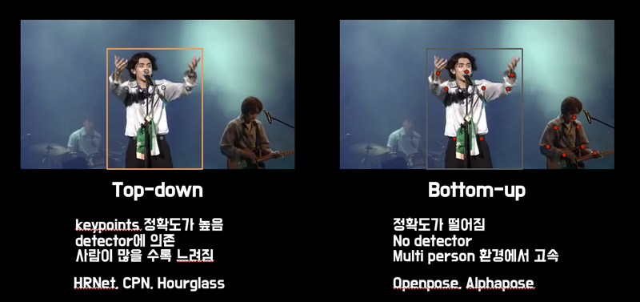
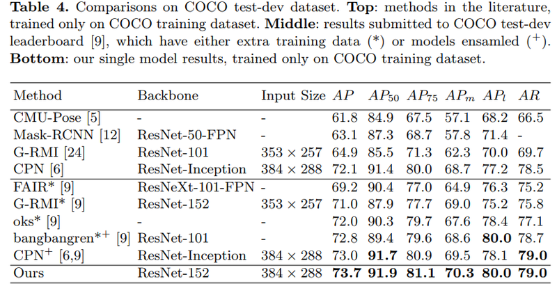

# 19. 사람의 몸짓을 읽어보자

오늘은 **Human Pose Estimation**에 대한 개념와 이론에 대해 알아볼 것이다.

## body language, 몸으로 하는 대화

Human pose estimation(HPE)은 크게 2D와 3D 로 나누어진다. 2D HPE 는 2D 이미지에서 (x, y) 2차원 좌표들을 찾아내고, 3D HPE 는 2D 이미지에서 (x, y, z) 3차원 좌표들을 찾아내는 기술이다.

그런데, 2차원 이미지에서 3차원 이미지를 복원하는 일은 굉장히 어려운 일이다. 2차원 이미지에서는 깊이에 대한 정보가 없기 때문이다.

- [영상 Geometry #1 좌표계](https://darkpgmr.tistory.com/77)
- [영상 Geometry #7 Epipolar Geometry](https://darkpgmr.tistory.com/83?category=460965)

굉장히 어렵긴 하지만 사람의 몸은 3D 환경에서 제약이 있다. (실세계 좌표계에서) 발은 바닥에 있으면서 무릎은 머리 위로 갈 수 없듯이 말이다. 그래서 이런 제약 조건을 이용해서 어느 정도 문제를 해결할 수 있다.

3D pose estimation 을 깊이 있게 다루기는 매우 오랜 시간이 걸리기 때문에, 오늘은 2D 영상 내에서 (x, y) pose (관절) 의 위치를 찾는 방법을 다뤄보려 한다.

## Pose는 Face landmark와 비슷하다

사실 우리는 이미 2D pose estimation 을 다룬 적이 있다. 바로 face landmark다. 딥러닝이나 사람의 시각에서도 실제로도 매우 비슷한 어플리케이션이다. 입력과 출력이 개수만 다를 뿐 상당히 비슷하다.

하지만 난이도에서 차이가 난다. face landmark 는 물리적으로 거의 고정되어 있는 (입이 얼굴보다 클 수 없다) 반면, human pose 는 팔, 다리가 상대적으로 넓은 범위와 자유도를 갖는다는 것을 고려해야 한다.


자유도가 높다는 것은 데이터 분포를 특정하기 어렵다고 표현할 수 있을 것 같다. 데이터 분포를 학습하기 어렵다면 당연히 학습에 더 많은 데이터가 필요하고 더 복잡한 모델을 사용해야 한다는 것을 의미한다. 따라서 상당히 많은 사전 작업이 요구되고 사용하려는 어플리케이션에 따라 접근 방법도 달라진다. 가장 초기에 만나는 접근법은 두 가지로 나눠질 수 있다.



첫 번째 방법은 **Top-down** 방법이다.

- 모든 사람의 정확한 keypoint 를 찾기 위해 object detection 을 사용한다.
- crop 한 이미지 내에서 keypoint 를 찾아내는 방법으로 표현한다.
- detector가 선행되어야 하고 모든 사람마다 알고리즘을 적용해야하기 때문에 사람이 많이 등장할 때는 느리다는 단점이 있다.

두 번째 방법은 **Bottom-up** 방법이다.

- detector가 없고 keypoint 를 먼저 검출한다. 예를 들어 손목에 해당하는 모든 점들을 검출한다.
- 한 사람에 해당하는 keypoint 를 clustering 한다.
- detector 가 없기 때문에 다수의 사람이 영상에 등장하더라도 속도 저하가 크지 않다. 반면 top down 방식에 비해 keypoint 검출범위가 넓어 성능이 떨어진다는 단점이 있다.

얼마나 정확해야 하는지, 여러 사람이 등장하는지 여부에 따라서 필요한 알고리즘이 달라질 수 있다. 핸드폰 카메라로 찍는 인물들은 대체로 소수로 등장하기 때문에 top-down 방식을 이용해도 큰 속도저하 없이 사용할 수 있을 것이라 생각한다.

그럼 Top-down 방법들에 대해 자세히 알아보자.

## Human keypoint detection (1)

### 자유도가 높은 사람의 동작

---

위에서 설명한 것처럼 human pose estimation 은 keypoint 의 localization 문제를 푼다는 점에서 비슷하다. 하지만 손목, 팔꿈치 등의 joint keypoint 정보는 얼굴의 keypoint 보다 훨씬 다양한 위치와 변화를 보인다.


위 [이미지](https://github.com/Team-Neighborhood/Kalman-Filter-Image)에서 볼 수 있듯이 손이 얼굴을 가리는 행위, 모든 keypoint 가 영상에 담기지 않는 등 invisible , occlusions, clothing, lighting change 가 face landmark 에 비해 더 어려운 환경을 만들어 낸다.

딥러닝 기반 방법이 적용되기 전에는 다양한 사전 지식이 사용 되었다. 가장 기본이 되는 아이디어는 "인체는 변형가능 부분으로 나누어져 있고 각 부분 끼리 연결성을 가지고 있다." 는 것이다.


그림에서 보이는 것처럼 손은 팔, 팔은 몸과 연결되어 있다. 손이 다리 옆에 있을 확률이 팔 옆에 있을 확률보다 훨씬 작을 것이다. 이런 제약 조건을 그림에 보이는 스프링으로 표현했다.

3D 환경에서 생각하면 정말 좋은 방법이다. 하지만 우리가 다루는 데이터는 2D 이미지 데이터이기 때문에 촬영 각도에 따라 충분히 팔이 다리 옆에서 관찰될 수 있다.

이 문제를 해결하기 위해 Deformable part models 방법에서는 각 부분(part)들의 complex joint relationship 의 mixture model 로 keypoint 를 표현하는 방법을 이용했지만 성능은 사람들의 기대에 미치지 못했다. 자세한 내용은 아래 논문을 참고하자.

- [Articulated human detection with flexible mixtures-of-parts](https://www.cs.cmu.edu/~deva/papers/pose_pami.pdf)

### **DeepPose**

---

딥러닝 이전의 전통적 pose estimation 모델은 분명한 한계가 있다. deformable parts model 논문에서 언급했듯이 graphical tree model 은 같은 이미지에 두 번 연산을 하는 등 연산 효율이 떨어지는 점과 그에 비해서도 부족한 성능이 문제점으로 인식되어 왔다.

AlexNet 이후, 다양한 분야에 CNN 이 적용되면서 pose estimation 분야에도 CNN 을 이용한 방법이 나타나기 시작했다. Toshev and Szegedy 는 처음으로 딥러닝 기반 keypoint localization 모델을 제안했다.

- [DeepPose: Human Pose Estimation via Deep Neural Networks](https://arxiv.org/pdf/1312.4659.pdf)


기존 기술로는 풀기 어려웠던 동작의 다양성, invisible joint의 문제를 언급하며 딥러닝 기반 추론 방법이 해결책이 될 수 있다는 것을 증명해냈다.


초기의 pose estimation 모델은 x, y 좌표를 직접적으로 예측하는 position regression 문제로 인식했다. human detection 을 통한 crop 된 사람 이미지를 이용해서 딥러닝 모델에 입력하고 (x, y) 좌표를 출력하도록 만든다.

DeepPose는 매우 혁신적인 시도였던 것에 비해 성능이 압도적으로 높았던 것은 아니었다.


표에서 볼 수 있듯이 DeepPose가 전반적으로 높은 성능을 나타내고 있긴 하지만 기존 Tree based model 인 Wang et al. 의 방법에 비해 비약적으로 성능을 상승시켰다고 말하기는 어렵다. DeepPose 의 기여는 SOTA에 가까운 성능을 내면서도 딥러닝을 적용한 첫 번째 사례라고 할 수 있을 것이다.

### **Efficient Object Localization Using Convolutional Network**

---

딥러닝을 사용한 DeepPose가 성능이 비약적으로 상승하지 않은 이유는 Tompson이 제안한 Efficient object localization 방법에서 알 수 있다.


이 논문에서는 제안했던 모델도 DeepPose 에 비해 깊어졌지만, 가장 중요한건 keypoint의 위치를 직접 예측하기보다 keypoint가 존재할 확률 분포를 학습하게 하자는 점이다.


human pose (keypoint) 도 사람이 labeling 을 할 수 밖에 없는데 사람이 항상 같은 위치의 점을 찍기는 어려울 것이다. 동영상으로 보면 조금 더 쉽게 관찰할 수 있다. 동영상의 아래 keypoint 들을 유심히 바라보자. 귀는 귀에 눈은 눈에 그리고 어깨는 어깨에 keypoint 자체는 잘 찍혀 있는 것 같은데 어색한 것을 느낄 수 있을 것이다.


Kalman filter 라고 적힌 동영상에 비해 Orig measured 는 점이 굉장히 떨리고 있다는 사실을 알 수 있다. 항상 같은 위치라고 생각하면서 keypoint 를 선택하지만 사실 매 사진마다 수 픽셀씩 차이가 생기고 있다. 눈을 찍고 싶다면 눈을 중심으로 "어떤 분포" 의 에러가 더해져서 저장 되는 것이다.

자연상태에서 일어나는 확률 분포는 가우시안 분포일 가능성이 크다. Tompson은 이런 점에 착안하여 label 을 (x, y) 좌표에서 (x, y) 를 중심으로 하는 heatmap으로 변환했다. 딥러닝 모델은 이 heatmap을 학습하게 되는 것이다. **"keypoint가 존재할 확률" 을 학습하게 된 이후로 성능이 비약적으로 향상**되는 모습을 볼 수 있다.


Toshev가 제안한 DeepPose 에 비해 무려 2배가 넘는 수치를 볼 수 있다. 머리의 경우 0.9 가 넘는 높은 성능을 드디어 가지게 됐다.


MPII 데이터는 2014년에 나온 데이터다. 기존 FLIC 데이터가 머리, 어깨, 팔꿈치, 손목 수준의 적은 개수의 keypoint를 가지고 있었지만 MPII는 몸의 각 관절 부위 16개의 keypoint를 갖는다. 기존 논문 (Gkioxari, Sapp) 들이 일부 데이터가 없는 이유이다.

Tompson이 제안한 방법은 heatmap 학습 뿐만이 아니라 모델에서도 개선을 이루었다. 어떤 방법이 있는지 논문에서 확인해보자.

- [Efficient Object Localization Using Convolutional Networks](https://arxiv.org/pdf/1411.4280.pdf)


## Human keypoint detection (2)

### **Convolutional Pose Machines**

---

CVPR 2016에서 발표된 CPM 은 completely differentiable 한 multi-stage 구조를 제안했다. multi stage 방법들은 DeepPose에서부터 지속적으로 사용되어 왔었다. 하지만 crop 연산 등 비연속적인 미분불가능한 stage 단위로 나눠져 있었기 때문에 학습 과정을 여러번 반복하는 비효율적인 방법을 사용해왔다.

- [Convolutional Pose Machines](https://arxiv.org/pdf/1602.00134.pdf)

CPM 은 end-to-end 로 학습할 수 있는 모델을 제안한다.


Stage 1 은 image feature 를 계산하는 역할을 하고 Stage 2는 keypoint 를 예측하는 역할을 한다. g1과 g2 모두 heatmap 을 출력하게 만들어서 재사용이 가능한 부분은 weight sharing 할 수 있도록 세부 모델을 설계 했다.


Stage ≥ 2 에서 볼 수 있듯이 Stage 2 이상부터는 반복적으로 사용할 수 있다. 보통은 3개의 스테이지를 사용한다고 한다. Stage 1 구조는 고정이고 Stage 2 부터는 Stage 2 구조를 반복해서 추론한다. Stage 2 부터는 입력이 heatmap(image feature)이 되기 때문에 stage 단계를 거칠수록 keypoint가 refinement 되는 효과를 볼 수 있다.


사실 CPM 이 아주 좋은 방법이라고 말하기는 어렵다. Multi-stage 방법을 사용하기 때문에 end-to-end 로 학습이 가능하더라도 그대로 학습하는 경우는 높은 성능을 달성하기 어렵다. 따라서 stage 단위로 pretraining 을 한 후 다시 하나의 모델로 합쳐서 학습을 한다. 논문을 작성하기 위해서라면 충분히 감내할 수 있지만 서비스 측면에서 바라본다면 불편한 요소라고 할 수 있다. 이런 문제점들은 후에 제안되는 모델들이 적극적으로 개선하고 있다.

CPM 을 다루는 이유는 성능 때문이다. receptive field 를 넓게 만드는 multi stage refinement 방법이 성능 향상에 크게 기여한 것 같다.


주황색 실선이 Tompson 알고리즘이다. CPM 에서 제안한 검정색, 회색 실선이 detection rate에서 유의미한 차이를 보이고 있는 것을 볼 수 있다. MPII 의 PCKh@0.5 에서 87.95% 를 달성했다고 한다. 당시 2등보다 6.11%p 높은 성능을 보였다.

### **Stacked Hourglass Network**

---

ECCV16 에서는 DeepPose 이후 랜드마크라고 불릴만한 논문이 제안 되었다. 바로 [Stacked Hourglass Networks for Human Pose Estimation](https://arxiv.org/pdf/1603.06937.pdf) 이다. 이름에 모든 내용이 담겨 있다. 하나씩 살펴보자.

**Hourglass**

**Stacked Hourglass Network** 의 기본 구조는 모래시계 같은 모양으로 만들어져 있다. Conv layer 와 pooling 으로 이미지(또는 feature) 를 인코딩 하고 upsampling layer 를 통해 feature map 의 크기를 키우는 방향으로 decoding 한다. feature map 크기가 작아졌다 커지는 구조여서 hourglass 라고 표현한다.


기존 방법들과의 가장 큰 차이점은 다음과 같다.

1. feature map upsampling
2. residual connection

pooling으로 image의 global feature를 찾고 upsampling으로 local feature를 고려하는 아이디어가 hourglass의 핵심 novelty라고 할 수 있다.

[resnet](https://www.cv-foundation.org/openaccess/content_cvpr_2016/papers/He_Deep_Residual_Learning_CVPR_2016_paper.pdf)은 이미 충분히 학습했을 것이다. hourglass의 모델 구조를 보면 [U-Net](https://arxiv.org/abs/1505.04597)과 비슷해 보인다. Hourglass는 이 간단한 구조를 여러 층으로 쌓아올려서 (stacked) human pose estimation의 성능을 향상시켰다.


MPII 에서 처음으로 PCKh@0.5 기준 90%를 넘어서는 성과를 보이게 된다. 특유의 간단한 구조와 높은 성능으로 현재까지도 많이 사용되고 있는 구조이다. human pose 분야에 관심이 있으시다면 한 번 사용해보자.

### **SimpleBaseline**

---

앞서 소개한 연구들은 딥러닝 기반의 2D human pose estimation 이 어떻게 발전해 왔는지 보여주고 있다. (x, y) 를 직접 regression 하는 방법이 heatmap 기반으로 바뀌고 모델의 구조가 바뀌어 가면서 encoder-decoder 가 쌓아져 가는 형태가 완성되었다.

결과적으로 MPII 에서 90% 를 넘길 정도로 좋아졌지만 모델의 구조는 다소 복잡해졌다.*사실 2020년 최신 논문들에 비하면 크게 복잡한 정도는 아니지만, 18~19년 당시의 기준이다.*

HPE 의 연구를 쭉 따라오던 당시 Microsoft 인턴 Haiping Wu는 약간 다른 시각을 가져봤다.

**"기술자체가 많이 발전했는데 현재의 간단한 모델은 얼마나 성능이 좋을까?"**

[SimpleBaseline](https://arxiv.org/pdf/1804.06208.pdf)의 저자는 정말 아주 간단한 encoder-decoder 구조를 설계한다.


그리고 이 구조로 무려 '73.7%' 의 mAP 를 COCO 에서 달성한다. 직전 연도(2017년) 의 72.1% 결과를 뛰어넘는 수치이다. 인턴 성과로 ECCV'18 에 출판되는 위엄을 보여주게 된다.



직전 방법인 hourglass 와 직접 비교해보면, 아래와 같은 결과가 나온다고 한다.


resnet50 만 사용한 간단한 구조가 hourglass 와 같은 SOTA(state-of-the-art) 를 이겼다는 것에 큰 놀라움을 선물한 논문이라고 생각한다.

참고로 CPN 은 이전에 소개한 Convolutional Pose Machine 이 아닌 **Cascaded Pyramid Network** 라는 모델이다. 자세히 소개하지는 않지만 skip connection 이 stage 사이에 연결되어 있다는 정도로 이해하고 넘어가면 좋을 것 같다.

SimpleBaseline은 구조가 간단하기 때문에 다뤄보기 좋을 것 같다. 다음 스텝에서 코드와 함께 살펴보도록 하자.

### **Deep High-Resolution Network (HRNet)**

---

[HRNet](https://arxiv.org/pdf/1902.09212.pdf) 은 개발된 이후 현재까지도 SOTA 에 가까운 성능을 보일 정도로 성능이 좋은 알고리즘이다. Simplebaseline의 1저자가 참여해 연구한 모델이기 때문에 Simplebaseline과 같은 철학을 공유한다.

Stacked hourglass, Casecaded pyramid network 등은 multi-stage 구조로 이루어져 있어서 학습 & 추론 속도가 느리다는 큰 단점이 있다. 대신 하이퍼파라미터를 최적화할 경우 1-stage 방법보다 성능이 좋다. 반면 Simplebaseline과 HRNet은 간단함을 추구하는 만큼 1-stage 를 고수한다. 덕분에 구조도 간결해지고 사용하기도 쉽다.


COCO 데이터셋에서 SOTA 의 성능을 자랑한다. (20년 현재는 조금 순위가 낮아졌다.)

1-stage 에서 어떻게 모델을 변화 시켰을까? 기존 알고리즘들을 먼저 살펴보자.


(a) : Hourglass
(b) : CPN(cascaded pyramid networks)
(c) : SimpleBaseline - transposed conv
(d) : SimpleBaseline - dilated conv

를 나타낸다.

위 그림에서 Simplebaseline 이 다른 알고리즘들에 비해 성능이 떨어지지 않지만 구조를 보면 공통점과 차이점을 관찰할 수 있다. 공통점은 high resolution → low resolution 인 encoder 와 low → high 인 decoder 구조로 이루어진 점이고, 차이점은 Hourglass 는 encoder 와 decoder 의 비율이 거의 비슷한 반면에, Simplebaseline 은 encoder 가 무겁고 (resnet50 등 backbone 사용) decoder 는 가벼운 모델을 사용했다. 또한 (a), (b) 는 skip connection 이 있지만 (c) 는 skip connection 이 없다.

차이점에 조금 더 집중해보면 기존 모델들은 skip connection 을 적극적으로 사용했다. HRNet 저자도 high → low → high 의 구조에서 high resolution 정보(representation)을 유지할 수 있는 모델을 어떻게 만들 수 있을지에 대한 고민을 하였다.


고민의 결과, down sample layer를 만들고 작아진 layer feautre 정보를 다시 up sampling해서 원본 해상도 크기에 적용하는 모델을 제안했다. 다소 복잡해 보이지만 1-stage로 동작하기 때문에 전체 flow를 보면 엄청 간단하다. 우리가 앞에서 다뤘던 CPM이나 Hourglass는 중간 단계에서의 heatmap supervision이 학습 과정에 꼭 필요했는데 HRNet 은 필요가 없다.

구현도 Simplebaseline의 backbone인 Resnet을 HRNet으로 교체만 해주면 되기 때문에 사용하기도 굉장히 편리하다.

HRNet 또한 이전 알고리즘들과 마찬가지로 heatmap을 regression하는 방식으로 학습하고 MSE loss를 이용한다. 특히 Simplebaseline 과 거의 유사하다. 결과를 살펴보면,


앞에서 다뤘던 Simplebaseline 이 보인다. 잠깐 언급된 CPN 도 보인다. AP 성능을 보면 HRNet 이 4% 에 가까운 비약적인 성능 향상을 이뤄냈다.

비교적 학습이 간단하면서 성능까지 좋은 모델이어서 현재도 많이 사용되고 있다. 특히 원저자의 PyTorch 코드가 매우 깔끔하게 구현되어 있고 재생산성이 높아 사용하기 좋다.

[https://github.com/leoxiaobin/deep-high-resolution-net.pytorch](https://github.com/leoxiaobin/deep-high-resolution-net.pytorch)

## 코드로 이해하는 Pose Estimation

### **SimpleBaseline 구조**

---


그림을 통해

- encoder : conv layers
- decoder : deconv module + upsampling

로 이루어져 있다는 것을 알 수 있지만 conv layer 가 정확히 어떻게 이루어져 있는지, deconv module 은 구성이 어떻게 되어 있는지, deconv module 이 그림처럼 3개일지는 논문을 정확하게 읽어봐야 알 수 있다.

논문 : [Simple Baselines for Human Pose Estimation and Tracking](https://arxiv.org/pdf/1804.06208.pdf)

### **PyTorch code 읽어보기**

---

사실 논문도 모든 디테일을 설명해주지 않는다. 하지만 인공지능 분야의 최대 장점은 저자의 공식 코드가 제공된다는 점이라고 할 수 있다. 마침 Simplebaseline 의 저자도 논문에서 코드 repo 의 위치를 언급했다. 해당 위치로 들어가면 더 자세히 살펴볼 수 있다.

- [https://github.com/Microsoft/human-pose-estimation.pytorch](https://github.com/Microsoft/human-pose-estimation.pytorch)

18년 이후 PyTorch 의 급격한 성장으로 절반 이상의 오픈소스가 PyTorch로 공개되고 있다.


**[주요 컨퍼런스의 PyTorch 성장률과 tensorflow 성장률. 연구분야에서는 PyTorch 가 압도적으로 많이 사용되고 있다.]**

오늘 검토해 보아야 할 공식 코드repo도 PyTorch 기반으로 작성되어 있다.

여러분이 PyTorch 코드를 읽을 줄 모른다면 그만큼 참고할 수 있는 코드가 줄어든다는 뜻이다. 이번 스텝만으로 PyTorch 코드를 구현할 수 없더라도 지금까지 쌓아온 기본기를 이용해서 simplebaseline 의 PyTorch 코드를 같이 읽어보기만 할 것이다..

모델 부분입니다.

[microsoft/human-pose-estimation.pytorch](https://github.com/microsoft/human-pose-estimation.pytorch/blob/master/lib/models/pose_resnet.py)

**`nn.`** 표현이 많이 등장한다. **`torch.nn`** 으로 **`keras.layers`** 와 같이 딥러닝 모델 구성에 필요한 도구들이 정의되어 있다.

29번째 줄에서는 BasicBlock 이라는 클래스가 보인다. `keras.models` 로 model 을 선언하는 것과 비슷하다. 참고로 PyTorch model 에서는 사용된 layer 를 forward 함수를 통해 computational graph 를 그려준다.

```python
residual = x

out = self.conv1(x)
out = self.bn1(out)
out = self.relu(out)

out = self.conv2(out)
out = self.bn2(out)

if self.downsample is not None:
	residual = self.downsample(x)

out += residual
out = self.relu(out)
```

forward 함수에서는 residual block을 사용했다. Pose 메인 model을 살펴보니 4개의 residual block을 이용한다. resnet과 동일한 구조이다. forward 함수를 보면 흐름을 쉽게 알 수 있다.

```python
def forward(self, x):
        x = self.conv1(x)
        x = self.bn1(x)
        x = self.relu(x)
        x = self.maxpool(x)

        x = self.layer1(x)
        x = self.layer2(x)
        x = self.layer3(x)
        x = self.layer4(x)

        x = self.deconv_layers(x)
        x = self.final_layer(x)

        return x
```

resnet 을 통과한 후 `deconv_layers` 와 `final_layer`를 차례로 통과한다.

deconv layer 를 찾아보니,

```python
layers.append(
                nn.ConvTranspose2d(
                    in_channels=self.inplanes,
                    out_channels=planes,
                    kernel_size=kernel,
                    stride=2,
                    padding=padding,
                    output_padding=output_padding,
                    bias=self.deconv_with_bias))
            layers.append(nn.BatchNorm2d(planes, momentum=BN_MOMENTUM))
            layers.append(nn.ReLU(inplace=True))
```

transpose conv 와 bn, relu 로 이루어져 있는 것을 확인했다.

EXTRA 가 자주 등장하는 것을 볼 때, 어떤 configuration 파일이 있을 것으로 짐작해 볼 수 있다. repo 내에서 검색해보면 파라미터 관련 정보를 담고 있는 아래 파일을 찾을 수 있다.

[https://github.com/microsoft/human-pose-estimation.pytorch/blob/master/experiments/coco/resnet50/256x192_d256x3_adam_lr1e-3.yaml#L23](https://github.com/microsoft/human-pose-estimation.pytorch/blob/master/experiments/coco/resnet50/256x192_d256x3_adam_lr1e-3.yaml#L23)

```python
NUM_DECONV_LAYERS: 3
    NUM_DECONV_FILTERS:
    - 256
    - 256
    - 256
    NUM_DECONV_KERNELS:
    - 4
    - 4
    - 4
```

deconv layer 의 파라미터가 아주 상세히 적혀있다. 이렇게 Simplebaseline 의 모델을 상세하게 파악해볼 수 있었다.

PyTorch 코드는 keras보다 직관적으로 표현되어 있기 때문에 지금처럼 빠르게 파악할 수 있는 장점이 있다. 이제 파악한 지식을 이용해서 tf-simplebaseline 모델을 만들어보자.

**SimpleBaseline - tf2**

```python
import os

import numpy as np
import tensorflow as tf
from tensorflow import keras
from tensorflow.keras import layers

resnet = tf.keras.applications.resnet.ResNet50(include_top=False, weights='imagenet')
```

deconv module을 만든다.

```python
upconv1 = tf.keras.layers.Conv2DTranspose(256, kernel_size=(4,4), strides=(2,2), padding='same')
bn1 = tf.keras.layers.BatchNormalization()
relu1 = tf.keras.layers.ReLU()
upconv2 = tf.keras.layers.Conv2DTranspose(256, kernel_size=(4,4), strides=(2,2), padding='same')
bn2 = tf.keras.layers.BatchNormalization()
relu2 = tf.keras.layers.ReLU()
upconv3 = tf.keras.layers.Conv2DTranspose(256, kernel_size=(4,4), strides=(2,2), padding='same')
bn3 = tf.keras.layers.BatchNormalization()
relu3 = tf.keras.layers.ReLU()
```

deconv module에서 중복을 제거하면 다음과 같다.

```python
def _make_deconv_layer(num_deconv_layers):
    seq_model = tf.keras.models.Sequential()
    for i in range(num_deconv_layers):
        seq_model.add(tf.keras.layers.Conv2DTranspose(256, kernel_size=(4,4), strides=(2,2), padding='same'))
        seq_model.add(tf.keras.layers.BatchNormalization())
        seq_model.add(tf.keras.layers.ReLU())
    return seq_model

upconv = _make_deconv_layer(3)
```

```python
final_layer = tf.keras.layers.Conv2D(1, kernel_size=(1,1), padding='same')
```

가상의 192x256 이미지를 넣어서 출력이 잘 나오는지 확인하는 코드를 작성해본다.

```python
def _make_deconv_layer(num_deconv_layers):
    seq_model = keras.models.Sequential()
    for i in range(num_deconv_layers):
        seq_model.add(tf.keras.layers.Conv2DTranspose(256, kernel_size=(4,4), strides=(2,2), padding='same'))
        seq_model.add(tf.keras.layers.BatchNormalization())
        seq_model.add(tf.keras.layers.ReLU())
    return seq_model

resnet = tf.keras.applications.resnet.ResNet50(include_top=False, weights='imagenet')
upconv = _make_deconv_layer(3)
final_layer = tf.keras.layers.Conv2D(1, kernel_size=(1,1), padding='same')

# input :  192x256
# output : 48x64
inputs = keras.Input(shape=(256, 192, 3))
x = resnet(inputs)
x = upconv(x)
out = final_layer(x)
model = keras.Model(inputs, out)

model.summary()

# np_input = np.zeros((1,256,192,3), dtype=np.float32)
np_input = np.random.randn(1,256,192,3)
np_input = np.zeros((1,256,192,3), dtype=np.float32)
tf_input = tf.convert_to_tensor(np_input, dtype=np.float32)
print (tf_input.shape) # TensorShape([1,256,192,3])

tf_output = model(tf_input)

print (tf_output.shape) # (1, 64, 48, 1)
print (tf_output[0,:10,:10,:10])
```
