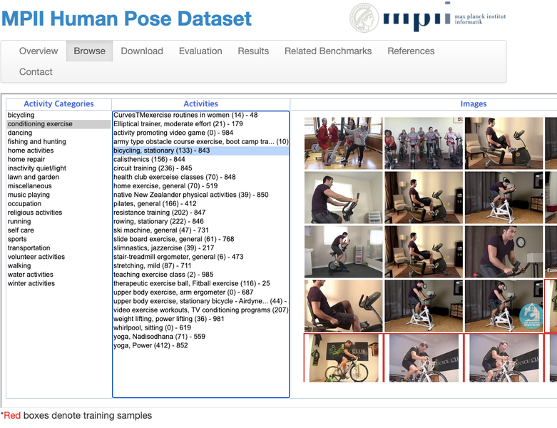

# 20. 행동 스티커 만들기

### **MPII 데이터셋 다운로드 받기**

---

오늘은 [MPII Human Pose Dataset](http://human-pose.mpi-inf.mpg.de/#download)을 사용해서 Human Pose Estimation task를 위한 모델을 훈련시켜 볼 것이다.



```python
$ wget https://datasets.d2.mpi-inf.mpg.de/andriluka14cvpr/mpii_human_pose_v1.tar.gz
$ wget https://datasets.d2.mpi-inf.mpg.de/andriluka14cvpr/mpii_human_pose_v1_u12_2.zip
$ tar -xvf mpii_human_pose_v1.tar.gz -C .
$ unzip mpii_human_pose_v1_u12_2.zip
```

## 데이터 전처리하기

필요한 패키지를 다운로드 한다.

```bash
$ pip install loguru
$ pip install ray
```

`tfrecords_mpii.py` 라는 이름으로 파일을 생성해서, 이후 데이터 전처리 과정을 거쳐 tfrecord 파일을 생성하는 작업을 진행할 것이다. 이 파일은 이전 스텝에 다운받은 `mpii.zip`에도 포함되어 있으므로 함께 확인한다.

```python
import csv
import io
import json
import os

os.environ["CUDA_VISIBLE_DEVICES"] = '-1' #CPU 사용
os.environ['TF_CPP_MIN_LOG_LEVEL'] = '3'

workdir = os.path.join(os.getenv('HOME'),'aiffel/mpii')
os.chdir(workdir)

from loguru import logger
from PIL import Image
import ray
import tensorflow as tf

num_train_shards = 64
num_val_shards = 8
ray.init()
tf.get_logger().setLevel('ERROR')
```

### **json 파싱하기**

이전 스텝에서 **`train.json`**과 **`validation.json`** 파일을 다운로드 받았다. 이 파일들은 이미지에 담겨 있는 사람들의 pose keypoint 정보들을 가지고 있어서 Pose Estimation을 위한 label로 삼을 수 있다.

우선 json이 어떻게 구성되어 있는지 파악해 보기 위해 json 파일을 열어 샘플로 annotation 정보를 1개만 출력해 본다. **`json.dumps()`**를 활용해서 좀 더 명확하게 beautify하면 좋다.

```python
import json, os

json_file_path = os.getenv('HOME')+'/aiffel/mpii/mpii_human_pose_v1_u12_2/train.json'

with open(json_file_path) as train_json:
    train_annos = json.load(train_json)
    json_formatted_str = json.dumps(train_annos[0], indent=2) # json beautify
    print(json_formatted_str)
```

**`joints`** 가 우리가 label 로 사용할 keypoint 의 label 이다. 이미지 형상과 사람의 포즈에 따라 모든 label 이 이미지에 나타나지 않기 때문에 **`joints_vis`** 를 이용해서 실제로 사용할 수 있는 keypoint 인지 나타낸다. MPII 의 경우 1 (visible) / 0(non) 으로만 나누어지기 때문에 조금 더 쉽게 사용할 수 있다. coco 의 경우 2 / 1 / 0 으로 표현해서 occlusion 상황까지 label화 되어있다.

**`joints`** 순서는 아래와 같은 순서로 배치되어 저장되어 있다.

- 0 - 오른쪽 발목
- 1 - 오른쪽 무릎
- 2 - 오른쪽 엉덩이
- 3 - 왼쪽 엉덩이
- 4 - 왼쪽 무릎
- 5 - 왼쪽 발목
- 6 - 골반
- 7 - 가슴(흉부)
- 8 - 목
- 9 - 머리 위
- 10 - 오른쪽 손목
- 11 - 오른쪽 팔꿈치
- 12 - 오른쪽 어깨
- 13 - 왼쪽 어깨
- 14 - 왼쪽 팔꿈치
- 15 - 왼쪽 손목

index 값은 언제든지 바꿔서 사용할 수 있다.

가장 어렵게 느껴지는 값은 **`scale`** 과 **`center`** 일 것이다.

- 높이 = scale * 200px
- center 는 사람의 중심점

200px 이 왜 상수값으로 고정되어 있는 이유는 정확하게 알 수 없었다.

[https://github.com/bearpaw/pytorch-pose/issues/31](https://github.com/bearpaw/pytorch-pose/issues/31)

검색해 보면 위 링크와 같이 토론이 일어 나지만 '사람 키를 200px 로 가정한다' 수준의 정보만 있다.

적절한 근거가 없어서 어렵게 느껴지는 부분이지만 "편의상 사용한다" 정도로 이해하고 넘어가자. 특이한 점은 **`scale`** 정보가 coco dataset에는 scale 값 또한 2차원으로 주어져서 bbox scale 이 나오지만 mpii 는 높이만 나온다는 점이다.

이제 json annotation 을 파싱하는 함수를 만들어 보겠습니다.

```python
def parse_one_annotation(anno, image_dir):
    filename = anno['image']
    joints = anno['joints']
    joints_visibility = anno['joints_vis']
    annotation = {
        'filename': filename,
        'filepath': os.path.join(image_dir, filename),
        'joints_visibility': joints_visibility,
        'joints': joints,
        'center': anno['center'],
        'scale' : anno['scale']
    }
    return annotation
```

image 의 전체 path 를 묶어 dict 타입의 label 로 만들어 낸다. 이 label 을 가지고 학습을 진행하면 된다.

## tfrecord 파일 만들기

이전까지는 tf.keras 의 **`imagedatagenerator`** 를 이용해서 주로 학습데이터를 읽었다. 하지만 실제 프로젝트에서는 튜토리얼 데이터셋보다 훨씬 큰 크기의 데이터를 다루어야 한다.

학습을 많이 해볼 수록 학습 속도에 관심을 가지게 되는데, [tensorflow 튜토리얼 문서](https://www.tensorflow.org/tutorials/load_data/tfrecord?hl=en)에는 다음과 같은 표현으로 나타나 있습니다.

> unless you are using tf.data and reading data is still the bottleneck to training.

일반적으로 학습 과정에서 gpu 의 연산 속도보다 HDD I/O 가 느리기 때문에 병목 현상이 발생하고 대단위 프로젝트 실험에서 효율성이 떨어지는 것을 관찰할 수 있다. 따라서 "학습 데이터를 어떻게 빠르게 읽는가?" 에 대한 고민을 반드시 수행해야 더 많은 실험을 할 수 있다.

데이터 관점에서 학습 속도를 향상시키기 위해서는 data read(prefetch) 또는 데이터 변환 단계에서 GPU 학습과 병렬적으로 수행되도록 prefetch를 적용해야 한다. 해당 방법은 tf.data의 map함수를 이용하여 cache에 저장해두는 방법을 사용해야 한다.

- [tf.data API로 성능 향상하기](https://www.tensorflow.org/guide/data_performance?hl=ko)

내용이 꽤 어렵지만 tf 에서는 위 변환을 자동화해주는 도구를 제공한다. 데이터셋을 tfrecord 형태로 표현하는 것이며, tfrecord는 binary record sequence 를 저장하기 위한 형식이다. 내부적으로 protocol buffer 라는 것을 이용한다.

- 참고 자료: [https://developers.google.com/protocol-buffers/?hl=ko](https://developers.google.com/protocol-buffers/?hl=ko)

protobuf 는 크로스플랫폼에서 사용할 수 있는 직렬화 데이터 라이브러리라고 생각하면 된다. 데이터셋 크기가 크기 때문에 빠른 학습을 위해서 이 정보를 tfrecord 파일로 변환한다.

```python
import ray

def build_tf_records(annotations, total_shards, split):
    chunks = chunkify(annotations, total_shards)
    futures = [
        # train_0001_of_0064.tfrecords
        build_single_tfrecord.remote(
            chunk, './tfrecords_mpii/{}_{}_of_{}.tfrecords'.format(
                split,
                str(i + 1).zfill(4),
                str(total_shards).zfill(4),
            )) for i, chunk in enumerate(chunks)
    ]
    ray.get(futures)
```

구현 내용을 보면 몇 가지 어려운 용어가 등장한다. tfrecord 로 표현하기 위해 필요한 것이다.

- annotation 을 total_shards 개수로 나눔(chunkify) (train : 64개, val : 8개)
- build_single_tfrecord 함수를 통해 tfrecord 로 저장
- 각 chunk 끼리 dependency 가 없기 때문에 병렬처리가 가능, ray를 사용

I/O 병목을 피하기 위해 입력 파일을 여러개로 나눈 뒤, 병렬적으로 prefetch 하는 것이 학습 속도를 빠르게 한다.

- [TFRecord 및 tf.train.Example](https://www.tensorflow.org/tutorials/load_data/tfrecord?hl=ko)

tf 튜토리얼에서 알려준 대로 annotation 을 적절한 개수로 나누는 함수를 작성한다.

```python
def chunkify(l, n):
    size = len(l) // n
    start = 0
    results = []
    for i in range(n - 1):
        results.append(l[start:start + size])
        start += size
    results.append(l[start:])
    return results
```

- l 은 annotation, n은 shard 개수
- shard 개수 단위로 annotation list 를 나누어서 새로운 list를 만든다.
- numpy array 라고 가정하면 (size, shard, anno_content) 정도의 shape을 가질 것이다.

tfrecord 1개를 저장하는 함수를 만든다.

```python
@ray.remote
def build_single_tfrecord(chunk, path):
    print('start to build tf records for ' + path)

    with tf.io.TFRecordWriter(path) as writer:
        for anno_list in chunk:
            tf_example = generate_tfexample(anno_list)
            writer.write(tf_example.SerializeToString())

    print('finished building tf records for ' + path)
```

- TFRecordWriter 를 이용해서 anno_list 를 shard 개수 단위로 작성한다.
- generate_tfexample 함수를 사용한다..
- [중요] write 할 때 string 으로 serialize 해야한다.

tfrecord 는 직렬화된 데이터를 저장하는 표현방법, 라이브러리이기 때문에 규칙을 따라주어야 한다.

- 참고자료: [직렬화에 대한 discussion](https://www.inflearn.com/questions/67208)

tf.example 은 아래와 같이 만들 수 있다.

```python
def generate_tfexample(anno):
    filename = anno['filename']
    filepath = anno['filepath']
    with open(filepath, 'rb') as image_file:
        content = image_file.read()

    image = Image.open(filepath)
    if image.format != 'JPEG' or image.mode != 'RGB':
        image_rgb = image.convert('RGB')
        with io.BytesIO() as output:
            image_rgb.save(output, format="JPEG", quality=95)
            content = output.getvalue()

    width, height = image.size
    depth = 3

    c_x = int(anno['center'][0])
    c_y = int(anno['center'][1])
    scale = anno['scale']

    x = [
        int(joint[0]) if joint[0] >= 0 else int(joint[0]) 
        for joint in anno['joints']
    ]
    y = [
        int(joint[1]) if joint[1] >= 0 else int(joint[0]) 
        for joint in anno['joints']
    ]
    # 0 - invisible, 1 - occluded, 2 - visible
    v = [0 if joint_v == 0 else 2 for joint_v in anno['joints_visibility']]

    feature = {
        'image/height':
        tf.train.Feature(int64_list=tf.train.Int64List(value=[height])),
        'image/width':
        tf.train.Feature(int64_list=tf.train.Int64List(value=[width])),
        'image/depth':
        tf.train.Feature(int64_list=tf.train.Int64List(value=[depth])),
        'image/object/parts/x':
        tf.train.Feature(int64_list=tf.train.Int64List(value=x)),
        'image/object/parts/y':
        tf.train.Feature(int64_list=tf.train.Int64List(value=y)),
        'image/object/center/x': 
        tf.train.Feature(int64_list=tf.train.Int64List(value=[c_x])),
        'image/object/center/y': 
        tf.train.Feature(int64_list=tf.train.Int64List(value=[c_y])),
        'image/object/scale':
        tf.train.Feature(float_list=tf.train.FloatList(value=[scale])),
        'image/object/parts/v':
        tf.train.Feature(int64_list=tf.train.Int64List(value=v)),
        'image/encoded':
        _bytes_feature(content),
        'image/filename':
        _bytes_feature(filename.encode())
    }

    return tf.train.Example(features=tf.train.Features(feature=feature))
```

- 앞에서 정의한 json 의 python type의 값들을 tf.example 에 사용할 수 있는 값으로 변환한다.
- image 파일은 byte 로 변환한다. bitmap 으로 저장하게 되면 파일용량이 상당히 커지기 때문에 만약 jpeg 타입이 아닌 경우 jpeg 으로 변환 후 content 로 불러서 저장한다. (H,W,C)
- 각 label 값을 tf.train.Feature 로 저장한다. 이 때 데이터 타입에 주의해야 한다.
- 이미지는 byte 인코딩 된 값을 그대로 넣는다.

```python
def _bytes_feature(value):
    if isinstance(value, type(tf.constant(0))):
        value = value.numpy(
        )  # BytesList won't unpack a string from an EagerTensor.
    return tf.train.Feature(bytes_list=tf.train.BytesList(value=[value]))
```

## Ray

Ray 는 파이썬을 위한 간단한 분산 어플리케이션 API이다. (multiprocessing)

- 참고자료: [https://docs.ray.io/en/latest/](https://docs.ray.io/en/latest/)

Ray는 Python Multiprocessing과 달리 기존의 코드를 거의 수정 없이 병렬화 할 수 있다.

- [10x Faster Parallel Python Without Python Multiprocessing](https://towardsdatascience.com/10x-faster-parallel-python-without-python-multiprocessing-e5017c93cce1)

```python
#tfrecords_mpii.py

import csv
import io
import json
import os

os.environ["CUDA_VISIBLE_DEVICES"] = "-1"
os.environ['TF_CPP_MIN_LOG_LEVEL'] = '3'

from loguru import logger
from PIL import Image
import ray
import tensorflow as tf

num_train_shards = 64
num_val_shards = 8
ray.init()
tf.get_logger().setLevel('ERROR')

def chunkify(l, n):
    size = len(l) // n
    start = 0
    results = []
    for i in range(n - 1):
        results.append(l[start:start + size])
        start += size
    results.append(l[start:])
    return results

def _bytes_feature(value):
    if isinstance(value, type(tf.constant(0))):
        value = value.numpy(
        )  # BytesList won't unpack a string from an EagerTensor.
    return tf.train.Feature(bytes_list=tf.train.BytesList(value=[value]))

def generate_tfexample(anno):
    filename = anno['filename']
    filepath = anno['filepath']
    with open(filepath, 'rb') as image_file:
        content = image_file.read()

    image = Image.open(filepath)
    if image.format != 'JPEG' or image.mode != 'RGB':
        image_rgb = image.convert('RGB')
        with io.BytesIO() as output:
            image_rgb.save(output, format="JPEG", quality=95)
            content = output.getvalue()

    width, height = image.size
    depth = 3

    c_x = int(anno['center'][0])
    c_y = int(anno['center'][1])
    scale = anno['scale']

    # x = [
    #     joint[0] / width if joint[0] >= 0 else joint[0]
    #     for joint in anno['joints']
    # ]
    # y = [
    #     joint[1] / height if joint[1] >= 0 else joint[0]
    #     for joint in anno['joints']
    # ]
    x = [
        int(joint[0]) if joint[0] >= 0 else int(joint[0]) 
        for joint in anno['joints']
    ]
    y = [
        int(joint[1]) if joint[1] >= 0 else int(joint[0]) 
        for joint in anno['joints']
    ]
    # 0 - invisible, 1 - occluded, 2 - visible
    v = [0 if joint_v == 0 else 2 for joint_v in anno['joints_visibility']]

    feature = {
        'image/height':
        tf.train.Feature(int64_list=tf.train.Int64List(value=[height])),
        'image/width':
        tf.train.Feature(int64_list=tf.train.Int64List(value=[width])),
        'image/depth':
        tf.train.Feature(int64_list=tf.train.Int64List(value=[depth])),
        'image/object/parts/x':
        tf.train.Feature(int64_list=tf.train.Int64List(value=x)),
        'image/object/parts/y':
        tf.train.Feature(int64_list=tf.train.Int64List(value=y)),
        'image/object/center/x': 
        tf.train.Feature(int64_list=tf.train.Int64List(value=[c_x])),
        'image/object/center/y': 
        tf.train.Feature(int64_list=tf.train.Int64List(value=[c_y])),
        'image/object/scale':
        tf.train.Feature(float_list=tf.train.FloatList(value=[scale])),
        # 'image/object/parts/x':
        # tf.train.Feature(float_list=tf.train.FloatList(value=x)),
        # 'image/object/parts/y':
        # tf.train.Feature(float_list=tf.train.FloatList(value=y)),
        'image/object/parts/v':
        tf.train.Feature(int64_list=tf.train.Int64List(value=v)),
        'image/encoded':
        _bytes_feature(content),
        'image/filename':
        _bytes_feature(filename.encode())
    }

    return tf.train.Example(features=tf.train.Features(feature=feature))

@ray.remote
def build_single_tfrecord(chunk, path):
    print('start to build tf records for ' + path)

    with tf.io.TFRecordWriter(path) as writer:
        for anno_list in chunk:
            tf_example = generate_tfexample(anno_list)
            writer.write(tf_example.SerializeToString())

    print('finished building tf records for ' + path)

def build_tf_records(annotations, total_shards, split):
    chunks = chunkify(annotations, total_shards)
    futures = [
        # train_0001_of_0064.tfrecords
        build_single_tfrecord.remote(
            chunk, './tfrecords_mpii/{}_{}_of_{}.tfrecords'.format(
                split,
                str(i + 1).zfill(4),
                str(total_shards).zfill(4),
            )) for i, chunk in enumerate(chunks)
    ]
    ray.get(futures)

def parse_one_annotation(anno, image_dir):
    filename = anno['image']
    joints = anno['joints']
    joints_visibility = anno['joints_vis']
    annotation = {
        'filename': filename,
        'filepath': os.path.join(image_dir, filename),
        'joints_visibility': joints_visibility,
        'joints': joints,
        'center': anno['center'],
        'scale' : anno['scale']
    }
    return annotation

def main():
    print('Start to parse annotations.')
    if not os.path.exists('./tfrecords_mpii'):
        os.makedirs('./tfrecords_mpii')

    with open('./mpii_human_pose_v1_u12_2/train.json') as train_json:
        train_annos = json.load(train_json)
        train_annotations = [
            parse_one_annotation(anno, './images/')
            for anno in train_annos
        ]
        print('First train annotation: ', train_annotations[0])
        del (train_annos)

    with open('./mpii_human_pose_v1_u12_2/validation.json') as val_json:
        val_annos = json.load(val_json)
        val_annotations = [
            parse_one_annotation(anno, './images/') for anno in val_annos
        ]
        print('First val annotation: ', val_annotations[0])
        del (val_annos)

    print('Start to build TF Records.')
    build_tf_records(train_annotations, num_train_shards, 'train')
    build_tf_records(val_annotations, num_val_shards, 'val')

    print('Successfully wrote {} annotations to TF Records.'.format(
        len(train_annotations) + len(val_annotations)))

if __name__ == '__main__':
    main()
```

아래와 같이 tfrecord 생성한다.

```bash
$ cd ~/aiffel/mpii && python tfrecords_mpii.py
```

아래 명령어를 실행해보면

```bash
$ cd ~/aiffel/mpii/tfrecords_mpii && ls | wc
```

약 200MB 정도의 tfrecords들이 72개 만들어진 것을 알 수 있다.

## Date label 로 만들기

tfrecords 파일을 읽고 전처리를 할 수 있는 dataloader 를 만든다.

```python
# preprocess.py

import tensorflow as tf

class Preprocessor(object):
    def __init__(self,
                 image_shape=(256, 256, 3),
                 heatmap_shape=(64, 64, 16),
                 is_train=False):
        self.is_train = is_train
        self.image_shape = image_shape
        self.heatmap_shape = heatmap_shape

    def __call__(self, example):
        features = self.parse_tfexample(example)
        image = tf.io.decode_jpeg(features['image/encoded'])

        if self.is_train:
            random_margin = tf.random.uniform([1], 0.1, 0.3)[0]
            image, keypoint_x, keypoint_y = self.crop_roi(image, features, margin=random_margin)
            image = tf.image.resize(image, self.image_shape[0:2])
        else:
            image, keypoint_x, keypoint_y = self.crop_roi(image, features)
            image = tf.image.resize(image, self.image_shape[0:2])

        image = tf.cast(image, tf.float32) / 127.5 - 1
        heatmaps = self.make_heatmaps(features, keypoint_x, keypoint_y)

        # print (image.shape, heatmaps.shape, type(heatmaps))

        return image, heatmaps
```

위 **`Preprocessor`** 클래스 코드에서 **`__call__()`** 메소드 내부에서 진행되는 주요 과정을 정리하면 아래와 같다.

- tfrecord 파일이기 때문에 병렬로 읽는 것은 tf 가 지원한다. **`self.parse_tfexample()`** 에 구현되어 있고 이 함수를 통해 **`tf.tensor`** 로 이루어진 dictionary 형태의 **`features`**를 얻을 수 있다.
- 즉 image 는 **`features['image/encoded']`** 형태로 사용할 수 있고 tfrecord 를 저장할 때 jpeg encoding 된 값을 넣었으므로 **`tf.io.decode_jpeg()`**로 decoding 하여 tensor 형태의 이미지를 얻다.
- **`crop_roi()`** 메소드를 이용해 해당 이미지를 학습하기 편하도록 몇 가지 트릭을 적용한다.
- **`make_heatmaps()`** 메소드를 이용해 label을 heatmap 으로 나타낸다.

```python
def parse_tfexample(self, example_proto):
        image_feature_description = {
            'image/height': tf.io.FixedLenFeature([], tf.int64),
            'image/width': tf.io.FixedLenFeature([], tf.int64),
            'image/depth': tf.io.FixedLenFeature([], tf.int64),
            'image/object/parts/x': tf.io.VarLenFeature(tf.int64),
            'image/object/parts/y': tf.io.VarLenFeature(tf.int64),
            'image/object/parts/v': tf.io.VarLenFeature(tf.int64),
            'image/object/center/x': tf.io.FixedLenFeature([], tf.int64),
            'image/object/center/y': tf.io.FixedLenFeature([], tf.int64),
            'image/object/scale': tf.io.FixedLenFeature([], tf.float32),
            'image/encoded': tf.io.FixedLenFeature([], tf.string),
            'image/filename': tf.io.FixedLenFeature([], tf.string),
        }
        return tf.io.parse_single_example(example_proto,
                                          image_feature_description)
```

tfrecord 파일 형식을 저장한 data type feature 에 맞게 parsing 한다. tf 가 자동으로 parsing 해주는 점은 아주 편하지만 feature description 을 정확하게 알고 있어야 하는 단점이 있다. 즉, tfrecord 에서 사용할 key 값들과 data type 을 모르면 tfrecord 파일을 사용하기 굉장히 어렵다. 이렇게 얻은 image 와 label 을 이용해서 적절한 학습 형태로 변환한다.

```python
def crop_roi(self, image, features, margin=0.2):
        img_shape = tf.shape(image)
        img_height = img_shape[0]
        img_width = img_shape[1]
        img_depth = img_shape[2]

        keypoint_x = tf.cast(tf.sparse.to_dense(features['image/object/parts/x']), dtype=tf.int32)
        keypoint_y = tf.cast(tf.sparse.to_dense(features['image/object/parts/y']), dtype=tf.int32)
        center_x = features['image/object/center/x']
        center_y = features['image/object/center/y']
        body_height = features['image/object/scale'] * 200.0

        # keypoint 중 유효한값(visible = 1) 만 사용합니다.
        masked_keypoint_x = tf.boolean_mask(keypoint_x, keypoint_x > 0)
        masked_keypoint_y = tf.boolean_mask(keypoint_y, keypoint_y > 0)

        # min, max 값을 찾습니다.
        keypoint_xmin = tf.reduce_min(masked_keypoint_x)
        keypoint_xmax = tf.reduce_max(masked_keypoint_x)
        keypoint_ymin = tf.reduce_min(masked_keypoint_y)
        keypoint_ymax = tf.reduce_max(masked_keypoint_y)

        # 높이 값을 이용해서 x, y 위치를 재조정 합니다. 박스를 정사각형으로 사용하기 위해 아래와 같이 사용합니다.
        xmin = keypoint_xmin - tf.cast(body_height * margin, dtype=tf.int32)
        xmax = keypoint_xmax + tf.cast(body_height * margin, dtype=tf.int32)
        ymin = keypoint_ymin - tf.cast(body_height * margin, dtype=tf.int32)
        ymax = keypoint_ymax + tf.cast(body_height * margin, dtype=tf.int32)

        # 이미지 크기를 벗어나는 점을 재조정 해줍니다.
        effective_xmin = xmin if xmin > 0 else 0
        effective_ymin = ymin if ymin > 0 else 0
        effective_xmax = xmax if xmax < img_width else img_width
        effective_ymax = ymax if ymax < img_height else img_height
        effective_height = effective_ymax - effective_ymin
        effective_width = effective_xmax - effective_xmin

        image = image[effective_ymin:effective_ymax, effective_xmin:effective_xmax, :]
        new_shape = tf.shape(image)
        new_height = new_shape[0]
        new_width = new_shape[1]

        # shift all keypoints based on the crop area
        effective_keypoint_x = (keypoint_x - effective_xmin) / new_width
        effective_keypoint_y = (keypoint_y - effective_ymin) / new_height

        return image, effective_keypoint_x, effective_keypoint_y
```

우리가 알고 있는 것은 joints 의 위치, center 의 좌표, body height 값이다. 균일하게 학습하기 위해 body width 를 적절히 정하는 것도 중요하다.

여기서는 높이 정보와 keypoint 위치를 이용해서 정사각형 박스를 사용하는 것을 기본으로 디자인 했다. 이와 관련해서는 여러 방법이 있을 수 있겠지만 배우는 단계에서 더 중요하게 봐야 할 부분은 우리가 임의로 조정한 crop box 가 이미지 바깥으로 나가지 않는지 예외 처리를 잘 해주어야 한다는 점이다.

(x, y) 좌표로 되어있는 keypoint 를 heatmap 으로 변경시킨다.


```python
def make_heatmaps(self, features, keypoint_x, keypoint_y):
        v = tf.cast(tf.sparse.to_dense(features['image/object/parts/v']), dtype=tf.float32)
        x = tf.cast(tf.math.round(keypoint_x * self.heatmap_shape[0]), dtype=tf.int32)
        y = tf.cast(tf.math.round(keypoint_y * self.heatmap_shape[1]), dtype=tf.int32)

        num_heatmap = self.heatmap_shape[2]
        heatmap_array = tf.TensorArray(tf.float32, 16)

        for i in range(num_heatmap):
            gaussian = self.generate_2d_guassian(self.heatmap_shape[1], self.heatmap_shape[0], y[i], x[i], v[i])
            heatmap_array = heatmap_array.write(i, gaussian)

        heatmaps = heatmap_array.stack()
        heatmaps = tf.transpose(heatmaps, perm=[1, 2, 0]) # change to (64, 64, 16)

        return heatmaps
```

- 16개의 점을 `generate_2d_gaussian()` 함수를 이용해서 64x64 의 map 에 표현한다. 2D 가우스 분포 수식을 적용해서 만들 수 있다.


```python
def generate_2d_guassian(self, height, width, y0, x0, visibility=2, sigma=1, scale=12):
        """
        "The same technique as Tompson et al. is used for supervision. A MeanSquared Error (MSE) loss is
        applied comparing the predicted heatmap to a ground-truth heatmap consisting of a 2D gaussian
        (with standard deviation of 1 px) centered on the keypoint location."

        https://github.com/princeton-vl/pose-hg-train/blob/master/src/util/img.lua#L204
        """
        heatmap = tf.zeros((height, width))

        # this gaussian patch is 7x7, let's get four corners of it first
        xmin = x0 - 3 * sigma
        ymin = y0 - 3 * sigma
        xmax = x0 + 3 * sigma
        ymax = y0 + 3 * sigma
        # if the patch is out of image boundary we simply return nothing according to the source code
        # [1]"In these cases the joint is either truncated or severely occluded, so for
        # supervision a ground truth heatmap of all zeros is provided."
        if xmin >= width or ymin >= height or xmax < 0 or ymax <0 or visibility == 0:
            return heatmap

        size = 6 * sigma + 1
        x, y = tf.meshgrid(tf.range(0, 6*sigma+1, 1), tf.range(0, 6*sigma+1, 1), indexing='xy')

        # the center of the gaussian patch should be 1
        center_x = size // 2
        center_y = size // 2

        # generate this 7x7 gaussian patch
        gaussian_patch = tf.cast(tf.math.exp(-(tf.square(x - center_x) + tf.math.square(y - center_y)) / (tf.math.square(sigma) * 2)) * scale, dtype=tf.float32)

        # part of the patch could be out of the boundary, so we need to determine the valid range
        # if xmin = -2, it means the 2 left-most columns are invalid, which is max(0, -(-2)) = 2
        patch_xmin = tf.math.maximum(0, -xmin)
        patch_ymin = tf.math.maximum(0, -ymin)
        # if xmin = 59, xmax = 66, but our output is 64x64, then we should discard 2 right-most columns
        # which is min(64, 66) - 59 = 5, and column 6 and 7 are discarded
        patch_xmax = tf.math.minimum(xmax, width) - xmin
        patch_ymax = tf.math.minimum(ymax, height) - ymin

        # also, we need to determine where to put this patch in the whole heatmap
        heatmap_xmin = tf.math.maximum(0, xmin)
        heatmap_ymin = tf.math.maximum(0, ymin)
        heatmap_xmax = tf.math.minimum(xmax, width)
        heatmap_ymax = tf.math.minimum(ymax, height)

        # finally, insert this patch into the heatmap
        indices = tf.TensorArray(tf.int32, 1, dynamic_size=True)
        updates = tf.TensorArray(tf.float32, 1, dynamic_size=True)

        count = 0

        for j in tf.range(patch_ymin, patch_ymax):
            for i in tf.range(patch_xmin, patch_xmax):
                indices = indices.write(count, [heatmap_ymin+j, heatmap_xmin+i])
                updates = updates.write(count, gaussian_patch[j][i])
                count += 1

        heatmap = tf.tensor_scatter_nd_update(heatmap, indices.stack(), updates.stack())

        return heatmap
```

sigma 값이 1 이고 window size 7 인 필터를 이용해서 만들었다. 이런 특수 함수들은 공개되어 있는 구현이 많기 때문에 참고해서 사용하는 것을 추천한다.

```python
# preprocess.py

import tensorflow as tf

class Preprocessor(object):
    def __init__(self,
                 image_shape=(256, 256, 3),
                 heatmap_shape=(64, 64, 16),
                 is_train=False):
        self.is_train = is_train
        self.image_shape = image_shape
        self.heatmap_shape = heatmap_shape

    def __call__(self, example):
        features = self.parse_tfexample(example)
        image = tf.io.decode_jpeg(features['image/encoded'])

        if self.is_train:
            random_margin = tf.random.uniform([1], 0.1, 0.3)[0]
            image, keypoint_x, keypoint_y = self.crop_roi(image, features, margin=random_margin)
            image = tf.image.resize(image, self.image_shape[0:2])
        else:
            image, keypoint_x, keypoint_y = self.crop_roi(image, features)
            image = tf.image.resize(image, self.image_shape[0:2])

        image = tf.cast(image, tf.float32) / 127.5 - 1
        heatmaps = self.make_heatmaps(features, keypoint_x, keypoint_y)

        # print (image.shape, heatmaps.shape, type(heatmaps))

        return image, heatmaps

    def crop_roi(self, image, features, margin=0.2):
        img_shape = tf.shape(image)
        img_height = img_shape[0]
        img_width = img_shape[1]
        img_depth = img_shape[2]

        keypoint_x = tf.cast(tf.sparse.to_dense(features['image/object/parts/x']), dtype=tf.int32)
        keypoint_y = tf.cast(tf.sparse.to_dense(features['image/object/parts/y']), dtype=tf.int32)
        center_x = features['image/object/center/x']
        center_y = features['image/object/center/y']
        body_height = features['image/object/scale'] * 200.0

        masked_keypoint_x = tf.boolean_mask(keypoint_x, keypoint_x > 0)
        masked_keypoint_y = tf.boolean_mask(keypoint_y, keypoint_y > 0)

        keypoint_xmin = tf.reduce_min(masked_keypoint_x)
        keypoint_xmax = tf.reduce_max(masked_keypoint_x)
        keypoint_ymin = tf.reduce_min(masked_keypoint_y)
        keypoint_ymax = tf.reduce_max(masked_keypoint_y)

        xmin = keypoint_xmin - tf.cast(body_height * margin, dtype=tf.int32)
        xmax = keypoint_xmax + tf.cast(body_height * margin, dtype=tf.int32)
        ymin = keypoint_ymin - tf.cast(body_height * margin, dtype=tf.int32)
        ymax = keypoint_ymax + tf.cast(body_height * margin, dtype=tf.int32)

        effective_xmin = xmin if xmin > 0 else 0
        effective_ymin = ymin if ymin > 0 else 0
        effective_xmax = xmax if xmax < img_width else img_width
        effective_ymax = ymax if ymax < img_height else img_height
        effective_height = effective_ymax - effective_ymin
        effective_width = effective_xmax - effective_xmin

        image = image[effective_ymin:effective_ymax, effective_xmin:effective_xmax, :]
        new_shape = tf.shape(image)
        new_height = new_shape[0]
        new_width = new_shape[1]

        effective_keypoint_x = (keypoint_x - effective_xmin) / new_width
        effective_keypoint_y = (keypoint_y - effective_ymin) / new_height

        return image, effective_keypoint_x, effective_keypoint_y

    def generate_2d_guassian(self, height, width, y0, x0, visibility=2, sigma=1, scale=12):
        """
        "The same technique as Tompson et al. is used for supervision. A MeanSquared Error (MSE) loss is
        applied comparing the predicted heatmap to a ground-truth heatmap consisting of a 2D gaussian
        (with standard deviation of 1 px) centered on the keypoint location."

        https://github.com/princeton-vl/pose-hg-train/blob/master/src/util/img.lua#L204
        """
        heatmap = tf.zeros((height, width))

        # this gaussian patch is 7x7, let's get four corners of it first
        xmin = x0 - 3 * sigma
        ymin = y0 - 3 * sigma
        xmax = x0 + 3 * sigma
        ymax = y0 + 3 * sigma
        # if the patch is out of image boundary we simply return nothing according to the source code
        # [1]"In these cases the joint is either truncated or severely occluded, so for
        # supervision a ground truth heatmap of all zeros is provided."
        if xmin >= width or ymin >= height or xmax < 0 or ymax <0 or visibility == 0:
            return heatmap

        size = 6 * sigma + 1
        x, y = tf.meshgrid(tf.range(0, 6*sigma+1, 1), tf.range(0, 6*sigma+1, 1), indexing='xy')

        # the center of the gaussian patch should be 1
        center_x = size // 2
        center_y = size // 2

        # generate this 7x7 gaussian patch
        gaussian_patch = tf.cast(tf.math.exp(-(tf.square(x - center_x) + tf.math.square(y - center_y)) / (tf.math.square(sigma) * 2)) * scale, dtype=tf.float32)

        # part of the patch could be out of the boundary, so we need to determine the valid range
        # if xmin = -2, it means the 2 left-most columns are invalid, which is max(0, -(-2)) = 2
        patch_xmin = tf.math.maximum(0, -xmin)
        patch_ymin = tf.math.maximum(0, -ymin)
        # if xmin = 59, xmax = 66, but our output is 64x64, then we should discard 2 right-most columns
        # which is min(64, 66) - 59 = 5, and column 6 and 7 are discarded
        patch_xmax = tf.math.minimum(xmax, width) - xmin
        patch_ymax = tf.math.minimum(ymax, height) - ymin

        # also, we need to determine where to put this patch in the whole heatmap
        heatmap_xmin = tf.math.maximum(0, xmin)
        heatmap_ymin = tf.math.maximum(0, ymin)
        heatmap_xmax = tf.math.minimum(xmax, width)
        heatmap_ymax = tf.math.minimum(ymax, height)

        # finally, insert this patch into the heatmap
        indices = tf.TensorArray(tf.int32, 1, dynamic_size=True)
        updates = tf.TensorArray(tf.float32, 1, dynamic_size=True)

        count = 0

        for j in tf.range(patch_ymin, patch_ymax):
            for i in tf.range(patch_xmin, patch_xmax):
                indices = indices.write(count, [heatmap_ymin+j, heatmap_xmin+i])
                updates = updates.write(count, gaussian_patch[j][i])
                count += 1

        heatmap = tf.tensor_scatter_nd_update(heatmap, indices.stack(), updates.stack())

        return heatmap

    def make_heatmaps(self, features, keypoint_x, keypoint_y):
        v = tf.cast(tf.sparse.to_dense(features['image/object/parts/v']), dtype=tf.float32)
        x = tf.cast(tf.math.round(keypoint_x * self.heatmap_shape[0]), dtype=tf.int32)
        y = tf.cast(tf.math.round(keypoint_y * self.heatmap_shape[1]), dtype=tf.int32)

        num_heatmap = self.heatmap_shape[2]
        heatmap_array = tf.TensorArray(tf.float32, 16)

        for i in range(num_heatmap):
            gaussian = self.generate_2d_guassian(self.heatmap_shape[1], self.heatmap_shape[0], y[i], x[i], v[i])
            heatmap_array = heatmap_array.write(i, gaussian)

        heatmaps = heatmap_array.stack()
        heatmaps = tf.transpose(heatmaps, perm=[1, 2, 0]) # change to (64, 64, 16)

        return heatmaps

    def parse_tfexample(self, example_proto):
        image_feature_description = {
            'image/height': tf.io.FixedLenFeature([], tf.int64),
            'image/width': tf.io.FixedLenFeature([], tf.int64),
            'image/depth': tf.io.FixedLenFeature([], tf.int64),
            'image/object/parts/x': tf.io.VarLenFeature(tf.int64),
            'image/object/parts/y': tf.io.VarLenFeature(tf.int64),
            'image/object/parts/v': tf.io.VarLenFeature(tf.int64),
            'image/object/center/x': tf.io.FixedLenFeature([], tf.int64),
            'image/object/center/y': tf.io.FixedLenFeature([], tf.int64),
            'image/object/scale': tf.io.FixedLenFeature([], tf.float32),
            'image/encoded': tf.io.FixedLenFeature([], tf.string),
            'image/filename': tf.io.FixedLenFeature([], tf.string),
        }
        return tf.io.parse_single_example(example_proto,
                                          image_feature_description)
```

## 모델을 학습해보자

### **Hourglass 모델 만들기**

---

이번엔 **`hourglass104.py`** 라는 파일을 생성한다.

```python
import tensorflow as tf

from tensorflow.keras.layers import Add, Concatenate, Lambda
from tensorflow.keras.layers import Input, Conv2D, ReLU, MaxPool2D
from tensorflow.keras.layers import UpSampling2D, ZeroPadding2D
from tensorflow.keras.layers import BatchNormalization
```

이전 노드에서 소개했던 hourglass 모델은 다음과 같다.


직육면체 박스는 residual block 이었다. 하나씩 구현해보자.

### **Residual block module**

---

```python
def BottleneckBlock(inputs, filters, strides=1, downsample=False, name=None):
    identity = inputs
    if downsample:
        identity = Conv2D(
            filters=filters,# lift channels first
            kernel_size=1,
            strides=strides,
            padding='same',
            kernel_initializer='he_normal')(inputs)

    x = BatchNormalization(momentum=0.9)(inputs)
    x = ReLU()(x)
    x = Conv2D(
        filters=filters // 2,
        kernel_size=1,
        strides=1,
        padding='same',
        kernel_initializer='he_normal')(x)

    x = BatchNormalization(momentum=0.9)(x)
    x = ReLU()(x)
    x = Conv2D(
        filters=filters // 2,
        kernel_size=3,
        strides=strides,
        padding='same',
        kernel_initializer='he_normal')(x)

    x = BatchNormalization(momentum=0.9)(x)
    x = ReLU()(x)
    x = Conv2D(
        filters=filters,
        kernel_size=1,
        strides=1,
        padding='same',
        kernel_initializer='he_normal')(x)

    x = Add()([identity, x])
    return x
```

hourglass 모델을 잘 생각해보면 마치 양파처럼 가장 바깥의 layer 를 제거하면 똑같은 구조가 나타나는 것을 알 수 있다. 이 점을 이용해서 간단하게 모델을 표현할 수 있다.

### **Hourglass module**

---

```python
def HourglassModule(inputs, order, filters, num_residual):
    """
    https://github.com/princeton-vl/pose-hg-train/blob/master/src/models/hg.lua#L3
    """
# Upper branch
    up1 = BottleneckBlock(inputs, filters, downsample=False)

    for i in range(num_residual):
        up1 = BottleneckBlock(up1, filters, downsample=False)

# Lower branch
    low1 = MaxPool2D(pool_size=2, strides=2)(inputs)
    for i in range(num_residual):
        low1 = BottleneckBlock(low1, filters, downsample=False)

    low2 = low1
    if order > 1:
        low2 = HourglassModule(low1, order - 1, filters, num_residual)
    else:
        for i in range(num_residual):
            low2 = BottleneckBlock(low2, filters, downsample=False)

    low3 = low2
    for i in range(num_residual):
        low3 = BottleneckBlock(low3, filters, downsample=False)

    up2 = UpSampling2D(size=2)(low3)

    return up2 + up1
```

재귀함수를 이용하여 바깥부터 5개의 양파껍질(Layer)을 만들고 싶다면 order를 이용해서 5,4…1 이 될 때까지 HourglassModule 을 반복하면 order 가 1이 될 때, BottleneckBlock 으로 대체해주면 아주 간결하게 만들 수 있다.

이 hourglass 모듈을 여러 층으로 쌓은 것이 stacked hourglass network 인데, 모델이 깊어지는 만큼 학습이 어려워 intermediate loss (auxilary loss) 를 추가해야 하는 것을 논문에서 언급 했다.


### **intermediate output을 위한 linear layer**

```python
def LinearLayer(inputs, filters):
    x = Conv2D(
        filters=filters,
        kernel_size=1,
        strides=1,
        padding='same',
        kernel_initializer='he_normal')(inputs)
    x = BatchNormalization(momentum=0.9)(x)
    x = ReLU()(x)
    return x
```

따라서 stacked 되는 hourglass 층 사이사이에 LinearLayer 를 삽입하고 중간 loss 를 계산해준다.

지금까지 만든 hourglass 를 여러 층으로 쌓으면 stacked hourglass 가 된다.


### **Stacked Hourglass**

---

```python
def StackedHourglassNetwork(
        input_shape=(256, 256, 3), num_stack=4, num_residual=1,
        num_heatmap=16):
    """
    https://github.com/princeton-vl/pose-hg-train/blob/master/src/models/hg.lua#L33
    """
    inputs = Input(shape=input_shape)

# initial processing of the image
    x = Conv2D(
        filters=64,
        kernel_size=7,
        strides=2,
        padding='same',
        kernel_initializer='he_normal')(inputs)
    x = BatchNormalization(momentum=0.9)(x)
    x = ReLU()(x)
    x = BottleneckBlock(x, 128, downsample=True)
    x = MaxPool2D(pool_size=2, strides=2)(x)
    x = BottleneckBlock(x, 128, downsample=False)
    x = BottleneckBlock(x, 256, downsample=True)

    ys = []
    for i in range(num_stack):
        x = HourglassModule(x, order=4, filters=256, num_residual=num_residual)
        for i in range(num_residual):
            x = BottleneckBlock(x, 256, downsample=False)

# predict 256 channels like a fully connected layer.
        x = LinearLayer(x, 256)

# predict final channels, which is also the number of predicted heatmap
        y = Conv2D(
            filters=num_heatmap,
            kernel_size=1,
            strides=1,
            padding='same',
            kernel_initializer='he_normal')(x)
        ys.append(y)

# if it's not the last stack, we need to add predictions backif i < num_stack - 1:
            y_intermediate_1 = Conv2D(filters=256, kernel_size=1, strides=1)(x)
            y_intermediate_2 = Conv2D(filters=256, kernel_size=1, strides=1)(y)
            x = Add()([y_intermediate_1, y_intermediate_2])

    return tf.keras.Model(inputs, ys, name='stacked_hourglass')

```

아래는 지금까지 작성해 온 내용을 정리한 **`hourglass104.py`** 파일이다.

```python
# hourglass104.py

import tensorflow as tf

from tensorflow.keras.layers import (
    Add,
    Concatenate,
    Conv2D,
    Input,
    Lambda,
    ReLU,
    MaxPool2D,
    UpSampling2D,
    ZeroPadding2D,
    BatchNormalization,
)

def BottleneckBlock(inputs, filters, strides=1, downsample=False, name=None):
    identity = inputs
    if downsample:
        identity = Conv2D(
            filters=filters,  # lift channels first
            kernel_size=1,
            strides=strides,
            padding='same',
            kernel_initializer='he_normal')(inputs)

    x = BatchNormalization(momentum=0.9)(inputs)
    x = ReLU()(x)
    x = Conv2D(
        filters=filters // 2,
        kernel_size=1,
        strides=1,
        padding='same',
        kernel_initializer='he_normal')(x)

    x = BatchNormalization(momentum=0.9)(x)
    x = ReLU()(x)
    x = Conv2D(
        filters=filters // 2,
        kernel_size=3,
        strides=strides,
        padding='same',
        kernel_initializer='he_normal')(x)

    x = BatchNormalization(momentum=0.9)(x)
    x = ReLU()(x)
    x = Conv2D(
        filters=filters,
        kernel_size=1,
        strides=1,
        padding='same',
        kernel_initializer='he_normal')(x)

    x = Add()([identity, x])
    return x

def HourglassModule(inputs, order, filters, num_residual):
    """
    https://github.com/princeton-vl/pose-hg-train/blob/master/src/models/hg.lua#L3
    """
    # Upper branch
    up1 = BottleneckBlock(inputs, filters, downsample=False)

    for i in range(num_residual):
        up1 = BottleneckBlock(up1, filters, downsample=False)

    # Lower branch
    low1 = MaxPool2D(pool_size=2, strides=2)(inputs)
    for i in range(num_residual):
        low1 = BottleneckBlock(low1, filters, downsample=False)

    low2 = low1
    if order > 1:
        low2 = HourglassModule(low1, order - 1, filters, num_residual)
    else:
        for i in range(num_residual):
            low2 = BottleneckBlock(low2, filters, downsample=False)

    low3 = low2
    for i in range(num_residual):
        low3 = BottleneckBlock(low3, filters, downsample=False)

    up2 = UpSampling2D(size=2)(low3)

    return up2 + up1

def LinearLayer(inputs, filters):
    x = Conv2D(
        filters=filters,
        kernel_size=1,
        strides=1,
        padding='same',
        kernel_initializer='he_normal')(inputs)
    x = BatchNormalization(momentum=0.9)(x)
    x = ReLU()(x)
    return x

def StackedHourglassNetwork(
        input_shape=(256, 256, 3), num_stack=4, num_residual=1,
        num_heatmap=16):
    """
    https://github.com/princeton-vl/pose-hg-train/blob/master/src/models/hg.lua#L33
    """
    inputs = Input(shape=input_shape)

    # initial processing of the image
    x = Conv2D(
        filters=64,
        kernel_size=7,
        strides=2,
        padding='same',
        kernel_initializer='he_normal')(inputs)
    x = BatchNormalization(momentum=0.9)(x)
    x = ReLU()(x)
    x = BottleneckBlock(x, 128, downsample=True)
    x = MaxPool2D(pool_size=2, strides=2)(x)
    x = BottleneckBlock(x, 128, downsample=False)
    x = BottleneckBlock(x, 256, downsample=True)

    ys = []
    for i in range(num_stack):
        x = HourglassModule(x, order=4, filters=256, num_residual=num_residual)
        for i in range(num_residual):
            x = BottleneckBlock(x, 256, downsample=False)

        # predict 256 channels like a fully connected layer.
        x = LinearLayer(x, 256)

        # predict final channels, which is also the number of predicted heatmap
        y = Conv2D(
            filters=num_heatmap,
            kernel_size=1,
            strides=1,
            padding='same',
            kernel_initializer='he_normal')(x)
        ys.append(y)

        # if it's not the last stack, we need to add predictions back
        if i < num_stack - 1:
            y_intermediate_1 = Conv2D(filters=256, kernel_size=1, strides=1)(x)
            y_intermediate_2 = Conv2D(filters=256, kernel_size=1, strides=1)(y)
            x = Add()([y_intermediate_1, y_intermediate_2])

    return tf.keras.Model(inputs, ys, name='stacked_hourglass')
```

## 학습 엔진 만들기

학습 코드 **`train.py`**를 구현해 볼 것이다. 지금까지 제작한 **`*.py`** 모듈들은 여기서 참조(import)되어 사용될 것이다.

```python
import math
import os
os.environ['CUDA_VISIBLE_DEVICES'] = '0'
os.environ['TF_CPP_MIN_LOG_LEVEL'] = '2'
from datetime import datetime

import click
import tensorflow as tf

from hourglass104 import StackedHourglassNetwork
from preprocess import Preprocessor

IMAGE_SHAPE = (256, 256, 3)
HEATMAP_SIZE = (64, 64)
```

model 로 만들어 둔 hourglass와 데이터 전처리용 preprocess 를 import 한다.

아래는 gpu memory growth 옵션을 조정하는 코드이다.

```python
def automatic_gpu_usage() :
    gpus = tf.config.experimental.list_physical_devices('GPU')
    if gpus:
        try:
            # Currently, memory growth needs to be the same across GPUs
            for gpu in gpus:
                tf.config.experimental.set_memory_growth(gpu, True)
            logical_gpus = tf.config.experimental.list_logical_devices('GPU')
            print(len(gpus), "Physical GPUs,", len(logical_gpus), "Logical GPUs")
        except RuntimeError as e:
            # Memory growth must be set before GPUs have been initialized
            print(e)
```

### **Trainer class**

---

```python
class Trainer(object):
    def __init__(self,
                 model,
                 epochs,
                 global_batch_size,
                 strategy,
                 initial_learning_rate,
                 version='0.0.1',
                 start_epoch=1,
                 tensorboard_dir='./logs'):
        self.start_epoch = start_epoch
        self.model = model
        self.epochs = epochs
        self.strategy = strategy
        self.global_batch_size = global_batch_size
        self.loss_object = tf.keras.losses.MeanSquaredError(
            reduction=tf.keras.losses.Reduction.NONE)

        self.optimizer = tf.keras.optimizers.Adam(
            learning_rate=initial_learning_rate)
        self.model = model

        self.current_learning_rate = initial_learning_rate
        self.last_val_loss = math.inf
        self.lowest_val_loss = math.inf
        self.patience_count = 0
        self.max_patience = 10
        self.tensorboard_dir = tensorboard_dir
        self.best_model = None
        self.version = version
```

위 코드에서 정의한 학습에 사용할 옵션들 중 몇 가지를 확인한다.

- loss : MSE (heatmap 을 pixel 단위 MSE 로 계산) → 실제 계산은 약간 다르다. `compute_loss()` 에서 새로 구현한다.
- strategy : 분산학습용 tf.strategy 이다. 사용 가능한 GPU가 1개뿐이라면 사용하지 않는다.
- optimizer : Adam

### **learning rate**

---

learning rate 는 decay step 에 따라 1/10 씩 작아지도록 설정했다.

```python
        def lr_decay(self):
        """
        This effectively simulate ReduceOnPlateau learning rate schedule. Learning rate
        will be reduced by a factor of 5 if there's no improvement over [max_patience] epochs
        """
        if self.patience_count >= self.max_patience:
            self.current_learning_rate /= 10.0
            self.patience_count = 0
        elif self.last_val_loss == self.lowest_val_loss:
            self.patience_count = 0
        self.patience_count += 1

        self.optimizer.learning_rate = self.current_learning_rate

    def lr_decay_step(self, epoch):
        if epoch == 25 or epoch == 50 or epoch == 75:
            self.current_learning_rate /= 10.0
        self.optimizer.learning_rate = self.current_learning_rate
```

### **loss function**

---

```python
        def compute_loss(self, labels, outputs):
        loss = 0
        for output in outputs:
            # assign more weights to foreground pixelsweights = tf.cast(labels > 0, dtype=tf.float32) * 81 + 1
            loss += tf.math.reduce_mean(
                tf.math.square(labels - output) * weights) * (
                    1. / self.global_batch_size)
        return loss
```

이론대로라면 `self.loss_object` 를 사용해서 MSE 로 구현하는 것이 맞지만 사실 동일 weight MSE 는 수렴이 잘 되지 않는다. 예측해야 하는 positive (joint 들)의 비율이 negative (배경)에 비해 상당히 적은 비율로 등장하기 때문에 실제 구현에서는 약간의 테크닉을 추가해줄 필요가 있다. label 이 배경이 아닌 경우 (heatmap 값이 0보다 큰 경우) 에 추가적인 weight 를 주면 보다 나아지는 경향을 볼 수 있다. weight 가 82인 이유는 heatmap 전체 크기인 64x64 에서 gaussian point 등장 비율이 7x7 패치이기 때문에 64 / 7 = 9.1 ⇒ 9x9 로 계산했다.

`tf.GradientTape` 을 이용해 loss 를 업데이트 하면 됩니다.

```python
    def train_step(self, inputs):
        images, labels = inputs
        with tf.GradientTape() as tape:
            outputs = self.model(images, training=True)
            loss = self.compute_loss(labels, outputs)

        grads = tape.gradient(
            target=loss, sources=self.model.trainable_variables)
        self.optimizer.apply_gradients(
            zip(grads, self.model.trainable_variables))

        return loss

    def val_step(self, inputs):
        images, labels = inputs
        outputs = self.model(images, training=False)
        loss = self.compute_loss(labels, outputs)
        return loss
```

실제 학습하는 함수이다. **`distributed_train_epoch()`** 과 **`distributed_val_epoch()`** 함수는 GPU를 여러개 이용하는 분산 학습용 코드이니, 사용하지 않더라도 참고삼아 봐두면 좋다.

```python
        def run(self, train_dist_dataset, val_dist_dataset):
                @tf.function
        def distributed_train_epoch(dataset):
            tf.print('Start distributed traininng...')
            total_loss = 0.0
            num_train_batches = 0.0
            for one_batch in dataset:
                per_replica_loss = self.strategy.experimental_run_v2(
                    self.train_step, args=(one_batch, ))
                batch_loss = self.strategy.reduce(
                    tf.distribute.ReduceOp.SUM, per_replica_loss, axis=None)
                total_loss += batch_loss
                num_train_batches += 1
                tf.print('Trained batch', num_train_batches, 'batch loss',
                         batch_loss, 'epoch total loss', total_loss / num_train_batches)
            return total_loss, num_train_batches

        @tf.function
        def distributed_val_epoch(dataset):
            total_loss = 0.0
            num_val_batches = 0.0
            for one_batch in dataset:
                per_replica_loss = self.strategy.experimental_run_v2(
                    self.val_step, args=(one_batch, ))
                num_val_batches += 1
                batch_loss = self.strategy.reduce(
                    tf.distribute.ReduceOp.SUM, per_replica_loss, axis=None)
                tf.print('Validated batch', num_val_batches, 'batch loss',
                         batch_loss)
                if not tf.math.is_nan(batch_loss):
# TODO: Find out why the last validation batch loss become NaN
                    total_loss += batch_loss
                else:
                    num_val_batches -= 1

            return total_loss, num_val_batches

        summary_writer = tf.summary.create_file_writer(self.tensorboard_dir)
        summary_writer.set_as_default()

        for epoch in range(self.start_epoch, self.epochs + 1):
            tf.summary.experimental.set_step(epoch)

            self.lr_decay()
            tf.summary.scalar('epoch learning rate',
                              self.current_learning_rate)

            print('Start epoch {} with learning rate {}'.format(
                epoch, self.current_learning_rate))

            train_total_loss, num_train_batches = distributed_train_epoch(
                train_dist_dataset)
            train_loss = train_total_loss / num_train_batches
            print('Epoch {} train loss {}'.format(epoch, train_loss))
            tf.summary.scalar('epoch train loss', train_loss)

            val_total_loss, num_val_batches = distributed_val_epoch(
                val_dist_dataset)
            val_loss = val_total_loss / num_val_batches
            print('Epoch {} val loss {}'.format(epoch, val_loss))
            tf.summary.scalar('epoch val loss', val_loss)

# save model when reach a new lowest validation lossif val_loss < self.lowest_val_loss:
                self.save_model(epoch, val_loss)
                self.lowest_val_loss = val_loss
            self.last_val_loss = val_loss

        return self.best_model
```

```python
    def save_model(self, epoch, loss):
        model_name = './models/model-v{}-epoch-{}-loss-{:.4f}.h5'.format(
            self.version, epoch, loss)
        self.model.save_weights(model_name)
        self.best_model = model_name
        print("Model {} saved.".format(model_name))
```

### **tf.dataset 만들기**

trainer 의 모델 학습 부분은 제작이 완료되었고 tfrecord 파일을 **`tf.dataset`** 으로 만들어 보자.

```python
def create_dataset(tfrecords, batch_size, num_heatmap, is_train):
    preprocess = Preprocessor(
        IMAGE_SHAPE, (HEATMAP_SIZE[0], HEATMAP_SIZE[1], num_heatmap), is_train)

    dataset = tf.data.Dataset.list_files(tfrecords)
    dataset = tf.data.TFRecordDataset(dataset)
    dataset = dataset.map(
        preprocess, num_parallel_calls=tf.data.experimental.AUTOTUNE)

    if is_train:
        dataset = dataset.shuffle(batch_size)

    dataset = dataset.batch(batch_size)
    dataset = dataset.prefetch(buffer_size=tf.data.experimental.AUTOTUNE)

    return dataset
```

preprocessor 구현에서 tfrecord 규칙을 모두 정의했기 때문에 단순히 tfrecord list 을 읽어와서 tf.data API 에 입력한 후, preprocessor 를 map 으로 적용하면 된다.

### **train함수 구현**

---

```python
def train(epochs, start_epoch, learning_rate, tensorboard_dir, checkpoint,
          num_heatmap, batch_size, train_tfrecords, val_tfrecords, version):
    strategy = tf.distribute.MirroredStrategy()
    global_batch_size = strategy.num_replicas_in_sync * batch_size
    train_dataset = create_dataset(
        train_tfrecords, global_batch_size, num_heatmap, is_train=True)
    val_dataset = create_dataset(
        val_tfrecords, global_batch_size, num_heatmap, is_train=False)

    if not os.path.exists(os.path.join('./models')):
        os.makedirs(os.path.join('./models/'))

    with strategy.scope():
        train_dist_dataset = strategy.experimental_distribute_dataset(
            train_dataset)
        val_dist_dataset = strategy.experimental_distribute_dataset(
            val_dataset)

        model = StackedHourglassNetwork(IMAGE_SHAPE, 4, 1, num_heatmap)
        if checkpoint and os.path.exists(checkpoint):
            model.load_weights(checkpoint)

        trainer = Trainer(
            model,
            epochs,
            global_batch_size,
            strategy,
            initial_learning_rate=learning_rate,
            start_epoch=start_epoch,
            version=version,
            tensorboard_dir=tensorboard_dir)

        print('Start training...')
        return trainer.run(train_dist_dataset, val_dist_dataset)
```

아래는 **`train.py`**의 메인 실행부이다.

```python
if __name__ == "__main__":
    tfrecords_dir = './dataset/tfrecords_mpii/'
    train_tfrecords = os.path.join(tfrecords_dir, 'train*')
    val_tfrecords = os.path.join(tfrecords_dir, 'val*')
    epochs = 50
    batch_size = 16
    num_heatmap = 16
    tensorboard_dir = './logs/'
    learning_rate = 0.0007
    start_epoch = 1

    automatic_gpu_usage()

    pretrained_path = None

    train(epochs, start_epoch, learning_rate, tensorboard_dir, pretrained_path,
          num_heatmap, batch_size, train_tfrecords, val_tfrecords, '0.0.1')
```

> (주의) 1Epoch 에 30분 정도 소요될 수 있다. 아래 코드는 50Epoch 학습으로 구현되어 있지만 실제 코드 실행시에는 Epoch 수 등을 적절히 조절한다.

```bash
$ python train.py
```

```python
# train.py

import math
import os
os.environ['CUDA_VISIBLE_DEVICES'] = '0'
os.environ['TF_CPP_MIN_LOG_LEVEL'] = '2'
from datetime import datetime

import click
import tensorflow as tf

from hourglass104 import StackedHourglassNetwork
from preprocess import Preprocessor

IMAGE_SHAPE = (256, 256, 3)
HEATMAP_SIZE = (64, 64)

def automatic_gpu_usage() :
    gpus = tf.config.experimental.list_physical_devices('GPU')
    if gpus:
        try:
# Currently, memory growth needs to be the same across GPUsfor gpu in gpus:
                tf.config.experimental.set_memory_growth(gpu, True)
            logical_gpus = tf.config.experimental.list_logical_devices('GPU')
            print(len(gpus), "Physical GPUs,", len(logical_gpus), "Logical GPUs")
        except RuntimeError as e:
# Memory growth must be set before GPUs have been initialized
            print(e)

class Trainer(object):
    def __init__(self,
                 model,
                 epochs,
                 global_batch_size,
                 strategy,
                 initial_learning_rate,
                 version='0.0.1',
                 start_epoch=1,
                 tensorboard_dir='./logs'):
        self.start_epoch = start_epoch
        self.model = model
        self.epochs = epochs
        self.strategy = strategy
        self.global_batch_size = global_batch_size
        self.loss_object = tf.keras.losses.MeanSquaredError(
            reduction=tf.keras.losses.Reduction.NONE)
# "we use rmsprop with a learning rate of 2.5e-4.""
        self.optimizer = tf.keras.optimizers.Adam(
            learning_rate=initial_learning_rate)
        self.model = model

        self.current_learning_rate = initial_learning_rate
        self.last_val_loss = math.inf
        self.lowest_val_loss = math.inf
        self.patience_count = 0
        self.max_patience = 10
        self.tensorboard_dir = tensorboard_dir
        self.best_model = None
        self.version = version

    def lr_decay(self):
        if self.patience_count >= self.max_patience:
            self.current_learning_rate /= 10.0
            self.patience_count = 0
        elif self.last_val_loss == self.lowest_val_loss:
            self.patience_count = 0
        self.patience_count += 1

        self.optimizer.learning_rate = self.current_learning_rate

    def lr_decay_step(self, epoch):
        if epoch == 25 or epoch == 50 or epoch == 75:
            self.current_learning_rate /= 10.0
        self.optimizer.learning_rate = self.current_learning_rate

    def compute_loss(self, labels, outputs):
        loss = 0
        for output in outputs:
            weights = tf.cast(labels > 0, dtype=tf.float32) * 81 + 1
            loss += tf.math.reduce_mean(
                tf.math.square(labels - output) * weights) * (
                    1. / self.global_batch_size)
        return loss

    def train_step(self, inputs):
        images, labels = inputs
        with tf.GradientTape() as tape:
            outputs = self.model(images, training=True)
            loss = self.compute_loss(labels, outputs)

        grads = tape.gradient(
            target=loss, sources=self.model.trainable_variables)
        self.optimizer.apply_gradients(
            zip(grads, self.model.trainable_variables))

        return loss

    def val_step(self, inputs):
        images, labels = inputs
        outputs = self.model(images, training=False)
        loss = self.compute_loss(labels, outputs)
        return loss

    def run(self, train_dist_dataset, val_dist_dataset):
        @tf.function
        def distributed_train_epoch(dataset):
            tf.print('Start distributed traininng...')
            total_loss = 0.0
            num_train_batches = 0.0
            for one_batch in dataset:
                per_replica_loss = self.strategy.experimental_run_v2(
                    self.train_step, args=(one_batch, ))
                batch_loss = self.strategy.reduce(
                    tf.distribute.ReduceOp.SUM, per_replica_loss, axis=None)
                total_loss += batch_loss
                num_train_batches += 1
                tf.print('Trained batch', num_train_batches, 'batch loss',
                         batch_loss, 'epoch total loss', total_loss / num_train_batches)
            return total_loss, num_train_batches

        @tf.function
        def distributed_val_epoch(dataset):
            total_loss = 0.0
            num_val_batches = 0.0
            for one_batch in dataset:
                per_replica_loss = self.strategy.experimental_run_v2(
                    self.val_step, args=(one_batch, ))
                num_val_batches += 1
                batch_loss = self.strategy.reduce(
                    tf.distribute.ReduceOp.SUM, per_replica_loss, axis=None)
                tf.print('Validated batch', num_val_batches, 'batch loss',
                         batch_loss)
                if not tf.math.is_nan(batch_loss):
# TODO: Find out why the last validation batch loss become NaN
                    total_loss += batch_loss
                else:
                    num_val_batches -= 1

            return total_loss, num_val_batches

        summary_writer = tf.summary.create_file_writer(self.tensorboard_dir)
        summary_writer.set_as_default()

        for epoch in range(self.start_epoch, self.epochs + 1):
            tf.summary.experimental.set_step(epoch)

            self.lr_decay()
            tf.summary.scalar('epoch learning rate',
                              self.current_learning_rate)

            print('Start epoch {} with learning rate {}'.format(
                epoch, self.current_learning_rate))

            train_total_loss, num_train_batches = distributed_train_epoch(
                train_dist_dataset)
            train_loss = train_total_loss / num_train_batches
            print('Epoch {} train loss {}'.format(epoch, train_loss))
            tf.summary.scalar('epoch train loss', train_loss)

            val_total_loss, num_val_batches = distributed_val_epoch(
                val_dist_dataset)
            val_loss = val_total_loss / num_val_batches
            print('Epoch {} val loss {}'.format(epoch, val_loss))
            tf.summary.scalar('epoch val loss', val_loss)

# save model when reach a new lowest validation lossif val_loss < self.lowest_val_loss:
                self.save_model(epoch, val_loss)
                self.lowest_val_loss = val_loss
            self.last_val_loss = val_loss

        return self.best_model

    def save_model(self, epoch, loss):
        model_name = './models/model-v{}-epoch-{}-loss-{:.4f}.h5'.format(
            self.version, epoch, loss)
        self.model.save_weights(model_name)
        self.best_model = model_name
        print("Model {} saved.".format(model_name))

def create_dataset(tfrecords, batch_size, num_heatmap, is_train):
    preprocess = Preprocessor(
        IMAGE_SHAPE, (HEATMAP_SIZE[0], HEATMAP_SIZE[1], num_heatmap), is_train)

    dataset = tf.data.Dataset.list_files(tfrecords)
    dataset = tf.data.TFRecordDataset(dataset)
    dataset = dataset.map(
        preprocess, num_parallel_calls=tf.data.experimental.AUTOTUNE)

    if is_train:
        dataset = dataset.shuffle(batch_size)

    dataset = dataset.batch(batch_size)
    dataset = dataset.prefetch(buffer_size=tf.data.experimental.AUTOTUNE)

    return dataset

def train(epochs, start_epoch, learning_rate, tensorboard_dir, checkpoint,
          num_heatmap, batch_size, train_tfrecords, val_tfrecords, version):
    strategy = tf.distribute.MirroredStrategy()
    global_batch_size = strategy.num_replicas_in_sync * batch_size
    train_dataset = create_dataset(
        train_tfrecords, global_batch_size, num_heatmap, is_train=True)
    val_dataset = create_dataset(
        val_tfrecords, global_batch_size, num_heatmap, is_train=False)

    if not os.path.exists(os.path.join('./models')):
        os.makedirs(os.path.join('./models/'))

    with strategy.scope():
        train_dist_dataset = strategy.experimental_distribute_dataset(
            train_dataset)
        val_dist_dataset = strategy.experimental_distribute_dataset(
            val_dataset)

        model = StackedHourglassNetwork(IMAGE_SHAPE, 4, 1, num_heatmap)
        if checkpoint and os.path.exists(checkpoint):
            model.load_weights(checkpoint)

        trainer = Trainer(
            model,
            epochs,
            global_batch_size,
            strategy,
            initial_learning_rate=learning_rate,
            start_epoch=start_epoch,
            version=version,
            tensorboard_dir=tensorboard_dir)

        print('Start training...')
        return trainer.run(train_dist_dataset, val_dist_dataset)

if __name__ == "__main__":
    tfrecords_dir = './dataset/tfrecords_mpii/'
    train_tfrecords = os.path.join(tfrecords_dir, 'train*')
    val_tfrecords = os.path.join(tfrecords_dir, 'val*')
    epochs = 50
    batch_size = 16
    num_heatmap = 16
    tensorboard_dir = './logs/'
    learning_rate = 0.0007
    start_epoch = 1

    automatic_gpu_usage()

    pretrained_path = None# './models_old/model-v0.0.2-epoch-15-loss-1.1013.h5'

    train(epochs, start_epoch, learning_rate, tensorboard_dir, pretrained_path,
          num_heatmap, batch_size, train_tfrecords, val_tfrecords, '0.0.1')
```


weight 파일까지 만들었다.

## 결과 확인하기

### **예측 엔진 만들기**

학습 코드 **`test.py`**를 구현해본다. 이전 스텝에서 학습한 모델이 Pose Estimation을 얼마나 정확히 수행하는지 살펴보자.

```python
import json
import os
import matplotlib.pyplot as plt
import matplotlib.patches as patches
import tensorflow as tf
import math
import cv2
import numpy as np
from hourglass104 import StackedHourglassNetwork
from preprocess import Preprocessor

os.environ['CUDA_VISIBLE_DEVICES'] = '0'
os.environ['TF_CPP_MIN_LOG_LEVEL'] = '2'

plt.rcParams["figure.figsize"] = (10,10)
```

gpu memory growth 옵션을 조정하는 코드는 이전 스텝과 동일하게 사용한다.

```python
def automatic_gpu_usage() :
    gpus = tf.config.experimental.list_physical_devices('GPU')
    if gpus:
        try:
# Currently, memory growth needs to be the same across GPUsfor gpu in gpus:
                tf.config.experimental.set_memory_growth(gpu, True)
            logical_gpus = tf.config.experimental.list_logical_devices('GPU')
            print(len(gpus), "Physical GPUs,", len(logical_gpus), "Logical GPUs")
        except RuntimeError as e:
# Memory growth must be set before GPUs have been initialized
            print(e)

automatic_gpu_usage()
```

학습한 weight 로 예측을 수행한다. 아래와 같이 모델과 학습된 weight 를 읽는다.

```python
model = StackedHourglassNetwork(
        input_shape=(256, 256, 3), num_stack=4, num_residual=1,
        num_heatmap=16)

model.load_weights('./models/model-v0.0.3-epoch-1-loss-1.0744.h5')# 본인이 학습한 weight path로 바꿔주세요.
```

위는 예시를 위해 **`mpii.zip`** 안에 함께 제공한 weight의 path이다. 이전 스텝에서 직접 학습한 파라미터의 경로로 바꿔서 비교해 보자.

사용할 파라미터는 다음과 같다.

```python
R_ANKLE = 0
R_KNEE = 1
R_HIP = 2
L_HIP = 3
L_KNEE = 4
L_ANKLE = 5
PELVIS = 6
THORAX = 7
UPPER_NECK = 8
HEAD_TOP = 9
R_WRIST = 10
R_ELBOW = 11
R_SHOULDER = 12
L_SHOULDER = 13
L_ELBOW = 14
L_WRIST = 15

MPII_BONES = [
    [R_ANKLE, R_KNEE],
    [R_KNEE, R_HIP],
    [R_HIP, PELVIS],
    [L_HIP, PELVIS],
    [L_HIP, L_KNEE],
    [L_KNEE, L_ANKLE],
    [PELVIS, THORAX],
    [THORAX, UPPER_NECK],
    [UPPER_NECK, HEAD_TOP],
    [R_WRIST, R_ELBOW],
    [R_ELBOW, R_SHOULDER],
    [THORAX, R_SHOULDER],

    [THORAX, L_SHOULDER],
    [L_SHOULDER, L_ELBOW],
    [L_ELBOW, L_WRIST]
]

```

### **heatmap to coordinate**

---

```python
def find_max_coordinates(heatmaps):
    flatten_heatmaps = tf.reshape(heatmaps, (4096, 16))
    indices = tf.math.argmax(flatten_heatmaps, axis=0)
    y = tf.cast(indices / 64, dtype=tf.int64)
    x = indices - 64 * y
    return tf.stack([x, y], axis=1).numpy()
```

모델 출력이 64x64 heatmap 으로 나오기 때문에 최대값을 찾는 함수가 필요하다. 64x64 를 fatten 후 argmax index 를 찾는다. 64x64 이미지 이기 때문에 row 와 col 값을 몫과 나머지로 표현하면 쉽게 값을 얻을 수 있다.

위 방법만으로는 256x256 이미지에 64x64 heatmap max 값을 표현하려면 quantization 오차가 발생하기 때문에 실제 계산에서는 3x3 필터를 이용해서 근사치를 구해준다.

```python
def extract_keypoints_from_heatmap(heatmaps):
    max_keypoints = find_max_coordinates(heatmaps)

    padded_heatmap = np.pad(heatmaps, [[1,1],[1,1],[0,0]], mode='constant')
    adjusted_keypoints = []
    for i, keypoint in enumerate(max_keypoints):
# since we've padded the heatmap, the max keypoint should increment by 1
        max_y = keypoint[1]+1
        max_x = keypoint[0]+1
# the patch is the 3x3 grid around the max keypoint location
        patch = padded_heatmap[max_y-1:max_y+2, max_x-1:max_x+2, i]
# assign 0 to max location
        patch[1][1] = 0
# and the next largest value is the largest neigbour we are looking for
        index = np.argmax(patch)
# find out the location of it relative to center
        next_y = index // 3
        next_x = index - next_y * 3
        delta_y = (next_y - 1) / 4
        delta_x = (next_x - 1) / 4
# we can then add original max keypoint location with this offset
        adjusted_keypoint_x = keypoint[0] + delta_x
        adjusted_keypoint_y = keypoint[1] + delta_y
        adjusted_keypoints.append((adjusted_keypoint_x, adjusted_keypoint_y))
# we do need to clip the value to make sure there's no keypoint out of border, just in case.
    adjusted_keypoints = np.clip(adjusted_keypoints, 0, 64)
# normalize the points so that we can scale back easily
    normalized_keypoints = adjusted_keypoints / 64
    return normalized_keypoints
```

아래는 **`test.py`**에서 실제로 수행되는 함수의 구현이다.

### **예측함수**

---

```python
def predict(image_path):
    encoded = tf.io.read_file(image_path)
    image = tf.io.decode_jpeg(encoded)
    inputs = tf.image.resize(image, (256, 256))
    inputs = tf.cast(inputs, tf.float32) / 127.5 - 1
    inputs = tf.expand_dims(inputs, 0)
    outputs = model(inputs, training=False)
    heatmap = tf.squeeze(outputs[-1], axis=0).numpy()
    kp = extract_keypoints_from_heatmap(heatmap)
    return image, kp
```

### **keypoint 그리기**

---

```python
def draw_keypoints_on_image(image, keypoints, index=None):
    fig,ax = plt.subplots(1)
    ax.imshow(image)
    joints = []
    for i, joint in enumerate(keypoints):
        joint_x = joint[0] * image.shape[1]
        joint_y = joint[1] * image.shape[0]
        if index is not None and index != i:
            continue
        plt.scatter(joint_x, joint_y, s=10, c='red', marker='o')
    plt.show()
```

### **스켈레톤 그리기**

---

```python
def draw_skeleton_on_image(image, keypoints, index=None):
    fig,ax = plt.subplots(1)
    ax.imshow(image)
    joints = []
    for i, joint in enumerate(keypoints):
        joint_x = joint[0] * image.shape[1]
        joint_y = joint[1] * image.shape[0]
        joints.append((joint_x, joint_y))
# draw skeletonfor bone in MPII_BONES:
        joint_1 = joints[bone[0]]
        joint_2 = joints[bone[1]]
        plt.plot([joint_1[0], joint_2[0]], [joint_1[1], joint_2[1]], linewidth=5, alpha=0.7)
    plt.show()
```

### **결과 이미지**

---

```python
image, keypoints = predict('./test_image.jpg')
draw_keypoints_on_image(image, keypoints)
draw_skeleton_on_image(image, keypoints)
```

실제 수행 결과를 터미널에서 확인하려면 아래와 같이 실행한다. **`test.py`**에서 **`predict()`** 함수에 다양한 이미지를 대입해 보면서 pose estimation의 결과를 비교해 보자.

```python
$ python test.py
```

## 회고록

- 데이터 다운로드가 오래 걸리는 노드는 미리 알려줬으면 좋겠다.
-
